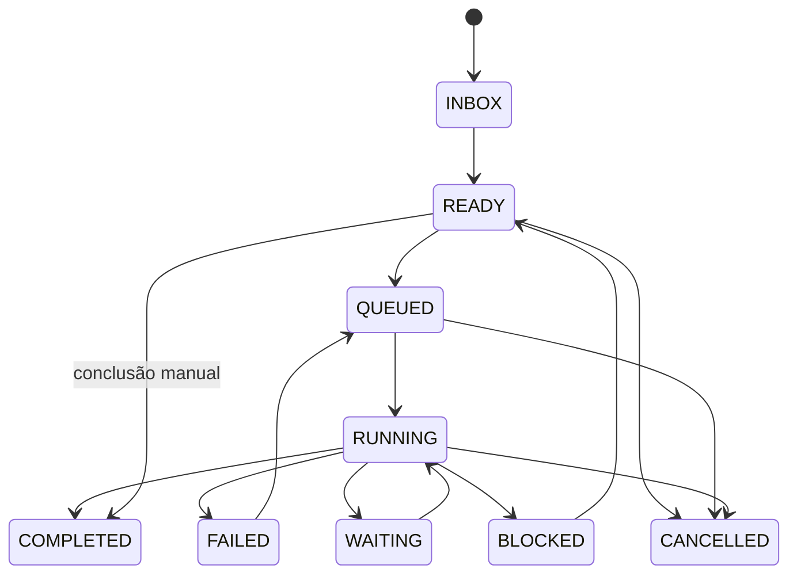
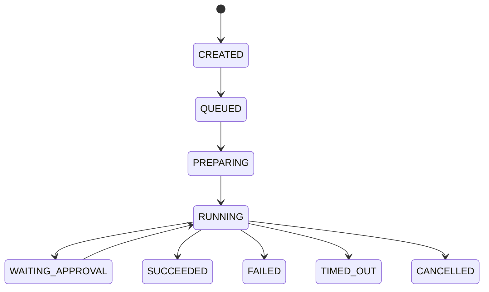
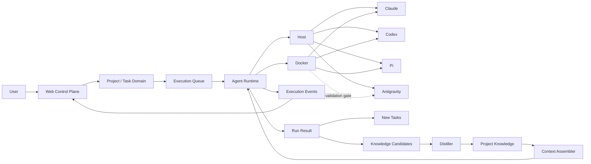

# Documentação da Ideia e Fundamentos Técnicos

**Dungeon Master — plataforma pessoal de trabalho com agentes de IA**  
**Versão:** 0.4  
**Data:** 07/09/2026

**Revisão 0.3 (07/09/2026).** Incorpora as conclusões da análise técnica do código de Sandcastle, Archon e TencentDB Agent Memory (arquivos `ANALISE-PROJETO.md` em cada pasta). Mudanças principais: Web passa de Angular para React 19; API passa de Fastify para Hono com OpenAPI gerada; Windows e macOS viram plataformas de primeira classe; cancelamento, trava de worktree e durabilidade de conhecimento passam a ser responsabilidades explícitas do domínio; structured output é antecipado para a Fase 2. O planejamento correspondente está em `planejamento_plataforma_agentic_v0.3.md`.

**Revisão 0.4 (07/09/2026).** O sistema ganha nome, Dungeon Master, e um toque de gamificação: vocabulário de RPG como skin da UI (seção 47), Conquistas com catálogo fixo, templates por usuário e forjadas por LLM, e um Hall para vê-las. Task ganha o campo `kind`. O planejamento correspondente está em `planejamento_dungeon_master_v0.4.md`.

---

# 1. Visão

A ideia é construir um sistema pessoal que transforme intenção em trabalho estruturado, execute esse trabalho através de agentes de IA e preserve o conhecimento adquirido para que futuras execuções não recomecem do zero.

A formulação mais curta é:

> **Capturar intenção -> estruturar trabalho -> executar -> observar -> aprender -> reutilizar.**

Isso posiciona o produto em uma região entre:

- task/project manager;
- workflow engine;
- agent runtime;
- model/harness router;
- knowledge base;
- personal AI operating system.

O produto não é apenas um orquestrador de agentes. Seu objeto principal é **trabalho**.

---

# 2. O modelo mental original

A ideia parte de um fluxo como:

```text
Usuário
  ↓
Inserção de tarefas
  ↓
Enriquecimento com IA
  ↓
Fila de execução
  ↓
Orquestrador
  ↓
Agente / Modelo / Loadout
  ↓
Análise
  ↓
Decomposição
  ↓
Plano
  ↓
Execução
  ↓
Resultado
  ├── novas tarefas
  └── novo conhecimento
              ↓
           destilar
              ↓
       conhecimento do projeto
```

Essa estrutura contém dois loops diferentes.

## 2.1 Loop operacional

```text
Task -> Analyze -> Decompose -> Plan -> Execute -> Evaluate
                                      ↓
                                New Tasks
```

## 2.2 Loop de aprendizado

```text
Run -> Result -> Knowledge Candidates -> Distill -> Project Knowledge
                                                   ↓
                                               Future Runs
```

O segundo loop é o que transforma a aplicação de um executor de prompts em um sistema cumulativo.

---

# 3. O projeto como unidade persistente de contexto

Uma decisão conceitual central é:

> **O Project é a unidade persistente de contexto; Task é a unidade de trabalho; Run é a unidade de execução.**

Agentes mudam. Modelos mudam. CLIs mudam. O conhecimento produzido deve continuar pertencendo ao projeto.

```text
Project
├── Description
├── Tasks
├── Documents
├── Knowledge
├── Decisions
├── Artifacts
├── Runs
└── Activity
```

Isso evita que conhecimento fique preso ao histórico de uma sessão específica de Claude, Codex, Pi ou Antigravity.

---

# 4. Por que a Web é um Control Plane

Uma interface de chat isolada não representa bem o produto.

A Web deve controlar e visualizar:

- projetos;
- inbox;
- tarefas;
- dependências;
- task graph;
- fila;
- agentes;
- loadouts;
- workflows;
- runs;
- ambientes de execução;
- eventos em tempo real;
- artifacts;
- knowledge;
- decisões;
- aprovações;
- custos e métricas futuras;
- conquistas e estatísticas de herói (Hall dos Heróis).

Portanto, o chat é um recurso da plataforma, não sua estrutura principal.

O chat pode servir para:

```text
Ask Project
  ↓
responder usando Project Knowledge
```

ou:

```text
Chat instruction
  ↓
Create Task
  ↓
Task Engine
```

---

# 5. As separações de domínio que protegem a arquitetura

## 5.1 Task != Run

Uma Task é trabalho pendente ou concluído.

Um Run é uma tentativa concreta de realizá-lo.

```text
Task #153
├── Run #1 -> FAILED
├── Run #2 -> CANCELLED
└── Run #3 -> SUCCEEDED
```

Se Task e Run forem a mesma entidade, ficam difíceis:

- retry;
- resume;
- comparação de modelos;
- comparação de loadouts;
- histórico;
- auditoria;
- cancelamento;
- reexecução.

---

## 5.2 Agent != Harness != Model

### Agent

Representa papel e comportamento.

Exemplo:

```text
Senior Software Architect
```

### Harness

Representa o runtime/CLI de agente.

```text
Claude Code
Codex CLI
Pi
Antigravity CLI
```

### Model

Representa o LLM utilizado pelo harness.

Um mesmo Agent pode ser executado por combinações diferentes.

```text
Agent: Senior Software Architect
Harness: Claude Code
Model: modelo A
```

ou:

```text
Agent: Senior Software Architect
Harness: Codex
Model: modelo B
```

Esse desacoplamento permite model routing sem redefinir papéis.

---

## 5.3 Task Graph != Workflow

Essa distinção é especialmente importante.

### Task Graph

Define **o que precisa ser feito**.

```text
Feature
├── Research
├── Backend
├── Frontend
└── Tests
```

### Workflow

Define **como uma unidade de trabalho deve ser processada**.

```text
Analyze
 ↓
Plan
 ↓
Execute
 ↓
Validate
```

O Workflow pode permanecer igual enquanto o Task Graph cresce dinamicamente.

---

# 6. Loadout como abstração de primeira classe

A ideia inicial de Loadout cresce para representar a configuração completa dada a um agente para executar uma tarefa.

```text
Loadout
├── Agent
├── Harness
├── Model
├── Skills
├── Tools
├── MCP Servers
├── Memory / Knowledge Policy
├── Context Policy
├── Execution Profile
└── Permission Policy
```

Exemplo conceitual:

```text
Loadout: Backend Developer

Agent
  Software Engineer

Harness
  Claude Code

Model
  Modelo configurado

Skills
  TypeScript
  PostgreSQL
  Architecture

Tools / MCP
  Git
  Filesystem
  Database

Knowledge
  Architecture decisions
  Project coding conventions

Execution
  HOST ou DOCKER

Permissions
  Workspace write
  Commands scoped
```

O Loadout torna uma execução reproduzível e inspecionável.

---

# 7. Por que TypeScript

TypeScript é uma escolha adequada porque o sistema é predominantemente composto por:

- processos assíncronos;
- APIs;
- streaming;
- subprocessos;
- CLIs;
- eventos estruturados;
- JSON;
- SSE/WebSocket;
- MCP;
- schemas;
- filas;
- integrações de LLM;
- frontend rico.

Além disso, Sandcastle e o Archon atual fornecem referências relevantes no ecossistema TypeScript.

A decisão é **TypeScript first**, não “TypeScript para sempre”.

Se no futuro uma ferramenta exigir Python ou outra linguagem, a integração pode existir como worker, MCP server ou serviço isolado sem alterar o domínio central.

---

# 8. Stack da Web e da API: React e Hono

## 8.1 Por que React na Web

O frontend tende a ser uma aplicação densa, com:

- múltiplas telas;
- formulários;
- tabelas;
- timelines;
- filtros;
- streaming de execução;
- drag-and-drop;
- dashboards;
- painéis de configuração;
- grafos de tarefas e de workflow;
- estados complexos.

Angular e React constroem esse tipo de painel com qualidade equivalente. A decisão por React vem do ecossistema das bibliotecas específicas que o control plane precisa, não do framework em si:

| Necessidade | Biblioteca |
|---|---|
| Task Graph e visualização de workflow | React Flow + dagre |
| Tabelas com filtro e ordenação | TanStack Table (headless) |
| Timeline de eventos com milhares de linhas | TanStack Virtual |
| Estado de servidor com cache e invalidação | TanStack Query |
| Estado de streaming (eventos SSE) | Zustand |
| Roteamento com parâmetros de busca tipados | TanStack Router |
| Componentes | shadcn/ui sobre Radix |
| Estilo | Tailwind |
| Build | Vite |

Três fatores decidiram:

1. **Grafo.** Task Graph, DAG de workflow e dependências são telas centrais do produto. React Flow é a única opção madura para isso; Angular não tem equivalente no mesmo nível.
2. **Desenvolvimento assistido por agentes.** O código que Claude Code, Codex e Pi geram para React + Tailwind + shadcn é mais confiável que para Angular. Em um projeto pessoal construído com IA, isso é velocidade real.
3. **Referências.** Archon (React 19, Vite, Tailwind, shadcn, React Flow, Zustand) e o MemoryPanel do TencentDB (React 18, Vite, Zustand) são React. O cockpit de run com timeline via SSE e a visão de DAG do Archon servem de modelo direto.

O objetivo não é compartilhar classes de domínio diretamente entre frontend e backend. O compartilhamento ocorre através de **contracts/schemas**: a API publica uma spec OpenAPI gerada dos schemas Zod, e o cliente TypeScript do frontend é gerado dessa spec. O frontend só importa tipos gerados e o pacote de contratos, nunca pacotes internos do backend. É a mesma regra que o Archon impõe por lint.

## 8.2 Por que Hono na API

A escolha inicial era Fastify. A troca por Hono se baseia em:

- **Contratos gerados.** Com `@hono/zod-openapi`, os mesmos schemas Zod que validam a requisição produzem a spec OpenAPI, que produz o cliente tipado do frontend. É a implementação literal da regra de contratos acima.
- **SSE nativo.** O helper de streaming SSE faz parte do Hono, sem plugin.
- **Portabilidade de runtime.** Roda em Node, Bun e Deno sem alterar código. O projeto fica em Node LTS, porque Bun no Windows é menos maduro, mas a porta permanece aberta.
- **Superfície pequena.** Menos mágica de plugins, o que ajuda quando agentes de IA escrevem parte do código.
- **Referências.** Archon e os três serviços HTTP do TencentDB usam Hono 4.

Cuidado necessário no Node: conexões SSE de longa duração exigem configurar explicitamente os timeouts do servidor HTTP (`requestTimeout`, `headersTimeout`, `keepAliveTimeout`), senão conexões ociosas são derrubadas. O Archon resolve isso no Bun com o `idleTimeout` máximo; no Node a configuração é feita no servidor criado por `@hono/node-server`.

---

# 9. Por que separar API e Worker

Uma chamada HTTP não deve possuir o ciclo de vida de uma execução de agente.

Errado:

```text
Web -> HTTP Request -> Agent de 40 minutos -> Response
```

Desejado:

```text
Web
 ↓
API
 ↓
Create Run
 ↓
Queue
 ↓
Worker
 ↓
Agent Runtime
```

Isso possibilita:

- execuções longas;
- retries;
- cancelamento;
- pause/resume futuro;
- jobs em background;
- isolamento de falhas;
- múltiplos workers no futuro.

A API coordena. O Worker executa.

---

# 10. Por que SSE inicialmente

O principal fluxo em tempo real é:

```text
Worker/API -> Browser
```

para eventos como:

- output;
- progresso;
- tool calls;
- mudança de step;
- artifact;
- conclusão.

SSE é suficiente para esse modelo inicialmente e reduz complexidade.

Comandos do usuário como cancelar/aprovar continuam ocorrendo via HTTP.

```text
Server -> Browser : SSE
Browser -> Server : HTTP
```

WebSocket pode ser adicionado quando houver uma necessidade bidirecional contínua real.

## 10.1 Entrega resiliente: notificação sem payload

Padrão a copiar do Archon: quando o Worker grava eventos no PostgreSQL, o `NOTIFY` enviado à API **não carrega o evento**. Ele apenas dispara um *drain* que lê `run_event` a partir do último cursor conhecido e empurra para o SSE. Isso mantém cursor, mapeamento e deduplicação em um único lugar, e uma notificação perdida ou coalescida nunca dessincroniza o browser. Na reconexão do `EventSource`, o cliente envia o último `sequence` recebido e a API reenvia a partir dali.

---

# 11. Estado mutável + execution log append-only

Não há necessidade inicial de Event Sourcing completo.

O modelo recomendado é:

```text
Mutable Domain State
+
Append-only Execution Events
```

Exemplo:

```text
task.status = RUNNING
```

é estado atual.

Enquanto:

```text
RunStarted
ContextLoaded
ToolCalled
ArtifactCreated
RunCompleted
```

é histórico imutável da execução.

Isso fornece observabilidade sem transformar toda a aplicação em um sistema event-sourced.

---

# 12. ExecutionEvent como linguagem comum

Cada harness fala uma linguagem diferente. A aplicação precisa de uma linguagem canônica.

```ts
type ExecutionEvent =
  | RunStartedEvent
  | TextDeltaEvent
  | ToolCallEvent
  | ToolResultEvent
  | ArtifactEvent
  | UsageEvent
  | DiagnosticEvent
  | ApprovalRequestedEvent
  | RunCompletedEvent
  | RunFailedEvent;
```

Claude, Codex, Pi e Antigravity devem ser traduzidos para esse modelo.

Isso significa que a Web não precisa conhecer o formato NDJSON de cada CLI.

---

# 13. A abstração de Runtime

O domínio não chama Sandcastle diretamente.

```ts
export interface AgentRuntime {
  execute(request: ExecutionRequest): AsyncIterable<ExecutionEvent>;
  cancel(runId: string): Promise<void>;
}
```

Abaixo dele:

```text
AgentRuntime
│
├── Execution Environment
│   ├── Host
│   └── Docker
│
└── Harness Adapter
    ├── Claude
    ├── Codex
    ├── Pi
    └── Antigravity
```

Uma possível composição:

```ts
interface ExecutionRequest {
  runId: string;
  taskId: string;
  workspace: WorkspaceRef;
  harness: HarnessRef;
  model?: ModelRef;
  loadout: LoadoutSnapshot;
  executionProfile: ExecutionProfileSnapshot;
  prompt: string;
}
```

Snapshots são úteis para que um Run antigo continue auditável mesmo se o Loadout for alterado posteriormente.

O resultado da execução também é estruturado e inclui a identidade da sessão do harness, quando existir:

```ts
interface ExecutionResult {
  status: "succeeded" | "failed" | "cancelled" | "timed_out";
  harness: HarnessRef;
  harnessVersion: string;
  harnessSessionId?: string;   // id de sessão/conversa do harness, para resume/fork
  usage?: UsageSummary;
  output?: unknown;            // structured output validado por schema, quando houver
}
```

`harnessSessionId` deve ser persistido no Run **junto com o harness que o emitiu**, porque as semânticas de resume diferem: Claude Code usa `--resume`/`--fork-session`, Codex usa `codex exec resume`/`fork`, Pi usa `--session <id>`, Antigravity usa `--conversation`.

**Cancelamento é responsabilidade do Runtime, não do backend de execução.** A análise do Sandcastle mostrou que ele não faz `kill` de processo em lugar nenhum: ao force-completar por timeout, o agente e seus processos filhos ficam órfãos no host. O `AgentRuntime.cancel()` precisa matar a árvore de processos e confirmar que ela desapareceu antes de marcar o Run como `CANCELLED` ou `TIMED_OUT`.

---

# 14. Execução Host: por que começar por ela

O objetivo inicial é reduzir atrito.

```text
Task -> Worker -> CLI instalada na máquina
```

Benefícios:

- zero startup de container;
- utiliza autenticação local já configurada;
- simples de depurar;
- melhor experiência de desenvolvimento;
- permite provar a arquitetura do Runtime rapidamente.

Sandcastle atualmente possui `noSandbox()`, que executa o agente diretamente no host e é compatível com suas APIs de execução.

Porém:

> **Host Execution não é sandbox.**

O processo possui as permissões do usuário/worker e pode, dependendo do harness, acessar recursos fora do workspace.

Dois pontos verificados na análise do Sandcastle que afetam diretamente o modo Host:

- **Não há kill de processo.** `noSandbox()` tem `close()` no-op e não existe `proc.kill()` no codebase. Timeout e cancelamento no host são implementados pela nossa aplicação (ver seção 13).
- **Env é allow-list.** O Sandcastle lê apenas `<repo>/.sandcastle/.env` e só resolve chaves declaradas ali; nada mais de `process.env` chega ao agente. A política de ambiente do Loadout precisa ser traduzida para esse mecanismo, ou o Runtime monta o ambiente por conta própria.

## 14.1 Plataformas suportadas: Windows e macOS

Windows e macOS são plataformas de primeira classe desde a Fase 0. Linux não é excluído, mas não é alvo de teste inicial. As consequências concretas:

| Tema | Windows | macOS |
|---|---|---|
| Kill de árvore de processos | `taskkill /T /F <pid>` | `spawn` com `detached: true` e `process.kill(-pid, "SIGTERM")` no grupo, com escalada para `SIGKILL` |
| Confirmação de término | Polling de existência do processo até sumir; o `taskkill` não é a prova, como o Archon documenta | Idem |
| Steps de comando | Sem shell, argumentos em array | Sem shell, argumentos em array |
| Caminhos | Normalização única na borda; invariante de caminho absoluto idêntico entre host e execução | Idem |
| Git worktree | Caminhos longos e case-insensitive | Case-insensitive por padrão |
| CI | `windows-latest` | `macos-latest` |

Todo esse código vive em um pacote próprio (`packages/platform`), testado nas duas plataformas na matriz de CI. Os testes de contrato de harness (seção 34) também rodam na matriz.

---

# 15. Segurança como capability, não booleano

Não basta guardar:

```text
sandbox = true/false
```

Existem diferentes níveis de enforcement.

Exemplo:

```ts
type EnforcementLevel =
  | "advisory"
  | "harness-native"
  | "sandbox-enforced";
```

### Advisory

Nossa aplicação pede que o agente respeite uma política, mas não existe barreira técnica forte.

### Harness Native

A própria CLI possui mecanismos de permissão.

### Sandbox Enforced

O ambiente externo limita tecnicamente filesystem, processos, rede etc.

A UI deve conseguir comunicar essa diferença.

---

# 16. Git Worktree não é sandbox

Mesmo no modo Host, utilizar um worktree por execução pode ser útil:

```text
Repository
├── main worktree
└── .runs/run-123 worktree
```

Isso ajuda a:

- separar alterações;
- comparar diffs;
- descartar uma execução;
- executar agentes concorrentes;
- diminuir alterações acidentais no working tree principal.

Mas isso **não limita filesystem nem execução de comandos**. Portanto, worktree é isolamento operacional de código, não segurança.

**Worktree por Run é o default do modo Host, mas com trava no domínio.** A análise do Sandcastle mostrou que o locking de worktree está projetado (ADR 0007) e **não implementado**: dois `run()` concorrentes com a mesma branch nomeada recebem o mesmo diretório e corrompem em silêncio. A solução mora na nossa aplicação, como no Archon: **um Run ativo por par (repositório, caminho de checkout)**, verificado no PostgreSQL com tiebreaker determinístico, antes de qualquer processo subir. Runs sem branch nomeada usam o sufixo aleatório do próprio Sandcastle e não colidem.

---

# 17. Docker como segunda opção da Fase 2

Docker não é requisito para iniciar o sistema.

Ele entra quando o Runtime já estiver funcionando em Host.

A principal exigência arquitetural é:

```text
ExecutionRequest
     ↓
AgentRuntime
     ↓
HOST ou DOCKER
     ↓
mesmo modelo de ExecutionEvent
```

A UI e o domínio não devem precisar saber detalhes de container lifecycle.

Isso permite escolher:

- `HOST` para velocidade e autenticação local;
- `DOCKER` para isolamento.

---

# 18. O papel do Sandcastle

Sandcastle é a principal referência de **Agent Execution Runtime**.

Pontos aproveitáveis:

- abstração de agent providers;
- Claude Code;
- Codex;
- Pi;
- execução host via `noSandbox()`;
- execução Docker;
- streaming/structured events;
- lifecycle de execução;
- sandbox providers;
- custom agent providers.

O uso recomendado é:

```text
Nosso domínio
   ↓
Nossa interface AgentRuntime
   ↓
Sandcastle adapter
   ↓
Sandcastle
```

Evitar:

```text
TaskService -> sandcastle.run(...)
```

espalhado pela aplicação.

## 18.1 O que a análise do código confirmou (v0.12.0)

Verificado na análise técnica local (`sandcastle/ANALISE-PROJETO.md`).

**Disponível e útil**

- Seis providers embutidos: `claudeCode`, `codex`, `pi`, `cursor`, `opencode`, `copilot`. Os três que miramos capturam sessão e suportam resume.
- `SandboxProvider` com três estratégias: `bind-mount`, `isolated` e `none` (`noSandbox()`), e estratégias de branch `head`, `merge-to-head` e `branch`.
- **Structured output com schema (Standard Schema) e `maxRetries` embutido**, disponível para os três harnesses. Isso antecipa a seção 30 para a Fase 2.
- `supportsResume` derivado da presença de `sessionStorage` no provider, em tempo de tipo. A matriz de capabilities (seção 32) deve espelhar isso.
- Distinção `timeoutMs` vs `elapsedMs` nos erros de timeout, feita para orquestradores downstream distinguirem timeout real de abort.
- Effect-TS é interno e não vaza para a API pública; a dependência é apenas de desenvolvimento.

**Lacunas que a nossa aplicação cobre**

- Nenhum `proc.kill()`: cancelamento e timeout no host são nossos (seção 13).
- Locking de worktree não implementado: trava por caminho no domínio (seção 16).
- Env allow-list via `.sandcastle/.env` (seção 14).
- `createSandbox()` não propaga o `env` do `AgentProvider` a containers longevos; só `run()` e `wt.run()` propagam. No Docker, preferir o caminho `run()` ou definir env no nível do sandbox.
- `sandbox.interactive()` passa `dangerouslySkipPermissions: true` incondicionalmente. Não usar esse entrypoint.
- CI upstream sem matriz de SO, apesar de código específico de Windows e macOS. Nossos testes de contrato na matriz compensam.

---

# 19. O papel do Archon

Archon é referência para o **Workflow / Task Execution Engine**.

A ideia reaproveitável não é necessariamente seu código, mas a separação entre:

- processo determinístico;
- passos de IA;
- passos de comando/validação;
- dependências;
- loops;
- approval gates;
- artifacts.

Princípio:

> A IA decide dentro de fronteiras; o workflow mantém a estrutura do processo observável e reproduzível.

Isso evita depender de um único prompt que peça ao agente para analisar, planejar, implementar e validar sem checkpoints claros.

## 19.1 Padrões a copiar e anti-padrões a evitar

Verificado na análise técnica local (`Archon/ANALISE-PROJETO.md`). O Archon é Bun + Hono + SQLite/PostgreSQL, com o motor de workflows YAML em cerca de 350 mil linhas; o executor de DAG sozinho tem 554 KB. O código não é reaproveitável; os padrões são.

**Copiar**

1. **Captura congelada da fonte do workflow** no início do Run. Os bytes executáveis são capturados uma vez, separados do lugar onde o Run age. É o que permite worktree limpo e retomar um Run pausado após editar o workflow ou atualizar o binário. Mapeia para `workflowVersionId` no Run.
2. **Gate de aprovação como CAS.** Resolver um gate é um `UPDATE ... WHERE status = 'paused' AND resolved IS NULL` mais a inserção dos eventos de auditoria **na mesma transação**. Se o update afeta zero linhas, o chamador perdeu a corrida. Fecha aprovação dupla e gate resolvido sem trilha.
3. **Dois contratos de escrita de evento.** Um que **nunca lança** (observabilidade pura, a execução continua) e um que **propaga falha** (a execução não pode prosseguir sem a linha). E um erro terminal próprio para quando a escrita do status final falha: nenhum resultado comum pode ser reportado por esse canal.
4. **Gate identificado por algo além do id do nó**, para que um Run retomado não encontre o evento antigo e pule o gate humano.
5. **Trava de conversa mais teto de capacidade global**, com aquisição que retorna imediatamente `started` ou `queued`.
6. **Expressão malformada é fail-closed**: condição inválida resulta em `false`, nó pulado e aviso ao usuário.
7. **Constantes derivadas de schemas e testes de paridade** onde a derivação cruza fronteira de pacote. Pares sincronizados à mão são tratados como defeito.

**Evitar**

- **Orquestrador como agente.** O orquestrador do Archon é ele próprio um agente de IA completo. O nosso é determinístico; a IA decide dentro de fronteiras. Isso pode mudar no Nível 4 de autonomia, não antes.
- **Executor monolítico.** Cada tipo de step (`agent`, `command`, `validation`, `approval`, `knowledge`) tem seu executor em módulo próprio desde o início.
- **YAML que vira linguagem de programação.** A constituição de linguagem do Archon existe porque isso aconteceu. Regra adotada: *dados coordenam, código computa, agentes julgam*. Workflows são declarados como dados (JSON/YAML validado por Zod) com vocabulário pequeno e fixo, **sem linguagem de expressão**.

---

# 20. O papel do TencentDB Agent Memory

TencentDB Agent Memory é referência para **Knowledge, Memory Assets, Skills e Loadouts**.

Ideias centrais aproveitáveis:

- memória não é apenas chat history;
- conhecimento deve ser destilado;
- skills são artefatos reutilizáveis;
- documentos/código devem ser recuperados sob demanda;
- agentes diferentes recebem loadouts diferentes;
- contexto não deve ser despejado integralmente no prompt;
- provenance/version/ownership importam.

A aplicação pode adaptar a ideia de memória em camadas para:

```text
L0 — Raw Execution
  logs, messages, tool calls, artifacts

L1 — Knowledge Atoms
  facts, decisions, discoveries, constraints

L2 — Project Knowledge
  architecture, current state, scenarios, summaries

L3 — Durable Knowledge
  skills, procedures, reusable patterns
```

## 20.1 Lições da análise do código

Verificado na análise técnica local (`TencentDB-Agent-Memory/ANALISE-PROJETO.md`).

**Ideias confirmadas**

- As quatro camadas existem e têm gatilhos distintos: L0 em todo fim de turno; L1 a cada lote de conversas ou por ociosidade; L2 por timer; L3 por sinal do próprio LLM ou por acúmulo. O Distiller da Fase 6 deve seguir essa lógica de lote e timer, nunca síncrona ao Run.
- **O recall automático por turno foi desligado de propósito** porque destruía o cache de prompt do provedor. Foi substituído por ferramentas read-only em um system prompt estável e cacheável, deixando o LLM decidir quando buscar. A seção 22 chega à mesma conclusão: contexto montado estável ao longo do Run, detalhes sob demanda.
- Busca híbrida BM25 + vetorial fundida por RRF, com embeddings **desligados por padrão**. Confirma PostgreSQL FTS antes de `pgvector`.
- Deduplicação de memória por julgamento de LLM com fail-open (prefere duplicar a perder). Aceitável para um sistema pessoal, desde que os candidatos passem por revisão humana no início.
- Post-mortems codificados em comentários, cada um com o número do incidente. Vale adotar como convenção.

**Erros a não repetir**

- **Retry morto na escrita de memória.** O retry esperava um erro que a função de POST nunca lançava; um 503 do kernel perdia a memória em silêncio. Lição para a seção 21: o caminho de escrita de conhecimento não pode ser fire-and-forget.
- **Escrita sem lock.** O checkpoint passou a falhar quando o lock não está disponível, em vez de escrever sem lock e sobrescrever o trabalho de outro nó. Lição: advisory lock do PostgreSQL por projeto no Distiller.
- **Autenticação no-op por padrão** e rotas administrativas sem auth. Mesmo em um sistema local single-user, a API só escuta em `localhost` e nunca trata auth como opcional silencioso.
- **Divergência entre documentação e código** em defaults, portas e contagens. Gerar documentação a partir dos schemas onde for possível.

---

# 21. Destillation como processo assíncrono

Concluir uma Task não deve esperar o Knowledge Engine.

```text
Run SUCCEEDED
     ↓
Task COMPLETED

     ↓ background

Knowledge Candidates
     ↓
Distillation
     ↓
Project Knowledge
```

Isso deixa o caminho operacional rápido e permite que o pipeline de conhecimento evolua independentemente.

**Assíncrono não significa fire-and-forget.** Os Knowledge Candidates são persistidos **na mesma transação** que grava o resultado do Run. O Distiller consome a tabela `knowledge_candidate` a partir do banco, sob **advisory lock por projeto**, e marca cada candidato como processado, rejeitado ou promovido. Uma falha do Distiller nunca perde um candidato; ele apenas fica pendente.

---

# 22. Knowledge não deve ser injetado inteiro

Evitar:

```text
Task
 ↓
Todo o histórico do projeto
 ↓
Prompt gigante
```

Preferir:

```text
Task
 ↓
Context Assembler
 ├── Project Summary
 ├── Relevant Decisions
 ├── Relevant Facts
 ├── Skills
 └── Tools para buscar detalhes
 ↓
Agent
```

O agente pode buscar detalhes sob demanda quando necessário.

---

# 23. Por que PostgreSQL primeiro

O domínio é fortemente relacional:

- project/task;
- dependencies;
- parent/child;
- runs;
- workflow versions;
- loadout relations;
- artifacts;
- knowledge provenance.

Além disso, PostgreSQL oferece:

- JSONB para payloads de eventos;
- full-text search;
- transações;
- advisory locks;
- filas simples;
- `pgvector` quando necessário.

Assim, não é necessário adicionar Redis ou banco vetorial no início.

---

# 24. Por que não começar com Redis

A primeira versão é single-user e local.

A fila pode existir no PostgreSQL:

```text
run
status = QUEUED
```

ou através de uma solução como `pg-boss`.

Adicionar Redis cedo cria:

- outro serviço;
- outro storage;
- outra política de backup;
- outra superfície operacional.

Ele só deve entrar quando resolver um problema observado.

---

# 25. Artifacts como entidade de primeira classe

Uma execução pode produzir mais do que texto.

```text
Artifact
├── FILE
├── DOCUMENT
├── REPORT
├── PATCH
├── IMAGE
├── LINK
├── CODE
└── TEST_RESULT
```

Artifacts devem possuir:

- origem;
- Run;
- Task;
- metadata;
- localização;
- tipo;
- hash opcional;
- createdAt.

Eles podem posteriormente ser fontes de Knowledge.

---

# 26. Human Approval

Autonomia deve ser regulada por policy.

Exemplos:

```text
Analyze
 ↓
Plan
 ↓
User Approval
 ↓
Execute
```

ou:

```text
Agent proposes 5 tasks
 ↓
Review
 ↓
Approve selected
```

Aprovação futura pode depender de:

- risco;
- custo;
- ferramenta;
- permissão;
- projeto;
- agente;
- tipo de alteração.

**Resolução do gate é um CAS.** Aprovar ou rejeitar faz um `UPDATE` condicional (`status = 'WAITING_APPROVAL' AND resolved_at IS NULL`) e insere os eventos `ApprovalGranted`/`ApprovalRejected` na mesma transação. Zero linhas afetadas significa que outra decisão chegou antes; a UI mostra o estado atual em vez de sobrescrever.

---

# 27. Antigravity CLI: por que merece uma fase própria

O Antigravity CLI é relevante porque seu contrato atual contém vários elementos especialmente bons para orquestração:

- execução headless com `-p`;
- `json`;
- `stream-json` NDJSON;
- structured output via JSON Schema;
- conversation IDs;
- resume/continue;
- sessão contínua por stdin;
- seleção de model;
- seleção de agent;
- reasoning effort;
- políticas de permissão;
- códigos de status.

Isso aproxima bastante o CLI do contrato que nosso `HarnessAdapter` precisa.

Ao mesmo tempo, sua evolução tem sido rápida e houve bugs recentes ligados a headless, autenticação e Windows em versões anteriores. Por isso, a integração deve ser versionada e testada por contrato.

---

# 28. Antigravity: estratégia técnica

A arquitetura não deve exigir suporte oficial do Sandcastle.

```text
HarnessAdapter
├── SandcastleBackedHarness
│   ├── Claude
│   ├── Codex
│   └── Pi
│
└── AntigravityHarnessAdapter
```

O adapter pode inicialmente usar:

```text
node:child_process
       ↓
agy --output-format stream-json
       ↓
NDJSON parser
       ↓
ExecutionEvent
```

Depois podemos criar ou adotar um provider Sandcastle para Antigravity sem alterar o restante da aplicação.

---

# 29. Antigravity e sessão contínua

O suporte a:

```text
--input-format stream-json
--output-format stream-json
```

abre uma possibilidade importante.

Em vez de criar um processo por prompt:

```text
prompt -> process -> exit
prompt -> process -> exit
```

poderemos futuramente manter:

```text
Run
 ↓
agy process
 ├── prompt 1
 ├── result 1
 ├── prompt 2
 ├── result 2
 └── ...
```

Isso pode ser usado por workflows multi-turn ou por Human-in-the-loop sem pagar startup completo a cada step.

Não é necessário implementar isso no primeiro adapter, mas a arquitetura não deve impedir.

---

# 30. Antigravity e structured output

`--json-schema` pode ser especialmente útil para tarefas que precisam produzir estruturas do domínio.

Exemplo conceitual:

```text
Task execution
  ↓
JSON Schema:
  status
  summary
  newTasks[]
  knowledgeCandidates[]
  warnings[]
```

Isso reduz parsing por heurística.

**Isso não é exclusivo do Antigravity.** O Sandcastle já oferece structured output validado por schema (Standard Schema, portanto Zod) com retry embutido para Claude Code, Codex e Pi. O `TaskExecutionResult` da Fase 5 pode nascer na Fase 2, com o mesmo schema para os quatro harnesses. Onde um harness não suportar structured output nativo, o adapter pede o bloco JSON no prompt e valida com o mesmo schema, com retry de correção.

---

# 31. Antigravity e autenticação

O CLI utiliza credenciais locais/cacheadas e fluxos de login próprios.

No modo Host isso é uma vantagem:

```text
Worker local
 ↓
agy
 ↓
credenciais já configuradas
```

No Docker isso se torna um problema de design.

Não devemos resolver isso montando indiscriminadamente o home do usuário dentro do container.

O suporte Docker deve responder:

- quais arquivos/token são realmente necessários?;
- existe autenticação não interativa apropriada?;
- é possível fornecer secrets mínimos?;
- como ocorre refresh?;
- como não vazar credenciais para artifacts/logs?;

Por isso `Antigravity + Docker` precisa de gate próprio.

---

# 32. Capabilities em vez de suposições

Nem todo harness suporta tudo.

Criar uma matriz de capabilities:

```ts
interface HarnessCapabilities {
  streaming: boolean;
  structuredOutput: boolean;
  resume: boolean;
  multiTurnProcess: boolean;
  toolEvents: boolean;
  tokenUsage: boolean;
  modelSelection: boolean;
  agentSelection: boolean;
  nativePermissions: boolean;
  hostExecution: boolean;
  dockerExecution: boolean;
}
```

A UI utiliza capabilities para habilitar/desabilitar recursos.

Isso evita condicionais espalhados:

```ts
if (harness === "antigravity") { ... }
```

---

# 33. Version discovery e compatibilidade

CLIs externas devem ser tratadas como dependências runtime versionadas.

Preflight:

```text
Claude Code installed? version?
Codex installed? version?
Pi installed? version?
Antigravity installed? version?
```

O sistema deve armazenar no Run:

```text
harness
harnessVersion
model
executionMode
loadoutVersion
workflowVersion
```

Isso torna resultados reproduzíveis e comparáveis.

---

# 34. Testes de contrato de Harness

Todos os harnesses devem passar por uma mesma suíte semântica.

```text
canRunPrompt
canStreamOutput
canProduceFinalResult
canFailClearly
canBeCancelled
canTimeout
reportsVersion
reportsCapabilities
```

Features opcionais:

```text
canResume
canEmitToolCalls
canStructuredOutput
canMaintainSession
```

Esse contrato é uma defesa importante contra mudanças de CLI.

---

# 35. Modelagem inicial sugerida

## Project

```text
id
title
description
status
createdAt
updatedAt
```

## Task

```text
id
projectId
parentTaskId?
title
description
status
kind                         # BUG | FEATURE | RESEARCH | CHORE
priority
workflowId?
defaultLoadoutId?
createdAt
updatedAt
```

## Run

```text
id
taskId
status
harness
harnessVersion
harnessSessionId?            # id de sessão/conversa emitido pelo harness
model?
executionMode                # HOST | DOCKER
workspacePath?               # caminho do checkout (worktree) usado; base da trava por caminho
workflowVersionId?           # captura congelada do workflow usado
loadoutSnapshot
executionProfileSnapshot
startedAt?
finishedAt?
cancelRequestedAt?
result?                      # JSONB: structured output validado + summary + usage
```

## KnowledgeCandidate

```text
id
runId
taskId
projectId
type                         # FACT | DECISION | DISCOVERY | CONSTRAINT | PROCEDURE | SUMMARY
content
provenance JSONB
status                       # PENDING | PROMOTED | REJECTED
createdAt
processedAt?
```

Gravado na mesma transação que `run.result`.

## RunEvent

```text
id
runId
sequence
type
timestamp
payload JSONB
```

## Artifact

```text
id
runId
taskId
type
name
location
metadata
createdAt
```

---

# 36. Máquina de estados

## Task



`READY → COMPLETED` é a **conclusão manual**, feita pelo usuário na interface sem passar por um Run. Existe porque a Fase 1 entrega o gerenciador de tarefas antes do runtime, e continua válida depois: nem todo trabalho precisa de um agente. Toda outra chegada a `COMPLETED` vem de um Run. Regras aplicadas em qualquer chegada a `COMPLETED`: todas as filhas precisam estar `COMPLETED` ou `CANCELLED`. Uma Task só entra em `QUEUED` quando todas as dependências estão `COMPLETED`; uma dependência `CANCELLED` continua bloqueando, e cabe ao usuário remover a aresta (decisão da Fase 1, revisável).

## Run



Task status e Run status não precisam ter transição 1:1.

---

# 37. Web UX conceitual

## Navegação

```text
Dashboard
Inbox
Projects
Tasks
Runs
Knowledge
Agents
Loadouts
Workflows
Hall
Settings
```

Os labels exibidos vêm do glossário ativo (seção 47), que o usuário escolhe pelo interruptor de tema em Settings; as rotas e o código usam os nomes acima nos dois modos.

## Run Cockpit

```text
┌──────────────────────────────────────────────────────────────┐
│ Task #187                                      RUNNING      │
├─────────────────┬─────────────────────────┬──────────────────┤
│ Task            │ Execution Timeline      │ Runtime          │
│                 │                         │                  │
│ Project         │ Run started             │ Harness: Codex   │
│ Priority        │ Context loaded          │ Model: ...       │
│ Dependencies    │ Tool: read file         │ Mode: HOST       │
│ Workflow        │ Tool: edit              │ Loadout: Builder │
│                 │ Tests running           │                  │
│                 │ ...                     │ [Cancel]         │
└─────────────────┴─────────────────────────┴──────────────────┘
```

O ambiente deve ser visível:

```text
HOST · UNISOLATED
```

ou:

```text
DOCKER · ISOLATED
```

---

# 38. Inbox como captura de intenção

A Inbox permite entradas pouco estruturadas.

```text
"ver por que a autenticação quebra no módulo X"
```

Uma futura etapa de enrichment produz:

```text
Title
Description
Project
Objective
Expected deliverable
Priority
Suggested workflow
Suggested loadout
```

O usuário pode revisar antes da fila.

---

# 39. Resultado de uma execução não é apenas texto

O resultado deve ser estruturado.

```text
Run Result
├── Status
├── Summary
├── Artifacts
├── Decisions
├── Warnings
├── Proposed Tasks
└── Knowledge Candidates
```

Isso permite que o Orchestrator transforme saída de IA em estado de domínio controlado.

---

# 40. Autonomia controlada

A evolução desejada é:

### Nível 0

Usuário cria Task e executa manualmente.

### Nível 1

Sistema sugere Loadout e Workflow.

### Nível 2

Agente propõe subtarefas; usuário aprova.

### Nível 3

Políticas autorizam categorias de subtarefas automaticamente.

### Nível 4

Delegação Agent-to-Agent e workflows dinâmicos.

### Nível 5

Orquestração de projetos de forma altamente autônoma sob budgets e políticas.

Não começar pelo Nível 5 é uma decisão intencional.

---

# 41. O diferencial do produto

As tecnologias individuais já existem:

- agentes;
- coding CLIs;
- task managers;
- workflow engines;
- RAG;
- memory systems.

O diferencial pretendido está na união das abstrações:

```text
Projects
+
Tasks
+
Task Graph
+
Workflows
+
Agents
+
Loadouts
+
Execution Environments
+
Observability
+
Knowledge Accumulation
```

O sistema administra o ciclo de trabalho, não apenas chamadas de LLM.

---

# 42. O que não queremos que a arquitetura vire

## Um ChatGPT clone

Porque perderia Task/Run/Workflow como entidades.

## Um wrapper do Sandcastle

Porque ficaríamos presos às abstrações e providers de um projeto externo.

## Um workflow engine genérico

Porque o foco é trabalho pessoal executado por agentes, não automação genérica de negócios.

## Uma memória global gigante

Porque contexto precisa de escopo, provenance e retrieval.

## Um sistema multi-agent antes de ter um bom single-agent runtime

Porque isso multiplicaria falhas antes de termos execução observável e previsível.

---

# 43. Decisões técnicas consolidadas

| Tema | Decisão atual | Motivo |
|---|---|---|
| Linguagem | TypeScript first | Ecossistema, integração com CLIs e Web |
| Web | React 19 + Vite + Tailwind + shadcn + TanStack (Query, Table, Virtual, Router) + React Flow + Zustand | Ecossistema de painéis ricos, grafo maduro, geração por agentes, referências são React |
| Backend | Node LTS + Hono + Zod | OpenAPI gerada dos schemas, SSE nativo, portável entre runtimes |
| Cliente de API | Gerado da spec OpenAPI do Hono | Contratos, não classes, entre Web e API |
| Plataformas | Windows e macOS, matriz de CI desde a Fase 0 | Decisão do produto; código de processo e caminho em `packages/platform` |
| Banco | PostgreSQL | Relações, JSONB, busca, pgvector futuro |
| Queue | PostgreSQL inicialmente | Menos infraestrutura |
| Banco em desenvolvimento | PostgreSQL 17 em docker compose; `embedded-postgres` em testes e CI | Praticidade local; runners de Windows e macOS não têm Docker Linux |
| Streaming | SSE | Fluxo predominantemente server -> web |
| Agent Runtime | abstração própria | Evitar lock-in |
| Claude/Codex/Pi | Sandcastle | Suporte existente |
| Host execution | Fase 2, primeira opção | Baixo atrito |
| Docker execution | Fase 2, segunda opção | Isolamento opcional |
| Antigravity | fase própria | Integração viável, porém com riscos específicos |
| Workflows | inspirado no Archon | Processo determinístico + IA |
| Knowledge | inspirado no TencentDB Agent Memory | Memória reutilizável e destilada |
| Event Sourcing | não inicialmente | Evitar complexidade |
| Redis | não inicialmente | PostgreSQL é suficiente |
| Vector DB separado | não inicialmente | pgvector somente se necessário |
| Multi-agent | posterior | Runtime e observabilidade primeiro |
| Cancelamento e timeout | responsabilidade do `AgentRuntime`, com kill de árvore por SO | Sandcastle não mata processos |
| Worktree no Host | default, com trava por (repositório, caminho) no domínio | Sandcastle não implementa locking |
| Structured output | Fase 2, via Sandcastle Output, para os três harnesses | Já disponível com schema e retry |
| Sessão do harness | `harnessSessionId` no Run, com o harness emissor | Retry com contexto e fork |
| Formato de Workflow | dados (JSON/YAML) validados por Zod, sem linguagem de expressão | Constituição de linguagem do Archon |
| Approval gate | CAS transacional com eventos de auditoria | Fecha aprovação dupla |
| Knowledge Candidates | persistidos na transação do resultado; Distiller sob advisory lock | Evitar perda silenciosa |
| Eventos de execução | dois contratos de escrita: nunca lança vs. propaga | Observabilidade nunca derruba execução |
| Código das referências | utilitários, prompts e trechos de SQL copiados ou adaptados com atribuição MIT; subsistemas só como padrão | Manifesto na seção 13 do planejamento |
| Gamificação | skin via `packages/glossary`, com interruptor na UI para ligar e desligar; Conquistas como projeção reconstruível, com catálogo fixo, templates por usuário e forjadas por LLM | Toque de RPG sem contaminar o domínio, opcional para o usuário (seção 47) |

---

# 44. Questões ainda abertas

Estas decisões não precisam ser resolvidas antes de começar, mas devem ser registradas.

**Resolvidas na v0.3**

- ~~Fastify vs Hono~~ → Hono (seção 8.2).
- ~~Como versionar Workflows: YAML/JSON vs DSL TypeScript~~ → dados validados por Zod, sem linguagem de expressão, com captura congelada por Run (seção 19.1).
- ~~Se Git Worktree será default para Host~~ → sim, com trava por caminho no domínio (seção 16).
- ~~Se o glossário deve ser trocável em runtime ou só em build~~ → em runtime, por interruptor nas configurações do usuário (seção 47.1).
- ~~Escopo do `packages/platform`~~ → só processo, caminho e shell; detecção de CLI instalada fica no preflight de cada adapter (decisões de partida da Fase 0 no planejamento).

**Ainda abertas**

1. Drizzle vs SQL mais explícito em módulos críticos. O TencentDB usa Drizzle com migrações nunca geradas; se Drizzle, a disciplina de migração é obrigatória desde a Fase 0.
2. `pg-boss` vs queue própria simples no primeiro Worker.
3. Como armazenar artifacts grandes: filesystem inicialmente ou object storage.
4. Qual policy model será comum entre harnesses.
5. Se Antigravity deverá virar provider Sandcastle ou permanecer adapter direto.
6. Como fornecer autenticação do Antigravity em Docker.
7. Quando introduzir embeddings.
8. Quando e como implementar Skills como artefatos executáveis/versionados.
9. Como medir custo de harnesses que usam subscriptions em vez de API metered. O Sandcastle captura `usage` dos streams de Claude e Codex; o `UsageEvent` pode registrar tokens mesmo sem custo monetário.
10. Como expor structured output de forma uniforme quando um harness não o suportar nativamente (prompt + validação + retry no adapter).
11. Se Conquistas forjadas por LLM são publicadas automaticamente ou passam pelo Selo da Guilda antes de aparecer no Hall.

---

# 45. Referências estudadas

## Sandcastle

https://github.com/mattpocock/sandcastle

Principal referência para execução programática de coding agents, providers e ambientes de execução.

Documentação relevante:

- `noSandbox()` — https://github.com/mattpocock/sandcastle/blob/main/src/sandboxes/no-sandbox.ts
- custom providers — https://github.com/mattpocock/sandcastle/blob/main/docs/agents/adding-an-agent-provider.md

## Archon

https://github.com/coleam00/Archon

Referência para workflows estruturados, separação entre passos determinísticos e agentic e observabilidade de execução.

## TencentDB Agent Memory

https://github.com/TencentCloud/TencentDB-Agent-Memory

Referência para memory assets, skills, Wiki/CodeGraph, loadouts e destilação de experiência em conhecimento reutilizável.

## Antigravity CLI

https://github.com/google-antigravity/antigravity-cli

Headless docs:

https://antigravity.google/docs/cli/headless/

Referência para a fase dedicada de integração do quarto harness.

## Análises técnicas locais

Produzidas em 06/09/2026 a partir do código-fonte de cada referência. São a base das seções 18.1, 19.1 e 20.1.

- `sandcastle/ANALISE-PROJETO.md` — v0.12.0; providers, sandboxes, máquina de timeouts, lacunas de kill e locking.
- `Archon/ANALISE-PROJETO.md` — motor de workflows, captura congelada, CAS de gate, contratos de evento, SSE por NOTIFY.
- `TencentDB-Agent-Memory/ANALISE-PROJETO.md` — camadas L0–L3, recall sob demanda, dedup por LLM, post-mortems, bugs de durabilidade.

Os três projetos são MIT. O manifesto do código reaproveitado a partir dessas análises, com arquivo de origem, commit fixado, modo (copiar, adaptar ou só ler) e pacote de destino, está na seção 13 de `planejamento_dungeon_master_v0.4.md`.

---

# 46. Síntese arquitetural



---

# 47. Camada de gamificação: Dungeon Master

O sistema se chama **Dungeon Master**. O nome vem com um toque de RPG de mesa: o Mestre da Guilda (usuário) publica Missões (Tasks) em Campanhas (Projects); Heróis (Agents) de uma Guilda (Harness) partem em Expedições (Runs); Monstros (bugs) são derrotados; Espólios (Artifacts) e Páginas do Grimório (Knowledge) ficam para a próxima Expedição; e o Dungeon Master (o sistema) narra, registra e premia com Conquistas. O glossário completo está na seção 14 do planejamento v0.4.

Três decisões protegem a arquitetura desse toque.

## 47.1 O tema é um skin

Código, contratos, tabelas, eventos e logs usam os nomes canônicos deste documento: Project, Task, Run, Agent, Harness, Loadout. O vocabulário temático existe em um único lugar, `packages/glossary`, consumido pela UI. Um teste falha se a Web renderizar um label de entidade que não venha do glossário ativo.

**O tema é opcional para o usuário.** O pacote traz dois glossários com o mesmo conjunto de chaves, `dnd` e `plain`, e a paridade é verificada em tempo de tipo. Um interruptor "Tema Dungeon Master" em Settings, ligado por padrão e persistido na preferência do usuário, escolhe qual a UI usa. Alternar troca só texto: rotas, URLs, ícones, layout e dados são idênticos nos dois modos, e a página não recarrega. Nomes de Conquistas também têm as duas versões; o texto de sabor e as Conquistas forjadas por LLM existem só no tema e ficam ocultos com ele desligado. Um terceiro tema no futuro é só um terceiro arquivo.

Uma regra de UX acompanha: o tema nunca esconde informação de segurança. "Campo aberto" vem sempre com "sem isolamento".

## 47.2 Conquistas são uma projeção

Conquistas, progresso e estatísticas de herói são calculados a partir de `run_event` e do estado de domínio já persistidos, por um projetor com cursor no Worker. Consequências:

- **nunca afetam a execução**: o projetor segue o contrato "nunca lança"; se cair, o Run continua;
- **são idempotentes**: desbloqueio único por (definição, usuário, tier);
- **são reconstruíveis**: um comando zera e reprocessa tudo, porque as entradas são duráveis.

Condições usam um vocabulário fechado de cinco predicados (contagem com tiers, sequência, primeira vez, conjunto completo, recorde), sem linguagem de expressão, pela mesma razão dos Workflows (seção 19.1). Predicado desconhecido é fail-closed.

## 47.3 Duas origens obrigatórias, uma opcional

- **Fixas** (`CATALOG`): catálogo versionado como dados, igual para todos.
- **Geradas por usuário** (`TEMPLATE`): templates instanciados com os dados de cada usuário, por Campanha, por Guilda, por Monstro reaberto, por Herói. Nascem ocultas e aparecem no primeiro progresso.
- **Forjadas** (`FORGED`, depois da Fase 6): o Distiller propõe uma Conquista única a partir de um resultado notável. Texto escrito por LLM passa por sanitização e nunca volta a um prompt. Com rate limit, para preservar raridade.

Task ganha o campo `kind` (`BUG`, `FEATURE`, `RESEARCH`, `CHORE`) desde a Fase 1, porque "bugs são Monstros" precisa de um fato no domínio, não de uma heurística sobre o título.

Fica de fora, de propósito: ranking entre usuários, recompensas que desbloqueiam funcionalidade, economia de itens e geração de texto por LLM no caminho quente da UI.

---

# 48. Princípio final

A arquitetura deve preservar a seguinte ideia mesmo quando bibliotecas, modelos e CLIs forem substituídos:

> **O sistema recebe trabalho, estrutura esse trabalho, equipa um agente com um Loadout, executa-o através de um Runtime observável, transforma resultados em novas ações e preserva conhecimento no Project para a próxima execução.**

Sandcastle, Archon, TencentDB Agent Memory e Antigravity são peças de referência ou infraestrutura. O produto é a camada de domínio que organiza e conecta esses conceitos.
