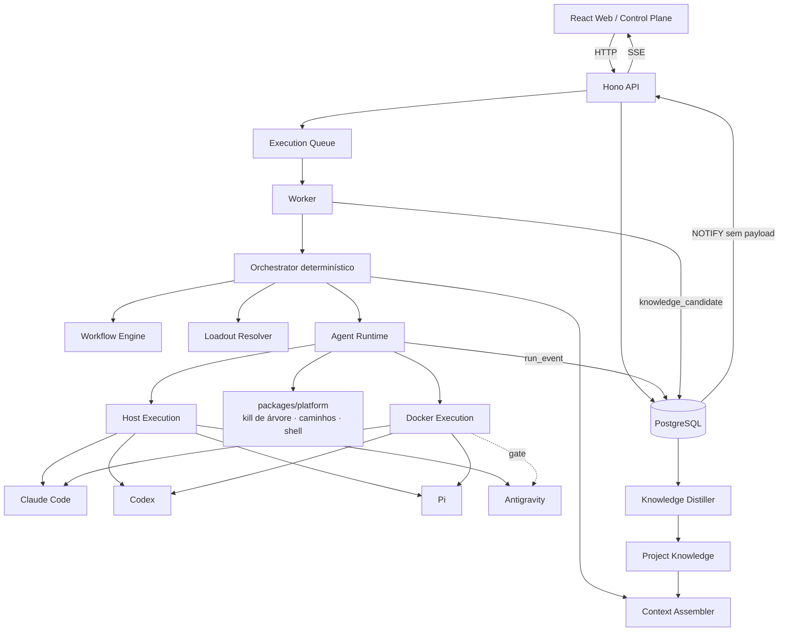

# Planejamento de Implementação — Dungeon Master

**Plataforma pessoal de trabalho com agentes de IA, com um toque de RPG de mesa.**

**Versão:** 0.4  
**Data:** 07/09/2026  
**Status:** Pronto para iniciar a Fase 0. Inclui a camada de gamificação e a Fase 2.5 de Conquistas  
**Substitui:** `planejamento_plataforma_agentic_v0.3.md` (v0.3) e `planejamento_plataforma_agentic.md` (v0.2), mantidos apenas como histórico  
**Documento companheiro:** `documentacao_ideia_e_fundamentos_tecnicos.md` (v0.4)

---

## 0. O que mudou

### 0.1 v0.3 → v0.4 (gamificação)

| Tema | v0.3 | v0.4 | Motivo |
|---|---|---|---|
| Nome | "plataforma pessoal de trabalho com agentes" | **Dungeon Master** | Identidade e tom |
| Tema | nenhum | skin de RPG via `packages/glossary`, com **interruptor na UI** para ligar e desligar; domínio canônico intacto (seção 14) | Toque de gamificação sem contaminar contratos, tabelas e eventos; quem preferir vê a interface sem tema |
| Conquistas | não existiam | **Fase 2.5**: catálogo fixo para todos, templates instanciados por usuário, forjadas por LLM como opcional; Hall dos Heróis | Pedido do produto |
| Task | sem tipo | `kind` (BUG, FEATURE, RESEARCH, CHORE) desde a Fase 1 | Bugs são Monstros; alimenta Bestiário e Conquistas com um fato do domínio |
| SSE | só canal de Run | canal de dashboard para eventos fora de Run | Toast de desbloqueio em qualquer tela |
| Fase 0 | — | monorepo `dungeon-master`, glossário, schema e catálogo v1 de Conquistas como dados, docs dentro do repo | Sementes da gamificação sem engine |
| Fora do MVP | — | ranking entre usuários, recompensas que destravam funcionalidade, economia de itens, LLM no caminho quente da UI | Manter o toque como toque |

### 0.2 v0.2 → v0.3

| Tema | v0.2 | v0.3 | Motivo |
|---|---|---|---|
| Web | Angular, Signals, RxJS, CDK | React 19, Vite, Tailwind, shadcn, TanStack Query/Table/Virtual/Router, React Flow, Zustand | Ecossistema de painéis ricos (grafo), geração de código por agentes, referências são React |
| API | Fastify | Hono + `@hono/zod-openapi` | Spec OpenAPI gerada dos schemas Zod, cliente tipado gerado, SSE nativo |
| Plataformas | não especificado | Windows e macOS de primeira classe, matriz de CI desde a Fase 0 | Decisão do produto; Sandcastle tem código específico de SO sem CI |
| Cancelamento e timeout | delegados ao Sandcastle | responsabilidade do `AgentRuntime`, com kill de árvore por SO | Sandcastle não faz kill de processo |
| Worktree no Host | opcional | default, com trava por (repositório, caminho) no domínio | Sandcastle não implementa locking de worktree |
| Structured output | Fase 3 (Antigravity) | Fase 2, via Sandcastle Output, para os três harnesses | Já disponível com schema e retry |
| Sessão do harness | não modelado | `harness_session_id` no Run, com o harness emissor | Retry com contexto e fork |
| Approval gate | aprovação simples | CAS transacional com eventos de auditoria | Fecha aprovação dupla (padrão do Archon) |
| Knowledge Candidates | assíncrono | persistidos na transação do resultado; Distiller sob advisory lock | Evitar perda silenciosa (bug do TencentDB) |
| Formato de Workflow | questão aberta | dados (JSON/YAML) validados por Zod, sem linguagem de expressão | Constituição de linguagem do Archon |
| Eventos de execução | um único writer | dois contratos: nunca lança vs. propaga; erro terminal próprio | Padrão do Archon |
| SSE | direto | NOTIFY sem payload + drain por cursor; reenvio na reconexão | Resiliência a notificação perdida |
| Executores de step | não especificado | um módulo por tipo de step desde a Fase 4 | Evitar o executor monolítico do Archon |
| Código das referências | não tratado | manifesto de cerca de 15 arquivos copiados ou adaptados, com atribuição MIT (seção 13) | Utilitários testados prontos; subsistemas só como padrão |

---

## 1. Objetivo do produto

Construir uma plataforma web pessoal para **capturar, organizar, executar, acompanhar e aprender com trabalho realizado por agentes de IA**.

A aplicação não será centrada em chat. O chat existirá como uma forma de interação, mas o núcleo do produto será:

```text
Project
  ├── Knowledge
  └── Tasks
        ├── Task Graph
        └── Run
              ├── Workflow
              ├── Agent / Harness / Model
              ├── Loadout
              ├── Execution Events
              ├── Artifacts
              └── Result
                    ├── New Tasks
                    └── Knowledge Candidates
```

A interface web funcionará como **Control Plane** de todo esse sistema.

O sistema se chama **Dungeon Master**. O nome vem com um toque de RPG de mesa que a UI usa e o domínio ignora: o Mestre da Guilda (usuário) publica Missões (Tasks) em Campanhas (Projects); Heróis (Agents) de uma Guilda (Harness) partem em Expedições (Runs); Monstros (bugs) são derrotados; Espólios (Artifacts) e Páginas do Grimório (Knowledge) ficam para a próxima Expedição; e o Dungeon Master (o sistema) narra, registra e premia com Conquistas. O glossário completo está na seção 14.

---

## 2. Princípios de implementação

1. **TypeScript first.** Frontend, API, worker, domínio e integrações em TypeScript, sobre Node LTS.
2. **Monólito modular antes de microserviços.** `web`, `api` e `worker` são processos diferentes, mas o domínio vive em um monorepo coeso.
3. **Sem Docker para a aplicação nas fases de fundação.** Web, API e Worker rodam como processos Node locais. O PostgreSQL de desenvolvimento sobe por docker compose, por praticidade; testes e CI usam `embedded-postgres`, porque os runners de Windows e macOS não oferecem Docker Linux.
4. **Execução de agentes começa sem isolamento.** `HOST` primeiro, `DOCKER` ainda na Fase 2 como segunda opção.
5. **Task != Run.** Uma tarefa representa trabalho; um Run representa uma tentativa concreta.
6. **Agent != Harness != Model.** O papel é independente da ferramenta e do modelo.
7. **Task Graph != Workflow.** O Task Graph representa o trabalho; o Workflow representa como uma tarefa é executada.
8. **Eventos de execução são append-only.** Estado de domínio continua mutável; sem Event Sourcing completo.
9. **Sandcastle é infraestrutura, não domínio.** O domínio não depende das abstrações do Sandcastle.
10. **Conhecimento pertence ao projeto.** Agentes e modelos são intercambiáveis; o contexto persistente fica no projeto.
11. **Autonomia cresce gradualmente.** Execução explícita e aprovação humana antes de delegação.
12. **Windows e macOS são plataformas de primeira classe.** Todo código de processo, caminho e shell é testado nas duas desde a Fase 0. Linux não é excluído, mas não é alvo de teste inicial.
13. **Cancelamento, timeout e travas são responsabilidade do domínio.** Nenhuma dessas garantias é delegada a biblioteca externa.
14. **Nada fire-and-forget no caminho de escrita de resultado ou conhecimento.** Resultado, eventos terminais e candidatos a conhecimento são persistidos transacionalmente.
15. **Contratos, não classes, entre Web e API.** A Web importa apenas o cliente gerado da spec OpenAPI e os tipos de `packages/contracts`.
16. **Dados coordenam, código computa, agentes julgam.** Workflows são dados sem linguagem de expressão.
17. **O tema é um skin, não o domínio.** Código, contratos, tabelas, eventos e logs usam os nomes canônicos (Project, Task, Run, Agent). O vocabulário de Dungeon Master entra só em labels da UI, via `packages/glossary`, e nos nomes e textos de Conquistas. O usuário liga e desliga o tema nas configurações; os dois glossários, `dnd` e `plain`, têm exatamente o mesmo conjunto de chaves, garantido em tempo de tipo.
18. **Conquistas são uma projeção.** Calculadas a partir de eventos e estado já persistidos; idempotentes, reconstruíveis do zero e incapazes de afetar a execução.

---

## 3. Stack inicial

### 3.1 Monorepo

- TypeScript
- Node.js LTS
- pnpm
- Turborepo (recomendado desde o início, para cache de build e execução por pacote)
- Vitest em todos os pacotes
- ESLint com regras de fronteira entre pacotes
- CI com matriz `windows-latest` + `macos-latest`

### 3.2 Web

| Função | Biblioteca |
|---|---|
| Framework | React 19 |
| Build | Vite |
| Estilo | Tailwind |
| Componentes | shadcn/ui sobre Radix |
| Roteamento | TanStack Router, com parâmetros de busca tipados para filtros |
| Estado de servidor | TanStack Query |
| Tabelas | TanStack Table (headless) |
| Virtualização | TanStack Virtual |
| Grafos | React Flow + dagre |
| Estado de streaming | Zustand, alimentado pelo `EventSource` |
| Cliente de API | gerado da spec OpenAPI (`openapi-typescript` + `openapi-fetch`) |
| Tempo real | SSE |

Regra de fronteira: `apps/web` importa somente `packages/api-client` e tipos de `packages/contracts`. Nenhum pacote interno do backend. Aplicada por lint.

### 3.3 Backend

- Node.js LTS
- Hono 4 com `@hono/zod-openapi`
- Zod como fonte única de validação e de spec OpenAPI
- `@hono/node-server` com timeouts de SSE configurados explicitamente (`requestTimeout`, `headersTimeout`, `keepAliveTimeout`)
- Logging estruturado (pino)
- API escuta apenas em `localhost` por padrão

### 3.4 Persistência

- PostgreSQL 17: `docker compose up db` para desenvolvimento local; `embedded-postgres` para testes e para o CI na matriz Windows + macOS
- Drizzle ORM, com disciplina de migração obrigatória: toda mudança de schema gera migração versionada e o CI falha se o schema e as migrações divergirem
- JSONB para payloads de eventos e snapshots
- Full-text search do PostgreSQL para a primeira fase do Context Engine
- Advisory locks para Distiller e trava de caminho
- `pgvector` somente quando o Context Engine precisar de busca vetorial

### 3.5 Worker e jobs

- Processo Node separado (`apps/worker`)
- Fila persistida no PostgreSQL, com polling transacional (`SELECT ... FOR UPDATE SKIP LOCKED`)
- `pg-boss` como alternativa quando a fila própria mostrar limite
- Redis e BullMQ adiados até necessidade observada

### 3.6 Runtime de agentes

- Sandcastle como primeiro backend de execução para Claude Code, Codex e Pi
- `noSandbox()` para execução no host
- `docker()` como modo isolado, ainda na Fase 2
- Abstração própria `AgentRuntime` / `HarnessAdapter` acima do Sandcastle
- **Kill de árvore de processos, timeout, trava de caminho e tradução de env são nossos**, em `packages/platform` e `packages/runtime`

### 3.7 Agentes e harnesses alvo

| Harness | Estratégia | Host Win | Host mac | Docker | Sessão/resume | Observação |
|---|---|---:|---:|---:|---|---|
| Claude Code | Sandcastle | Sim | Sim | Sim | `--resume` / `--fork-session` | Suporte nativo, captura de sessão |
| Codex CLI | Sandcastle | Sim | Sim | Sim | `codex exec resume` / `fork` | Suporte nativo, captura de sessão |
| Pi | Sandcastle | Sim | Sim | Sim | `--session <id>` | Suporte nativo, captura de sessão |
| Antigravity CLI | Fase dedicada | Meta | Meta | Gate | `--conversation` | Adapter próprio e/ou provider Sandcastle |

### 3.8 Contratos e geração de cliente

```text
packages/contracts (Zod)
        ↓
apps/api (Hono + zod-openapi)  →  openapi.json
        ↓
packages/api-client (gerado)   →  apps/web
```

O `openapi.json` e o cliente gerado são commitados. O CI regenera e falha se houver diff, no mesmo padrão dos artefatos gerados do Archon.

---

## 4. Arquitetura de alto nível



Fluxo de tempo real: o Worker grava `run_event` no PostgreSQL e emite `NOTIFY` sem payload. A API faz *drain* a partir do último cursor e empurra por SSE. Na reconexão, o browser envia o último `sequence` recebido e a API reenvia a partir dali.

---

## 5. Estrutura do monorepo

```text
agentic-work-os/
│
├── apps/
│   ├── web/                 # React 19 + Vite
│   ├── api/                 # Hono
│   └── worker/              # fila + orquestrador + runtime
│
├── packages/
│   ├── contracts/           # schemas Zod: fonte única de tipos e OpenAPI
│   ├── api-client/          # gerado da spec OpenAPI; único import da web
│   ├── domain/              # entidades, máquinas de estado, regras
│   ├── database/            # Drizzle, migrações, repositórios
│   ├── platform/            # kill de árvore por SO, normalização de caminho, spawn sem shell
│   ├── events/              # ExecutionEvent, writers (nunca-lança / propaga), cursor
│   ├── projects/
│   ├── tasks/
│   ├── runs/
│   ├── workflows/           # motor, um executor por tipo de step
│   ├── agents/
│   ├── loadouts/
│   ├── runtime/             # AgentRuntime, HarnessAdapter, capabilities, preflight
│   ├── runtime-sandcastle/  # adapter Sandcastle (Claude, Codex, Pi)
│   ├── runtime-antigravity/ # adapter direto (Fase 3)
│   ├── knowledge/
│   ├── knowledge-mcp/       # servidor MCP somente leitura do Grimório, por Run (Fase 7)
│   ├── context/
│   ├── artifacts/
│   ├── observability/
│   ├── glossary/            # canônico → tema (Dungeon Master); fonte única dos labels da UI
│   └── achievements/        # catálogo fixo, templates, vocabulário de condições, projetor, hero stats
│
├── docs/                    # este planejamento e o documento técnico, movidos para o repo na Fase 0
│
├── tooling/
│   ├── openapi/             # geração e verificação do cliente
│   ├── vitest/              # setup compartilhado (isolamento de gitconfig por worker)
│   └── ci/                  # matriz Windows + macOS
│
└── THIRD_PARTY_NOTICES.md   # atribuição MIT do código reaproveitado (seção 13)
```

Regras de fronteira, aplicadas por lint:

- `packages/domain` não importa Sandcastle, Antigravity, Drizzle nem SDK de provedor.
- `apps/web` importa somente `packages/api-client` e tipos de `packages/contracts`.
- `packages/runtime` não importa `packages/database`; recebe store por injeção de contrato, como o motor do Archon.

---

# 6. Roadmap

## Fase 0 — Foundation

### Objetivo

Ter a aplicação completa subindo localmente em Windows e macOS, sem Docker para a aplicação (só o banco de desenvolvimento usa container), mesmo que ainda não execute agentes.

### Decisões de partida (07/09/2026)

| Tema | Decisão |
|---|---|
| Repositório | `github.com/daniel--santos/dungeon-master`, branch `main`, trabalho em branches curtas |
| Licença | MIT, com `THIRD_PARTY_NOTICES.md` para o código reaproveitado |
| Máquinas | Windows 11 como estação principal; Mac disponível para teste manual do modo Host |
| Banco em desenvolvimento | PostgreSQL 17 em docker compose; `embedded-postgres` em testes e CI |
| Runtime | Node 24 LTS fixado em `.nvmrc` e `engines`; pnpm 10 fixado em `packageManager` |
| Identificadores | UUIDv7 gerados na aplicação; `timestamptz` em UTC em todo timestamp |
| API | Rotas sob `/api/v1`; erros no formato RFC 9457 (problem details); escuta só em `localhost` |
| Idioma | UI em português; identificadores de código em inglês; o glossário é a costura para outro idioma depois |
| Usuário | Um usuário local semeado na tabela `user`, sem login; toda tabela com `user_id` aponta para ele |
| `packages/platform` | Só processo, caminho e shell; detecção de CLI instalada fica no preflight de cada adapter |
| Testes | Vitest desde a Fase 0; Playwright a partir da Fase 1, quando houver telas |
| Execução da fase | Esqueleto do monorepo por um único agente (fiação sequencial); depois pacotes independentes em paralelo, um agente por branch |

### Entregas

- [x] Criar monorepo TypeScript com pnpm e Turborepo
- [x] Criar `apps/web` (React 19 + Vite + Tailwind + shadcn + TanStack Router)
- [x] Criar `apps/api` (Hono + zod-openapi)
- [x] Criar `apps/worker`
- [x] PostgreSQL 17 via `docker compose up db` para desenvolvimento; `embedded-postgres` nos testes e no CI
- [x] Configurar Drizzle e migrações versionadas, com check de divergência no CI
- [x] Criar `packages/contracts` com os primeiros schemas Zod
- [x] Pipeline de geração: `openapi.json` → `packages/api-client`, com check de diff no CI
- [x] Regras de lint de fronteira entre pacotes
- [x] Criar `packages/platform` com kill de árvore de processos (Windows e macOS), normalização de caminho e spawn sem shell, com testes nas duas plataformas
- [x] Criar `THIRD_PARTY_NOTICES.md` e importar os itens de Fase 0 do manifesto (seção 13): terminação de processo e validação de caminho do Archon, isolamento de gitconfig do Sandcastle, transport SSE e poller adaptados para Hono, regra de lint do frontend
- [x] Nomear o monorepo `dungeon-master` e o escopo de pacotes `@dungeon-master/*`; mover este planejamento e o documento técnico para `docs/`
- [x] Criar `packages/glossary` com dois glossários de chaves idênticas, `dnd` e `plain` (seção 14), paridade de chaves verificada em tempo de tipo, e um teste que falha se a Web renderizar um label de entidade fora do glossário ativo
- [x] Criar a tabela `user_setting` (chave/valor JSONB) e o endpoint de configurações, onde a preferência de tema é guardada
- [x] Criar `packages/achievements` apenas com o schema Zod de definição de Conquista, o vocabulário fechado de condições e o catálogo fixo v1 como dados JSON validados no CI; sem projetor ainda (Fase 2.5)
- [x] Configurar logging estruturado
- [x] Configurar health checks
- [x] Implementar SSE entre API e Web, com timeouts do servidor Node configurados e reconexão por cursor
- [x] Definir padrão de erros
- [x] Criar testes unitários base
- [x] CI com matriz `windows-latest` + `macos-latest` rodando lint, typecheck, testes e checks de artefatos gerados
- [x] Documentação de desenvolvimento local para os dois sistemas

### Pendências ao fechar a Fase 0 (07/09/2026)

Entregue e verificada em 07/09/2026, em três rodadas: esqueleto do monorepo, depois `packages/platform` + `tooling/vitest`, `packages/glossary` + `packages/achievements` e SSE + settings em paralelo. **CI verde em `windows-latest` e `macos-latest`** na terceira execução, após duas correções que só o runner revelou: o teto de tempo do teste de rajada de gitconfig no Windows, e o Postgres de teste iniciado por `pg_ctl` porque `postgres.exe` recusa rodar como administrador (o runner do Windows é administrador). Os testes de kill de grupo POSIX passaram no macOS. **Fase 0 fechada pelo critério de conclusão.** Fica pendente para as fases seguintes:

- O caso `linux` de `isInside` (`packages/platform`) não roda em nenhuma perna da matriz.
- O teste de CTRL_BREAK do Windows (`packages/platform`) só roda fora do CI: o runner não tem sessão de desktop para abrir o console da fixture. Fica provado localmente, em toda execução no Windows.
- **`apps/web` sem testes**, rodando com `--passWithNoTests`; entra na Fase 1 com as primeiras telas.
- **Marca d'água do poller de eventos**: o cursor avança até a maior `sequence` vista; duas transações concorrentes que commitassem fora de ordem poderiam pular a menor. Irrelevante na Fase 0 (produtores de uma inserção só); tarefa registrada na Fase 2B.
- **Achados para todo o repositório**, já registrados no `CLAUDE.md`: o TypeScript 6 não inclui `@types/node` automaticamente (todo pacote com builtins precisa de `types: ["node"]`), e a regra de fronteira do ESLint precisa de `regex`, não de `group` com glob.
- **Correção posterior (07/09/2026, Fase 1)**: importar `embedded-postgres` em runtime instalava um `async-exit-hook` que devolvia código 0 ao Vitest mesmo com teste falhando, e o CI ficou verde com uma suíte vermelha por algumas horas. O helper de testes passou a chamar `initdb` e `pg_ctl` direto sobre os binários, sem importar o pacote; regra e método de prova ("teste vermelho de propósito, conferir exit 1") no `CLAUDE.md`.

### Critério de conclusão

Web, API, Worker e PostgreSQL funcionam localmente nos dois sistemas, sem Docker. O CI verde nas duas plataformas é pré-requisito para iniciar a Fase 1.

---

## Fase 1 — Web Control Plane + Projects + Tasks

### Objetivo

Criar uma aplicação utilizável como gerenciador pessoal de projetos e tarefas antes de adicionar agentes.

### Funcionalidades

#### Web

- [x] Layout principal com shadcn (sidebar, header, command palette), com todos os labels de entidade vindos do glossário ativo via um hook único (`useGlossary`)
- [x] Settings com o interruptor **"Tema Dungeon Master"**, ligado por padrão, persistido em `user_setting` e aplicado sem recarregar a página; também acessível pela command palette
- [x] Hall dos Heróis em modo catálogo: todas as Conquistas fixas visíveis como bloqueadas, com raridade e descrição; sem progresso ainda
- [x] Dashboard
- [x] Inbox
- [x] Projects
- [x] Tasks, com TanStack Table e filtros em parâmetros de busca tipados do TanStack Router
- [x] Task details
- [x] Runs (estrutura vazia inicialmente)
- [x] Agents (cadastro inicial) — adiado para a Fase 2A, quando existirem as entidades Agent, Harness, Model e Loadout
- [x] Loadouts (cadastro inicial) — adiado para a Fase 2A, quando existirem as entidades Agent, Harness, Model e Loadout
- [x] Visualização de dependências de tarefas com React Flow (leitura; edição fica para a Fase 5)

#### Project

- [x] Criar, editar, arquivar
- [x] Overview
- [x] Tasks do projeto
- [x] Activity básica

#### Task

- [x] Criar, editar
- [x] Prioridade e status
- [x] Tipo (`kind`): `BUG`, `FEATURE`, `RESEARCH`, `CHORE`. No tema, `BUG` é Monstro e alimenta o Bestiário e as Conquistas
- [x] Parent task
- [x] Dependências
- [x] Subtarefas
- [x] Inbox -> Task

### Estados iniciais de Task

```text
INBOX
READY
QUEUED
RUNNING
WAITING
BLOCKED
COMPLETED
FAILED
CANCELLED
```

### Decisões de modelagem da Fase 1 (07/09/2026, backend entregue)

- **A Inbox são Tasks em `INBOX`**, sem Project; promover atribui o Project e leva a `READY`; descartar leva a `CANCELLED`. Restrição no banco: `project_id IS NOT NULL OR status IN ('INBOX','CANCELLED')`.
- **Conclusão manual**: `READY → COMPLETED` existe para o usuário marcar trabalho feito sem Run (seção 36 do documento técnico). As demais chegadas a `COMPLETED` vêm de Run, a partir da Fase 2.
- **Regras de domínio em `packages/domain`**: transições; filhas `COMPLETED`/`CANCELLED` antes de concluir a mãe; toda entrada em `QUEUED` exige dependências `COMPLETED` (inclusive a retentativa `FAILED → QUEUED`); dependência `CANCELLED` continua bloqueando até a aresta ser removida; ciclo direto ou indireto de dependências é recusado.
- **`activity`** é append-only por Project e Task; seus tipos são o mesmo vocabulário dos eventos de dashboard de domínio (`project.*`, `task.*`). Arquivar é `project.updated` com `from`/`to`.
- **Trocar o Project de uma Task** só é permitido sem mãe e sem filhas; mover subárvore é Fase 5.
- **Labels de status e prioridade de Task** aprovados como chaves do glossário, iguais nos dois temas: Capturada, Pronta, Na fila, Em execução, Aguardando, Bloqueada, Concluída, Falhou, Cancelada; Baixa, Média, Alta, Urgente.
- **`QUEUED → READY` e `RUNNING → READY` (acrescentadas na Fase 2A, 07/09/2026)**: são a volta do Run cancelado. **Cancelar uma execução não cancela a tarefa** — o Run é uma tentativa, e desistir de uma tentativa devolve o trabalho ao quadro. Sem elas, cancelar um Run deixaria a Task presa em `QUEUED` ou `RUNNING` sem Run vivo por trás; levá-la a `CANCELLED`, que é terminal, faria o usuário perder a tarefa por ter interrompido uma execução. A máquina completa está na seção 36 do documento técnico.
- **Pendências**: a `activity` de criação de uma captura nasce sem Project e não aparece no diário do Project após a promoção; `GET /tasks` só ordena por `updatedAt desc`; texto de captura limitado a 200 caracteres.

### Fechamento da Fase 1 (07/09/2026)

Entregue em quatro rodadas de agentes: backend (domínio, banco, API), textos das Conquistas, pendências de API com o catálogo, shell da web, e as telas. Verificado localmente (44 tarefas do Turborepo, cliente gerado e migrações em dia, 5 testes de ponta a ponta) e no CI nos dois sistemas.

Decisões da rodada das telas, aceitas:

- A 16ª carta do Hall é **uma** carta oculta representando os cinco templates, e não cinco cartas: um template só vira Conquista quando os dados o instanciam.
- O glossário não carrega gênero, então os textos ao redor de um label evitam concordância ("Criar" em vez de "Nova").
- A carta mostra o `flavor` em itálico no tema `dnd` e o esconde no `plain`.
- As capturas em `INBOX` aparecem na lista de Missões com o estado "Capturada"; o filtro de status as tira.
- O detalhe de Missão oferece Concluir, Reabrir e Cancelar só quando a aresta existe na máquina de estados; `409` vira toast com o `detail` do problem details.

Pendências, todas na API, **resolvidas na Fase 2A (07/09/2026)**:

- [x] `GET /projects` sem `taskCounts`; a lista fazia uma leitura por linha. Agora vem por uma agregação única sobre os ids da página.
- [x] `GET /tasks` sem filtro de exclusão de estado. Agora aceita `excludeStatus[]`, aplicado depois de `status`.
- [x] O payload de `activity` não trazia o título da Task. Agora traz `taskTitle`, **gravado no instante do fato**: resolver na leitura mostraria o nome de hoje num fato de ontem, ou nome nenhum quando a Task tivesse sido apagada.
- [x] Agentes e Equipamentos deixaram de ser placeholders: as entidades, as rotas e o cliente gerado existem desde a Fase 2A. As telas continuam pendentes.

### Critério de conclusão

A aplicação já pode ser usada manualmente para gerenciar projetos, tarefas, subtarefas e dependências através da interface web. Alternar o interruptor de tema troca todos os labels da interface sem recarregar, e nenhuma rota, URL ou payload muda entre os dois modos.

---

# Fase 2 — Execution Runtime: Host + Docker

## Objetivo

Transformar tarefas em execuções reais de agentes, com duas opções de ambiente:

1. `HOST` — execução local sem isolamento.
2. `DOCKER` — execução isolada em container.

`HOST` primeiro, funcionando sem Docker instalado. Docker na segunda parte da mesma fase.

---

## 2A — Modelo de execução

### Entidades

- [x] `Run`, com `harness_session_id`, `execution_mode`, `workspace_path`, `workflow_version_id`, `cancel_requested_at`
- [x] `RunEvent`, com `sequence` único por Run
- [x] `ExecutionProfile`
- [x] `Agent`
- [x] `Harness`, com `HarnessCapabilities`
- [x] `Model`
- [x] `Loadout`
- [x] `workspace_lock`, e `workspace_kind`/`workspace_path` no Project

### Máquina de estados de Run

```text
CREATED          → QUEUED | CANCELLED
QUEUED           → PREPARING | CANCELLED
PREPARING        → RUNNING | FAILED | CANCELLED
RUNNING          → SUCCEEDED | FAILED | TIMED_OUT | CANCELLED | WAITING_APPROVAL
WAITING_APPROVAL → RUNNING | CANCELLED
```

Terminais: `SUCCEEDED`, `FAILED`, `TIMED_OUT`, `CANCELLED`. Transição para estado terminal só ocorre após confirmação de que a árvore de processos terminou.

Um pedido de cancelamento só marca `cancel_requested_at`; quem transiciona é o worker (ou a API, quando o Run ainda está `CREATED`/`QUEUED`, imediatamente, porque não há árvore a confirmar). O acoplamento com a máquina de Task está na seção 36 do documento técnico, e a aresta nova `RUNNING → READY` de Task é a volta do trabalho ao quadro.

### Contrato de runtime

```ts
export interface AgentRuntime {
  execute(request: ExecutionRequest): AsyncIterable<ExecutionEvent>;
  cancel(runId: string): Promise<void>;   // mata a árvore e confirma término
}

export interface ExecutionResult {
  status: "succeeded" | "failed" | "cancelled" | "timed_out";
  harness: HarnessRef;
  harnessVersion: string;
  harnessSessionId?: string;
  usage?: UsageSummary;
  output?: unknown;                        // structured output validado por schema
}
```

### Contrato do harness

```ts
export interface HarnessAdapter {
  readonly id: string;
  readonly capabilities: HarnessCapabilities;
  preflight(context: HarnessContext): Promise<PreflightResult>;
  execute(request: HarnessExecutionRequest): AsyncIterable<HarnessEvent>;
  cancel(executionId: string): Promise<void>;
}
```

`HarnessCapabilities` inclui `resume`, derivado da presença de storage de sessão no provider, no mesmo espírito do Sandcastle.

### Contratos de escrita de evento

```ts
appendRunEvent(runId, event)       // NUNCA lança; observabilidade pura
persistRunEvent(runId, event)      // propaga falha; usar quando a execução não pode seguir sem a linha
writeRunTerminalStatus(runId, ...) // falha vira TerminalStatusWriteError: nenhum resultado comum pode
                                   // ser reportado pelo mesmo canal
```

**Onde cada peça mora (decisão da Fase 2A).** O que é lógica pura fica em `packages/events` e é testado sem infraestrutura: o sanitizador de credenciais e o `TerminalStatusWriteError`. As três funções acima moram em `packages/database`, porque as três escrevem **em transação** — o status terminal grava o Run, a transição da Task, a `activity`, o `dashboard_event` e a liberação da trava de workspace de uma vez — e uma transação não atravessa a fronteira de um pacote que não conhece `pg`.

**A `sequence` é atribuída pelo banco, por Run**, com `SELECT COALESCE(MAX(sequence),0)+1` sob `FOR UPDATE` na linha do Run. Não é uma sequência do PostgreSQL por Run: sequências não voltam atrás em `ROLLBACK`, e o buraco que sobrasse faria a marca d'água do poller (Fase 2B) esperar para sempre por um evento que nunca existiu.

**A fila é a tabela `run`**: `status = 'QUEUED'` é o que `claimNextQueuedRun` reclama com `SELECT ... FOR UPDATE SKIP LOCKED`. Uma tabela de fila separada precisaria de uma segunda verdade sobre o mesmo fato.

### Entrega do modelo de execução (07/09/2026)

Contratos, domínio, banco e API entregues numa rodada; o runtime de agente
(`packages/runtime`, `packages/runtime-sandcastle`) e o worker vêm em rodadas
próprias e consomem o que está aqui.

Decisões tomadas nesta rodada, todas comentadas no código:

- **A fila é a tabela `run`.** `claimNextQueuedRun` reclama com `FOR UPDATE SKIP LOCKED` e leva o Run a `PREPARING` e a Task a `RUNNING` na mesma transação.
- **`sequence` de `run_event` por `MAX+1` com a linha do Run travada**, e não por sequência do PostgreSQL, para o log não ter lacunas (justificativa nos contratos de escrita, acima).
- **Trava de workspace com desempate determinístico**: trava livre é de quem pediu; trava do próprio Run é idempotente; trava de Run terminal é obsoleta e recuperada; entre dois Runs que **ainda não começaram**, vence o de `id` menor (UUIDv7, logo o criado primeiro), qualquer que tenha sido a ordem de chegada; um Run que já começou nunca perde a trava. O contrato com o worker é confirmar a posse com `getActiveRunByPath` imediatamente antes de subir o processo.
- **Harness é cadastro fechado**, semeado pelo `db:seed`: um harness novo é um adapter novo, não um `INSERT`. Antigravity nasce desligado (Fase 3), e "Masmorra selada" nasce desligado (Fase 2C).
- **`version` do Loadout sobe só quando a edição muda alguma coisa**; enviar os mesmos valores não é uma edição.
- **Um `SUCCEEDED` sem resultado estruturado leva a Task a `FAILED`**, não a `COMPLETED`: sem prova de que o trabalho ficou pronto, o desfecho seguro é deixá-la retentável.
- **Stream SSE por Run** com canal de NOTIFY próprio (`dm_run_event`), sem payload. Transporte e poller nascem por Run olhado e morrem com a última aba, por contagem de referências; o `LISTEN` é um só, porque a notificação não diz de qual Run veio.

Fica pendente para as rodadas seguintes da Fase 2:

- Nenhuma tela: Agentes, Equipamentos e o Run Cockpit continuam placeholders na web.
- `packages/runs` nasceu só com a trava de capacidade; o resto do domínio de execução chega com o worker.
- A marca d'água do poller (cursor que só avança até a primeira lacuna) segue registrada na 2B e ainda não foi implementada.
- `harness.installed_version` e `checked_at` têm escrita (`recordHarnessPreflight`) e ninguém que os preencha até o preflight da 2B.
- `workflow_version_id` do Run é sempre nulo até a Fase 4.

---

## 2B — Execução HOST sem isolamento

### Implementação

- [x] Integrar Sandcastle `noSandbox()` — decidido **não** vendorizar o Sandcastle; os adapters de host implementam o mesmo papel direto sobre `packages/platform` (ADR em `packages/runtime-sandcastle/README.md`)
- [x] Claude Code via host
- [x] Codex via host
- [x] Pi via host
- [x] Preflight de CLIs instaladas e descoberta de versão, por SO — no boot do Worker, gravando `installed_version`, `checked_at` e `capabilities`
- [x] Verificação de autenticação quando possível
- [x] Working directory explícito
- [x] **Git worktree por Run como default**, com trava por (repositório, caminho) no PostgreSQL antes de subir qualquer processo — a trava é adquirida, a posse é confirmada com `getActiveRunByPath` imediatamente antes do processo, e o worktree é criado pelo Worker
- [x] Teto de capacidade de runs concorrentes, com a trava por chave do Archon (seção 13.2) — `packages/runs/src/capacity-lock.ts`
- [x] **Cancelamento por kill de árvore de processos** (`packages/platform`), com confirmação de término por polling, adaptado da terminação de processo do Archon (seção 13.2)
- [x] **Timeout de ociosidade e de conclusão**, ambos nossos, com distinção entre timeout real e abort
- [x] Tradução da política de ambiente do Loadout — montagem própria por allow-list (`buildExecutionEnv`); o `.sandcastle/.env` foi recusado porque um repositório clonado não deve declarar o que vaza para dentro do agente
- [x] Captura de stdout, stderr e eventos estruturados
- [x] Captura de `harnessSessionId` e `usage`
- [x] **Structured output** pelo bloco `<result>`, com o schema `TaskExecutionResult` em `packages/contracts` e síntese do desfecho quando o harness não sabe produzi-lo
- [x] Persistência de eventos com os dois contratos de escrita — `appendRunEvent` e `persistRunEvent`
- [x] Sanitização de credenciais em todo payload de evento, com o sanitizador do Archon (seção 13.2) — aplicada em `insertRunEvent`
- [x] Streaming SSE para a interface via NOTIFY + drain — `GET /api/v1/runs/{id}/events/stream`, um poller por Run olhado, canal `dm_run_event` sem payload
- [x] Marca d'água no poller de eventos: o cursor só avança até a primeira lacuna de `sequence`, com prazo curto para desistir de uma lacuna que um `ROLLBACK` queimou
- [x] Tela de execução ao vivo (Run Cockpit, "Cristal de Visão" no tema)
- [x] Canal de dashboard no SSE para eventos fora de um Run (desbloqueio de Conquista, stats de herói), no padrão do canal de dashboard do Archon
- [x] Testes de contrato de harness rodando na matriz Windows + macOS — sempre com o harness falso, e com as CLIs reais onde elas existem

### Segurança obrigatória no modo HOST

- [x] Indicador visual `UNISOLATED`
- [x] Aceite explícito para execução host
- [x] Working directory restrito ao esperado
- [x] Nunca assumir que o agente está restrito ao diretório
- [x] Não expor segredos desnecessários — allow-list própria, nunca `{ ...process.env }`
- [x] Registrar comandos e tool calls quando o harness disponibilizar — `ToolCall`/`ToolResult` em `run_event`
- [x] Política de permissões por Loadout — traduzida pelo Worker, que é quem decide o que `commandExecution: ALL` significa em cada harness
- [x] Diferenciar `policy requested` de `policy enforced` — `enforcement` viaja no `RunStarted`, e todo rebaixamento de política vira `Diagnostic`
- [x] Nunca pular permissões incondicionalmente — `bypass` só com isolamento imposto ou opt-in explícito, e nesse caso com `Diagnostic` e linha no diário

```ts
type EnforcementLevel = "advisory" | "harness-native" | "sandbox-enforced";
```

### Entrega do Worker de execução (07/09/2026)

O processo que junta a 2A (modelo, banco, API) com a 2B (runtime e adapters):
ele consome a fila, prepara o workspace, executa pelo `AgentRuntime`, persiste
os eventos, escreve o desfecho e devolve o estado à Task.

Decisões desta rodada, todas comentadas no código:

- **`claimed_by` por processo, e reconciliação na partida.** Um `worker_id` novo
  a cada processo é o que distingue "meu Run" de "rastro de um Worker morto".
  Runs em `PREPARING`/`RUNNING` sem dono viram `FAILED` **retentável**, e não
  `CANCELLED`: ninguém pediu para cancelar, e `CANCELLED` devolveria a Task a
  `READY` como se fosse decisão do usuário. Nada é retomado sozinho e nenhum
  worktree é apagado.
- **Duas travas, de propósito.** A `workspace_lock` do PostgreSQL sobrevive a um
  restart e coordena processos; a `CapacityLock` em memória ordena o que já está
  dentro do Worker. A chave da segunda é o **caminho de checkout**: dois Runs com
  `GIT_WORKTREE` no mesmo repositório rodam em paralelo, dois com `CURRENT` se
  enfileiram.
- **O laço nunca reclama mais do que pode rodar.** Reclamar leva o Run a
  `PREPARING` e a Task a `RUNNING`, e não existe volta para `QUEUED`.
- **Três degraus de permissão, não dois.** O modo de auto-aprovação de edições
  não deixa o agente commitar, e `bypass` entrega a máquina. O degrau do meio é
  a **concessão**: o Worker diz o que pode ser feito — escrever no workspace,
  executar estes prefixos de comando — e cada adapter traduz para o argv dele
  (`--allowedTools` no Claude Code, `--sandbox` no Codex, `--tools` no Pi).
  `bypass` continua só com `SANDBOX_ENFORCED` ou `allowUnsafeBypass = true`, com
  `Diagnostic` e `run.permission_bypassed` no diário.
- **Um `RunCompleted` sem `output` estruturado é sintetizado**, com um
  `Diagnostic` dizendo que foi sintetizado. A regra do domínio "`SUCCEEDED` sem
  resultado → Task `FAILED`" continua valendo, mas passa a ser rede de segurança:
  um agente que fez o trabalho e esqueceu o bloco não deveria custar a Task. O
  `outputSchema` só é pedido a quem declara `structuredOutput`.
- **Uma negação de permissão isolada não reprova o Run; negação com trabalho
  inacabado, sim.** Medido contra a CLI 2.1.263 no Windows: o agente tenta a
  ferramenta `PowerShell`, é negado, refaz com `Bash` e termina. Reprovar aquele
  Run descartaria trabalho concluído. Já uma negação que deixou a tarefa pela
  metade vira `FAILED` com `PERMISSION_DENIED` e a lista do que foi negado, em
  vez de um `SUCCEEDED` cuja Task ficou `BLOCKED` sem dizer por quê. Como
  `--permission-prompts none` está sempre no argv fora do bypass, uma negação é
  imediata e nunca vira espera.
- **Espólios saem do diff do worktree**, e não só do stream: apenas o Codex
  anuncia `Artifact` sozinho, e sem essa passagem a mesma tarefa deixaria rastro
  diferente conforme a Guilda escolhida. Os eventos saem antes do terminal, com
  o tipo da mudança e o tamanho, deduplicados contra o que o harness já anunciou.
- **Worktree preservado em falha, timeout, cancelamento e sujeira**, com um
  `Diagnostic` de recuperação trazendo os comandos copiáveis; removido só num
  sucesso limpo, depois de os commits terem sido coletados para `result.commits`.
- **`resumeFromRunId` cria um Run novo**, com `attempt` maior, que herda Loadout e
  ExecutionProfile do Run de origem e exige dele `harness_session_id` capturado
  mais a capability `resume`.
- **Dois canais de `NOTIFY` sem payload para o Worker** (`dm_run_queue`,
  `dm_run_cancel`), no padrão de `dashboard_event`: eles só acordam quem já sabe
  consultar, então uma notificação perdida vira latência, nunca trabalho perdido.
- **`TerminalStatusWriteError` não tem compensação.** O Worker loga em nível fatal
  e deixa a reconciliação da próxima partida resolver.

Fica pendente para as rodadas seguintes:

- Run Cockpit e o aceite explícito de execução host continuam sendo tela, e a web
  ainda não os tem; o indicador `UNISOLATED` também.
- Commits e espólios só são coletados na estratégia `GIT_WORKTREE`: em `CURRENT`
  faltaria guardar o `HEAD` de antes do Run.
- Um comando composto (`git add X; if ($?) { git commit … }`) não casa com
  prefixo nenhum na allow-list do Claude Code, porque a CLI não valida
  estaticamente as partes de uma cadeia. Ele é negado mesmo com `git` liberado,
  e o agente reescreve em comandos simples — custa um turno.
- `COPY` como estratégia de workspace continua recusada com mensagem.

---

## 2C — Execução DOCKER

### Implementação

- [x] ~~Integrar Sandcastle `docker()`~~ — backend próprio em `packages/runtime/src/docker.ts`. O `docker()` do Sandcastle sobe container longevo com `docker exec`, e o `exec` de lá não aceita `-e`; aqui é um `docker run --rm` por Run. Do Sandcastle veio a montagem do `.git` de worktree (`mountUtils.ts`), com atribuição.
- [x] Docker preflight: daemon, versão do servidor, imagem presente e UID da imagem contra o do worker, com mensagem que diz o comando que resolve
- [x] Gerenciamento de imagem base: `docker/agent.Dockerfile` e `pnpm docker:build`, com o contrato de UID/GID documentado em `docker/README.md`
- [x] Claude Code e Pi em Docker. **Codex não**: o ADR 0001 o classificou como experimental, e `dockerExecution` dele é `false`
- [x] Montagem de workspace, inclusive worktree do Windows com o `.git` do repositório pai remapeado
- [x] Variáveis de ambiente controladas, pela allow-list do runtime; o valor nunca entra no argv (`-e NOME` sem `=`)
- [x] Política de rede: `--network none` quando a política pede `NONE`. `ALLOWLIST` é rebaixado com `Diagnostic` e `enforced: false` — o Docker liga ou desliga a rede, e filtrar por host precisaria de um proxy
- [x] Limites de recursos: `--cpus`, `--memory` e `--pids-limit` quando o perfil os trouxer
- [x] Cleanup de containers, inclusive em cancelamento, com o desaparecimento **confirmado** por consulta e não presumido
- [x] Logs de lifecycle do sandbox, como `Diagnostic` no diário do Run
- [x] Mesmo contrato de eventos do modo HOST: os dois modos compartilham `buildArgs`, `parseLine` e `describeExit`; o que muda é o spawn

### Modelo de ExecutionProfile

```ts
interface ExecutionProfile {
  id: string;
  name: string;
  mode: "host" | "docker";                              // enforcement
  workspaceStrategy: "current" | "git-worktree" | "copy"; // isolamento operacional
  permissionPolicyId?: string;
  environmentPolicyId?: string;
  networkPolicyId?: string;
}
```

`mode` e `workspaceStrategy` são eixos ortogonais. Worktree não é backend, como o Archon documenta.

### UX

```text
Execution Environment

(●) Local / Host        Faster · No isolation
( ) Docker Sandbox      Isolated · Extra startup cost
```

---

## Decisões de UX da Fase 2 (07/09/2026, sobre o canvas de design)

Canvas: https://claude.ai/code/artifact/b39beab6-6089-4ca2-8027-0d2c60b1f3c8 (fontes em `docs/design/fase2/`).

- **Status de Run no glossário**: chaves novas, iguais nos dois temas, `run.status.queued` "Na fila", `run.status.preparing` "Preparando", `run.status.running` "Em andamento"; e `run.status.waitingApproval` "Aguardando o Selo" no tema, "Aguardando aprovação" sem tema.
- **Cancelar uma Expedição abre um diálogo de confirmação** (AlertDialog), e a Expedição só vira Retirada depois de `ProcessTreeTerminated`. Decisão do usuário sobre a proposta de confirmar no segundo toque.
- **"Retomar a Expedição"** aparece só quando a Guilda declara `resume` nas capabilities e um `harnessSessionId` foi capturado.

## Fechamento da Fase 2 e da Fase 2.5A/B (08/09/2026)

**Critério de conclusão da Fase 2 cumprido** pela interface e pelo Worker, nos dois sistemas no CI e com o Claude Code real no host e em Docker: criar Missão, escolher Equipamento, escolher Campo aberto ou Masmorra selada, executar, acompanhar o Diário ao vivo com reconexão, cancelar com a árvore confirmada morta (host) ou o container confirmado removido (Docker), consultar resultado estruturado, sessão e histórico, e dois Runs concorrentes no mesmo repositório sem colisão.

O que entrou nesta última rodada (retomada após uma queda de energia, com os agentes recriados sobre os próprios worktrees):

- **Permissões**: comandos confiáveis como **subcomandos** (`git add`, `git commit`, `git status`, `git diff`, `git log`), nunca `git` inteiro; "crie um arquivo e faça commit" termina sem negação e `git reset --hard` é negado. Migração de dados `0007` reescreve a allow-list antiga nos bancos já instalados. Correção do `500` em JSON malformado (status de `HTTPException`).
- **Identidade git no agente**: o ambiente por allow-list não levava `HOME` no Windows e o `git commit` do agente falhava em silêncio no CI; agora `AGENT_GIT_ENV_KEYS` vai a todo harness, sem chaves de credencial de remoto, e a falha de coleta do worktree vira `Diagnostic`. O cenário de teste usa `user.useConfigOnly`, porque no macOS e no Linux o git inventa identidade.
- **Docker (2C)**: ADR `docs/adr/0001-autenticacao-em-docker.md` — Claude Code **suportado** (`CLAUDE_CODE_OAUTH_TOKEN` ou o `.credentials.json` do host montado somente leitura), Pi **suportado** (`GEMINI_API_KEY`), Codex **experimental**. Imagem `dungeon-master-agent:0.1.0` (1,28 GB, build 75 s, partida 0,7–1,1 s), backend de container com segredo pelo ambiente do cliente (nunca no argv), bind mount do worktree com `safe.directory` (no Windows o mount aparece como root), kill por `docker rm -f` confirmado. Suíte de contrato 11/11 com `claude-code@docker`; Run real commitou dentro do container e o commit apareceu no host. Perfil "Masmorra selada" habilitado (migração `0008`).
- **Projetor de Conquistas (2.5B)**: tabelas, projetor por cursor (posição viaja como texto para não perder microssegundos), instanciação de templates, desbloqueios idempotentes, `hero_stats`, `pnpm dm achievements rebuild` reproduzindo, API `GET /achievements`, `/achievements/unlocks`, `POST .../seen`, `GET /heroes/stats`.
- **Fechamento da web**: workspace da Campanha, Retomar a Expedição, filtro por Guilda e título da Missão em `GET /runs`, e2e do fluxo completo.

Pendências que ficam registradas:

- `pi@docker` não verificável nesta máquina (cota zerada da chave do provedor; agora falha visivelmente em vez de virar sucesso vazio). `resume` entre Runs não provado em Docker (a sessão morre com `--rm`). Allow-list de rede não é imponível sem proxy. Commits só coletados em `GIT_WORKTREE`; `COPY` recusado. `ApprovalRequested` não é emitido por nenhuma CLI (Fase 4).
- Um comando composto do agente (`git add X; git commit`) é negado pela CLI mesmo com os prefixos liberados; custa um turno ao agente.
- **2.5D (web)**: Hall com progresso real, toast de desbloqueio, Heróis, Bestiário e Crônica com dados — próxima rodada.

## Fechamento da Fase 2.5D e andamento da Fase 3 (08/09/2026)

**Fase 2.5 completa.** Web do Hall com dados reais: cartas nos quatro estados com progresso e desbloqueio, contador real, filtros da URL alimentando a API, marcação de visto, toast de desbloqueio em qualquer tela (visto ao vivo após uma Expedição real: "Primeira Expedição"), abas Heróis, Bestiário e Crônica com dados, aba na URL (`tab`), Masmorra selada habilitada no diálogo de Nova Expedição, bloco de Execução em Settings. 10 testes de ponta a ponta; o e2e do Hall não sobe o Worker e usa `pnpm dm achievements rebuild` entre ação e conferência.

Pendências de API deixadas pela web (rodada curta de backend a fazer):

- O payload de `achievement.unlocked` não traz a descrição da Conquista; sem tema o toast mostra estado e grau.
- Nada expõe reaberturas de Task; a coluna de nêmesis do Bestiário existe vazia.
- O preflight do Docker não é exposto pela API; Settings mostra só o preflight das CLIs de host.

**Fase 3 em andamento** (dois agentes, branches `feat/fase3-antigravity` e `feat/fase3-docker-gate`): adapter direto do Antigravity no host em `packages/runtime-antigravity` com spike de contrato da CLI 1.1.27, suíte de contrato real e falsa, registro no Worker e seed; e o gate 3D com ADR `0002-antigravity-em-docker` e a imagem 0.2.0 com o `agy`. A fiação do adapter em Docker vem depois que o de host existir.

## Fechamento da Fase 3 (08/09/2026)

**Fase 3 completa.** O Antigravity é o quarto harness no host, com o mesmo contrato dos outros três, e o gate 3D respondeu com um ADR em vez de uma suposição.

- **3A/3B/3C/3E (host)**: `packages/runtime-antigravity` com o contrato medido da CLI `agy` 1.1.27 no README do pacote; prompt por stdin em `stream-json` (o `-p` toma o prompt como valor de flag e o argv do Windows tem teto de 32767 caracteres); `--add-dir` sempre, senão o agente escreve na scratch da CLI; `--json-schema` nativo com `structured_output`; resume por `conversation_id`; saída 0 mesmo negando tudo, convertida em diagnóstico e falha. Suíte de contrato 11/11 com o `agy` real e, no CI, com um `agy` falso que fala o dialeto real. Registro no Worker, harness habilitado (migração `0009`). Capabilities `true`: streaming, structuredOutput, resume, toolEvents, tokenUsage, modelSelection, hostExecution; `false`: forkSession, multiTurnProcess, agentSelection, nativePermissions, dockerExecution.
- **O degrau do meio não existe nesta CLI**: a allow-list de comando do `settings.json` não é consultada em modo headless; o único interruptor sem interface é o bypass total. `CONFIGURED` não vira flag nenhuma (mais restritivo que o pedido, nunca menos) e o Worker escreve no diário um aviso próprio deste harness. "Campo aberto" com "crie um arquivo e faça commit" termina `FAILED` com `PERMISSION_DENIED`; com `allowUnsafeBypass` no perfil termina `SUCCEEDED` com o commit coletado.
- **3D (Docker)**: ADR `docs/adr/0002-antigravity-em-docker.md`, veredito **experimental**. O `agy` guarda a credencial no cofre do sistema operacional, não em arquivo; não há `login`, `auth` nem `setup-token`; `GEMINI_API_KEY`/`GOOGLE_API_KEY` não são consumidas. O único caminho não interativo é `AGY_ADC_AUTH=1` com Application Default Credentials por arquivo montado somente leitura, comprovado até a rejeição do Google com credencial sintética e não provado com credencial real (emiti-la é decisão do usuário). Imagem `dungeon-master-agent:0.2.0` (1,49 GB, build 91 s) com o `agy` por objeto versionado e SHA-512 conferido antes de extrair; `fixedEnv` no docker run para configuração não secreta, com erro se o mesmo nome aparecer também em `envKeys`. Não há fiação do adapter Antigravity em Docker.

Pendências que ficam registradas:

- Mostrar na tela de Equipamento o aviso de que o Antigravity só executa comandos com o bypass ligado.
- `AGY_ADC_AUTH` no ambiente do host quebra o host autenticado; `agy models` serve de preflight; sem credencial a CLI leva 60 s fixos que `--print-timeout` não controla.
- Sessão contínua por stdin e `--agent` ficam para quando houver necessidade.

**Fase 4 iniciada** em três ondas: 4A fundação (contratos Zod do Workflow, domínio puro, tabelas e migração, captura congelada, gate por CAS, seed "Expedição guiada", API e cliente); depois, em paralelo, 4B motor (`packages/workflow`, executores por tipo, integração no Worker, pausa em gate que sobrevive a restart) e 4C web (Rituais, Selo da Guilda com diálogo de confirmação, cockpit por passos, e2e).

## Fechamento da Fase 4 (08/09/2026)

**Critério de conclusão da Fase 4 cumprido**: uma Missão escolhe um Ritual; a Expedição acompanha cada passo, sua saída e seus Selos; uma Expedição parada no Selo sobrevive a restart do Worker e a edição do Ritual. Provado com Claude Code real no host: `analyze` e `plan` rodaram, o Selo abriu, o Worker foi derrubado e subido, a aprovação pela API devolveu o Run à fila, `execute` criou um arquivo e commitou, `validate` rodou `git status --porcelain` e o Run fechou `SUCCEEDED` com os cinco passos assentados; um segundo Run com o Selo negado terminou `FAILED`, com `execute` pulado por predicado e `validate` por dependência, e a segunda decisão no mesmo Selo recebeu 409.

O que entrou, em três ondas:

- **4A, fundação**: definição de Workflow como dados validados por Zod com `superRefine` fail-closed (chave e `gateKey` repetidos, dependência inexistente, ciclo com o caminho, predicado só sobre dependência transitiva); domínio puro com ordem topológica, prontidão, predicados fail-closed e máquina de estados do RunStep; tabelas `workflow`, `workflow_version`, `workflow_step`, `run_step`, `approval_gate` (migração `0010`), captura congelada na criação do Run com os `run_step` nascendo `PENDING` na mesma transação, gate resolvido por CAS com auditoria na mesma transação e 409 com o gate atual quando outra decisão chegou antes; seed "Expedição guiada"; oito rotas novas e `workflowId` na Task. Eventos do motor numa união própria (`WorkflowEvent`) ao lado dos eventos de harness.
- **4B, motor e Worker**: `packages/workflow` com runner determinístico, um passo por vez, um executor por tipo em módulo próprio e persistência por portas (não importa banco nem eventos; regra de ESLint); retomada só pelos `run_step` persistidos, gate reencontrado pela chave; retry com snapshot de checkout numa ref git (`refs/dm/snapshots/<runId>/<stepKey>`) restaurada só em `GIT_WORKTREE`; timeout por passo; cancelamento entre e durante passos por `AbortSignal`, e em `WAITING_APPROVAL` pelo laço ocioso do Worker; reconciliação assenta passos órfãos (`WORKER_LOST`); a Task do Run vai na frente de todo passo de agente.
- **4C, web**: Rituais com editor por texto JSON/YAML (conversão no cliente) e grafo somente leitura em React Flow com dagre; Ritual na Missão e na Nova Expedição; passos do ritual e Carta do Selo no cockpit, com as duas decisões atrás de diálogo de confirmação e o 409 mostrando o Selo como ficou; Selos pendentes na lista de Expedições, contador na navegação e toast em qualquer tela; Diário renderiza os eventos do motor; 12 testes de ponta a ponta, com uma fixture por SQL no banco embutido que deixa uma Expedição esperando o Selo.

Pendências que ficam registradas:

- Steps `command` e `validation` em modo `DOCKER` são fail-closed (`COMMAND_STEP_DOCKER_UNSUPPORTED`); o container efêmero fica para depois.
- Passos em paralelo, sessão contínua entre passos de agente e autoaprovação ficam fora da Fase 4.
- API: `ApprovalGateListItem` sem nome e versão do Ritual; `RunStep.error.details` sem tipo para o motivo de pulo; promoção da Inbox sem `workflowId`.
- Processo: um agente derrubou por padrão de linha de comando e levou junto uma API alheia; a regra de derrubar só o que se subiu, pelo PID, entra no `CLAUDE.md`.

**Fase 5 iniciada** (Task Decomposition + Task Graph): propostas de trabalho a partir do resultado das Expedições, Tasks filhas com dependências, grafo editável; em paralelo, uma rodada curta com as pendências de API acumuladas.

## Fechamento da Fase 5 (08/09/2026)

**Critério de conclusão da Fase 5 cumprido**: os resultados de execução propõem trabalho novo, propostas aprovadas viram Missões filhas com dependências, e o grafo da Campanha é editável. Provado com Claude Code real: uma Expedição terminou com duas propostas e um candidato a conhecimento gravados no mesmo instante do resultado; a aprovação com dependência criou a Missão filha com a aresta no Mapa; a recusa e as segundas decisões responderam 409 com a proposta atual.

O que entrou:

- **5A, backend**: tabelas `proposed_task` e `knowledge_candidate` (migração `0011`), gravadas **na mesma transação** do desfecho do Run, no Run simples e no Run com Ritual (resultado agregado), inclusive quando o Run falha; idempotência por Run e posição; item fora do contrato é pulado com aviso, nunca derruba a escrita terminal. Aprovar cria a Task filha da origem por padrão (`parentTaskId` nulo = sem mãe) com as dependências pedidas, sob CAS; ciclo responde 409 com o caminho; Task de outra Campanha é 404; da Inbox é 409. Rotas de propostas, candidatos (só leitura, para a Fase 6), grafo da Campanha (arestas no sentido da execução) e troca do conjunto de dependências; `openProposalCount` na Campanha e na Missão; eventos `task.proposed` e `task.proposal.resolved`. Autoaprovação só como ponto de extensão (`decideProposalPolicy`, sempre revisão humana).
- **Rodada de pendências** (Fases 2.5, 3 e 4): descrição no payload de `achievement.unlocked`; `GET /task-reopenings` para o nêmesis do Bestiário; `GET /preflights/docker` sob demanda com bloco em Settings; Ritual na listagem de Selos; `StepSkipReason` tipado; `workflowId` na promoção da Inbox; aviso de permissões nativas na tela de Equipamento.
- **5B, web**: Mapa da Campanha em `/projects/:id/graph` (React Flow com dagre, cartões com estado, prioridade, tipo, marca de Ritual e de Pistas abertas; arrastar cria dependência com ciclo devolvido em toast; remover aresta com confirmação; mãe/filha como aresta tracejada só leitura; filtro por status na URL; releitura por SSE). "Pista" é a proposta no tema ("Tarefa proposta" sem tema): painel na Campanha e na Missão de origem, diálogo de aprovação com mãe, dependências, tipo, prioridade, Ritual e nota, recusa confirmada, contador na navegação, toast em qualquer tela, e o cockpit mostra o que a Expedição trouxe. 14 testes de ponta a ponta, com fixture SQL de um desfecho com propostas.

Pendências que ficam registradas:

- A máquina de estados da Task não tem transição saindo de `COMPLETED`; a contagem de reaberturas fica em zero até "reabrir" existir.
- `GET /proposed-tasks` não filtra por `runId`; a lista de Campanhas continua sem `openProposalCount` por linha.
- A rota de dependência por aresta aceita Task de outra Campanha e o grafo omite essas arestas.
- `KnowledgeCandidate` ainda sem processamento nem proveniência: assunto da Fase 6.
- Ambiente: nesta máquina o Vite e o fork do vitest morrem às vezes com exit `0xC0000409`; reexecutar antes de suspeitar de regressão.

**Fase 6 iniciada** (Knowledge + Distillation): `packages/knowledge` com prompts e helpers adaptados do TencentDB, Distiller assíncrono sob advisory lock por Campanha, itens do Grimório com proveniência e revisão humana ligada por padrão, Project Summary, telas Grimório e Decisões, e as Conquistas forjadas da parte 2.5C passando pela fila de revisão.

## Fechamento da Fase 6 (08/09/2026)

**Critério de conclusão da Fase 6 cumprido**: o sistema acumula aprendizado em vez de só histórico. Provado com Claude Code real: uma Expedição gravou três candidatos no desfecho, inclusive a decisão; o Escriba promoveu os três numa chamada; a revisão aprovou dois, recusou um e recebeu 409 na segunda decisão; a segunda Expedição, com o mesmo aprendizado reescrito, terminou fundida ao item existente com o motivo registrado; o Resumo da Campanha foi gerado a partir dos itens ativos; e uma Conquista forjada nasceu em revisão, invisível no Hall.

O que entrou:

- **6A, backend**: `packages/knowledge` puro com portas (prompts de extração, julgamento de duplicata e resumo adaptados do TencentDB Agent Memory com atribuição, filtro de ruído L0, funil de deduplicação em duas fases com fail-open sobre recall FTS, gatilho do resumo com cinco condições, agendador por lote, ociosidade e timer, sanitização por `escapeXmlTags`, critério de resultado notável e forja); migração `0012` com `knowledge_item` (tsvector gerado e índice GIN), `distillation_run`, decisão e proveniência em `knowledge_candidate`, revisão e proveniência das forjadas em `achievement_definition`, e trigger `NOTIFY` na chegada de candidato; `decisions` do resultado viram candidatos na mesma transação do desfecho; Distiller como laço próprio do Worker sob `pg_advisory_xact_lock` por Campanha, com o Escriba do Grimório rodando pelo `AgentRuntime` num workspace temporário sem comandos, uma chamada por lote, saída por JSON Schema e sem chave de API à parte; revisão humana ligada por padrão; treze rotas novas e as configurações `knowledge.humanReview`, `knowledge.loadoutId`, `knowledge.distillEveryMinutes` e `achievements.forgeEveryNRuns`; CLI `pnpm dm knowledge distill` e `status`; convenção de post-mortem em comentário no `CLAUDE.md`, com o `#1` numa correção real (gravar `null` em configuração JSON).
- **6B, web**: Grimório da Campanha em `/projects/:id/knowledge` com o Resumo em destaque, fila do Selo do Escriba (selar, corrigir antes de selar, recusar com nota), lista com filtros e busca na URL, gaveta de detalhe com proveniência e candidatos fundidos, abas de Decretos e de Lotes; `/knowledge` global por Campanha; vereditos do Escriba nos candidatos do cockpit; bloco Grimório em Settings; seção "Na forja" no Hall com pendurar, reescrever e descartar; toasts e contador na navegação; 17 testes de ponta a ponta.

Pendências que ficam registradas:

- O Loadout do Escriba aparece no seletor de Equipamento da Nova Expedição e é pré-selecionado por ordem alfabética; falta um marcador de finalidade no Loadout.
- API: soma da fila de revisão de todas as Campanhas; leitura de candidato por id; nome do Loadout no lote de destilação; `GET /achievements/forged` filtra só por estado de revisão.
- O primeiro lote de uma Campanha sempre forja a "primeira vitória da Guilda"; o nêmesis fica inerte até "reabrir Missão" existir.
- Ambiente: um processo da API morreu em silêncio uma vez durante a prova, sem defeito encontrado; mesmo padrão do Vite e do vitest nesta máquina.
- CI: os jobs do GitHub Actions estão bloqueados por cobrança da conta; até liberar, o gate é a verificação local completa.

**Fase 7 iniciada** (Context Engine): `packages/context` com o montador de contexto estável ao longo do Run (Resumo da Campanha, decretos e itens relevantes, contexto da Missão mãe e das dependências, artefatos, orçamento de tokens com o estimador rápido), sanitização anti-injeção antes de reinjetar texto escrito por modelo, ferramentas somente leitura de busca no Grimório expostas ao agente, e registro do que foi recuperado por Expedição.

## Fechamento da Fase 7 (08/09/2026)

**Critério de conclusão da Fase 7 cumprido**: o agente recebe só o contexto relevante da Campanha, montado uma vez no início da Expedição e congelado para preservar o cache de prompt, com detalhes sob demanda por ferramentas somente leitura do Grimório, e tudo fica registrado. Provado com Claude Code real: só a página relevante entrou no contexto por busca textual, o agente a citou no resultado, e a Expedição retomada herdou o mesmo texto ignorando uma página inserida depois; em outra Expedição, no host e em Docker, o agente chamou `search_knowledge` e `get_knowledge_item`, achou a página certa, ignorou a pendente de revisão e commitou o resultado.

O que entrou, em três ondas:

- **7A, montador de contexto**: `packages/context` puro com portas, seis seções (Resumo da Campanha, decretos, páginas por `ts_rank` sobre título e descrição da Missão, Missão mãe e dependências, artefatos de Expedições anteriores, habilidades do Equipamento), orçamento por fatias com o estimador rápido do TencentDB Agent Memory, corte por prioridade (artefatos, páginas, linhagem, decretos, resumo com piso), sanitização única com `escapeXmlTags` e `stripInjectedContext` compartilhada com o Grimório, render determinístico num bloco `<context>` antes de "# Tarefa"; `run_context` (migração `0013`) montado ao reclamar a Expedição, herdado na retomada (`inheritedFromRunId`) e igual em todos os passos de agente do Ritual; `GET /runs/{id}/context` com os estados montado, vazio, desligado e falhou; configurações `context.*`; a política de conhecimento do Equipamento manda por Equipamento e as configurações globais são o teto.
- **7B, ferramentas**: `packages/knowledge-mcp`, servidor MCP por stdio somente leitura (`search_knowledge`, `get_knowledge_item`, `get_project_summary`, `list_decisions`, `get_task_context`), escopado à Campanha e ao usuário, empacotado num arquivo só; `ExecutionRequest.mcpServers` com capability `mcpServers` por Guilda: Claude Code no host e em Docker (servidor dentro do container, `DATABASE_URL` pelo ambiente apontando para `host.docker.internal`), Codex no host, Pi e Antigravity sem caminho headless na versão pinada, com o motivo nos READMEs; servidores MCP do Equipamento repassados; instrução das ferramentas aplicada pelo runtime; `DATABASE_URL` redigida no diário; suítes de contrato reais 12/12 em `claude-code@host`, `codex@host`, `pi@host` e `claude-code@docker`.
- **7C, web**: painel "Provisões da Expedição" no cockpit (estado, medidor total e por seção, itens com motivo, score, tokens e link para a origem, excluídos, herança, texto do bloco com copiar); consultas ao Grimório destacadas no Diário com contador; bloco Provisões em Settings; políticas de conhecimento e de contexto editáveis no Equipamento; 19 testes de ponta a ponta.

Pendências que ficam registradas:

- `GET /runs/{id}/context` não distingue Expedição inexistente de contexto ainda não montado; não há leitura de contextos por Missão.
- A capability `mcpServers` não está no contrato da API; o `target` STDIO do Equipamento não aceita caminho com espaço; o commit do Codex no Windows é barrado pelo sandbox dele; sessão contínua e relevância híbrida (RRF, embeddings) ficam para depois.
- Ambiente: nesta máquina o Node 24.15 mata processos em silêncio sob carga; com o Node 22 a suíte de ponta a ponta passou de primeira. O piso é **22.22**, que é o que o `engines` aceita e o que o `jsdom` exige — a 22.19 usada no experimento é recusada pelo `pnpm install` de hoje. O e2e passou a servir a build de produção por `vite preview`.

**Fases 0 a 7 concluídas.** A Fase 8 (Loadouts avançados, Skills e Tools) aguarda decisão.

## Rodada de correção (08/09/2026)

Uma auditoria de oito frentes sobre a `main` em `059876e` levantou **77 achados** (5 CRÍTICO,
18 ALTO, 29 MÉDIO, 25 BAIXO), no relatório fora do repositório
`dungeon-master-revisao-2026-09-08.md`. Esta rodada corrigiu **os 5 críticos, os 18 altos e a
maioria dos médios e baixos**, em oito branches por área, cada correção com teste vermelho
provado antes e verde depois, e post-mortem numerado onde houve incidente (`#2` a `#24`).

**Os cinco críticos.**

- **O `.env` da raiz nunca era lido.** O README mandava copiar para a raiz do monorepo; o
  dotenv resolve `path.resolve(cwd, ".env")` e o `pnpm --filter` roda com o cwd no diretório
  do pacote. Todo processo caía no banco padrão em silêncio — inclusive quem apontasse o
  `DATABASE_URL` para um banco de sondagem antes de verificar a migração de uma branch, que é
  o que a seção 4 do `CLAUDE.md` manda fazer e chama de irrecuperável quando dá errado. Novo
  `packages/platform/src/workspace-env.ts` acha a raiz pelo `pnpm-workspace.yaml` e os cinco
  pontos de entrada carregam `[.env do pacote, .env da raiz]`, nessa ordem de precedência. O
  dotenv entra por injeção: o `platform` continua importando só builtins.
- **A ordem do "Como subir" quebrava num clone limpo.** Os comandos de banco vinham antes do
  `pnpm build`, e os scripts de migração importam `contracts` e `achievements` de `dist/`, que
  não é versionado. O `build` virou o passo 2.
- **Run de Task mãe com subtarefa aberta nunca gravava o desfecho.** `checkRunCreation` deixava
  criar o Run e `checkTaskTransition` recusava o `COMPLETED` do desfecho com
  `CHILDREN_NOT_SETTLED`: o domínio autorizava começar o que ele mesmo recusaria terminar, e
  `run.result`, as `ProposedTask` e os `KnowledgeCandidate` se perdiam sem uma linha de log. O
  desfecho passa a levar a Task a `BLOCKED`, que diz a verdade e não é terminal; `applyRunStatus`
  lê as filhas **antes** de decidir o alvo, senão a regra do domínio fica inerte.
- **Cancelamento perdido na fila de capacidade.** O `AbortController` nascia dentro de
  `executar`, que a `CapacityLock` adia: o Run enfileirado entrava em `cancelados` sem sinal,
  `checarCancelamentos` nunca o revisitava, e ele rodava até o fim gravando `SUCCEEDED`. O sinal
  passou para o `pump`, antes do `acquireLock`, e o Run que espera na fila é fechado como
  `CANCELLED` sem esperar a trava liberar. Pela mesma raiz, o desligamento **iniciava** Runs em
  vez de encerrá-los.
- **A reconciliação de partida matava Run de Worker vivo.** Sem heartbeat nem lease,
  `claimed_by <> meu workerId` era tratado como prova de morte, e um segundo Worker na mesma
  máquina fechava como `WORKER_LOST` os Runs vivos do primeiro. Agora um `workerId` desta
  máquina com PID vivo não é órfão. O lease completo (`heartbeat_at` renovado por tique) pede
  schema e ficou registrado como desenho, não feito.

**Os dezoito altos**, por área: `writeTerminal` descartava o `Result` de
`writeRunTerminalStatus` e marcava sucesso na recusa, que é o que transformava qualquer recusa
de domínio em perda silenciosa; `pump` reentrante furava `maxConcurrentRuns`; `run.result` era
gravado sem o sanitizador de credenciais que `error` e `run_step` já usavam, e voltava cru aos
prompts de Runs futuros; falha no replay do SSE virava 200 com stream vazio e religamento
infinito; `hasMore` era sempre `false` no limite padrão, truncando o log sem aviso; o projetor
de Conquistas varria `activity` e `run_event` inteiras a cada tique (migração **0014**, só
índices); `killGraceMs`/`killConfirmMs` eram validados e nunca chegavam ao kill, enquanto o
Diagnostic anunciava o número que ninguém usou; abandonar o stream deixava o processo do agente
órfão e fora do alcance de `cancel()`; a linhagem de Task atravessava a fronteira de Project e
levava texto de outra Campanha para o bloco `<context>` e para o `get_task_context`;
`list_decisions` devolvia sempre as decisões mais antigas; e cinco defeitos da interface eram a
mesma raiz — um efeito que copiava `query.data` para o estado local sem marca de edição
pendente, apagando o que o usuário digitava — resolvida com um `useHydratedForm` só, em vez de
cinco guardas.

Dois achados marcados como prováveis **se confirmaram**, e os dois eram sobre a regra "segredo
nunca vai no argv": URL de servidor MCP `HTTP` do Loadout chegava crua à linha de comando, e as
variáveis `GIT_CONFIG_*` atravessavam para o container apontando para caminho do host.

**Um achado não se confirmou**: o `docker/agent.Dockerfile` estava sem `Changes:`. Está lá
desde o commit original; faltavam só o `@commit` no cabeçalho e a entrada no
`THIRD_PARTY_NOTICES.md`.

**O que ficou registrado e não feito:**

- **Renomear `hero_stats`, a rota `/api/v1/heroes/stats` e as chaves `expeditions`/
  `monstersSlain`.** A regra da seção 1 do `CLAUDE.md` está furada nas três camadas. O
  [ADR 0003](./adr/0003-hero-stats-e-a-regra-de-vocabulario.md) levanta a superfície completa,
  mede o custo (migração `0015` escrita à mão, porque o gerador emite `DROP`+`CREATE` e não
  `RENAME`, mais um `UPDATE dashboard_event` para o histórico não ficar órfão) e recomenda
  renomear, junto com reescrever a regra para falar de conceito e não de grafia — hoje ela
  lista termos em português, o que a torna contornável por tradução. Decisão do dono, e um
  commit largo com o repositório parado.
- **Token no caminho de uma URL de MCP `HTTP` ainda vai ao argv.** A correção recusa
  `usuário:senha@` e avisa sobre query, mas um segredo no path é indistinguível de um path
  comum. Fechar de vez pede separar a especificação em URL + token por variável de ambiente,
  o que é mudança de contrato.
- **Heartbeat/lease de Worker** (acima), e os médios e baixos que sobraram do Worker: o
  `Diagnostic` impreciso quando a rede `NO_TERMINAL_EVENT` dispara numa recusa, `run_step`
  órfão no `catch` do Workflow, exit 0 em `uncaughtException`, `recoverLostAttempt` sem log,
  `rejected-queue-full`, handlers de sinal instalados depois do boot, e as duas escritas
  separadas da reconciliação.

**Ponto cego que a rodada tornou visível:** as suítes de contrato de harness
(`runtime-sandcastle`, `runtime-antigravity`) se desligam quando `CI` está definido, por
decisão do projeto — elas sobem agentes de verdade. O verde do GitHub nunca as cobre, e elas só
rodam quando alguém as pede à mão com `DM_HARNESS_CONTRACT=1`.

Verificação final na `main` integrada: `lint`, `typecheck` 37/37, `test` 37/37, `build` 19/19,
`gen:check` sem diff, `db:check` em dia, `format:check` limpo e **19/19 no e2e**. CI verde no
Windows e no macOS.

## Andamento anterior da Fase 2 (histórico)

Mergeadas e verdes no CI: 2A (modelo, banco, API), 2B (runtime e adapters de host; ADR em `packages/runtime-sandcastle/README.md`: os adapters não dependem do Sandcastle em runtime), o Worker (laço, reconciliação, cancelamento confirmado, shutdown gracioso, `resumeFromRunId`, marca d'água do poller) e as telas (cadastros, Nova Expedição com aceite do modo host, Expedições, Cristal de Visão com diário ao vivo e AlertDialog de cancelamento).

Decisões aceitas na rodada das telas: o aceite do modo host fica em `user_setting` (`execution.hostAcknowledged`), revogável em Settings; lista e cockpit no mesmo commit por causa da árvore de rotas gerada.

Em curso na terceira rodada: allow-list de comandos por política (o modo configurado precisa commitar sem bypass); UI do `workspacePath` do Project (sem ela nenhuma Expedição nasce pela interface); "Retomar a Expedição"; `GET /runs` com `harnessKey` e `taskTitle`; Docker (2C) com spike de autenticação antes de qualquer promessa; projetor de Conquistas (2.5B).

Pendências conhecidas: commits só coletados em `GIT_WORKTREE`; `COPY` recusado; `ApprovalRequested` não é emitido por nenhuma CLI no modo não interativo (Fase 4); Pi sem permissão por ferramenta (enforcement `ADVISORY`); rodar `pnpm dev:web` e o e2e ao mesmo tempo disputa o cache do Vite.

## Andamento da 2C (08/09/2026)

O modo `DOCKER` está implementado e "Masmorra selada" nasce **ligada**. O que decidiu isso foi o ADR [`docs/adr/0001-autenticacao-em-docker.md`](./adr/0001-autenticacao-em-docker.md): Claude Code e Pi têm caminho de credencial provado dentro do container, o Codex não.

Provado com Run de verdade, em 08/09/2026, Windows 11 com Docker Desktop 29.7.2 sobre WSL2:

- **`claude-code@docker` cumpre os onze casos da suíte de contrato**, autenticado pelo `~/.claude/.credentials.json` montado read-only — o segundo caminho do ADR. O `CLAUDE_CODE_OAUTH_TOKEN` continua sendo o recomendado, e não foi emitido: `claude setup-token` é interativo.
- **Sync-out funciona sem passo de sincronização**: o agente criou um arquivo e commitou dentro do container, e o commit apareceu na branch do Run no repositório do host. É o que o bind mount do `.git` do repositório pai entrega, e é o que o ADR 0017 do Sandcastle existe para evitar precisar.
- **Cancelamento remove o container e confirma**: `RunCancelled` com `processTreeTerminated = true` cerca de 700 ms depois do pedido, e `docker ps -a` sem sobra.
- Imagem de 1,28 GB, build do zero em 74,7 s, partida de container entre 0,7 e 1,1 s.

Três defeitos encontrados enquanto se provava isso, todos corrigidos:

1. **O git recusava o worktree montado** com "detected dubious ownership". No Windows o Docker Desktop apresenta todo bind mount como `root:root` modo 0777 dentro do container, e o agente é uid 1000: ele escrevia o arquivo e não commitava, terminando o Run com sucesso aparente e espólio nenhum. A imagem passou a declarar os dois pontos de montagem como `safe.directory`.
2. **A `environmentPolicy` do perfil não chegava ao container.** O mesmo Run enxergaria uma variável em Campo aberto e não em Masmorra selada.
3. **Uma falha de provedor do Pi virava sucesso.** A CLI 0.85.1 fecha a mensagem com `stopReason: "error"` em vez de emitir linha `error`, e um 429 produzia `RunCompleted` com zero texto. Vale igual no host; estava escondido porque o provedor configurado lá respondia.

Pendências da 2C:

- **`pi@docker` não pôde ser verificado de ponta a ponta**: dentro do container o Pi cai no provedor `google` (a configuração de provedor do host não é montada, de propósito), e a `GEMINI_API_KEY` desta máquina está com a cota do free tier zerada — `limit: 0`. A falha é da conta, não do código, e agora aparece como `RunFailed` com a mensagem do provedor.
- **`resume` entre Runs não foi provado no modo `DOCKER`.** A sessão da CLI vive dentro do container, e o `--rm` a leva embora. Vale investigar antes de prometer "Retomar a Expedição" em Masmorra selada.
- **`ALLOWLIST` de rede não é imponível** sem um proxy no meio; hoje vira `Diagnostic` e `enforced: false`.
- **`resourceLimits` ainda não tem campo no `ExecutionProfile`**; o backend já os aplica quando existirem.

## 2D — Observabilidade mínima de Run

```text
RunQueued
RunPreparing
RunStarted
HarnessSelected
ModelSelected
ExecutionEnvironmentPrepared
WorkspaceLockAcquired
ContextLoaded
HarnessSessionCaptured
ToolCalled
ToolResultReceived
OutputReceived
UsageReported
ArtifactCreated
CancelRequested
ProcessTreeTerminated
RunSucceeded
RunFailed
RunTimedOut
RunCancelled
```

### Critério de conclusão da Fase 2

A partir da Web, nos dois sistemas operacionais, é possível:

1. Abrir uma Task.
2. Selecionar Agent/Loadout.
3. Escolher `HOST` ou `DOCKER`.
4. Executar com Claude Code, Codex ou Pi.
5. Acompanhar eventos ao vivo, com reconexão sem perda.
6. Cancelar e ver a árvore de processos confirmada como encerrada.
7. Consultar resultado estruturado, sessão do harness e histórico depois.
8. Rodar dois Runs concorrentes no mesmo repositório sem colisão de worktree.

---

# Fase 2.5 — Conquistas e Hall dos Heróis

## Objetivo

Adicionar a camada de gamificação do Dungeon Master sobre o núcleo já observável: Conquistas com duas origens obrigatórias e uma opcional, um Hall para vê-las, e estatísticas de herói. Tudo cosmético, tudo projeção, nada no caminho de execução.

Depende da Fase 2 porque quase toda Conquista relevante nasce de uma Expedição concluída. O Hall em modo catálogo já existe desde a Fase 1, então o usuário vê desde cedo o que há para conquistar.

---

## 2.5A — Modelo

### Origens de Conquista

| Origem | Quem define | Quando é criada | Exemplo |
|---|---|---|---|
| `CATALOG` (fixa, igual para todos) | o produto, como dados em `packages/achievements/catalog/*.json` | no boot, a partir do catálogo versionado | "Primeira Expedição": primeira Run bem-sucedida |
| `TEMPLATE` (gerada por usuário) | o produto define o template; a aplicação instancia com os dados de cada usuário | quando a entidade parametrizada aparece: projeto criado, guilda usada pela primeira vez, monstro reaberto | "Guardião de {campanha}": 25 missões concluídas em {campanha} |
| `FORGED` (forjada, opcional) | a aplicação, via LLM, a partir de um resultado notável de Run | parte C, após a Fase 6; com rate limit | "Domador do Deadlock", após vencer um bug de concorrência reaberto três vezes |

`CATALOG` cobre a parte fixa para todos. `TEMPLATE` cobre a parte gerada pela aplicação para cada usuário, com os nomes dos projetos, guildas, heróis e monstros dele. `FORGED` é o passo seguinte, quando o pipeline de conhecimento existir.

### Vocabulário fechado de condições

Mesma regra dos Workflows: dados, sem linguagem de expressão. Cinco predicados:

```text
count   { source, filter, thresholds[] }     # "50 monstros derrotados"; thresholds dão os tiers I/II/III
streak  { source, filter, length }           # "10 vitórias seguidas"
first   { source, filter }                   # "primeira expedição em masmorra selada"
set     { source, dimension, values[] }      # "vitória com as quatro guildas"
record  { source, metric, direction }        # "expedição vitoriosa mais longa até agora"
```

`source` é um evento ou entidade conhecidos (`run.succeeded`, `task.completed`, `approval.granted`, `knowledge_item.promoted`, `project.created`...). `filter` é um objeto com campos conhecidos (`task.kind`, `run.executionMode`, `run.harness`, `project.id`, `run.resumedFrom`...). Definição com predicado ou campo desconhecido é fail-closed: carrega como inválida, aparece no log e nunca desbloqueia.

### Entidades

- [ ] `AchievementDefinition`: origem, escopo (`GLOBAL`, `PROJECT`, `HARNESS`, `AGENT`, `TASK`), `scope_id`, nome e descrição **em duas versões** (`theme` e `plain`, para acompanhar o interruptor de tema), texto de sabor (só `theme`), ícone, raridade (`COMMON`, `RARE`, `EPIC`, `LEGENDARY`), oculta, condição, proveniência. Conquistas forjadas têm só a versão `theme`, porque são texto de sabor por natureza
- [ ] `AchievementProgress`: contador, melhor marca, sequência atual, por definição e usuário
- [ ] `AchievementUnlock`: desbloqueio idempotente por (definição, usuário, tier), com Run e Task de origem e `seen_at`
- [ ] `HeroStats`: por Agent (herói) e por Loadout (equipamento): experiência, nível, expedições, vitórias, derrotas, monstros derrotados, guilda mais usada

Tudo escopado por `user_id` desde o início, mesmo single-user.

### Voz e apresentação das Conquistas (decisões de 07/09/2026)

- **Carta Heráldica**: raridade como borda e brilho sutil da carta, ícone em medalhão, nome em serif com versalete. Escolhida pelo usuário no canvas de design da Fase 1 (`docs/design/fase1/`), sobre a alternativa Sóbria.
- **Voz do Dungeon Master**: os textos `theme` (nome, descrição, `flavor`) têm humor ácido, sarcástico e deadpan, no espírito das conquistas da série *Dungeon Crawler Carl*, que é a referência do usuário para a ideia. **Texto sempre original**: a série é referência de tom, nunca de conteúdo. O guia de voz vive em `packages/achievements/VOICE.md` e será a base do prompt das Conquistas forjadas (Fase 6). A versão `plain` continua sóbria e literal.
- **Espetáculo e plateia** (decisão de 07/09/2026, após dois passes de calibração): o Dungeon Master não é só o burocrata que anota, é o apresentador de uma transmissão. Existe arquibancada, aposta, câmera, replay, vaia e aplauso; o usuário é a atração. O registro seco e glib continua por baixo. Vocabulário próprio da Guilda; sem patrocinador com nome, sem moeda, e a proibição de citar a série continua absoluta.

### Experiência e nível

Cosméticos. Experiência por Expedição vitoriosa, com bônus por Monstro derrotado e pela primeira vitória em Masmorra selada. Nível derivado da experiência por fórmula fixa no catálogo. Nenhuma funcionalidade depende de nível.

---

## 2.5B — Projetor

- [ ] Projetor no Worker que consome `run_event` e mudanças de domínio por cursor (`achievement_cursor`), avalia as condições e grava progresso e desbloqueios
- [ ] Contrato "nunca lança": erro no projetor é logado e o cursor não avança; a execução do Run nunca é afetada
- [ ] Idempotência por unicidade de (definição, usuário, tier); reprocessar um evento não desbloqueia duas vezes
- [ ] Instanciação de templates ao surgir a entidade parametrizada, com definição oculta até o primeiro progresso
- [ ] Comando de reconstrução (`dm achievements rebuild`) que zera progresso e desbloqueios e reprocessa do início; possível porque todas as entradas são duráveis
- [ ] Evento `AchievementUnlocked` no canal de dashboard do SSE, com toast em qualquer tela
- [ ] Atualização de `HeroStats` no mesmo passo do projetor

---

## 2.5C — Conquistas forjadas (após a Fase 6)

- [ ] Step opcional do Distiller: dado um resultado notável (Monstro reaberto derrotado, sequência longa, primeira vitória de uma Guilda), o LLM propõe nome, descrição e texto de sabor
- [ ] O texto passa por `escapeXmlTags` antes de persistir e de exibir, e nunca é reinjetado em prompts
- [ ] Rate limit: no máximo uma forjada a cada N Expedições, para preservar raridade
- [ ] O Mestre da Guilda pode renomear ou descartar; a proveniência guarda o Run de origem

---

## 2.5D — Hall dos Heróis

- [ ] Aba **Conquistas**: grade de cartas com estados bloqueada (silhueta), oculta ("???"), em progresso (barra e tier) e desbloqueada; filtros por origem, raridade e estado em parâmetros de busca tipados
- [ ] Aba **Heróis**: cartas por Agent com experiência, nível, vitórias e derrotas, guilda mais usada, e detalhamento por Loadout
- [ ] Aba **Bestiário**: Monstros derrotados (Tasks `BUG` concluídas), com destaque para nêmesis (reabertos e vencidos de vez) e o Run que os derrotou
- [ ] Aba **Crônica**: linha do tempo de desbloqueios
- [ ] Toast de desbloqueio via SSE e marcação de visto
- [ ] Com o tema desligado: labels do glossário `plain`, nomes `plain` das Conquistas, texto de sabor oculto, ícones mantidos; a rota `/hall` e os dados não mudam

---

## Catálogo fixo v1

| Chave | Nome | Raridade | Condição |
|---|---|---|---|
| `first_expedition` | Primeira Expedição (plain: Primeira execução) | COMMON | `first run.succeeded` |
| `monster_slayer` | Caçador de Monstros I/II/III | COMMON → EPIC | `count task.completed kind=BUG` 10 / 50 / 200 |
| `flawless_streak` | Sem Baixas | RARE | `streak run.succeeded 10` |
| `tactical_retreat` | Retirada Tática | COMMON | `first run.cancelled` |
| `sealed_dungeon` | Masmorra Selada | RARE | `first run.succeeded executionMode=DOCKER` |
| `four_guilds` | Aliado das Quatro Guildas | EPIC | `set run.succeeded harness {claude, codex, pi, antigravity}` |
| `second_wind` | Segundo Fôlego | RARE | `first run.succeeded resumedFrom!=null` |
| `guild_seal` | Selo da Guilda | COMMON | `first approval.granted` |
| `veto` | Veto | COMMON | `first approval.rejected` |
| `grimoire_scribe` | Escriba do Grimório I/II/III | RARE → LEGENDARY | `count knowledge_item.promoted` 10 / 100 / 500 |
| `ritualist` | Ritualista | RARE | `first run.succeeded workflowVersionId!=null` |
| `cartographer` | Cartógrafo | COMMON | `first task.dependency_created` |
| `long_march` | Marcha Longa | EPIC | `record run.durationMs max`, acima de 60 min |
| `night_watch` | Vigília Noturna | COMMON | `first run.succeeded hourLocal in 0..5` |
| `campaign_founder` | Fundador de Campanhas | COMMON | `count project.created` 5 |

Tiers e limiares são dados no catálogo. Mudar um limiar é uma nova versão do catálogo, não código. Cada entrada traz nome e descrição nas versões `theme` e `plain`; a tabela acima mostra a versão `theme` e um exemplo da `plain`.

## Templates v1

| Chave | Nome | Instanciado por | Condição |
|---|---|---|---|
| `campaign_guardian` | Guardião de {campanha} | cada Project | `count task.completed project={id}` 25 / 100 |
| `guild_ally` | Aliado da Guilda {guilda} | cada Harness usado | `count run.succeeded harness={id}` 50 |
| `nemesis` | Nêmesis: {título do monstro} | cada Task `BUG` reaberta duas ou mais vezes | `first task.completed id={id}` |
| `hero_veteran` | {herói} Veterano | cada Agent | `count run.succeeded agent={id}` 100 |
| `campaign_record` | Recorde de {campanha} | cada Project | `record run.durationMs max project={id}` |

## Critério de conclusão da Fase 2.5

1. Concluir uma Task `BUG` com Run vitorioso desbloqueia "Primeira Expedição" e conta em "Caçador de Monstros", com toast na tela em que o usuário estiver.
2. Criar um Project instancia "Guardião de {campanha}" oculto; após a primeira Task concluída ele aparece em progresso.
3. `dm achievements rebuild` reproduz exatamente os mesmos desbloqueios.
4. Derrubar o projetor no meio de um Run não afeta o Run.
5. O Hall mostra as quatro abas com dados reais.

---

# Fase 3 — Suporte dedicado ao Antigravity CLI

## Objetivo

Adicionar **Antigravity CLI (`agy`) como harness de primeira classe** sem forçar o domínio a depender do CLI ou do Sandcastle.

Fase própria por causa de: ciclo de releases rápido, autenticação particular, diferenças de permissão, histórico de bugs headless/Windows, Docker a validar separadamente.

---

## 3A — Spike técnico e contrato de compatibilidade

Executado **nos dois sistemas operacionais**.

- [x] Instalar e pinar versão do `agy` — 1.1.27
- [x] Validar `--version`, `-p`, `--output-format json` e `stream-json`, `--input-format stream-json`, `--json-schema`, `--conversation`, `--continue`, `--model`, `--agent`, `--effort`
- [x] Validar códigos de saída
- [x] Validar cancelamento por kill de árvore (não apenas sinal)
- [x] Validar timeout
- [x] Documentar os tipos de eventos NDJSON

Feito no Windows; o macOS fica com o CI. O contrato medido, com comandos e
saídas reais, está em [`packages/runtime-antigravity/README.md`](../packages/runtime-antigravity/README.md),
seção "Contrato da CLI 1.1.27".

### Matriz mínima de testes

| Cenário | Resultado esperado |
|---|---|
| prompt simples | resposta final capturável |
| tool call | evento estruturado |
| edição de arquivo | alteração detectável |
| comando shell | evento/política capturável |
| erro do modelo | Run FAILED |
| cancelamento | Run CANCELLED, árvore confirmada encerrada |
| timeout | Run TIMED_OUT |
| structured output | schema validado |
| resume | `harnessSessionId` reutilizado, contexto retomado |

---

## 3B — Estratégia de integração

**Decisão: adapter direto** (`AntigravityHarnessAdapter` com `node:child_process` via `packages/platform`), com a possibilidade de mover para provider Sandcastle depois. A API pública não muda.

---

## 3C — Antigravity HOST

- [x] Implementar `AntigravityHarnessAdapter` — `packages/runtime-antigravity`
- [x] Spawn sem shell, via `packages/platform`
- [x] Parser incremental NDJSON
- [x] Mapear eventos Antigravity -> `ExecutionEvent`
- [x] Mapear `conversation_id` -> `harnessSessionId`
- [x] Resume, structured output, model, effort — `agent` não: ver abaixo
- [x] Cancelamento por kill de árvore e timeout
- [x] Preflight e health
- [x] Ausência de autenticação não trava o worker
- [x] Diagnostics e stderr separados
- [x] Permissões headless testadas — e o resultado mudou o desenho

### Permissão

```ts
type AgentPermissionMode = "default" | "configured" | "bypass";
```

`bypass` é visível e opt-in. Nunca default.

**O degrau do meio não existe nesta CLI.** O `agy` 1.1.27 tem allow-list de
comando em `settings.json`, e não a consulta em modo headless: com `-p`, todo
`run_command` é negado nos quatro valores de `toolPermission`, com as regras
carregadas. O único interruptor que funciona sem interface é
`--dangerously-skip-permissions`, que libera tudo. `configured` portanto **não
vira flag nenhuma** — o resultado é mais restritivo que o pedido, nunca menos —,
`nativePermissions` sai `false` e o Worker escreve no diário do Run um aviso com
texto próprio para este harness.

---

## 3D — Antigravity DOCKER

Gate técnico, não suposição. Mesmos itens da v0.2. Só é marcado como suportado com caminho de autenticação seguro e reproduzível; caso contrário, `experimental` com limitações documentadas.

---

## 3E — Testes de contrato

```text
HarnessContractSuite
├── canRunPrompt
├── emitsText
├── emitsToolEvents
├── returnsFinalResult
├── returnsStructuredOutput
├── handlesFailure
├── canCancel                 # inclui confirmação de término da árvore
├── supportsTimeout
├── capturesSessionId
├── reportsVersion
└── reportsCapabilities
```

Roda para Claude, Codex, Pi e Antigravity, na matriz Windows + macOS.

## Andamento da Fase 3 — 3A, 3B, 3C e 3E (08/09/2026)

O Antigravity é o **quarto harness**, ligado, no host, nos mesmos lugares que os
outros três: `packages/runtime-antigravity`, registrado em `hostAdapters` do
Worker, semeado com `enabled = true` (migração de dados `0009`). Os onze casos
da suíte de contrato passam com a CLI 1.1.27 de verdade neste Windows, e no CI
com um `agy` falso que emite o NDJSON documentado e é traduzido pelo parser de
produção. Todo o contrato medido está em
[`packages/runtime-antigravity/README.md`](../packages/runtime-antigravity/README.md).

Três achados do spike mudaram o desenho:

1. **O prompt não cabe no argv e o stdin de texto não funciona.** `-p` toma o
   prompt como *valor da flag*, e um prompt com contexto de projeto passa do teto
   de 32767 caracteres da linha de comando do Windows. A saída é
   `--input-format stream-json`, que lê uma mensagem NDJSON do stdin; o formato
   (`{"event":"user","message":{"role":"user","content":[…]}}`) foi descoberto
   por eliminação e está documentado. Com ele o prompt viaja pelo stdin como nos
   outros três.
2. **`--add-dir <cwd>` não é opcional.** Sem ele o agente não trata o diretório
   de trabalho como workspace e escreve na scratch da própria CLI, mesmo com o
   `init` relatando o `cwd` certo. O primeiro Run do spike criou o arquivo no
   lugar errado.
3. **Não há allow-list de comando em modo headless** (detalhe na seção 3C acima).
   É a diferença que separa este harness do Pi: lá a lista é frouxa, aqui ela é
   ignorada. `enforcement` sai `ADVISORY` nos dois, mas o aviso é outro.

Matriz de capabilities, com o que foi exercitado: `streaming`,
`structuredOutput` (nativo, `--json-schema` validado de ponta a ponta),
`resume`, `toolEvents`, `tokenUsage`, `modelSelection` e `hostExecution` em
`true`; `forkSession` (não há `--fork-session`), `multiTurnProcess` (possível,
não implementado), `agentSelection` (a flag existe, mas `agy agents` não lista
agente nenhum), `nativePermissions` e `dockerExecution` em `false`.

Verificado à mão, com API e Worker no ar sobre um banco separado
(`dungeon_master_fase3`), num repositório de teste:

- **"Campo aberto" + "crie OLA.md e faça commit" termina `FAILED`**, e está
  certo: o arquivo é criado (`Artifact OLA.md`), o `git status` é negado, e o
  Run sai com `PERMISSION_DENIED`, `agentStatus: blocked` e o worktree
  preservado. O aviso do Worker sobre a allow-list aparece antes do `RunStarted`.
- **Com `allowUnsafeBypass` no perfil, o mesmo Run termina `SUCCEEDED`** com
  `result.commits` trazendo o sha e o assunto, artefato e sessão capturada.
- **Cancelamento**: `CANCELLED` com `processTreeTerminated: true` e método
  `taskkill`; `agy.exe` vivo durante o Run e ausente depois. Contagem de
  processos `agy` igual antes e depois de tudo: zero.
- **Retomada por `resumeFromRunId`** reusa o mesmo `conversation_id` e o agente
  responde a partir do contexto do Run anterior.

Pendências da Fase 3:

- **3D (Docker) fechou como experimental**, no ADR 0002, e nada dele é fiado
  aqui: `dockerExecution` fica `false` e não há adapter de container. A
  credencial do `agy` vem do cofre do sistema operacional — uma `HOME` vazia
  continua autenticada —, então não há arquivo para montar somente-leitura nem
  variável de ambiente consumida, que são os dois caminhos do ADR 0001. O único
  caminho não interativo é `AGY_ADC_AUTH=1` com Application Default Credentials
  por arquivo, não provado com credencial real. **`AGY_ADC_AUTH` fica fora da
  allow-list de ambiente do adapter de host**: ligá-lo desliga o token do cofre e
  quebraria todo Run de host.
- **Um Loadout de Antigravity com um perfil de allow-list não executa comando
  nenhum.** Quem quiser que ele commite precisa ligar `allowUnsafeBypass`, que é
  barulhento de propósito. Vale considerar mostrar isso na tela de Equipamento.
- **Sessão contínua** (`--input-format stream-json` com várias linhas) e
  **`--agent`** ficam para quando houver necessidade e agente para exercitar.
- **`--mode accept-edits`/`plan`** não entra: o binário carrega a mensagem
  "`--mode` is not supported headless".

### Critério de conclusão da Fase 3

Antigravity aparece na mesma UI dos demais harnesses, com host estável nos dois sistemas, eventos em tempo real, resultado persistido, resume, capabilities explícitas, e Docker suportado ou marcado como experimental.

---

# Fase 4 — Workflow Engine

## Objetivo

Separar o processo de execução da inteligência do agente.

### Formato

Workflows são **dados** (JSON ou YAML) validados por schema Zod em `packages/contracts`, com vocabulário pequeno e fixo. **Sem linguagem de expressão.** Condições são um conjunto fechado de predicados nomeados (`stepSucceeded`, `outputStatusIs`, `artifactExists`), nunca strings avaliadas.

### Captura congelada

No início do Run, o workflow é capturado em `workflow_version` e o Run referencia `workflow_version_id`. Editar o workflow não afeta Runs em andamento nem retomadas.

### Entidades

- [ ] `Workflow`
- [ ] `WorkflowVersion`
- [ ] `WorkflowStep`
- [ ] `RunStep`
- [ ] `ApprovalGate`

### Tipos de step iniciais, cada um em executor próprio

- [ ] `agent`
- [ ] `command` (spawn sem shell, via `packages/platform`)
- [ ] `validation`
- [ ] `approval`
- [ ] `knowledge`

### Recursos

- [ ] Dependências
- [ ] Condições por predicado fechado
- [ ] Retry, com snapshot de checkout fora do laço
- [ ] Timeout
- [ ] Approval gate com resolução por CAS transacional e evento de auditoria
- [ ] Gate identificado por chave própria, não pelo id do step, para retomada segura
- [ ] Artifact passing
- [ ] Step result
- [ ] Fixtures de teste: stubs de resposta de agente por step, no espírito do fixture-runner do Archon

### Primeiro workflow

```text
Analyze → Plan → [Approval] → Execute → Validate
```

### Critério de conclusão

Uma Task pode escolher um Workflow; o Run acompanha cada step, sua saída e seus gates individualmente; um Run pausado em gate sobrevive a restart do worker e a edição do workflow.

---

# Fase 5 — Task Decomposition + Task Graph

## Objetivo

Permitir que resultados de execução proponham novo trabalho.

O schema `TaskExecutionResult` já existe desde a Fase 2; aqui ele passa a alimentar o domínio.

### Entregas

- [ ] `ProposedTask`
- [ ] Parent/child generation
- [ ] Dependency generation
- [ ] Tela Task Graph com React Flow e layout dagre, com edição de dependências
- [ ] Aprovar/rejeitar tarefas propostas
- [ ] Política de autoaprovação futura

### Resultado estruturado

```ts
interface TaskExecutionResult {
  status: "completed" | "blocked" | "failed";
  summary: string;
  artifacts: ArtifactRef[];
  discoveredTasks: ProposedTask[];
  knowledgeCandidates: KnowledgeCandidate[];
  decisions: DecisionCandidate[];
  warnings: string[];
}
```

---

# Fase 6 — Knowledge + Distillation

## Objetivo

Fazer o sistema acumular aprendizado em vez de apenas histórico.

### Tipos iniciais

```text
FACT · DECISION · DISCOVERY · CONSTRAINT · PROCEDURE · SUMMARY
```

### Durabilidade

- Knowledge Candidates são gravados **na mesma transação** que `run.result`.
- O Distiller consome `knowledge_candidate` do banco, sob **advisory lock por projeto**, em lote e por timer, nunca síncrono ao Run.
- Cada candidato termina como `PROMOTED` ou `REJECTED`; falha do Distiller deixa o candidato `PENDING`.

### Entregas

- [ ] `KnowledgeItem` com proveniência, Project binding e Run binding
- [ ] `KnowledgeCandidate` (tabela desde a Fase 5)
- [ ] Distillation Worker com advisory lock
- [ ] Prompts de extração, dedup e sumário adaptados do TencentDB (seção 13.3), com os tipos do nosso domínio e sem a camada de persona
- [ ] Filtro de ruído de harness no L0 antes da destilação, adaptado do extrator de query do TencentDB
- [ ] Deduplicação por julgamento de LLM com fail-open, **mais revisão humana ligada por padrão** no início
- [ ] Tela Knowledge
- [ ] Tela Decisions
- [ ] Conquistas forjadas (Fase 2.5, parte C): step opcional do Distiller que propõe uma Conquista única a partir de um resultado notável, com texto sanitizado
- [ ] Convenção de post-mortem em comentário com referência ao incidente

### Pipeline

```text
Run → Execution Result ──(mesma transação)──▶ knowledge_candidate
                                                    │ async, lock por projeto
                                                    ▼
                                                 Distiller → Project Knowledge
```

---

# Fase 7 — Context Engine

## Objetivo

Entregar ao agente somente o contexto relevante, de forma **estável ao longo do Run** para preservar cache de prompt, com detalhes sob demanda.

### Entregas

- [ ] `ContextAssembler`
- [ ] Project Summary
- [ ] Relevant Decisions
- [ ] Relevant Knowledge
- [ ] Parent/Dependency context
- [ ] Relevant Artifacts
- [ ] Skills
- [ ] Context budget, com o estimador rápido de tokens do TencentDB (seção 13.3)
- [ ] Sanitização anti-injeção de todo conhecimento escrito por LLM antes de reinjetar no prompt (seção 13.3)
- [ ] Ferramentas read-only de busca expostas ao agente (MCP ou tool nativa do harness), em vez de recall automático por turno
- [ ] Retrieval logging

### Evolução de retrieval

1. regras determinísticas;
2. busca textual do PostgreSQL (FTS, BM25);
3. ranking híbrido com RRF;
4. embeddings + `pgvector`, desligados por padrão;
5. recuperação em camadas inspirada no TencentDB Agent Memory.

---

# Fase 8 — Loadouts avançados, Skills e Tools

Inalterada em relação à v0.2.

```text
Loadout
├── Agent
├── Harness
├── Model
├── Skills
├── Tools
├── MCP Servers
├── Knowledge Policy
├── Context Policy
├── Execution Profile
└── Permission Policy
```

- [ ] Skills versionadas
- [ ] Tool registry, MCP registry, Model registry, Provider registry
- [ ] Loadout versioning
- [ ] Capability matching e preflight

---

# Fase 9 — Autonomia e Agent-to-Agent

Inalterada em relação à v0.2. Somente após execução, observabilidade e conhecimento maduros. É aqui que o orquestrador pode ganhar um turno de agente, no espírito do Archon, e não antes.

- [ ] Agent delegation e Agent-to-Agent
- [ ] Dynamic workflow e loadout selection
- [ ] Model routing
- [ ] Auto-created tasks
- [ ] Approval policies
- [ ] Budgets
- [ ] Circuit breakers

---

# Fase 10 — Observabilidade avançada

Inalterada em relação à v0.2, com um acréscimo: tokens são registrados desde a Fase 2 pelo `UsageReported`, mesmo para harnesses por assinatura sem custo monetário.

---

# 7. Modelo de dados

## Fases 0–2

```text
project

task
task_dependency

agent
harness
model
loadout
execution_profile

run                 # + harness_session_id, execution_mode, workspace_path,
                    #   workflow_version_id, cancel_requested_at, result JSONB
run_event           # (run_id, sequence) único
artifact
workspace_lock      # (repo_path, checkout_path) → run_id ativo
user_setting        # chave/valor JSONB por usuário; guarda a preferência de tema, entre outras
```

## Fases 4–6

```text
workflow
workflow_version    # captura congelada
workflow_step
run_step
approval_gate       # resolução por CAS

knowledge_candidate # gravado na transação do resultado
knowledge_item
```

## Fase 2.5

```text
achievement_definition  # origem CATALOG | TEMPLATE | FORGED, escopo, condição JSONB, raridade, oculta
achievement_progress    # (definition_id, user_id) → contador, melhor marca, sequência
achievement_unlock      # UNIQUE (definition_id, user_id, tier); run_id, task_id, seen_at
achievement_cursor      # posição do projetor em run_event e nos eventos de domínio
hero_stats              # por agent_id e por loadout_id: xp, nível, expedições, vitórias, derrotas, monstros
```

Todas são projeções: podem ser truncadas e reconstruídas a partir de `run_event`, `task` e `project`.

## Posteriores

```text
skill · tool · mcp_server
loadout_skill · loadout_tool · loadout_mcp
provider
```

---

# 8. Telas principais

Rotas e código usam o nome canônico. O label exibido vem do glossário ativo, escolhido pelo interruptor de tema em Settings.

| Rota (canônica) | Label com tema | Label sem tema |
|---|---|---|
| Dashboard | Mesa do Mestre | Painel |
| Inbox | Quadro de Missões | Caixa de entrada |
| Projects | Campanhas | Projetos |
| Tasks | Missões | Tarefas |
| Runs | Expedições | Execuções |
| Knowledge | Grimório | Conhecimento |
| Agents | Heróis | Agentes |
| Loadouts | Equipamentos | Loadouts |
| Workflows | Rituais | Workflows |
| Hall | Hall dos Heróis | Conquistas |
| Settings | Configurações | Configurações |

## Run Cockpit

| Área | Implementação |
|---|---|
| Timeline ao vivo | Zustand alimentado pelo `EventSource`, renderizado com TanStack Virtual |
| Dados do Run e do Loadout | TanStack Query |
| Workflow atual | React Flow, nós coloridos por status do step |
| Tool calls, artifacts, diagnostics | TanStack Table |
| Ambiente | Badge `HOST · UNISOLATED` ou `DOCKER · ISOLATED` |
| Ações | Cancel, Approve, Reject via HTTP |
| Filtros de eventos | parâmetros de busca tipados do TanStack Router |

## Hall dos Heróis

| Área | Implementação |
|---|---|
| Conquistas | grade de cartas shadcn; estado, raridade e origem como filtros em parâmetros de busca tipados; TanStack Query com invalidação pelo evento de desbloqueio |
| Heróis | cartas por Agent com barra de experiência e nível; detalhamento por Loadout em TanStack Table |
| Bestiário | TanStack Table de Tasks `BUG` concluídas, com coluna de nêmesis e link para o Run |
| Crônica | lista virtualizada de desbloqueios com TanStack Virtual |
| Toast de desbloqueio | Zustand alimentado pelo canal de dashboard do SSE, renderizado no layout raiz |

---

# 9. Primeiro vertical slice real

```text
Criar Project → Criar Task → Selecionar Agent + Loadout → Escolher HOST
   → Queue → Worker → Trava de caminho → Sandcastle / Harness → Execução
   → Live Events na Web → Resultado estruturado persistido → harnessSessionId salvo
```

Depois, o mesmo fluxo deve funcionar mudando somente `HOST -> DOCKER`, e deve funcionar igual em Windows e macOS. As duas equivalências são requisitos da Fase 2.

---

# 10. Itens deliberadamente fora do MVP

- multi-user, organizações, RBAC;
- Kubernetes, Kafka, microserviços;
- editor visual de Workflow (a visualização existe; a edição gráfica não);
- marketplace de agentes;
- vector database separado;
- swarms autônomos;
- workflows 100% gerados pela IA;
- A2A avançado;
- execução remota/cloud sandbox;
- Linux como alvo de teste (não excluído, apenas não testado no início);
- ranking ou comparação entre usuários (o sistema é single-user);
- recompensas que desbloqueiam funcionalidade (Conquistas e nível são cosméticos);
- economia de itens, loot aleatório, moedas;
- geração de texto por LLM no caminho quente da UI (Conquistas forjadas nascem no Distiller, em background).

---

# 11. Riscos principais

## Execução sem isolamento

Host é conveniente, mas o agente roda com as permissões do processo local. Característica explícita, nunca detalhe oculto.

## Dependência de CLIs externas

Mitigação: adapters separados, version discovery, capability discovery, testes de contrato na matriz de SO, versões pinadas, lógica de CLI nunca no domínio.

## Lacunas do Sandcastle que assumimos

Sem kill de processo, sem locking de worktree, env em allow-list, env do provider não propagado a containers longevos. Cada uma tem cobertura própria nas Fases 0 e 2. Se uma versão futura do Sandcastle resolver alguma, o adapter simplifica sem mudar o domínio.

## Divergência entre plataformas

Kill de processo, caminhos, shell e case-sensitivity diferem entre Windows e macOS. Mitigação: `packages/platform` como único lugar desse código, testado nas duas plataformas em todo commit.

## Divergência entre documentação e código

Os três projetos de referência sofrem disso. Mitigação: OpenAPI, cliente e constantes gerados dos schemas, com checks no CI.

## Antigravity

Viável, mas de evolução rápida. Host provado primeiro; Docker depende de autenticação segura.

## Tema vazando para o domínio

O risco da gamificação é um nome temático virar nome de tabela, de evento ou de contrato, e o sistema ficar difícil de ler para quem não conhece o tema. Mitigação: `packages/glossary` como único lugar do vocabulário, teste de lint que falha em label fora do glossário, e a regra de que Conquistas são projeção e nunca escrevem no domínio.

## Complexidade prematura

O maior risco continua sendo tentar autonomia, memória sofisticada e multi-agent antes de o ciclo Task -> Run -> Result estar excelente. A Fase 2.5 não muda isso: ela consome o ciclo, não o altera.

---

# 12. Ordem prática para começar

1. Criar o monorepo com pnpm, Turborepo e CI na matriz Windows + macOS.
2. Criar `packages/contracts` com `Project`, `Task`, `Run` e `ExecutionEvent`.
3. Criar `packages/platform` a partir da terminação de processo do Archon (seção 13.2) e provar o kill de árvore nos dois sistemas.
4. Criar PostgreSQL, Drizzle e migrações com check no CI.
5. Subir Hono com zod-openapi e o pipeline de geração do cliente.
6. Subir a Web React com shadcn e TanStack Router, consumindo o cliente gerado.
7. Implementar Projects, Tasks e Inbox.
8. Criar Worker, fila e SSE com NOTIFY + drain.
9. Definir `AgentRuntime`, `HarnessAdapter` e `HarnessCapabilities`.
10. Implementar Claude Code com `noSandbox()`, worktree com trava, cancelamento próprio e structured output.
11. Generalizar para Codex e Pi; rodar a suíte de contrato na matriz.
12. Adicionar Docker como segundo ExecutionProfile.
13. Ligar o projetor de Conquistas e completar o Hall dos Heróis (Fase 2.5).
14. Executar a Fase 3 do Antigravity.
15. Somente então iniciar o Workflow Engine.

---

# 13. Manifesto de código reaproveitado das referências

Os três projetos são MIT. Copiar é permitido desde que o aviso de copyright e a permissão acompanhem o código. Dos cerca de 400 mil linhas dos três, o que entra aqui são uns 15 arquivos pequenos, prompts e trechos de SQL, somando perto de 3 mil linhas com testes.

## 13.0 Regras

1. **Nada é vendorizado como subsistema.** Só utilitários autocontidos, prompts e trechos de SQL.
2. **Todo arquivo copiado ou adaptado** leva o cabeçalho abaixo e uma entrada em `THIRD_PARTY_NOTICES.md` na raiz do monorepo.
3. **Testes colocados ao lado do arquivo de origem** são copiados junto e passam a rodar na nossa matriz de CI.
4. **Antes de copiar, verificar imports** de `bun:`/`Bun.` (Archon) e de `effect` (Sandcastle). Os arquivos abaixo foram verificados em 07/09/2026; o resultado está na coluna de observação.
5. **Commits de referência fixados.** Qualquer atualização futura compara contra estes:

| Projeto | Titular | Commit | Data |
|---|---|---|---|
| Sandcastle | Matt Pocock | `e99f832` (v0.12.0) | 29/06/2026 |
| Archon | Cole Medin | `0773b97` | 01/09/2026 |
| TencentDB Agent Memory | Tencent | `3efcd31` | 31/08/2026 |

Cabeçalho padrão:

```ts
// Adapted from <projeto> — <caminho no repositório de origem>@<commit>
// Copyright (c) <ano> <titular>. Licensed under the MIT License.
// Changes: <resumo das adaptações feitas aqui>
```

Modos:

- **Copiar** — mudanças mínimas (imports, nomes).
- **Adaptar** — mesma estrutura e algoritmo, integração nossa (storage, framework, tipos do domínio).
- **Ler** — reimplementar a ideia; o arquivo de origem não é copiado.

## 13.1 Sandcastle — dependência npm, mais quatro arquivos

| Origem | Linhas | Modo | Destino | Fase | Observação |
|---|---:|---|---|---:|---|
| `src/testSetup.ts` | 32 | Copiar | `tooling/vitest/git-isolation.ts`, usado como `setupFiles` por todo pacote que toca git | 0 | Sem Effect. Resolve a race de `git config --global` em workers paralelos do vitest |
| `src/boundedTail.ts` | 69 | Copiar | `packages/runtime/src/bounded-tail.ts` | 2 | Sem Effect. Cauda rolante de 64 KB para stdout de runs longos |
| `src/PromptArgumentSubstitution.ts` | 157 | Adaptar | `packages/workflows/src/prompt-args.ts` | 4 | **Tem um import de `effect`**; remover. Marcador que torna argumentos de prompt seguros contra injeção de shell |
| `src/AgentProvider.ts` (parsers de stream) | 1267 | Ler | Molde para `packages/runtime-antigravity/src/ndjson-parser.ts` | 3 | Um parser por harness e onde cada um expõe o id de sessão (no Pi, só na linha de header) |

Também como processo, adaptados ao nosso repositório: o questionário de `docs/agents/adding-an-agent-provider.md` antes de escrever qualquer adapter, e a estrutura de ADR de `docs/adr/`, que enumera alternativas rejeitadas e vazamentos conhecidos.

## 13.2 Archon — utilitários com teste; nenhum dos listados usa API do Bun

| Origem | Linhas | Modo | Destino | Fase | Observação |
|---|---:|---|---|---:|---|
| `packages/cli/src/utils/detached-run-control.ts`, linhas 454–572 (`processExists`, `waitUntilGone`, `terminateDetachedProcessTree`) | ~120 de 572 | Adaptar (extrair) | `packages/platform/src/process-tree.ts` | 0 | POSIX: `kill(-pid, SIGTERM)`, grace, escalada para `SIGKILL`, confirmação. Windows: `taskkill /PID /T /F` com confirmação por polling, porque o exit code não é prova. Só `node:child_process` |
| `packages/core/src/utils/conversation-lock.ts` + `.test.ts` | 197 | Copiar | `packages/runs/src/capacity-lock.ts` | 2 | Trava sequencial por chave mais teto global; aquisição retorna `started` ou `queued` na hora |
| `packages/core/src/utils/credential-sanitizer.ts` + `.test.ts` | 39 | Copiar | `packages/events/src/credential-sanitizer.ts` | 2 | Aplicado a todo payload de `run_event` antes de persistir |
| `packages/core/src/utils/path-validation.ts` + `.test.ts` | 46 | Copiar | `packages/platform/src/path-validation.ts` | 0 | Restrição de working directory |
| `packages/workflows/src/terminal-status-write.ts` | 59 | Copiar | `packages/events/src/terminal-status-write.ts` | 2 | O erro terminal de escrita de status |
| `packages/providers/src/shared/effort.ts` + `.test.ts` | 90 | Copiar | `packages/loadouts/src/effort.ts` | 2 | Escada única de effort; `clampEffort` desce primeiro |
| `packages/server/src/adapters/web/transport.ts` | 302 | Adaptar | `packages/events/src/sse-transport.ts` (desvio registrado: sem dependência de Hono nem de pg, writer por injeção) | 0 | `Bun.serve` vira `streamSSE` do Hono. Manter o buffer de replay e o invariante `EVENT_BUFFER_TTL_MS >= RECONNECT_GRACE_MS` |
| `packages/server/src/adapters/web/dashboard-event-poller.ts` | 149 | Adaptar | `packages/events/src/dashboard-event-poller.ts` | 0 | Drain por cursor disparado pelo NOTIFY |
| `packages/core/src/db/adapters/postgres.ts` (trigger de NOTIFY e `listen()`) | trecho de 304 | Adaptar | `packages/database/src/notify.ts` + migração | 0 | O NOTIFY não carrega payload |
| `packages/core/src/db/workflows.ts` (`resolveApprovalGate`) | função de 2145 | Ler | `packages/workflows/src/approval-gate.ts` | 4 | Copiar a forma do `UPDATE` condicional mais inserção de eventos na mesma transação |
| `packages/workflows/src/workflow-source.ts` | — | Ler | `packages/workflows/src/workflow-version.ts` | 4 | Captura congelada; o original está amarrado ao layout `.archon` |
| `packages/workflows/src/fixture-runner.ts` | — | Ler | `packages/workflows/src/testing/fixtures.ts` | 4 | Stubs declarativos por step, para o nosso schema |
| Regra de ESLint de `packages/web` que limita imports a tipos gerados | — | Copiar config | `apps/web/eslint.config.js` | 0 | Nossa versão permite `packages/api-client` e tipos de `packages/contracts` |

**Não copiar:** `packages/workflows/src/dag-executor.ts`, `packages/server/src/routes/api.ts`, `packages/core/src/orchestrator/orchestrator-agent.ts`, `packages/isolation/src/providers/worktree.ts`, `packages/isolation/src/backends/container.ts`. Os dois últimos já vêm pelo Sandcastle.

## 13.3 TencentDB Agent Memory — prompts e helpers; nenhum serviço

Os prompts foram afinados para memória pessoal de chat, com persona. Toda adaptação troca os tipos para `FACT`, `DECISION`, `DISCOVERY`, `CONSTRAINT`, `PROCEDURE`, `SUMMARY` e remove a camada de persona.

| Origem | Linhas | Modo | Destino | Fase | Observação |
|---|---:|---|---|---:|---|
| `MemoryCore/src/core/prompts/l1-extraction.ts` | — | Adaptar | `packages/knowledge/src/prompts/extract-candidates.ts` | 6 | Extração de átomos com `source_message_ids` |
| `MemoryCore/src/core/prompts/l1-dedup.ts` | — | Adaptar | `packages/knowledge/src/prompts/dedup-judge.ts` | 6 | O julgamento de duplicata |
| `MemoryCore/src/core/prompts/scene-extraction.ts` | 572 | Adaptar | `packages/knowledge/src/prompts/project-summary.ts` | 6 | Documento narrativo consolidado vira o Project Summary |
| `MemoryCore/src/offload_server/prompts/l2-prompt.ts` (guardrails, linhas 9–18) | trecho de 113 | Copiar trecho | Mesmo arquivo acima | 6 | O que o LLM não pode fazer ao consolidar |
| `MemoryCore/src/core/record/l1-dedup.ts` | 408 | Adaptar | `packages/knowledge/src/dedup.ts` | 6 | Funil em duas fases com fail-open; recall de candidatos passa a ser FTS do PostgreSQL |
| `MemoryCore/src/core/persona/persona-trigger.ts` | 136 | Adaptar | `packages/knowledge/src/summary-trigger.ts` | 6 | As cinco condições viram o gatilho de regeneração do Project Summary |
| `MemoryCore/src/utils/pipeline-manager.ts` (gatilhos e timer descendente) | trecho de 1218 | Ler (extrair) | `packages/knowledge/src/distiller-scheduler.ts` | 6 | Só a lógica de lote, ociosidade e timer |
| `MemoryCore/src/utils/sanitize.ts` (`escapeXmlTags`) | função | Copiar função | `packages/context/src/sanitize.ts` | 7 | Anti-injeção ao reinjetar texto escrito por LLM |
| `MemoryCore/src/core/scene/scene-navigation.ts` (`stripSceneNavigation`) | função | Copiar função | `packages/context/src/sanitize.ts` | 7 | Idem |
| `MemoryCore/src/offload/fast-token-estimate.ts` (`fastEstimateMessages`) | — | Copiar | `packages/context/src/token-estimate.ts` | 7 | Estimador rápido com tabela para CJK, para o orçamento de contexto |
| `MemoryProxy/src/common/user-query-extractor.ts` | 193 | Adaptar | `packages/knowledge/src/l0-noise-filter.ts` | 6 | Filtro de ruído de harness em três camadas, aplicado ao L0 antes da destilação |
| `MemoryKnowledge/src/engines/wiki/graph-search.ts` | 91 | Ler | `packages/context` (etapa 5 do retrieval) | 7 | BFS multi-hop com decay sobre wikilinks; só se o conhecimento ganhar links |

**Não copiar:** `MemoryProxy` como servidor, `MemoryCore/src/gateway`, `MemoryCore/src/core/store/sqlite.ts`, metadados e ACL, `MemoryCore/src/utils/checkpoint.ts`. Nossas travas são advisory lock do PostgreSQL.

## 13.4 Fluxo de importação

```text
1. Copiar o arquivo (e o teste) para o destino
2. Inserir o cabeçalho de atribuição com caminho@commit
3. Registrar em THIRD_PARTY_NOTICES.md
4. Remover imports de Bun / Effect e ajustar tipos ao domínio
5. Rodar o teste na matriz Windows + macOS
6. Anotar em "Changes:" o que foi alterado
```

---

# 14. Glossário Dungeon Master

O tema é um skin, e é opcional. A coluna canônica é a única que aparece em código, contratos, tabelas, eventos, logs e URLs. As duas colunas seguintes são os dois glossários de `packages/glossary`, `dnd` e `plain`, com o mesmo conjunto de chaves; o interruptor "Tema Dungeon Master" em Settings escolhe qual a UI usa. Um terceiro tema no futuro é só um terceiro arquivo com as mesmas chaves.

| Canônico | Tema D&D (`dnd`) | Sem tema (`plain`) | Nota |
|---|---|---|---|
| Sistema | Dungeon Master | Dungeon Master | O nome do produto não muda; o "narrador" só existe no tema |
| Usuário | Mestre da Guilda | Você | |
| Project | Campanha | Projeto | |
| Task | Missão | Tarefa | |
| Task `kind=BUG` | Monstro | Bug | Concluir é derrotar; alimenta o Bestiário |
| Task `kind=FEATURE` | Missão | Funcionalidade | |
| Task `kind=RESEARCH` | Exploração | Pesquisa | |
| Task `kind=CHORE` | Manutenção | Manutenção | |
| Subtask | Etapa da missão | Subtarefa | |
| Task Graph | Mapa da masmorra | Grafo de tarefas | |
| Inbox | Quadro de Missões | Caixa de entrada | |
| Run | Expedição | Execução | |
| Run `SUCCEEDED` / `FAILED` / `CANCELLED` / `TIMED_OUT` | Vitória / Derrota / Retirada / Exaustão | Concluída / Falhou / Cancelada / Tempo esgotado | |
| Agent | Herói | Agente | Classe (tema) é Papel (sem tema): Arquiteto, Engenheiro, Revisor, Explorador |
| Harness | Guilda | Harness | Claude Code, Codex, Pi, Antigravity |
| Model | Patrono | Modelo | A fonte do poder do herói |
| Loadout | Equipamento | Loadout | |
| Skill | Habilidade | Skill | |
| Tool | Item | Ferramenta | |
| MCP Server | Relíquia | Servidor MCP | |
| Knowledge | Grimório da Campanha | Conhecimento do projeto | |
| Knowledge item | Página do Grimório | Item de conhecimento | |
| Decision | Decreto | Decisão | |
| Workflow | Ritual | Workflow | |
| Workflow step | Passo do ritual | Etapa do workflow | |
| Approval gate | Selo da Guilda | Aprovação | A decisão do usuário |
| Artifact | Espólio | Artefato | |
| Execution `HOST` | Campo aberto | Host | Sempre acompanhado de "sem isolamento" nos dois modos |
| Execution `DOCKER` | Masmorra selada | Docker | |
| Run Cockpit | Cristal de Visão | Painel da execução | |
| Execution timeline | Diário da Expedição | Linha do tempo | |
| Achievement | Conquista | Conquista | Nomes das conquistas também têm as duas versões |
| Hall | Hall dos Heróis | Conquistas | Abas: Conquistas, Heróis, Bestiário, Crônica; sem tema: Conquistas, Agentes, Bugs resolvidos, Histórico |
| XP / Level | Experiência / Nível | Pontos / Nível | Cosméticos nos dois modos |
| Worker, Queue, API, Runtime | sem tema | sem tema | Infraestrutura não é tematizada |

Regras:

- **Segurança nunca é tematizada a ponto de sumir.** "Campo aberto" vem sempre com "sem isolamento", e o badge de ambiente mantém o texto canônico ao lado, nos dois modos.
- **O interruptor troca só texto.** Rotas, URLs, atalhos, ícones, layout e dados são idênticos nos dois modos; alternar não recarrega a página.
- **Texto de sabor é só do tema.** Descrições narrativas de Conquistas e as Conquistas forjadas por LLM não têm versão `plain`; com o tema desligado, o sabor fica oculto e o nome `plain` aparece.
- **Paridade em tempo de tipo.** Os dois glossários são `Record<GlossaryKey, string>` sobre a mesma união de chaves; faltar uma chave em qualquer um é erro de compilação.

---

# 15. Fontes técnicas de referência

## Externas

- Sandcastle — https://github.com/mattpocock/sandcastle
- Sandcastle `noSandbox()` — https://github.com/mattpocock/sandcastle/blob/main/src/sandboxes/no-sandbox.ts
- Sandcastle custom agent providers — https://github.com/mattpocock/sandcastle/blob/main/docs/agents/adding-an-agent-provider.md
- Archon — https://github.com/coleam00/Archon
- TencentDB Agent Memory — https://github.com/TencentCloud/TencentDB-Agent-Memory
- Antigravity CLI — https://github.com/google-antigravity/antigravity-cli
- Antigravity Headless Mode — https://antigravity.google/docs/cli/headless/

## Análises técnicas locais (06/09/2026)

- `sandcastle/ANALISE-PROJETO.md` — v0.12.0; providers, sandboxes, máquina de timeouts, lacunas de kill e locking.
- `Archon/ANALISE-PROJETO.md` — motor de workflows, captura congelada, CAS de gate, contratos de evento, SSE por NOTIFY.
- `TencentDB-Agent-Memory/ANALISE-PROJETO.md` — camadas L0–L3, recall sob demanda, dedup por LLM, post-mortems, bugs de durabilidade.

---

## Resumo executivo

A aplicação começa simples e local, sem Docker, e funciona em Windows e macOS desde o primeiro commit. A primeira grande milestone é executar Claude Code, Codex e Pi diretamente no host por meio de um runtime abstraído e observável, no qual cancelamento, timeout, trava de worktree e resultado estruturado são garantias do nosso domínio, não da biblioteca. Ainda na Fase 2, o mesmo contrato oferece Docker como opção isolada.

A Web é React com TanStack e React Flow, consumindo um cliente gerado da spec OpenAPI que a API Hono produz dos schemas Zod. Contratos, não classes.

O sistema se chama Dungeon Master e veste um toque de RPG de mesa: Heróis partem em Expedições para cumprir Missões e derrotar Monstros, e o Dungeon Master premia com Conquistas. O tema mora em um glossário e na Fase 2.5; o domínio continua falando Project, Task e Run.

O Antigravity ganha uma fase exclusiva. Workflow, Task Graph, Knowledge, Context, Loadouts e autonomia crescem sobre o núcleo sem alterar sua abstração fundamental:

> **Task define o trabalho. Run registra uma tentativa. Workflow define o processo. Loadout equipa o agente. Runtime executa e garante término. Knowledge preserva o aprendizado de forma durável. A Web controla e torna tudo observável. O Dungeon Master narra e premia, sem mudar as regras.**
