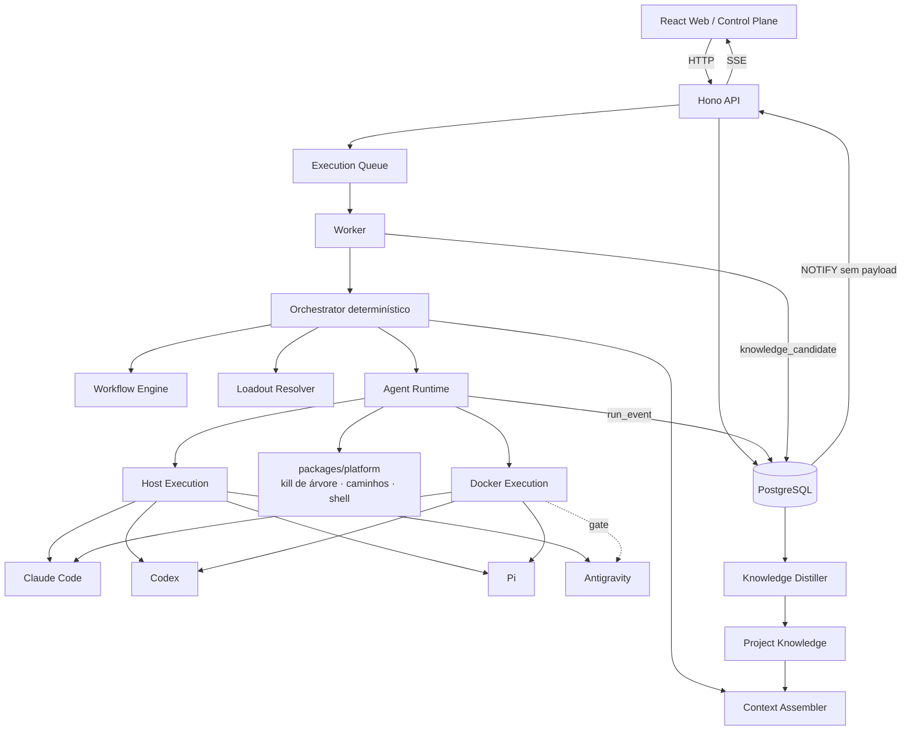

# Planejamento de Implementação — Dungeon Master

**Plataforma pessoal de trabalho com agentes de IA, com um toque de RPG de mesa.**

**Versão:** 0.4  
**Data:** 07/09/2026  
**Status:** Pronto para iniciar a Fase 0. Inclui a camada de gamificação e a Fase 2.5 de Conquistas  
**Substitui:** `planejamento_plataforma_agentic_v0.3.md` (v0.3) e `planejamento_plataforma_agentic.md` (v0.2), mantidos apenas como histórico  
**Documento companheiro:** `documentacao_ideia_e_fundamentos_tecnicos.md` (v0.4)

---

## 0. O que mudou

### 0.1 v0.3 → v0.4 (gamificação)

| Tema | v0.3 | v0.4 | Motivo |
|---|---|---|---|
| Nome | "plataforma pessoal de trabalho com agentes" | **Dungeon Master** | Identidade e tom |
| Tema | nenhum | skin de RPG via `packages/glossary`, com **interruptor na UI** para ligar e desligar; domínio canônico intacto (seção 14) | Toque de gamificação sem contaminar contratos, tabelas e eventos; quem preferir vê a interface sem tema |
| Conquistas | não existiam | **Fase 2.5**: catálogo fixo para todos, templates instanciados por usuário, forjadas por LLM como opcional; Hall dos Heróis | Pedido do produto |
| Task | sem tipo | `kind` (BUG, FEATURE, RESEARCH, CHORE) desde a Fase 1 | Bugs são Monstros; alimenta Bestiário e Conquistas com um fato do domínio |
| SSE | só canal de Run | canal de dashboard para eventos fora de Run | Toast de desbloqueio em qualquer tela |
| Fase 0 | — | monorepo `dungeon-master`, glossário, schema e catálogo v1 de Conquistas como dados, docs dentro do repo | Sementes da gamificação sem engine |
| Fora do MVP | — | ranking entre usuários, recompensas que destravam funcionalidade, economia de itens, LLM no caminho quente da UI | Manter o toque como toque |

### 0.2 v0.2 → v0.3

| Tema | v0.2 | v0.3 | Motivo |
|---|---|---|---|
| Web | Angular, Signals, RxJS, CDK | React 19, Vite, Tailwind, shadcn, TanStack Query/Table/Virtual/Router, React Flow, Zustand | Ecossistema de painéis ricos (grafo), geração de código por agentes, referências são React |
| API | Fastify | Hono + `@hono/zod-openapi` | Spec OpenAPI gerada dos schemas Zod, cliente tipado gerado, SSE nativo |
| Plataformas | não especificado | Windows e macOS de primeira classe, matriz de CI desde a Fase 0 | Decisão do produto; Sandcastle tem código específico de SO sem CI |
| Cancelamento e timeout | delegados ao Sandcastle | responsabilidade do `AgentRuntime`, com kill de árvore por SO | Sandcastle não faz kill de processo |
| Worktree no Host | opcional | default, com trava por (repositório, caminho) no domínio | Sandcastle não implementa locking de worktree |
| Structured output | Fase 3 (Antigravity) | Fase 2, via Sandcastle Output, para os três harnesses | Já disponível com schema e retry |
| Sessão do harness | não modelado | `harness_session_id` no Run, com o harness emissor | Retry com contexto e fork |
| Approval gate | aprovação simples | CAS transacional com eventos de auditoria | Fecha aprovação dupla (padrão do Archon) |
| Knowledge Candidates | assíncrono | persistidos na transação do resultado; Distiller sob advisory lock | Evitar perda silenciosa (bug do TencentDB) |
| Formato de Workflow | questão aberta | dados (JSON/YAML) validados por Zod, sem linguagem de expressão | Constituição de linguagem do Archon |
| Eventos de execução | um único writer | dois contratos: nunca lança vs. propaga; erro terminal próprio | Padrão do Archon |
| SSE | direto | NOTIFY sem payload + drain por cursor; reenvio na reconexão | Resiliência a notificação perdida |
| Executores de step | não especificado | um módulo por tipo de step desde a Fase 4 | Evitar o executor monolítico do Archon |
| Código das referências | não tratado | manifesto de cerca de 15 arquivos copiados ou adaptados, com atribuição MIT (seção 13) | Utilitários testados prontos; subsistemas só como padrão |

---

## 1. Objetivo do produto

Construir uma plataforma web pessoal para **capturar, organizar, executar, acompanhar e aprender com trabalho realizado por agentes de IA**.

A aplicação não será centrada em chat. O chat existirá como uma forma de interação, mas o núcleo do produto será:

```text
Project
  ├── Knowledge
  └── Tasks
        ├── Task Graph
        └── Run
              ├── Workflow
              ├── Agent / Harness / Model
              ├── Loadout
              ├── Execution Events
              ├── Artifacts
              └── Result
                    ├── New Tasks
                    └── Knowledge Candidates
```

A interface web funcionará como **Control Plane** de todo esse sistema.

O sistema se chama **Dungeon Master**. O nome vem com um toque de RPG de mesa que a UI usa e o domínio ignora: o Mestre da Guilda (usuário) publica Missões (Tasks) em Campanhas (Projects); Heróis (Agents) de uma Guilda (Harness) partem em Expedições (Runs); Monstros (bugs) são derrotados; Espólios (Artifacts) e Páginas do Grimório (Knowledge) ficam para a próxima Expedição; e o Dungeon Master (o sistema) narra, registra e premia com Conquistas. O glossário completo está na seção 14.

---

## 2. Princípios de implementação

1. **TypeScript first.** Frontend, API, worker, domínio e integrações em TypeScript, sobre Node LTS.
2. **Monólito modular antes de microserviços.** `web`, `api` e `worker` são processos diferentes, mas o domínio vive em um monorepo coeso.
3. **Sem Docker para a aplicação nas fases de fundação.** Web, API e Worker rodam como processos Node locais. O PostgreSQL de desenvolvimento sobe por docker compose, por praticidade; testes e CI usam `embedded-postgres`, porque os runners de Windows e macOS não oferecem Docker Linux.
4. **Execução de agentes começa sem isolamento.** `HOST` primeiro, `DOCKER` ainda na Fase 2 como segunda opção.
5. **Task != Run.** Uma tarefa representa trabalho; um Run representa uma tentativa concreta.
6. **Agent != Harness != Model.** O papel é independente da ferramenta e do modelo.
7. **Task Graph != Workflow.** O Task Graph representa o trabalho; o Workflow representa como uma tarefa é executada.
8. **Eventos de execução são append-only.** Estado de domínio continua mutável; sem Event Sourcing completo.
9. **Sandcastle é infraestrutura, não domínio.** O domínio não depende das abstrações do Sandcastle.
10. **Conhecimento pertence ao projeto.** Agentes e modelos são intercambiáveis; o contexto persistente fica no projeto.
11. **Autonomia cresce gradualmente.** Execução explícita e aprovação humana antes de delegação.
12. **Windows e macOS são plataformas de primeira classe.** Todo código de processo, caminho e shell é testado nas duas desde a Fase 0. Linux não é excluído, mas não é alvo de teste inicial.
13. **Cancelamento, timeout e travas são responsabilidade do domínio.** Nenhuma dessas garantias é delegada a biblioteca externa.
14. **Nada fire-and-forget no caminho de escrita de resultado ou conhecimento.** Resultado, eventos terminais e candidatos a conhecimento são persistidos transacionalmente.
15. **Contratos, não classes, entre Web e API.** A Web importa apenas o cliente gerado da spec OpenAPI e os tipos de `packages/contracts`.
16. **Dados coordenam, código computa, agentes julgam.** Workflows são dados sem linguagem de expressão.
17. **O tema é um skin, não o domínio.** Código, contratos, tabelas, eventos e logs usam os nomes canônicos (Project, Task, Run, Agent). O vocabulário de Dungeon Master entra só em labels da UI, via `packages/glossary`, e nos nomes e textos de Conquistas. O usuário liga e desliga o tema nas configurações; os dois glossários, `dnd` e `plain`, têm exatamente o mesmo conjunto de chaves, garantido em tempo de tipo.
18. **Conquistas são uma projeção.** Calculadas a partir de eventos e estado já persistidos; idempotentes, reconstruíveis do zero e incapazes de afetar a execução.

---

## 3. Stack inicial

### 3.1 Monorepo

- TypeScript
- Node.js LTS
- pnpm
- Turborepo (recomendado desde o início, para cache de build e execução por pacote)
- Vitest em todos os pacotes
- ESLint com regras de fronteira entre pacotes
- CI com matriz `windows-latest` + `macos-latest`

### 3.2 Web

| Função | Biblioteca |
|---|---|
| Framework | React 19 |
| Build | Vite |
| Estilo | Tailwind |
| Componentes | shadcn/ui sobre Radix |
| Roteamento | TanStack Router, com parâmetros de busca tipados para filtros |
| Estado de servidor | TanStack Query |
| Tabelas | TanStack Table (headless) |
| Virtualização | TanStack Virtual |
| Grafos | React Flow + dagre |
| Estado de streaming | Zustand, alimentado pelo `EventSource` |
| Cliente de API | gerado da spec OpenAPI (`openapi-typescript` + `openapi-fetch`) |
| Tempo real | SSE |

Regra de fronteira: `apps/web` importa somente `packages/api-client` e tipos de `packages/contracts`. Nenhum pacote interno do backend. Aplicada por lint.

### 3.3 Backend

- Node.js LTS
- Hono 4 com `@hono/zod-openapi`
- Zod como fonte única de validação e de spec OpenAPI
- `@hono/node-server` com timeouts de SSE configurados explicitamente (`requestTimeout`, `headersTimeout`, `keepAliveTimeout`)
- Logging estruturado (pino)
- API escuta apenas em `localhost` por padrão

### 3.4 Persistência

- PostgreSQL 17: `docker compose up db` para desenvolvimento local; `embedded-postgres` para testes e para o CI na matriz Windows + macOS
- Drizzle ORM, com disciplina de migração obrigatória: toda mudança de schema gera migração versionada e o CI falha se o schema e as migrações divergirem
- JSONB para payloads de eventos e snapshots
- Full-text search do PostgreSQL para a primeira fase do Context Engine
- Advisory locks para Distiller e trava de caminho
- `pgvector` somente quando o Context Engine precisar de busca vetorial

### 3.5 Worker e jobs

- Processo Node separado (`apps/worker`)
- Fila persistida no PostgreSQL, com polling transacional (`SELECT ... FOR UPDATE SKIP LOCKED`)
- `pg-boss` como alternativa quando a fila própria mostrar limite
- Redis e BullMQ adiados até necessidade observada

### 3.6 Runtime de agentes

- Sandcastle como primeiro backend de execução para Claude Code, Codex e Pi
- `noSandbox()` para execução no host
- `docker()` como modo isolado, ainda na Fase 2
- Abstração própria `AgentRuntime` / `HarnessAdapter` acima do Sandcastle
- **Kill de árvore de processos, timeout, trava de caminho e tradução de env são nossos**, em `packages/platform` e `packages/runtime`

### 3.7 Agentes e harnesses alvo

| Harness | Estratégia | Host Win | Host mac | Docker | Sessão/resume | Observação |
|---|---|---:|---:|---:|---|---|
| Claude Code | Sandcastle | Sim | Sim | Sim | `--resume` / `--fork-session` | Suporte nativo, captura de sessão |
| Codex CLI | Sandcastle | Sim | Sim | Sim | `codex exec resume` / `fork` | Suporte nativo, captura de sessão |
| Pi | Sandcastle | Sim | Sim | Sim | `--session <id>` | Suporte nativo, captura de sessão |
| Antigravity CLI | Fase dedicada | Meta | Meta | Gate | `--conversation` | Adapter próprio e/ou provider Sandcastle |

### 3.8 Contratos e geração de cliente

```text
packages/contracts (Zod)
        ↓
apps/api (Hono + zod-openapi)  →  openapi.json
        ↓
packages/api-client (gerado)   →  apps/web
```

O `openapi.json` e o cliente gerado são commitados. O CI regenera e falha se houver diff, no mesmo padrão dos artefatos gerados do Archon.

---

## 4. Arquitetura de alto nível



Fluxo de tempo real: o Worker grava `run_event` no PostgreSQL e emite `NOTIFY` sem payload. A API faz *drain* a partir do último cursor e empurra por SSE. Na reconexão, o browser envia o último `sequence` recebido e a API reenvia a partir dali.

---

## 5. Estrutura do monorepo

```text
agentic-work-os/
│
├── apps/
│   ├── web/                 # React 19 + Vite
│   ├── api/                 # Hono
│   └── worker/              # fila + orquestrador + runtime
│
├── packages/
│   ├── contracts/           # schemas Zod: fonte única de tipos e OpenAPI
│   ├── api-client/          # gerado da spec OpenAPI; único import da web
│   ├── domain/              # entidades, máquinas de estado, regras
│   ├── database/            # Drizzle, migrações, repositórios
│   ├── platform/            # kill de árvore por SO, normalização de caminho, spawn sem shell
│   ├── events/              # ExecutionEvent, writers (nunca-lança / propaga), cursor
│   ├── projects/
│   ├── tasks/
│   ├── runs/
│   ├── workflows/           # motor, um executor por tipo de step
│   ├── agents/
│   ├── loadouts/
│   ├── runtime/             # AgentRuntime, HarnessAdapter, capabilities, preflight
│   ├── runtime-sandcastle/  # adapter Sandcastle (Claude, Codex, Pi)
│   ├── runtime-antigravity/ # adapter direto (Fase 3)
│   ├── knowledge/
│   ├── context/
│   ├── artifacts/
│   ├── observability/
│   ├── glossary/            # canônico → tema (Dungeon Master); fonte única dos labels da UI
│   └── achievements/        # catálogo fixo, templates, vocabulário de condições, projetor, hero stats
│
├── docs/                    # este planejamento e o documento técnico, movidos para o repo na Fase 0
│
├── tooling/
│   ├── openapi/             # geração e verificação do cliente
│   ├── vitest/              # setup compartilhado (isolamento de gitconfig por worker)
│   └── ci/                  # matriz Windows + macOS
│
└── THIRD_PARTY_NOTICES.md   # atribuição MIT do código reaproveitado (seção 13)
```

Regras de fronteira, aplicadas por lint:

- `packages/domain` não importa Sandcastle, Antigravity, Drizzle nem SDK de provedor.
- `apps/web` importa somente `packages/api-client` e tipos de `packages/contracts`.
- `packages/runtime` não importa `packages/database`; recebe store por injeção de contrato, como o motor do Archon.

---

# 6. Roadmap

## Fase 0 — Foundation

### Objetivo

Ter a aplicação completa subindo localmente em Windows e macOS, sem Docker para a aplicação (só o banco de desenvolvimento usa container), mesmo que ainda não execute agentes.

### Decisões de partida (07/09/2026)

| Tema | Decisão |
|---|---|
| Repositório | `github.com/daniel--santos/dungeon-master`, branch `main`, trabalho em branches curtas |
| Licença | MIT, com `THIRD_PARTY_NOTICES.md` para o código reaproveitado |
| Máquinas | Windows 11 como estação principal; Mac disponível para teste manual do modo Host |
| Banco em desenvolvimento | PostgreSQL 17 em docker compose; `embedded-postgres` em testes e CI |
| Runtime | Node 24 LTS fixado em `.nvmrc` e `engines`; pnpm 10 fixado em `packageManager` |
| Identificadores | UUIDv7 gerados na aplicação; `timestamptz` em UTC em todo timestamp |
| API | Rotas sob `/api/v1`; erros no formato RFC 9457 (problem details); escuta só em `localhost` |
| Idioma | UI em português; identificadores de código em inglês; o glossário é a costura para outro idioma depois |
| Usuário | Um usuário local semeado na tabela `user`, sem login; toda tabela com `user_id` aponta para ele |
| `packages/platform` | Só processo, caminho e shell; detecção de CLI instalada fica no preflight de cada adapter |
| Testes | Vitest desde a Fase 0; Playwright a partir da Fase 1, quando houver telas |
| Execução da fase | Esqueleto do monorepo por um único agente (fiação sequencial); depois pacotes independentes em paralelo, um agente por branch |

### Entregas

- [x] Criar monorepo TypeScript com pnpm e Turborepo
- [x] Criar `apps/web` (React 19 + Vite + Tailwind + shadcn + TanStack Router)
- [x] Criar `apps/api` (Hono + zod-openapi)
- [x] Criar `apps/worker`
- [x] PostgreSQL 17 via `docker compose up db` para desenvolvimento; `embedded-postgres` nos testes e no CI
- [x] Configurar Drizzle e migrações versionadas, com check de divergência no CI
- [x] Criar `packages/contracts` com os primeiros schemas Zod
- [x] Pipeline de geração: `openapi.json` → `packages/api-client`, com check de diff no CI
- [x] Regras de lint de fronteira entre pacotes
- [x] Criar `packages/platform` com kill de árvore de processos (Windows e macOS), normalização de caminho e spawn sem shell, com testes nas duas plataformas
- [x] Criar `THIRD_PARTY_NOTICES.md` e importar os itens de Fase 0 do manifesto (seção 13): terminação de processo e validação de caminho do Archon, isolamento de gitconfig do Sandcastle, transport SSE e poller adaptados para Hono, regra de lint do frontend
- [x] Nomear o monorepo `dungeon-master` e o escopo de pacotes `@dungeon-master/*`; mover este planejamento e o documento técnico para `docs/`
- [x] Criar `packages/glossary` com dois glossários de chaves idênticas, `dnd` e `plain` (seção 14), paridade de chaves verificada em tempo de tipo, e um teste que falha se a Web renderizar um label de entidade fora do glossário ativo
- [x] Criar a tabela `user_setting` (chave/valor JSONB) e o endpoint de configurações, onde a preferência de tema é guardada
- [x] Criar `packages/achievements` apenas com o schema Zod de definição de Conquista, o vocabulário fechado de condições e o catálogo fixo v1 como dados JSON validados no CI; sem projetor ainda (Fase 2.5)
- [x] Configurar logging estruturado
- [x] Configurar health checks
- [x] Implementar SSE entre API e Web, com timeouts do servidor Node configurados e reconexão por cursor
- [x] Definir padrão de erros
- [x] Criar testes unitários base
- [x] CI com matriz `windows-latest` + `macos-latest` rodando lint, typecheck, testes e checks de artefatos gerados
- [x] Documentação de desenvolvimento local para os dois sistemas

### Pendências ao fechar a Fase 0 (07/09/2026)

Entregue e verificada em 07/09/2026, em três rodadas: esqueleto do monorepo, depois `packages/platform` + `tooling/vitest`, `packages/glossary` + `packages/achievements` e SSE + settings em paralelo. **CI verde em `windows-latest` e `macos-latest`** na terceira execução, após duas correções que só o runner revelou: o teto de tempo do teste de rajada de gitconfig no Windows, e o Postgres de teste iniciado por `pg_ctl` porque `postgres.exe` recusa rodar como administrador (o runner do Windows é administrador). Os testes de kill de grupo POSIX passaram no macOS. **Fase 0 fechada pelo critério de conclusão.** Fica pendente para as fases seguintes:

- O caso `linux` de `isInside` (`packages/platform`) não roda em nenhuma perna da matriz.
- O teste de CTRL_BREAK do Windows (`packages/platform`) só roda fora do CI: o runner não tem sessão de desktop para abrir o console da fixture. Fica provado localmente, em toda execução no Windows.
- **`apps/web` sem testes**, rodando com `--passWithNoTests`; entra na Fase 1 com as primeiras telas.
- **Marca d'água do poller de eventos**: o cursor avança até a maior `sequence` vista; duas transações concorrentes que commitassem fora de ordem poderiam pular a menor. Irrelevante na Fase 0 (produtores de uma inserção só); tarefa registrada na Fase 2B.
- **Achados para todo o repositório**, já registrados no `CLAUDE.md`: o TypeScript 6 não inclui `@types/node` automaticamente (todo pacote com builtins precisa de `types: ["node"]`), e a regra de fronteira do ESLint precisa de `regex`, não de `group` com glob.
- **Correção posterior (07/09/2026, Fase 1)**: importar `embedded-postgres` em runtime instalava um `async-exit-hook` que devolvia código 0 ao Vitest mesmo com teste falhando, e o CI ficou verde com uma suíte vermelha por algumas horas. O helper de testes passou a chamar `initdb` e `pg_ctl` direto sobre os binários, sem importar o pacote; regra e método de prova ("teste vermelho de propósito, conferir exit 1") no `CLAUDE.md`.

### Critério de conclusão

Web, API, Worker e PostgreSQL funcionam localmente nos dois sistemas, sem Docker. O CI verde nas duas plataformas é pré-requisito para iniciar a Fase 1.

---

## Fase 1 — Web Control Plane + Projects + Tasks

### Objetivo

Criar uma aplicação utilizável como gerenciador pessoal de projetos e tarefas antes de adicionar agentes.

### Funcionalidades

#### Web

- [x] Layout principal com shadcn (sidebar, header, command palette), com todos os labels de entidade vindos do glossário ativo via um hook único (`useGlossary`)
- [x] Settings com o interruptor **"Tema Dungeon Master"**, ligado por padrão, persistido em `user_setting` e aplicado sem recarregar a página; também acessível pela command palette
- [x] Hall dos Heróis em modo catálogo: todas as Conquistas fixas visíveis como bloqueadas, com raridade e descrição; sem progresso ainda
- [x] Dashboard
- [x] Inbox
- [x] Projects
- [x] Tasks, com TanStack Table e filtros em parâmetros de busca tipados do TanStack Router
- [x] Task details
- [x] Runs (estrutura vazia inicialmente)
- [x] Agents (cadastro inicial) — adiado para a Fase 2A, quando existirem as entidades Agent, Harness, Model e Loadout
- [x] Loadouts (cadastro inicial) — adiado para a Fase 2A, quando existirem as entidades Agent, Harness, Model e Loadout
- [x] Visualização de dependências de tarefas com React Flow (leitura; edição fica para a Fase 5)

#### Project

- [x] Criar, editar, arquivar
- [x] Overview
- [x] Tasks do projeto
- [x] Activity básica

#### Task

- [x] Criar, editar
- [x] Prioridade e status
- [x] Tipo (`kind`): `BUG`, `FEATURE`, `RESEARCH`, `CHORE`. No tema, `BUG` é Monstro e alimenta o Bestiário e as Conquistas
- [x] Parent task
- [x] Dependências
- [x] Subtarefas
- [x] Inbox -> Task

### Estados iniciais de Task

```text
INBOX
READY
QUEUED
RUNNING
WAITING
BLOCKED
COMPLETED
FAILED
CANCELLED
```

### Decisões de modelagem da Fase 1 (07/09/2026, backend entregue)

- **A Inbox são Tasks em `INBOX`**, sem Project; promover atribui o Project e leva a `READY`; descartar leva a `CANCELLED`. Restrição no banco: `project_id IS NOT NULL OR status IN ('INBOX','CANCELLED')`.
- **Conclusão manual**: `READY → COMPLETED` existe para o usuário marcar trabalho feito sem Run (seção 36 do documento técnico). As demais chegadas a `COMPLETED` vêm de Run, a partir da Fase 2.
- **Regras de domínio em `packages/domain`**: transições; filhas `COMPLETED`/`CANCELLED` antes de concluir a mãe; toda entrada em `QUEUED` exige dependências `COMPLETED` (inclusive a retentativa `FAILED → QUEUED`); dependência `CANCELLED` continua bloqueando até a aresta ser removida; ciclo direto ou indireto de dependências é recusado.
- **`activity`** é append-only por Project e Task; seus tipos são o mesmo vocabulário dos eventos de dashboard de domínio (`project.*`, `task.*`). Arquivar é `project.updated` com `from`/`to`.
- **Trocar o Project de uma Task** só é permitido sem mãe e sem filhas; mover subárvore é Fase 5.
- **Labels de status e prioridade de Task** aprovados como chaves do glossário, iguais nos dois temas: Capturada, Pronta, Na fila, Em execução, Aguardando, Bloqueada, Concluída, Falhou, Cancelada; Baixa, Média, Alta, Urgente.
- **Pendências**: a `activity` de criação de uma captura nasce sem Project e não aparece no diário do Project após a promoção; `GET /tasks` só ordena por `updatedAt desc`; texto de captura limitado a 200 caracteres.

### Fechamento da Fase 1 (07/09/2026)

Entregue em quatro rodadas de agentes: backend (domínio, banco, API), textos das Conquistas, pendências de API com o catálogo, shell da web, e as telas. Verificado localmente (44 tarefas do Turborepo, cliente gerado e migrações em dia, 5 testes de ponta a ponta) e no CI nos dois sistemas.

Decisões da rodada das telas, aceitas:

- A 16ª carta do Hall é **uma** carta oculta representando os cinco templates, e não cinco cartas: um template só vira Conquista quando os dados o instanciam.
- O glossário não carrega gênero, então os textos ao redor de um label evitam concordância ("Criar" em vez de "Nova").
- A carta mostra o `flavor` em itálico no tema `dnd` e o esconde no `plain`.
- As capturas em `INBOX` aparecem na lista de Missões com o estado "Capturada"; o filtro de status as tira.
- O detalhe de Missão oferece Concluir, Reabrir e Cancelar só quando a aresta existe na máquina de estados; `409` vira toast com o `detail` do problem details.

Pendências, todas na API, para a próxima rodada de backend:

- `GET /projects` sem `taskCounts`; a lista faz uma leitura por linha.
- `GET /tasks` sem filtro de exclusão de estado (para tirar capturas sem oito parâmetros na URL).
- O payload de `activity` não traz o título da Task; o diário diz "Missão criada" sem dizer qual.
- Agentes e Equipamentos seguem como placeholders até a Fase 2A.

### Critério de conclusão

A aplicação já pode ser usada manualmente para gerenciar projetos, tarefas, subtarefas e dependências através da interface web. Alternar o interruptor de tema troca todos os labels da interface sem recarregar, e nenhuma rota, URL ou payload muda entre os dois modos.

---

# Fase 2 — Execution Runtime: Host + Docker

## Objetivo

Transformar tarefas em execuções reais de agentes, com duas opções de ambiente:

1. `HOST` — execução local sem isolamento.
2. `DOCKER` — execução isolada em container.

`HOST` primeiro, funcionando sem Docker instalado. Docker na segunda parte da mesma fase.

---

## 2A — Modelo de execução

### Entidades

- [ ] `Run`, com `harness_session_id`, `execution_mode`, `workspace_path`, `workflow_version_id`, `cancel_requested_at`
- [ ] `RunEvent`, com `sequence` único por Run
- [ ] `ExecutionProfile`
- [ ] `Agent`
- [ ] `Harness`, com `HarnessCapabilities`
- [ ] `Model`
- [ ] `Loadout`

### Máquina de estados de Run

```text
CREATED → QUEUED → PREPARING → RUNNING → SUCCEEDED | FAILED | TIMED_OUT | CANCELLED
                                 RUNNING ⇄ WAITING_APPROVAL
```

Transição para estado terminal só ocorre após confirmação de que a árvore de processos terminou.

### Contrato de runtime

```ts
export interface AgentRuntime {
  execute(request: ExecutionRequest): AsyncIterable<ExecutionEvent>;
  cancel(runId: string): Promise<void>;   // mata a árvore e confirma término
}

export interface ExecutionResult {
  status: "succeeded" | "failed" | "cancelled" | "timed_out";
  harness: HarnessRef;
  harnessVersion: string;
  harnessSessionId?: string;
  usage?: UsageSummary;
  output?: unknown;                        // structured output validado por schema
}
```

### Contrato do harness

```ts
export interface HarnessAdapter {
  readonly id: string;
  readonly capabilities: HarnessCapabilities;
  preflight(context: HarnessContext): Promise<PreflightResult>;
  execute(request: HarnessExecutionRequest): AsyncIterable<HarnessEvent>;
  cancel(executionId: string): Promise<void>;
}
```

`HarnessCapabilities` inclui `resume`, derivado da presença de storage de sessão no provider, no mesmo espírito do Sandcastle.

### Contratos de escrita de evento

```ts
appendEvent(runId, event)          // NUNCA lança; observabilidade pura
persistEvent(runId, event)         // propaga falha; usar quando a execução não pode seguir sem a linha
writeTerminalStatus(runId, status) // falha vira TerminalStatusWriteError: nenhum resultado comum pode
                                   // ser reportado pelo mesmo canal
```

---

## 2B — Execução HOST sem isolamento

### Implementação

- [ ] Integrar Sandcastle `noSandbox()`
- [ ] Claude Code via host
- [ ] Codex via host
- [ ] Pi via host
- [ ] Preflight de CLIs instaladas e descoberta de versão, por SO
- [ ] Verificação de autenticação quando possível
- [ ] Working directory explícito
- [ ] **Git worktree por Run como default**, com trava por (repositório, caminho) no PostgreSQL antes de subir qualquer processo
- [ ] Teto de capacidade de runs concorrentes, com a trava por chave do Archon (seção 13.2)
- [ ] **Cancelamento por kill de árvore de processos** (`packages/platform`), com confirmação de término por polling, adaptado da terminação de processo do Archon (seção 13.2)
- [ ] **Timeout de ociosidade e de conclusão**, ambos nossos, com distinção entre timeout real e abort
- [ ] Tradução da política de ambiente do Loadout para o allow-list do Sandcastle (`.sandcastle/.env`) ou montagem própria do ambiente
- [ ] Captura de stdout, stderr e eventos estruturados
- [ ] Captura de `harnessSessionId` e `usage`
- [ ] **Structured output via Sandcastle Output**, com o schema `TaskExecutionResult` já definido em `packages/contracts`
- [ ] Persistência de eventos com os dois contratos de escrita
- [ ] Sanitização de credenciais em todo payload de evento, com o sanitizador do Archon (seção 13.2)
- [ ] Streaming SSE para a interface via NOTIFY + drain (base entregue na Fase 0: `packages/events`, `dashboard_event`, `GET /api/v1/events/stream`)
- [ ] Marca d'água no poller de eventos: o cursor só avança até a primeira lacuna de `sequence`, para que transações concorrentes que commitem fora de ordem não sejam puladas (risco registrado ao fechar a Fase 0)
- [ ] Tela de execução ao vivo (Run Cockpit, "Cristal de Visão" no tema)
- [ ] Canal de dashboard no SSE para eventos fora de um Run (desbloqueio de Conquista, stats de herói), no padrão do canal de dashboard do Archon
- [ ] Testes de contrato de harness rodando na matriz Windows + macOS

### Segurança obrigatória no modo HOST

- [ ] Indicador visual `UNISOLATED`
- [ ] Aceite explícito para execução host
- [ ] Working directory restrito ao esperado
- [ ] Nunca assumir que o agente está restrito ao diretório
- [ ] Não expor segredos desnecessários; o allow-list do Sandcastle ajuda aqui
- [ ] Registrar comandos e tool calls quando o harness disponibilizar
- [ ] Política de permissões por Loadout
- [ ] Diferenciar `policy requested` de `policy enforced`
- [ ] Nunca usar `sandbox.interactive()` do Sandcastle, que pula permissões incondicionalmente

```ts
type EnforcementLevel = "advisory" | "harness-native" | "sandbox-enforced";
```

---

## 2C — Execução DOCKER

### Implementação

- [ ] Integrar Sandcastle `docker()`
- [ ] Docker preflight (Docker Desktop no Windows e no macOS)
- [ ] Gerenciamento de imagem base
- [ ] Claude Code, Codex e Pi em Docker
- [ ] Montagem de workspace
- [ ] Variáveis de ambiente controladas; usar o caminho `run()`, porque `createSandbox()` não propaga o env do provider a containers longevos
- [ ] Política de rede
- [ ] Limites de recursos quando possível
- [ ] Cleanup de containers, inclusive em cancelamento
- [ ] Logs de lifecycle do sandbox
- [ ] Mesmo contrato de eventos do modo HOST

### Modelo de ExecutionProfile

```ts
interface ExecutionProfile {
  id: string;
  name: string;
  mode: "host" | "docker";                              // enforcement
  workspaceStrategy: "current" | "git-worktree" | "copy"; // isolamento operacional
  permissionPolicyId?: string;
  environmentPolicyId?: string;
  networkPolicyId?: string;
}
```

`mode` e `workspaceStrategy` são eixos ortogonais. Worktree não é backend, como o Archon documenta.

### UX

```text
Execution Environment

(●) Local / Host        Faster · No isolation
( ) Docker Sandbox      Isolated · Extra startup cost
```

---

## 2D — Observabilidade mínima de Run

```text
RunQueued
RunPreparing
RunStarted
HarnessSelected
ModelSelected
ExecutionEnvironmentPrepared
WorkspaceLockAcquired
ContextLoaded
HarnessSessionCaptured
ToolCalled
ToolResultReceived
OutputReceived
UsageReported
ArtifactCreated
CancelRequested
ProcessTreeTerminated
RunSucceeded
RunFailed
RunTimedOut
RunCancelled
```

### Critério de conclusão da Fase 2

A partir da Web, nos dois sistemas operacionais, é possível:

1. Abrir uma Task.
2. Selecionar Agent/Loadout.
3. Escolher `HOST` ou `DOCKER`.
4. Executar com Claude Code, Codex ou Pi.
5. Acompanhar eventos ao vivo, com reconexão sem perda.
6. Cancelar e ver a árvore de processos confirmada como encerrada.
7. Consultar resultado estruturado, sessão do harness e histórico depois.
8. Rodar dois Runs concorrentes no mesmo repositório sem colisão de worktree.

---

# Fase 2.5 — Conquistas e Hall dos Heróis

## Objetivo

Adicionar a camada de gamificação do Dungeon Master sobre o núcleo já observável: Conquistas com duas origens obrigatórias e uma opcional, um Hall para vê-las, e estatísticas de herói. Tudo cosmético, tudo projeção, nada no caminho de execução.

Depende da Fase 2 porque quase toda Conquista relevante nasce de uma Expedição concluída. O Hall em modo catálogo já existe desde a Fase 1, então o usuário vê desde cedo o que há para conquistar.

---

## 2.5A — Modelo

### Origens de Conquista

| Origem | Quem define | Quando é criada | Exemplo |
|---|---|---|---|
| `CATALOG` (fixa, igual para todos) | o produto, como dados em `packages/achievements/catalog/*.json` | no boot, a partir do catálogo versionado | "Primeira Expedição": primeira Run bem-sucedida |
| `TEMPLATE` (gerada por usuário) | o produto define o template; a aplicação instancia com os dados de cada usuário | quando a entidade parametrizada aparece: projeto criado, guilda usada pela primeira vez, monstro reaberto | "Guardião de {campanha}": 25 missões concluídas em {campanha} |
| `FORGED` (forjada, opcional) | a aplicação, via LLM, a partir de um resultado notável de Run | parte C, após a Fase 6; com rate limit | "Domador do Deadlock", após vencer um bug de concorrência reaberto três vezes |

`CATALOG` cobre a parte fixa para todos. `TEMPLATE` cobre a parte gerada pela aplicação para cada usuário, com os nomes dos projetos, guildas, heróis e monstros dele. `FORGED` é o passo seguinte, quando o pipeline de conhecimento existir.

### Vocabulário fechado de condições

Mesma regra dos Workflows: dados, sem linguagem de expressão. Cinco predicados:

```text
count   { source, filter, thresholds[] }     # "50 monstros derrotados"; thresholds dão os tiers I/II/III
streak  { source, filter, length }           # "10 vitórias seguidas"
first   { source, filter }                   # "primeira expedição em masmorra selada"
set     { source, dimension, values[] }      # "vitória com as quatro guildas"
record  { source, metric, direction }        # "expedição vitoriosa mais longa até agora"
```

`source` é um evento ou entidade conhecidos (`run.succeeded`, `task.completed`, `approval.granted`, `knowledge_item.promoted`, `project.created`...). `filter` é um objeto com campos conhecidos (`task.kind`, `run.executionMode`, `run.harness`, `project.id`, `run.resumedFrom`...). Definição com predicado ou campo desconhecido é fail-closed: carrega como inválida, aparece no log e nunca desbloqueia.

### Entidades

- [ ] `AchievementDefinition`: origem, escopo (`GLOBAL`, `PROJECT`, `HARNESS`, `AGENT`, `TASK`), `scope_id`, nome e descrição **em duas versões** (`theme` e `plain`, para acompanhar o interruptor de tema), texto de sabor (só `theme`), ícone, raridade (`COMMON`, `RARE`, `EPIC`, `LEGENDARY`), oculta, condição, proveniência. Conquistas forjadas têm só a versão `theme`, porque são texto de sabor por natureza
- [ ] `AchievementProgress`: contador, melhor marca, sequência atual, por definição e usuário
- [ ] `AchievementUnlock`: desbloqueio idempotente por (definição, usuário, tier), com Run e Task de origem e `seen_at`
- [ ] `HeroStats`: por Agent (herói) e por Loadout (equipamento): experiência, nível, expedições, vitórias, derrotas, monstros derrotados, guilda mais usada

Tudo escopado por `user_id` desde o início, mesmo single-user.

### Voz e apresentação das Conquistas (decisões de 07/09/2026)

- **Carta Heráldica**: raridade como borda e brilho sutil da carta, ícone em medalhão, nome em serif com versalete. Escolhida pelo usuário no canvas de design da Fase 1 (`docs/design/fase1/`), sobre a alternativa Sóbria.
- **Voz do Dungeon Master**: os textos `theme` (nome, descrição, `flavor`) têm humor ácido, sarcástico e deadpan, no espírito das conquistas da série *Dungeon Crawler Carl*, que é a referência do usuário para a ideia. **Texto sempre original**: a série é referência de tom, nunca de conteúdo. O guia de voz vive em `packages/achievements/VOICE.md` e será a base do prompt das Conquistas forjadas (Fase 6). A versão `plain` continua sóbria e literal.

### Experiência e nível

Cosméticos. Experiência por Expedição vitoriosa, com bônus por Monstro derrotado e pela primeira vitória em Masmorra selada. Nível derivado da experiência por fórmula fixa no catálogo. Nenhuma funcionalidade depende de nível.

---

## 2.5B — Projetor

- [ ] Projetor no Worker que consome `run_event` e mudanças de domínio por cursor (`achievement_cursor`), avalia as condições e grava progresso e desbloqueios
- [ ] Contrato "nunca lança": erro no projetor é logado e o cursor não avança; a execução do Run nunca é afetada
- [ ] Idempotência por unicidade de (definição, usuário, tier); reprocessar um evento não desbloqueia duas vezes
- [ ] Instanciação de templates ao surgir a entidade parametrizada, com definição oculta até o primeiro progresso
- [ ] Comando de reconstrução (`dm achievements rebuild`) que zera progresso e desbloqueios e reprocessa do início; possível porque todas as entradas são duráveis
- [ ] Evento `AchievementUnlocked` no canal de dashboard do SSE, com toast em qualquer tela
- [ ] Atualização de `HeroStats` no mesmo passo do projetor

---

## 2.5C — Conquistas forjadas (após a Fase 6)

- [ ] Step opcional do Distiller: dado um resultado notável (Monstro reaberto derrotado, sequência longa, primeira vitória de uma Guilda), o LLM propõe nome, descrição e texto de sabor
- [ ] O texto passa por `escapeXmlTags` antes de persistir e de exibir, e nunca é reinjetado em prompts
- [ ] Rate limit: no máximo uma forjada a cada N Expedições, para preservar raridade
- [ ] O Mestre da Guilda pode renomear ou descartar; a proveniência guarda o Run de origem

---

## 2.5D — Hall dos Heróis

- [ ] Aba **Conquistas**: grade de cartas com estados bloqueada (silhueta), oculta ("???"), em progresso (barra e tier) e desbloqueada; filtros por origem, raridade e estado em parâmetros de busca tipados
- [ ] Aba **Heróis**: cartas por Agent com experiência, nível, vitórias e derrotas, guilda mais usada, e detalhamento por Loadout
- [ ] Aba **Bestiário**: Monstros derrotados (Tasks `BUG` concluídas), com destaque para nêmesis (reabertos e vencidos de vez) e o Run que os derrotou
- [ ] Aba **Crônica**: linha do tempo de desbloqueios
- [ ] Toast de desbloqueio via SSE e marcação de visto
- [ ] Com o tema desligado: labels do glossário `plain`, nomes `plain` das Conquistas, texto de sabor oculto, ícones mantidos; a rota `/hall` e os dados não mudam

---

## Catálogo fixo v1

| Chave | Nome | Raridade | Condição |
|---|---|---|---|
| `first_expedition` | Primeira Expedição (plain: Primeira execução) | COMMON | `first run.succeeded` |
| `monster_slayer` | Caçador de Monstros I/II/III | COMMON → EPIC | `count task.completed kind=BUG` 10 / 50 / 200 |
| `flawless_streak` | Sem Baixas | RARE | `streak run.succeeded 10` |
| `tactical_retreat` | Retirada Tática | COMMON | `first run.cancelled` |
| `sealed_dungeon` | Masmorra Selada | RARE | `first run.succeeded executionMode=DOCKER` |
| `four_guilds` | Aliado das Quatro Guildas | EPIC | `set run.succeeded harness {claude, codex, pi, antigravity}` |
| `second_wind` | Segundo Fôlego | RARE | `first run.succeeded resumedFrom!=null` |
| `guild_seal` | Selo da Guilda | COMMON | `first approval.granted` |
| `veto` | Veto | COMMON | `first approval.rejected` |
| `grimoire_scribe` | Escriba do Grimório I/II/III | RARE → LEGENDARY | `count knowledge_item.promoted` 10 / 100 / 500 |
| `ritualist` | Ritualista | RARE | `first run.succeeded workflowVersionId!=null` |
| `cartographer` | Cartógrafo | COMMON | `first task.dependency_created` |
| `long_march` | Marcha Longa | EPIC | `record run.durationMs max`, acima de 60 min |
| `night_watch` | Vigília Noturna | COMMON | `first run.succeeded hourLocal in 0..5` |
| `campaign_founder` | Fundador de Campanhas | COMMON | `count project.created` 5 |

Tiers e limiares são dados no catálogo. Mudar um limiar é uma nova versão do catálogo, não código. Cada entrada traz nome e descrição nas versões `theme` e `plain`; a tabela acima mostra a versão `theme` e um exemplo da `plain`.

## Templates v1

| Chave | Nome | Instanciado por | Condição |
|---|---|---|---|
| `campaign_guardian` | Guardião de {campanha} | cada Project | `count task.completed project={id}` 25 / 100 |
| `guild_ally` | Aliado da Guilda {guilda} | cada Harness usado | `count run.succeeded harness={id}` 50 |
| `nemesis` | Nêmesis: {título do monstro} | cada Task `BUG` reaberta duas ou mais vezes | `first task.completed id={id}` |
| `hero_veteran` | {herói} Veterano | cada Agent | `count run.succeeded agent={id}` 100 |
| `campaign_record` | Recorde de {campanha} | cada Project | `record run.durationMs max project={id}` |

## Critério de conclusão da Fase 2.5

1. Concluir uma Task `BUG` com Run vitorioso desbloqueia "Primeira Expedição" e conta em "Caçador de Monstros", com toast na tela em que o usuário estiver.
2. Criar um Project instancia "Guardião de {campanha}" oculto; após a primeira Task concluída ele aparece em progresso.
3. `dm achievements rebuild` reproduz exatamente os mesmos desbloqueios.
4. Derrubar o projetor no meio de um Run não afeta o Run.
5. O Hall mostra as quatro abas com dados reais.

---

# Fase 3 — Suporte dedicado ao Antigravity CLI

## Objetivo

Adicionar **Antigravity CLI (`agy`) como harness de primeira classe** sem forçar o domínio a depender do CLI ou do Sandcastle.

Fase própria por causa de: ciclo de releases rápido, autenticação particular, diferenças de permissão, histórico de bugs headless/Windows, Docker a validar separadamente.

---

## 3A — Spike técnico e contrato de compatibilidade

Executado **nos dois sistemas operacionais**.

- [ ] Instalar e pinar versão do `agy`
- [ ] Validar `--version`, `-p`, `--output-format json` e `stream-json`, `--input-format stream-json`, `--json-schema`, `--conversation`, `--continue`, `--model`, `--agent`, `--effort`
- [ ] Validar códigos de saída
- [ ] Validar cancelamento por kill de árvore (não apenas sinal)
- [ ] Validar timeout
- [ ] Documentar os tipos de eventos NDJSON

### Matriz mínima de testes

| Cenário | Resultado esperado |
|---|---|
| prompt simples | resposta final capturável |
| tool call | evento estruturado |
| edição de arquivo | alteração detectável |
| comando shell | evento/política capturável |
| erro do modelo | Run FAILED |
| cancelamento | Run CANCELLED, árvore confirmada encerrada |
| timeout | Run TIMED_OUT |
| structured output | schema validado |
| resume | `harnessSessionId` reutilizado, contexto retomado |

---

## 3B — Estratégia de integração

**Decisão: adapter direto** (`AntigravityHarnessAdapter` com `node:child_process` via `packages/platform`), com a possibilidade de mover para provider Sandcastle depois. A API pública não muda.

---

## 3C — Antigravity HOST

- [ ] Implementar `AntigravityHarnessAdapter`
- [ ] Spawn sem shell, via `packages/platform`
- [ ] Parser incremental NDJSON
- [ ] Mapear eventos Antigravity -> `ExecutionEvent`
- [ ] Mapear `conversation_id` -> `harnessSessionId`
- [ ] Resume, structured output, model, agent, effort
- [ ] Cancelamento por kill de árvore e timeout
- [ ] Preflight e health
- [ ] Ausência de autenticação não trava o worker
- [ ] Diagnostics e stderr separados
- [ ] Permissões headless testadas

### Permissão

```ts
type AgentPermissionMode = "default" | "configured" | "bypass";
```

`bypass` é visível e opt-in. Nunca default.

---

## 3D — Antigravity DOCKER

Gate técnico, não suposição. Mesmos itens da v0.2. Só é marcado como suportado com caminho de autenticação seguro e reproduzível; caso contrário, `experimental` com limitações documentadas.

---

## 3E — Testes de contrato

```text
HarnessContractSuite
├── canRunPrompt
├── emitsText
├── emitsToolEvents
├── returnsFinalResult
├── returnsStructuredOutput
├── handlesFailure
├── canCancel                 # inclui confirmação de término da árvore
├── supportsTimeout
├── capturesSessionId
├── reportsVersion
└── reportsCapabilities
```

Roda para Claude, Codex, Pi e Antigravity, na matriz Windows + macOS.

### Critério de conclusão da Fase 3

Antigravity aparece na mesma UI dos demais harnesses, com host estável nos dois sistemas, eventos em tempo real, resultado persistido, resume, capabilities explícitas, e Docker suportado ou marcado como experimental.

---

# Fase 4 — Workflow Engine

## Objetivo

Separar o processo de execução da inteligência do agente.

### Formato

Workflows são **dados** (JSON ou YAML) validados por schema Zod em `packages/contracts`, com vocabulário pequeno e fixo. **Sem linguagem de expressão.** Condições são um conjunto fechado de predicados nomeados (`stepSucceeded`, `outputStatusIs`, `artifactExists`), nunca strings avaliadas.

### Captura congelada

No início do Run, o workflow é capturado em `workflow_version` e o Run referencia `workflow_version_id`. Editar o workflow não afeta Runs em andamento nem retomadas.

### Entidades

- [ ] `Workflow`
- [ ] `WorkflowVersion`
- [ ] `WorkflowStep`
- [ ] `RunStep`
- [ ] `ApprovalGate`

### Tipos de step iniciais, cada um em executor próprio

- [ ] `agent`
- [ ] `command` (spawn sem shell, via `packages/platform`)
- [ ] `validation`
- [ ] `approval`
- [ ] `knowledge`

### Recursos

- [ ] Dependências
- [ ] Condições por predicado fechado
- [ ] Retry, com snapshot de checkout fora do laço
- [ ] Timeout
- [ ] Approval gate com resolução por CAS transacional e evento de auditoria
- [ ] Gate identificado por chave própria, não pelo id do step, para retomada segura
- [ ] Artifact passing
- [ ] Step result
- [ ] Fixtures de teste: stubs de resposta de agente por step, no espírito do fixture-runner do Archon

### Primeiro workflow

```text
Analyze → Plan → [Approval] → Execute → Validate
```

### Critério de conclusão

Uma Task pode escolher um Workflow; o Run acompanha cada step, sua saída e seus gates individualmente; um Run pausado em gate sobrevive a restart do worker e a edição do workflow.

---

# Fase 5 — Task Decomposition + Task Graph

## Objetivo

Permitir que resultados de execução proponham novo trabalho.

O schema `TaskExecutionResult` já existe desde a Fase 2; aqui ele passa a alimentar o domínio.

### Entregas

- [ ] `ProposedTask`
- [ ] Parent/child generation
- [ ] Dependency generation
- [ ] Tela Task Graph com React Flow e layout dagre, com edição de dependências
- [ ] Aprovar/rejeitar tarefas propostas
- [ ] Política de autoaprovação futura

### Resultado estruturado

```ts
interface TaskExecutionResult {
  status: "completed" | "blocked" | "failed";
  summary: string;
  artifacts: ArtifactRef[];
  discoveredTasks: ProposedTask[];
  knowledgeCandidates: KnowledgeCandidate[];
  decisions: DecisionCandidate[];
  warnings: string[];
}
```

---

# Fase 6 — Knowledge + Distillation

## Objetivo

Fazer o sistema acumular aprendizado em vez de apenas histórico.

### Tipos iniciais

```text
FACT · DECISION · DISCOVERY · CONSTRAINT · PROCEDURE · SUMMARY
```

### Durabilidade

- Knowledge Candidates são gravados **na mesma transação** que `run.result`.
- O Distiller consome `knowledge_candidate` do banco, sob **advisory lock por projeto**, em lote e por timer, nunca síncrono ao Run.
- Cada candidato termina como `PROMOTED` ou `REJECTED`; falha do Distiller deixa o candidato `PENDING`.

### Entregas

- [ ] `KnowledgeItem` com proveniência, Project binding e Run binding
- [ ] `KnowledgeCandidate` (tabela desde a Fase 5)
- [ ] Distillation Worker com advisory lock
- [ ] Prompts de extração, dedup e sumário adaptados do TencentDB (seção 13.3), com os tipos do nosso domínio e sem a camada de persona
- [ ] Filtro de ruído de harness no L0 antes da destilação, adaptado do extrator de query do TencentDB
- [ ] Deduplicação por julgamento de LLM com fail-open, **mais revisão humana ligada por padrão** no início
- [ ] Tela Knowledge
- [ ] Tela Decisions
- [ ] Conquistas forjadas (Fase 2.5, parte C): step opcional do Distiller que propõe uma Conquista única a partir de um resultado notável, com texto sanitizado
- [ ] Convenção de post-mortem em comentário com referência ao incidente

### Pipeline

```text
Run → Execution Result ──(mesma transação)──▶ knowledge_candidate
                                                    │ async, lock por projeto
                                                    ▼
                                                 Distiller → Project Knowledge
```

---

# Fase 7 — Context Engine

## Objetivo

Entregar ao agente somente o contexto relevante, de forma **estável ao longo do Run** para preservar cache de prompt, com detalhes sob demanda.

### Entregas

- [ ] `ContextAssembler`
- [ ] Project Summary
- [ ] Relevant Decisions
- [ ] Relevant Knowledge
- [ ] Parent/Dependency context
- [ ] Relevant Artifacts
- [ ] Skills
- [ ] Context budget, com o estimador rápido de tokens do TencentDB (seção 13.3)
- [ ] Sanitização anti-injeção de todo conhecimento escrito por LLM antes de reinjetar no prompt (seção 13.3)
- [ ] Ferramentas read-only de busca expostas ao agente (MCP ou tool nativa do harness), em vez de recall automático por turno
- [ ] Retrieval logging

### Evolução de retrieval

1. regras determinísticas;
2. busca textual do PostgreSQL (FTS, BM25);
3. ranking híbrido com RRF;
4. embeddings + `pgvector`, desligados por padrão;
5. recuperação em camadas inspirada no TencentDB Agent Memory.

---

# Fase 8 — Loadouts avançados, Skills e Tools

Inalterada em relação à v0.2.

```text
Loadout
├── Agent
├── Harness
├── Model
├── Skills
├── Tools
├── MCP Servers
├── Knowledge Policy
├── Context Policy
├── Execution Profile
└── Permission Policy
```

- [ ] Skills versionadas
- [ ] Tool registry, MCP registry, Model registry, Provider registry
- [ ] Loadout versioning
- [ ] Capability matching e preflight

---

# Fase 9 — Autonomia e Agent-to-Agent

Inalterada em relação à v0.2. Somente após execução, observabilidade e conhecimento maduros. É aqui que o orquestrador pode ganhar um turno de agente, no espírito do Archon, e não antes.

- [ ] Agent delegation e Agent-to-Agent
- [ ] Dynamic workflow e loadout selection
- [ ] Model routing
- [ ] Auto-created tasks
- [ ] Approval policies
- [ ] Budgets
- [ ] Circuit breakers

---

# Fase 10 — Observabilidade avançada

Inalterada em relação à v0.2, com um acréscimo: tokens são registrados desde a Fase 2 pelo `UsageReported`, mesmo para harnesses por assinatura sem custo monetário.

---

# 7. Modelo de dados

## Fases 0–2

```text
project

task
task_dependency

agent
harness
model
loadout
execution_profile

run                 # + harness_session_id, execution_mode, workspace_path,
                    #   workflow_version_id, cancel_requested_at, result JSONB
run_event           # (run_id, sequence) único
artifact
workspace_lock      # (repo_path, checkout_path) → run_id ativo
user_setting        # chave/valor JSONB por usuário; guarda a preferência de tema, entre outras
```

## Fases 4–6

```text
workflow
workflow_version    # captura congelada
workflow_step
run_step
approval_gate       # resolução por CAS

knowledge_candidate # gravado na transação do resultado
knowledge_item
```

## Fase 2.5

```text
achievement_definition  # origem CATALOG | TEMPLATE | FORGED, escopo, condição JSONB, raridade, oculta
achievement_progress    # (definition_id, user_id) → contador, melhor marca, sequência
achievement_unlock      # UNIQUE (definition_id, user_id, tier); run_id, task_id, seen_at
achievement_cursor      # posição do projetor em run_event e nos eventos de domínio
hero_stats              # por agent_id e por loadout_id: xp, nível, expedições, vitórias, derrotas, monstros
```

Todas são projeções: podem ser truncadas e reconstruídas a partir de `run_event`, `task` e `project`.

## Posteriores

```text
skill · tool · mcp_server
loadout_skill · loadout_tool · loadout_mcp
provider
```

---

# 8. Telas principais

Rotas e código usam o nome canônico. O label exibido vem do glossário ativo, escolhido pelo interruptor de tema em Settings.

| Rota (canônica) | Label com tema | Label sem tema |
|---|---|---|
| Dashboard | Mesa do Mestre | Painel |
| Inbox | Quadro de Missões | Caixa de entrada |
| Projects | Campanhas | Projetos |
| Tasks | Missões | Tarefas |
| Runs | Expedições | Execuções |
| Knowledge | Grimório | Conhecimento |
| Agents | Heróis | Agentes |
| Loadouts | Equipamentos | Loadouts |
| Workflows | Rituais | Workflows |
| Hall | Hall dos Heróis | Conquistas |
| Settings | Configurações | Configurações |

## Run Cockpit

| Área | Implementação |
|---|---|
| Timeline ao vivo | Zustand alimentado pelo `EventSource`, renderizado com TanStack Virtual |
| Dados do Run e do Loadout | TanStack Query |
| Workflow atual | React Flow, nós coloridos por status do step |
| Tool calls, artifacts, diagnostics | TanStack Table |
| Ambiente | Badge `HOST · UNISOLATED` ou `DOCKER · ISOLATED` |
| Ações | Cancel, Approve, Reject via HTTP |
| Filtros de eventos | parâmetros de busca tipados do TanStack Router |

## Hall dos Heróis

| Área | Implementação |
|---|---|
| Conquistas | grade de cartas shadcn; estado, raridade e origem como filtros em parâmetros de busca tipados; TanStack Query com invalidação pelo evento de desbloqueio |
| Heróis | cartas por Agent com barra de experiência e nível; detalhamento por Loadout em TanStack Table |
| Bestiário | TanStack Table de Tasks `BUG` concluídas, com coluna de nêmesis e link para o Run |
| Crônica | lista virtualizada de desbloqueios com TanStack Virtual |
| Toast de desbloqueio | Zustand alimentado pelo canal de dashboard do SSE, renderizado no layout raiz |

---

# 9. Primeiro vertical slice real

```text
Criar Project → Criar Task → Selecionar Agent + Loadout → Escolher HOST
   → Queue → Worker → Trava de caminho → Sandcastle / Harness → Execução
   → Live Events na Web → Resultado estruturado persistido → harnessSessionId salvo
```

Depois, o mesmo fluxo deve funcionar mudando somente `HOST -> DOCKER`, e deve funcionar igual em Windows e macOS. As duas equivalências são requisitos da Fase 2.

---

# 10. Itens deliberadamente fora do MVP

- multi-user, organizações, RBAC;
- Kubernetes, Kafka, microserviços;
- editor visual de Workflow (a visualização existe; a edição gráfica não);
- marketplace de agentes;
- vector database separado;
- swarms autônomos;
- workflows 100% gerados pela IA;
- A2A avançado;
- execução remota/cloud sandbox;
- Linux como alvo de teste (não excluído, apenas não testado no início);
- ranking ou comparação entre usuários (o sistema é single-user);
- recompensas que desbloqueiam funcionalidade (Conquistas e nível são cosméticos);
- economia de itens, loot aleatório, moedas;
- geração de texto por LLM no caminho quente da UI (Conquistas forjadas nascem no Distiller, em background).

---

# 11. Riscos principais

## Execução sem isolamento

Host é conveniente, mas o agente roda com as permissões do processo local. Característica explícita, nunca detalhe oculto.

## Dependência de CLIs externas

Mitigação: adapters separados, version discovery, capability discovery, testes de contrato na matriz de SO, versões pinadas, lógica de CLI nunca no domínio.

## Lacunas do Sandcastle que assumimos

Sem kill de processo, sem locking de worktree, env em allow-list, env do provider não propagado a containers longevos. Cada uma tem cobertura própria nas Fases 0 e 2. Se uma versão futura do Sandcastle resolver alguma, o adapter simplifica sem mudar o domínio.

## Divergência entre plataformas

Kill de processo, caminhos, shell e case-sensitivity diferem entre Windows e macOS. Mitigação: `packages/platform` como único lugar desse código, testado nas duas plataformas em todo commit.

## Divergência entre documentação e código

Os três projetos de referência sofrem disso. Mitigação: OpenAPI, cliente e constantes gerados dos schemas, com checks no CI.

## Antigravity

Viável, mas de evolução rápida. Host provado primeiro; Docker depende de autenticação segura.

## Tema vazando para o domínio

O risco da gamificação é um nome temático virar nome de tabela, de evento ou de contrato, e o sistema ficar difícil de ler para quem não conhece o tema. Mitigação: `packages/glossary` como único lugar do vocabulário, teste de lint que falha em label fora do glossário, e a regra de que Conquistas são projeção e nunca escrevem no domínio.

## Complexidade prematura

O maior risco continua sendo tentar autonomia, memória sofisticada e multi-agent antes de o ciclo Task -> Run -> Result estar excelente. A Fase 2.5 não muda isso: ela consome o ciclo, não o altera.

---

# 12. Ordem prática para começar

1. Criar o monorepo com pnpm, Turborepo e CI na matriz Windows + macOS.
2. Criar `packages/contracts` com `Project`, `Task`, `Run` e `ExecutionEvent`.
3. Criar `packages/platform` a partir da terminação de processo do Archon (seção 13.2) e provar o kill de árvore nos dois sistemas.
4. Criar PostgreSQL, Drizzle e migrações com check no CI.
5. Subir Hono com zod-openapi e o pipeline de geração do cliente.
6. Subir a Web React com shadcn e TanStack Router, consumindo o cliente gerado.
7. Implementar Projects, Tasks e Inbox.
8. Criar Worker, fila e SSE com NOTIFY + drain.
9. Definir `AgentRuntime`, `HarnessAdapter` e `HarnessCapabilities`.
10. Implementar Claude Code com `noSandbox()`, worktree com trava, cancelamento próprio e structured output.
11. Generalizar para Codex e Pi; rodar a suíte de contrato na matriz.
12. Adicionar Docker como segundo ExecutionProfile.
13. Ligar o projetor de Conquistas e completar o Hall dos Heróis (Fase 2.5).
14. Executar a Fase 3 do Antigravity.
15. Somente então iniciar o Workflow Engine.

---

# 13. Manifesto de código reaproveitado das referências

Os três projetos são MIT. Copiar é permitido desde que o aviso de copyright e a permissão acompanhem o código. Dos cerca de 400 mil linhas dos três, o que entra aqui são uns 15 arquivos pequenos, prompts e trechos de SQL, somando perto de 3 mil linhas com testes.

## 13.0 Regras

1. **Nada é vendorizado como subsistema.** Só utilitários autocontidos, prompts e trechos de SQL.
2. **Todo arquivo copiado ou adaptado** leva o cabeçalho abaixo e uma entrada em `THIRD_PARTY_NOTICES.md` na raiz do monorepo.
3. **Testes colocados ao lado do arquivo de origem** são copiados junto e passam a rodar na nossa matriz de CI.
4. **Antes de copiar, verificar imports** de `bun:`/`Bun.` (Archon) e de `effect` (Sandcastle). Os arquivos abaixo foram verificados em 07/09/2026; o resultado está na coluna de observação.
5. **Commits de referência fixados.** Qualquer atualização futura compara contra estes:

| Projeto | Titular | Commit | Data |
|---|---|---|---|
| Sandcastle | Matt Pocock | `e99f832` (v0.12.0) | 29/06/2026 |
| Archon | Cole Medin | `0773b97` | 01/09/2026 |
| TencentDB Agent Memory | Tencent | `3efcd31` | 31/08/2026 |

Cabeçalho padrão:

```ts
// Adapted from <projeto> — <caminho no repositório de origem>@<commit>
// Copyright (c) <ano> <titular>. Licensed under the MIT License.
// Changes: <resumo das adaptações feitas aqui>
```

Modos:

- **Copiar** — mudanças mínimas (imports, nomes).
- **Adaptar** — mesma estrutura e algoritmo, integração nossa (storage, framework, tipos do domínio).
- **Ler** — reimplementar a ideia; o arquivo de origem não é copiado.

## 13.1 Sandcastle — dependência npm, mais quatro arquivos

| Origem | Linhas | Modo | Destino | Fase | Observação |
|---|---:|---|---|---:|---|
| `src/testSetup.ts` | 32 | Copiar | `tooling/vitest/git-isolation.ts`, usado como `setupFiles` por todo pacote que toca git | 0 | Sem Effect. Resolve a race de `git config --global` em workers paralelos do vitest |
| `src/boundedTail.ts` | 69 | Copiar | `packages/runtime/src/bounded-tail.ts` | 2 | Sem Effect. Cauda rolante de 64 KB para stdout de runs longos |
| `src/PromptArgumentSubstitution.ts` | 157 | Adaptar | `packages/workflows/src/prompt-args.ts` | 4 | **Tem um import de `effect`**; remover. Marcador que torna argumentos de prompt seguros contra injeção de shell |
| `src/AgentProvider.ts` (parsers de stream) | 1267 | Ler | Molde para `packages/runtime-antigravity/src/ndjson-parser.ts` | 3 | Um parser por harness e onde cada um expõe o id de sessão (no Pi, só na linha de header) |

Também como processo, adaptados ao nosso repositório: o questionário de `docs/agents/adding-an-agent-provider.md` antes de escrever qualquer adapter, e a estrutura de ADR de `docs/adr/`, que enumera alternativas rejeitadas e vazamentos conhecidos.

## 13.2 Archon — utilitários com teste; nenhum dos listados usa API do Bun

| Origem | Linhas | Modo | Destino | Fase | Observação |
|---|---:|---|---|---:|---|
| `packages/cli/src/utils/detached-run-control.ts`, linhas 454–572 (`processExists`, `waitUntilGone`, `terminateDetachedProcessTree`) | ~120 de 572 | Adaptar (extrair) | `packages/platform/src/process-tree.ts` | 0 | POSIX: `kill(-pid, SIGTERM)`, grace, escalada para `SIGKILL`, confirmação. Windows: `taskkill /PID /T /F` com confirmação por polling, porque o exit code não é prova. Só `node:child_process` |
| `packages/core/src/utils/conversation-lock.ts` + `.test.ts` | 197 | Copiar | `packages/runs/src/capacity-lock.ts` | 2 | Trava sequencial por chave mais teto global; aquisição retorna `started` ou `queued` na hora |
| `packages/core/src/utils/credential-sanitizer.ts` + `.test.ts` | 39 | Copiar | `packages/events/src/credential-sanitizer.ts` | 2 | Aplicado a todo payload de `run_event` antes de persistir |
| `packages/core/src/utils/path-validation.ts` + `.test.ts` | 46 | Copiar | `packages/platform/src/path-validation.ts` | 0 | Restrição de working directory |
| `packages/workflows/src/terminal-status-write.ts` | 59 | Copiar | `packages/events/src/terminal-status-write.ts` | 2 | O erro terminal de escrita de status |
| `packages/providers/src/shared/effort.ts` + `.test.ts` | 90 | Copiar | `packages/loadouts/src/effort.ts` | 2 | Escada única de effort; `clampEffort` desce primeiro |
| `packages/server/src/adapters/web/transport.ts` | 302 | Adaptar | `packages/events/src/sse-transport.ts` (desvio registrado: sem dependência de Hono nem de pg, writer por injeção) | 0 | `Bun.serve` vira `streamSSE` do Hono. Manter o buffer de replay e o invariante `EVENT_BUFFER_TTL_MS >= RECONNECT_GRACE_MS` |
| `packages/server/src/adapters/web/dashboard-event-poller.ts` | 149 | Adaptar | `packages/events/src/dashboard-event-poller.ts` | 0 | Drain por cursor disparado pelo NOTIFY |
| `packages/core/src/db/adapters/postgres.ts` (trigger de NOTIFY e `listen()`) | trecho de 304 | Adaptar | `packages/database/src/notify.ts` + migração | 0 | O NOTIFY não carrega payload |
| `packages/core/src/db/workflows.ts` (`resolveApprovalGate`) | função de 2145 | Ler | `packages/workflows/src/approval-gate.ts` | 4 | Copiar a forma do `UPDATE` condicional mais inserção de eventos na mesma transação |
| `packages/workflows/src/workflow-source.ts` | — | Ler | `packages/workflows/src/workflow-version.ts` | 4 | Captura congelada; o original está amarrado ao layout `.archon` |
| `packages/workflows/src/fixture-runner.ts` | — | Ler | `packages/workflows/src/testing/fixtures.ts` | 4 | Stubs declarativos por step, para o nosso schema |
| Regra de ESLint de `packages/web` que limita imports a tipos gerados | — | Copiar config | `apps/web/eslint.config.js` | 0 | Nossa versão permite `packages/api-client` e tipos de `packages/contracts` |

**Não copiar:** `packages/workflows/src/dag-executor.ts`, `packages/server/src/routes/api.ts`, `packages/core/src/orchestrator/orchestrator-agent.ts`, `packages/isolation/src/providers/worktree.ts`, `packages/isolation/src/backends/container.ts`. Os dois últimos já vêm pelo Sandcastle.

## 13.3 TencentDB Agent Memory — prompts e helpers; nenhum serviço

Os prompts foram afinados para memória pessoal de chat, com persona. Toda adaptação troca os tipos para `FACT`, `DECISION`, `DISCOVERY`, `CONSTRAINT`, `PROCEDURE`, `SUMMARY` e remove a camada de persona.

| Origem | Linhas | Modo | Destino | Fase | Observação |
|---|---:|---|---|---:|---|
| `MemoryCore/src/core/prompts/l1-extraction.ts` | — | Adaptar | `packages/knowledge/src/prompts/extract-candidates.ts` | 6 | Extração de átomos com `source_message_ids` |
| `MemoryCore/src/core/prompts/l1-dedup.ts` | — | Adaptar | `packages/knowledge/src/prompts/dedup-judge.ts` | 6 | O julgamento de duplicata |
| `MemoryCore/src/core/prompts/scene-extraction.ts` | 572 | Adaptar | `packages/knowledge/src/prompts/project-summary.ts` | 6 | Documento narrativo consolidado vira o Project Summary |
| `MemoryCore/src/offload_server/prompts/l2-prompt.ts` (guardrails, linhas 9–18) | trecho de 113 | Copiar trecho | Mesmo arquivo acima | 6 | O que o LLM não pode fazer ao consolidar |
| `MemoryCore/src/core/record/l1-dedup.ts` | 408 | Adaptar | `packages/knowledge/src/dedup.ts` | 6 | Funil em duas fases com fail-open; recall de candidatos passa a ser FTS do PostgreSQL |
| `MemoryCore/src/core/persona/persona-trigger.ts` | 136 | Adaptar | `packages/knowledge/src/summary-trigger.ts` | 6 | As cinco condições viram o gatilho de regeneração do Project Summary |
| `MemoryCore/src/utils/pipeline-manager.ts` (gatilhos e timer descendente) | trecho de 1218 | Ler (extrair) | `packages/knowledge/src/distiller-scheduler.ts` | 6 | Só a lógica de lote, ociosidade e timer |
| `MemoryCore/src/utils/sanitize.ts` (`escapeXmlTags`) | função | Copiar função | `packages/context/src/sanitize.ts` | 7 | Anti-injeção ao reinjetar texto escrito por LLM |
| `MemoryCore/src/core/scene/scene-navigation.ts` (`stripSceneNavigation`) | função | Copiar função | `packages/context/src/sanitize.ts` | 7 | Idem |
| `MemoryCore/src/offload/fast-token-estimate.ts` (`fastEstimateMessages`) | — | Copiar | `packages/context/src/token-estimate.ts` | 7 | Estimador rápido com tabela para CJK, para o orçamento de contexto |
| `MemoryProxy/src/common/user-query-extractor.ts` | 193 | Adaptar | `packages/knowledge/src/l0-noise-filter.ts` | 6 | Filtro de ruído de harness em três camadas, aplicado ao L0 antes da destilação |
| `MemoryKnowledge/src/engines/wiki/graph-search.ts` | 91 | Ler | `packages/context` (etapa 5 do retrieval) | 7 | BFS multi-hop com decay sobre wikilinks; só se o conhecimento ganhar links |

**Não copiar:** `MemoryProxy` como servidor, `MemoryCore/src/gateway`, `MemoryCore/src/core/store/sqlite.ts`, metadados e ACL, `MemoryCore/src/utils/checkpoint.ts`. Nossas travas são advisory lock do PostgreSQL.

## 13.4 Fluxo de importação

```text
1. Copiar o arquivo (e o teste) para o destino
2. Inserir o cabeçalho de atribuição com caminho@commit
3. Registrar em THIRD_PARTY_NOTICES.md
4. Remover imports de Bun / Effect e ajustar tipos ao domínio
5. Rodar o teste na matriz Windows + macOS
6. Anotar em "Changes:" o que foi alterado
```

---

# 14. Glossário Dungeon Master

O tema é um skin, e é opcional. A coluna canônica é a única que aparece em código, contratos, tabelas, eventos, logs e URLs. As duas colunas seguintes são os dois glossários de `packages/glossary`, `dnd` e `plain`, com o mesmo conjunto de chaves; o interruptor "Tema Dungeon Master" em Settings escolhe qual a UI usa. Um terceiro tema no futuro é só um terceiro arquivo com as mesmas chaves.

| Canônico | Tema D&D (`dnd`) | Sem tema (`plain`) | Nota |
|---|---|---|---|
| Sistema | Dungeon Master | Dungeon Master | O nome do produto não muda; o "narrador" só existe no tema |
| Usuário | Mestre da Guilda | Você | |
| Project | Campanha | Projeto | |
| Task | Missão | Tarefa | |
| Task `kind=BUG` | Monstro | Bug | Concluir é derrotar; alimenta o Bestiário |
| Task `kind=FEATURE` | Missão | Funcionalidade | |
| Task `kind=RESEARCH` | Exploração | Pesquisa | |
| Task `kind=CHORE` | Manutenção | Manutenção | |
| Subtask | Etapa da missão | Subtarefa | |
| Task Graph | Mapa da masmorra | Grafo de tarefas | |
| Inbox | Quadro de Missões | Caixa de entrada | |
| Run | Expedição | Execução | |
| Run `SUCCEEDED` / `FAILED` / `CANCELLED` / `TIMED_OUT` | Vitória / Derrota / Retirada / Exaustão | Concluída / Falhou / Cancelada / Tempo esgotado | |
| Agent | Herói | Agente | Classe (tema) é Papel (sem tema): Arquiteto, Engenheiro, Revisor, Explorador |
| Harness | Guilda | Harness | Claude Code, Codex, Pi, Antigravity |
| Model | Patrono | Modelo | A fonte do poder do herói |
| Loadout | Equipamento | Loadout | |
| Skill | Habilidade | Skill | |
| Tool | Item | Ferramenta | |
| MCP Server | Relíquia | Servidor MCP | |
| Knowledge | Grimório da Campanha | Conhecimento do projeto | |
| Knowledge item | Página do Grimório | Item de conhecimento | |
| Decision | Decreto | Decisão | |
| Workflow | Ritual | Workflow | |
| Workflow step | Passo do ritual | Etapa do workflow | |
| Approval gate | Selo da Guilda | Aprovação | A decisão do usuário |
| Artifact | Espólio | Artefato | |
| Execution `HOST` | Campo aberto | Host | Sempre acompanhado de "sem isolamento" nos dois modos |
| Execution `DOCKER` | Masmorra selada | Docker | |
| Run Cockpit | Cristal de Visão | Painel da execução | |
| Execution timeline | Diário da Expedição | Linha do tempo | |
| Achievement | Conquista | Conquista | Nomes das conquistas também têm as duas versões |
| Hall | Hall dos Heróis | Conquistas | Abas: Conquistas, Heróis, Bestiário, Crônica; sem tema: Conquistas, Agentes, Bugs resolvidos, Histórico |
| XP / Level | Experiência / Nível | Pontos / Nível | Cosméticos nos dois modos |
| Worker, Queue, API, Runtime | sem tema | sem tema | Infraestrutura não é tematizada |

Regras:

- **Segurança nunca é tematizada a ponto de sumir.** "Campo aberto" vem sempre com "sem isolamento", e o badge de ambiente mantém o texto canônico ao lado, nos dois modos.
- **O interruptor troca só texto.** Rotas, URLs, atalhos, ícones, layout e dados são idênticos nos dois modos; alternar não recarrega a página.
- **Texto de sabor é só do tema.** Descrições narrativas de Conquistas e as Conquistas forjadas por LLM não têm versão `plain`; com o tema desligado, o sabor fica oculto e o nome `plain` aparece.
- **Paridade em tempo de tipo.** Os dois glossários são `Record<GlossaryKey, string>` sobre a mesma união de chaves; faltar uma chave em qualquer um é erro de compilação.

---

# 15. Fontes técnicas de referência

## Externas

- Sandcastle — https://github.com/mattpocock/sandcastle
- Sandcastle `noSandbox()` — https://github.com/mattpocock/sandcastle/blob/main/src/sandboxes/no-sandbox.ts
- Sandcastle custom agent providers — https://github.com/mattpocock/sandcastle/blob/main/docs/agents/adding-an-agent-provider.md
- Archon — https://github.com/coleam00/Archon
- TencentDB Agent Memory — https://github.com/TencentCloud/TencentDB-Agent-Memory
- Antigravity CLI — https://github.com/google-antigravity/antigravity-cli
- Antigravity Headless Mode — https://antigravity.google/docs/cli/headless/

## Análises técnicas locais (06/09/2026)

- `sandcastle/ANALISE-PROJETO.md` — v0.12.0; providers, sandboxes, máquina de timeouts, lacunas de kill e locking.
- `Archon/ANALISE-PROJETO.md` — motor de workflows, captura congelada, CAS de gate, contratos de evento, SSE por NOTIFY.
- `TencentDB-Agent-Memory/ANALISE-PROJETO.md` — camadas L0–L3, recall sob demanda, dedup por LLM, post-mortems, bugs de durabilidade.

---

## Resumo executivo

A aplicação começa simples e local, sem Docker, e funciona em Windows e macOS desde o primeiro commit. A primeira grande milestone é executar Claude Code, Codex e Pi diretamente no host por meio de um runtime abstraído e observável, no qual cancelamento, timeout, trava de worktree e resultado estruturado são garantias do nosso domínio, não da biblioteca. Ainda na Fase 2, o mesmo contrato oferece Docker como opção isolada.

A Web é React com TanStack e React Flow, consumindo um cliente gerado da spec OpenAPI que a API Hono produz dos schemas Zod. Contratos, não classes.

O sistema se chama Dungeon Master e veste um toque de RPG de mesa: Heróis partem em Expedições para cumprir Missões e derrotar Monstros, e o Dungeon Master premia com Conquistas. O tema mora em um glossário e na Fase 2.5; o domínio continua falando Project, Task e Run.

O Antigravity ganha uma fase exclusiva. Workflow, Task Graph, Knowledge, Context, Loadouts e autonomia crescem sobre o núcleo sem alterar sua abstração fundamental:

> **Task define o trabalho. Run registra uma tentativa. Workflow define o processo. Loadout equipa o agente. Runtime executa e garante término. Knowledge preserva o aprendizado de forma durável. A Web controla e torna tudo observável. O Dungeon Master narra e premia, sem mudar as regras.**
