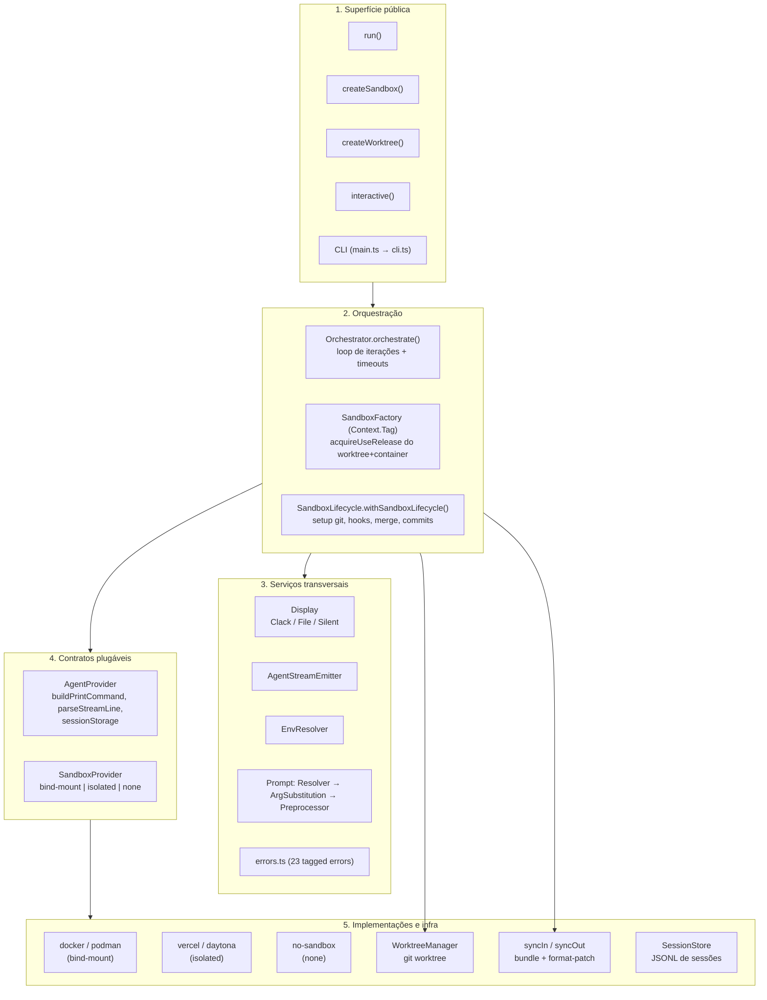
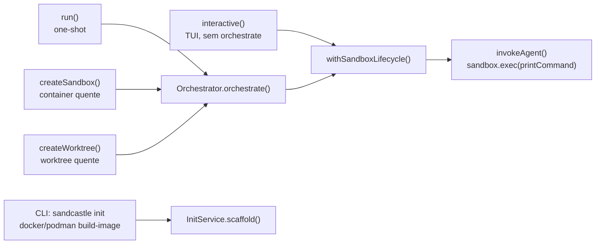
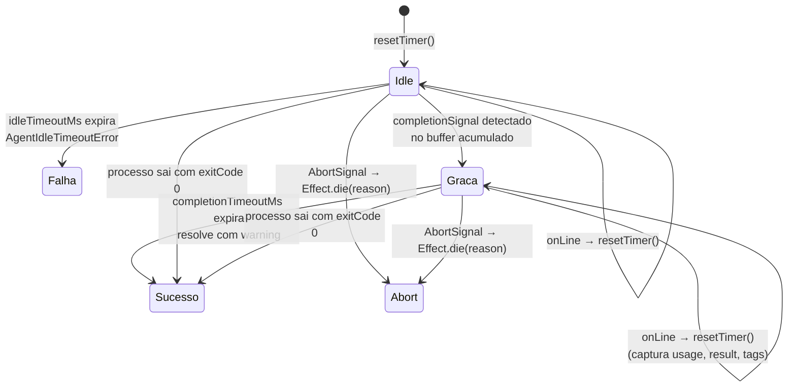
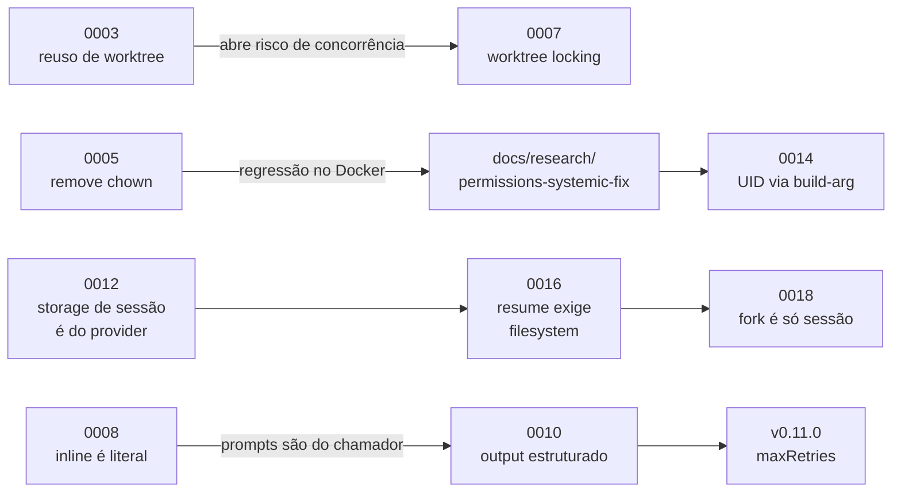

# Análise Técnica — Sandcastle

> Documento gerado por análise de código em 2026-09-06.
> Alvo: `@ai-hero/sandcastle` v0.12.0 (branch `main`, commit `e99f832`, 2026-06-29).
> Repositório de origem declarado em `package.json`: `https://github.com/mattpocock/sandcastle`. Licença MIT.

---

## Sumário

1. [Visão geral e objetivo da aplicação](#1-visão-geral-e-objetivo-da-aplicação)
2. [Stack e dependências principais](#2-stack-e-dependências-principais)
3. [Arquitetura e estrutura do repositório](#3-arquitetura-e-estrutura-do-repositório)
4. [Fluxo principal da aplicação](#4-fluxo-principal-da-aplicação)
5. [Detalhes de implementação interessantes](#5-detalhes-de-implementação-interessantes)
6. [Modelo de dados / tipos centrais](#6-modelo-de-dados--tipos-centrais)
7. [Configuração e uso](#7-configuração-e-uso)
8. [Testes e qualidade](#8-testes-e-qualidade)
9. [Evolução do projeto](#9-evolução-do-projeto)
10. [Pontos fortes, riscos e oportunidades](#10-pontos-fortes-riscos-e-oportunidades)
11. [Referências rápidas](#11-referências-rápidas)

---

## 1. Visão geral e objetivo da aplicação

### 1.1 O que é

Sandcastle é uma **biblioteca TypeScript (com CLI acoplada) que orquestra agentes de codificação de IA dentro de ambientes isolados**. O `package.json` a descreve como *"CLI for orchestrating AI agents in isolated sandbox environments"*, e o `CONTEXT.md` refina: *"um toolkit TypeScript que orquestra agentes de codificação de IA dentro de sandboxes isolados, gerenciando o ciclo de vida de sandboxes, branches, prompts e iterações."*

O contrato de uso é deliberadamente pequeno. O `README.md` resume em três passos:

1. Você invoca o agente com um único `sandcastle.run()`.
2. O Sandcastle cuida do isolamento do agente com uma *branch strategy* configurável.
3. Os commits feitos nas branches são mesclados de volta.

```typescript
import { run, claudeCode } from "@ai-hero/sandcastle";
import { docker } from "@ai-hero/sandcastle/sandboxes/docker";

await run({
  agent: claudeCode("claude-opus-4-8"),
  sandbox: docker(),
  promptFile: ".sandcastle/prompt.md",
});
```

### 1.2 Que problema resolve

Rodar um agente de codificação autônomo ("AFK" — *away from keyboard*) na sua máquina levanta três problemas simultâneos que ninguém quer resolver de novo a cada projeto:

- **Isolamento.** Um agente com permissões liberadas (`--dangerously-skip-permissions`) não deveria escrever direto no working directory do desenvolvedor. Sandcastle constrói o container, monta o repositório dentro dele e faz o agente rodar como usuário não-root.
- **Gestão de branches e integração.** Os commits precisam sair do sandbox e voltar para o host de forma previsível. Sandcastle implementa três estratégias (`head`, `merge-to-head`, `branch`) sobre git worktrees, incluindo o caminho difícil: providers isolados que não compartilham filesystem, onde a sincronização é feita com `git bundle` na entrada e `git format-patch` + `git am --3way` na saída.
- **Ciclo de vida da invocação.** Timeouts por etapa, detecção de sinal de conclusão, captura e retomada de sessões do agente, hooks, streaming de saída, extração de output estruturado validado por schema.

### 1.3 Para quem

O público-alvo é o **desenvolvedor ou time que constrói o próprio harness de agentes**, não o usuário final de um produto de IA. Isso fica explícito em várias decisões documentadas:

- Sandcastle não embute um *issue tracker* e **não participa do runtime** dele (`docs/agents/adding-an-issue-tracker.md`). A escolha no `init` apenas substitui três comandos de CLI dentro dos prompts gerados.
- Sandcastle não injeta instruções no prompt. O `<promise>COMPLETE</promise>` e as tags de output estruturado são convenções que **você** documenta no seu prompt (ADR 0010).
- O `.sandcastle/Dockerfile` é gerado uma vez e passa a ser propriedade do usuário (`.out-of-scope/custom-base-image-abstraction.md`): *"Control is inverted towards the user. Sandcastle scaffolds a sensible default; the user owns the result."*

A proposta de valor, portanto, é: **o motor de execução, não a metodologia**. Casos de uso citados no README: paralelizar múltiplos agentes AFK, criar pipelines de revisão, ou simplesmente orquestrar agentes próprios.

### 1.4 O que `plans/`, `research/` e `ideas/` revelam

Essas três pastas não são documentação — são **o rastro de decisão**, e são bastante reveladoras sobre como o projeto é conduzido.

#### `research/sandbox-provider-research.md` (~39 KB, 587 linhas, datado de 2026-04-10)

Pesquisa para a issue #250 (providers de sandbox plugáveis). É um levantamento exaustivo, com tabelas de URL/estrelas/licença/mecanismo de montagem/performance/necessidade de root/plataforma para cada candidato:

- **Bind-mount locais**: Docker/Moby, Podman, nerdctl, LXC/Incus, systemd-nspawn, Apptainer.
- **Runtimes OCI de baixo nível** (runc, crun, youki, gVisor/runsc, Kata, Sysbox) — com veredito explícito: são *configuração de um provider existente*, não um provider novo (`docker({ runtime: 'runsc' })`).
- **microVMs**: Cloud Hypervisor, QEMU microVMs, Firecracker (com a observação decisiva de que Firecracker **não faz filesystem sharing**, logo só poderia ser um provider isolado).
- **Nível de processo**: Bubblewrap, Firejail (marcado como risco de segurança por ser SUID), Minijail, Landlock.
- **macOS**: Apple Containers, Lima, Colima, OrbStack, Tart. **Windows**: WSL2, Windows Sandbox.
- **Isolados/cloud**: Daytona, E2B, Runloop, Modal, Blaxel, Morph Cloud, Northflank, Cloudflare, além de plataformas de dev-env (Codespaces, Gitpod, Coder…).
- **Não-viáveis**: runtimes WebAssembly (WASI não roda binários Linux arbitrários — "volte em 2-3 anos"), Flatpak/Snap, Windows Sandbox (não captura stdout de processos executados, logo `exec` é inimplementável).

A conclusão arquitetural é a frase que estrutura todo o `SandboxProvider.ts` até hoje: *"Bind-mounting local directories is only possible with local tools. Every cloud service requires file syncing."* Isso é exatamente a divisão `tag: "bind-mount"` vs `tag: "isolated"`.

#### `plans/pi-session-samples/`

Capturas reais de `@mariozechner/pi-coding-agent@0.73.1` feitas em 2026-05-29 para resolver as dúvidas abertas do suporte a resume do Pi (issue #565):

- `stream-stdout.jsonl` — a stdout completa de uma iteração. A descoberta que destravou a implementação: **a linha 1 é o header `{"type":"session","version":3,"id":"<uuid>","cwd":"<path>"}` e é o único lugar onde o session id aparece no stream** (`agent_start` não carrega). Logo `parsePiStreamLine` deve emitir `session_id` a partir de `obj.type === "session"`.
- `resumed-session.jsonl` — o arquivo de sessão em disco após dois turnos. Confirma que `cwd` aparece **apenas na linha de header** (crítico para a reescrita host↔sandbox) e que `pi --session <id>` **anexa in-place** no mesmo arquivo com o mesmo id.

Ou seja: antes de implementar, o mantenedor capturou o formato real e o versionou como fixture de referência. O mesmo padrão aparece em `ideas/opencode-example-output.jsonl` (~68 KB de stream real do OpenCode).

#### `ideas/config-and-hooks.md`

Uma proposta antiga (menciona o nome legado `.ralph.config.ts` — o projeto se chamava RALPH) de um arquivo de configuração no repo alvo. Propunha: prompt configurável por seções, comando pós-sync-in (`npm install`), configurações de Docker, e iteração/modelo. Hooks eram **explicitamente adiados da v1**, com pontos candidatos (`onSetup`, `onSyncIn`, `beforeRun`, `afterRun`, `onSyncOut`, `onCleanup`) e três perguntas abertas: hooks rodam no sandbox, no host, ou ambos? Shell ou funções TypeScript? Um hook que falha aborta ou avisa?

O código atual responde as três: hooks rodam **nos dois lugares, explicitamente separados** (`hooks.host.*` vs `hooks.sandbox.*`), são **comandos shell** (`{ command: string; sudo?: boolean; timeoutMs?: number }`), e **falham rápido** (`SandboxLifecycle.ts`). E não existe arquivo de config: a configuração é o código TypeScript que o usuário escreve. Vale a leitura como "o caminho não tomado".

#### `.out-of-scope/` — a pasta mais interessante do repositório

Oito documentos que declaram **não-objetivos**, cada um citando as issues que o motivaram. Isso é raro e é um sinal de maturidade de manutenção:

| Arquivo | Não-objetivo declarado | Razão central |
| --- | --- | --- |
| `built-in-agent-providers.md` | Não crescer a lista curada de agentes | Cada um é compromisso permanente de manutenção; `AgentProvider` é interface pública exportada |
| `built-in-sandbox-providers.md` | Não crescer a lista de sandboxes | "Lugares onde se pode rodar um container" é ilimitado |
| `bundled-workflow-templates.md` | Não empacotar templates opinativos de terceiros | Drift do upstream + endosso implícito de uma metodologia |
| `configurable-namespace-prefix.md` | Prefixo `sandcastle`/`.sandcastle` não é configurável | É convenção interna, não contrato público |
| `custom-base-image-abstraction.md` | Sem camada de abstração para compor Dockerfiles | O Dockerfile é do usuário depois do scaffold |
| `docker-provider-bespoke-options.md` | Sem opção dedicada por flag do `docker run` | Viraria "todo o `docker run`, retipado"; existem escapes (`dockerCompose()`, provider próprio) |
| `multi-repo-sandbox.md` | Múltiplos repos independentes num sandbox | Premissa de repo único está profundamente entrelaçada (`SandboxConfig`, `WorktreeManager`, `syncIn/syncOut`, coleta de commits) |
| `provider-error-retry.md` | Sem retry em erros de provider (rate limit, auth, quota) | Sandcastle não é dona da conexão nem da interface de erro; retry mascara erros reais |

---

## 2. Stack e dependências principais

### 2.1 Runtime e linguagem

| Item | Valor | Onde |
| --- | --- | --- |
| Linguagem | TypeScript (`strict: true`, `noUncheckedIndexedAccess: true`) | `tsconfig.json` |
| Target / módulo | ES2022 / NodeNext | `tsconfig.json` |
| Tipo de pacote | ESM puro (`"type": "module"`, `format: ["esm"]`) | `package.json`, `tsup.config.ts` |
| Target de build | `node18` | `tsup.config.ts` |
| Node em CI | 22 (CI e workflows de agente), 24 (release) | `.github/workflows/*.yml` |
| Gerenciador | `npm@10.9.2` | `package.json#packageManager` |

### 2.2 A dependência que define a arquitetura interna: Effect

O núcleo é escrito em **Effect-TS** (`effect@^3.20.0`, `@effect/platform`, `@effect/platform-node`, `@effect/cli`, `@effect/printer-ansi`). Isso governa:

- **Injeção de dependência** via `Context.Tag` — `SandboxFactory`, `SandboxConfig`, `Display`, `AgentStreamEmitter` são todos services resolvidos por `Layer`.
- **Erros tipados** via `Data.TaggedError` — 23 classes em `src/errors.ts`, unidas em `type SandboxError`.
- **Gestão de recursos** via `Effect.acquireUseRelease` — worktrees e containers são liberados de forma determinística mesmo em falha ou abort (`SandboxFactory.ts`).
- **Concorrência e corridas** via `Effect.raceFirst`, `Deferred`, `Fiber` — a máquina de timeouts do orquestrador (`Orchestrator.ts:221-231`).

**Detalhe crucial: o Effect é rigorosamente interno.** O `.sandcastle/CODING_STANDARDS.md` estabelece a regra ("Effect should not leak out into the user-facing API") e o `postbuild` a **impõe mecanicamente** — veja a seção 8.4.

### 2.3 Dependências declaradas

`dependencies` (a única em produção):

- `@clack/prompts@^1.1.0` — prompts interativos do `sandcastle init` e a UI de terminal (spinners, taskLog).

`peerDependencies` (ambas **opcionais**):

- `@vercel/sandbox` (`>=1.0.0`) — provider isolado Vercel.
- `@daytona/sdk` (`^0.164.0`) — provider isolado Daytona.

Ambas são `external` no tsup e carregadas por `await import()` dinâmico dentro dos respectivos arquivos, de modo que quem não usa esses providers não precisa instalá-las.

`devDependencies` relevantes: `effect` e todo o ecossistema `@effect/*`, `zod@^4.4.3` (só em testes e templates), `tsup@^8.5.1`, `vitest@^3.2.0`, `tsx@^4.21.0`, `prettier@^3.5.3`, `husky@^9.1.7`, `lint-staged@^15.5.1`, `@changesets/cli@^2.30.0`, `typescript@^6.0.3` e `@typescript/native-preview` (o `tsgo`, usado no `npm run typecheck`).

### 2.4 Ferramental

| Área | Ferramenta | Configuração |
| --- | --- | --- |
| Build | **tsup** | `tsup.config.ts` — 7 entradas, ESM, splitting, sourcemap, `dts: true`, treeshake |
| Type-check | **tsgo** (`@typescript/native-preview`) | `npm run typecheck` = `tsgo --noEmit` |
| Testes | **vitest** | `vitest.config.ts` — inclui `src/**/*.test.ts`, `setupFiles: ["src/testSetup.ts"]` |
| Formatação | **prettier** | `.prettierrc` (semi, aspas duplas, trailing comma all, 80 cols) |
| Pre-commit | **husky** + **lint-staged** | `.husky/pre-commit` → `npx lint-staged` |
| Versionamento | **changesets** | `.changeset/config.json`, `access: "public"`, `baseBranch: "main"` |

**Não existe ESLint.** O "lint" do projeto é: `prettier --check` + `tsgo --noEmit` + o guard de tipos públicos. O `lint-staged.config.mjs` roda apenas prettier, com um detalhe que vale citar: ele **filtra symlinks** antes de passar os caminhos ao prettier, porque `AGENTS.md → CLAUDE.md` e `.claude/skills → ../.agents/skills` são symlinks e o prettier se recusa a formatá-los, quebrando qualquer commit que os incluísse.

### 2.5 Detalhe de empacotamento não-óbvio

O `tsup.config.ts` injeta um banner em todos os bundles:

```js
banner: {
  js: [
    "import { createRequire as __sandcastleCreateRequire } from 'node:module';",
    "const require = __sandcastleCreateRequire(import.meta.url);",
  ].join("\n"),
}
```

O comentário explica: algumas dependências CJS empacotadas (notadamente `undici`, via `@effect/platform-node`) fazem `require()` de builtins do Node. ESM não tem `require`, então um é instalado via `createRequire`.

O `postbuild` também copia `src/templates` → `dist/templates` — os templates são **assets shipados**, não código empacotado (não há entrada correspondente no tsup).

---

## 3. Arquitetura e estrutura do repositório

### 3.1 Mapa de diretórios

```
sandcastle/
├── src/                       52 arquivos .ts (~15.4k linhas) + 53 de teste (~29k linhas)
│   ├── index.ts               Superfície pública do pacote
│   ├── main.ts                Entrypoint do binário `sandcastle` (shebang)
│   ├── cli.ts                 Árvore de comandos @effect/cli
│   ├── run.ts                 API pública `run()`
│   ├── createSandbox.ts       API pública `createSandbox()` (sandbox longevo)
│   ├── createWorktree.ts      API pública `createWorktree()` (worktree longevo)
│   ├── interactive.ts         API pública `interactive()` (sessão TUI)
│   ├── Orchestrator.ts        Loop de iterações + máquina de timeouts
│   ├── SandboxFactory.ts      Layer Effect que cria/destrói worktree + container
│   ├── SandboxLifecycle.ts    Setup git, hooks, merge-back, coleta de commits
│   ├── WorktreeManager.ts     Ciclo de vida dos git worktrees
│   ├── AgentProvider.ts       6 providers de agente + storage de sessão
│   ├── SandboxProvider.ts     Contratos dos providers de sandbox + factories
│   ├── sandboxes/             Implementações: docker, podman, vercel, daytona, no-sandbox + 3 dublês de teste
│   ├── templates/             5 scaffolds copiados pelo `init`
│   ├── errors.ts              23 tagged errors + `withTimeout`
│   ├── Display.ts             Serviço de UI (Clack / File / Silent)
│   ├── InitService.ts         Registries e scaffolding do `init`
│   ├── syncIn.ts / syncOut.ts Sincronização git para providers isolados
│   ├── SessionStore.ts        Codificação de caminhos e transferência de sessões
│   └── ... (Prompt*, mount*, Session*, boundedTail, TextDeltaBuffer, …)
├── docs/
│   ├── adr/                   20 ADRs
│   ├── agents/                Guias para skills de agente (5 arquivos)
│   ├── content/docs/          Site de docs em MDX
│   ├── research/              Pesquisa de permissões
│   └── app/ components/ lib/  App Next.js 16 + Fumadocs (`sandcastle-docs`, privado)
├── plans/                     Fixtures de sessões Pi capturadas
├── research/                  Pesquisa de providers de sandbox
├── ideas/                     Propostas antigas + amostra de stream OpenCode
├── .out-of-scope/             8 não-objetivos declarados
├── .sandcastle/               Dogfooding: o próprio repo usa Sandcastle nele mesmo
│   ├── run.ts, test-*.ts      Orquestradores locais
│   ├── agent-workflows/       5 workflows dirigidos por GitHub Actions
│   └── CODING_STANDARDS.md    Constituição de engenharia (186 linhas)
├── .github/workflows/         ci, release + 5 workflows `agent-*`
├── .agents/skills/            Skills (symlinkado em .claude/skills)
├── scripts/                   check-public-types-effect-free.mjs
├── CONTEXT.md                 Glossário de linguagem ubíqua (~350 linhas)
├── CLAUDE.md                  Instruções para agentes (AGENTS.md é symlink)
├── README.md                  1399 linhas — a documentação canônica
└── CHANGELOG.md               50 versões
```

### 3.2 O que é publicado

O `package.json` declara `"files": ["dist"]` e seis pontos de entrada:

| Import path | Entrada tsup | Conteúdo |
| --- | --- | --- |
| `@ai-hero/sandcastle` | `src/index.ts` | `run`, `interactive`, `createSandbox`, `createWorktree`, `Output`, os 6 factories de agente, os factories de provider, tipos |
| `@ai-hero/sandcastle/sandboxes/docker` | `src/sandboxes/docker.ts` | `docker()` |
| `@ai-hero/sandcastle/sandboxes/podman` | `src/sandboxes/podman.ts` | `podman()` |
| `@ai-hero/sandcastle/sandboxes/vercel` | `src/sandboxes/vercel.ts` | `vercel()` |
| `@ai-hero/sandcastle/sandboxes/daytona` | `src/sandboxes/daytona.ts` | `daytona()` |
| `@ai-hero/sandcastle/sandboxes/no-sandbox` | `src/sandboxes/no-sandbox.ts` | `noSandbox()` |

Mais o binário: `"bin": { "sandcastle": "dist/main.js" }`.

A separação por subpath é intencional: cada provider carrega suas próprias dependências e nenhuma delas entra no bundle raiz.

### 3.3 Camadas do sistema

O código se organiza em cinco camadas bem delimitadas, com uma direção de dependência clara:



**A inversão de dependência é o eixo do design.** O `Orchestrator` não sabe nada sobre Docker nem sobre Claude Code. Ele consome duas interfaces (`AgentProvider`, `SandboxProvider`) e um `SandboxFactory` injetado por `Layer`. Isso permite três coisas que o projeto usa de fato:

1. Providers de terceiros (`createBindMountSandboxProvider`, `createIsolatedSandboxProvider` são exportados publicamente).
2. Dublês de teste (`src/sandboxes/test-bind-mount.ts`, `test-isolated.ts`, `test-shared.ts`) que exercitam o sistema inteiro sem Docker.
3. **Reuso do sandbox quente** — `createSandbox()` e `createWorktree()` substituem o `SandboxFactory` por um `reuseFactoryLayer` que simplesmente entrega o container já em pé, sem criar nada. Detalhe em 4.4.

### 3.4 Os módulos principais em `src/`

| Módulo | Papel |
| --- | --- |
| `run.ts` (894 l.) | Valida opções, resolve cwd/prompt/env/branch, monta os `Layer`, chama `orchestrate`, anexa `resume`/`fork`, extrai output estruturado com retry |
| `Orchestrator.ts` (604 l.) | Loop `for i in 1..maxIterations`. `invokeAgent` monta a máquina de corrida entre exec, idle timeout, completion timeout e AbortSignal. Emite eventos de display/stream. Captura sessão e usage |
| `SandboxFactory.ts` (691 l.) | O `Layer` que implementa `withSandbox`. Quatro caminhos distintos: `none`+head, `none`+worktree, `isolated`, `bind-mount`+head, `bind-mount`+worktree. Aninha `acquireUseRelease` para garantir que o worktree seja limpo mesmo se o container falhar |
| `SandboxLifecycle.ts` (544 l.) | Tudo que acontece em volta do trabalho do agente: `safe.directory`, propagação de identidade git do host, hooks `onSandboxReady` (host e sandbox em paralelo), `applyToHost` para isolados, merge-to-head, coleta de commits via `git rev-list` |
| `AgentProvider.ts` (1267 l.) | Seis providers (`claudeCode`, `codex`, `cursor`, `opencode`, `copilot`, `pi`), seus parsers de stream JSONL, e três implementações de `AgentSessionStorage` |
| `WorktreeManager.ts` (538 l.) | `create`/`remove`/`pruneStale`/`hasUncommittedChanges`, nomes de branch temporária, detecção de colisão + reuso + fast-forward de origin |
| `createSandbox.ts` (1136 l.) | `createSandbox()` e `createSandboxFromWorktree()` — o handle longevo |
| `createWorktree.ts` (764 l.) | `createWorktree()` — worktree como conceito de primeira classe |
| `InitService.ts` (1109 l.) | Registries (agentes, sandboxes, issue trackers), templates de Dockerfile, scaffolding |
| `cli.ts` (699 l.) | Árvore `@effect/cli`: `init`, `docker build-image|remove-image`, `podman build-image|remove-image` |

---

## 4. Fluxo principal da aplicação

Existem **quatro pontos de entrada programáticos** e **um CLI**. Eles compartilham o mesmo motor (`orchestrate` + `withSandboxLifecycle`), variando apenas quem cria e destrói os recursos.

### 4.1 Panorama



### 4.2 Fluxo 1 — `run()`, o caminho canônico

Este é o fluxo completo, de `run.ts:493` até o resultado.

#### Fase A — Validação e resolução (host, síncrono)

1. `options.signal?.throwIfAborted()` — um signal já abortado rejeita **antes de qualquer setup**.
2. **Derivação da branch strategy**: explícita > default por tag do provider. `isolated` → `merge-to-head`; `bind-mount` e `none` → `head` (`run.ts:508-512`).
3. Validações que falham cedo, todas com mensagem acionável:
   - `head` + provider isolado → erro (isolado não escreve no host).
   - `head` + `copyToWorktree` não vazio → erro (não há worktree para copiar).
   - `resumeSession` + `maxIterations > 1` → erro (ADR 0011).
   - `forkSession` sem `resumeSession` → erro.
   - `output` + `maxIterations !== 1` → erro (ADR 0010).
   - `output.maxRetries > 0` com provider sem `sessionStorage` → erro nomeando os providers que servem.
4. `resolveCwd(options.cwd)` — stat do caminho; `CwdError` se não existir ou não for diretório.
5. Se `resumeSession`: `assertResumeSessionExists()` — verifica **no host, antes de subir container nenhum**, que o arquivo de sessão existe. Para `noSandbox()` a busca é por id global (`findByIdOnHost`); para os demais, pelo caminho determinístico derivado do repo dir.
6. `resolvePrompt({ prompt, promptFile })` → `{ text, source: "inline" | "template" }`. Ambos ou nenhum → `PromptError`.
7. Se `output`: a tag de abertura (`<result>`) **precisa estar no prompt resolvido**, senão erro. Sandcastle nunca injeta a instrução.
8. `resolveEnv(hostRepoDir)` + `mergeProviderEnv(...)`. Ver 5.6.
9. `getCurrentBranch(hostRepoDir)` → `currentHostBranch` (vira `{{TARGET_BRANCH}}`).
10. Resolução da branch de trabalho: `head` → branch atual do host; `branch` → a explícita; `merge-to-head` → `generateTempBranchName()`.
11. Resolução do logging. **O default é arquivo**: `.sandcastle/logs/<targetBranch>-<branch>[-name].log`. Em modo arquivo, imprime no terminal `[nome] Started on branch X` + a dica `tail -f <path>`.
12. Montagem dos `Layer`: `SandboxConfig` (env, hostRepoDir, provider, strategy, hooks, signal, timeouts) → `WorktreeDockerSandboxFactory.layer`, mais o display layer e o `agentStreamEmitterLayer`.

#### Fase B — Substituição de argumentos do prompt

Dentro do Effect, antes de tocar em container:

- **Prompt inline** → `validateNoArgsWithInlinePrompt(userArgs)` (passar `promptArgs` é erro) e o texto passa **literalmente** (ADR 0008).
- **Prompt de arquivo** → `validateNoBuiltInArgOverride`, depois `substitutePromptArgs(raw, { SOURCE_BRANCH, TARGET_BRANCH, ...userArgs })`. Um `{{KEY}}` sem valor é erro; um arg não usado gera warning.

#### Fase C — Ciclo de vida por iteração (`SandboxFactory.withSandbox`)

Para cada iteração `i` de 1 a `maxIterations`:

```mermaid
sequenceDiagram
    participant O as Orchestrator
    participant F as SandboxFactory
    participant W as WorktreeManager
    participant P as SandboxProvider
    participant L as SandboxLifecycle
    participant A as Agente (no sandbox)

    O->>F: withSandbox(makeEffect)
    F->>W: pruneStale (best-effort)
    F->>W: create(repo, {branch|name})
    Note over W: .sandcastle/worktrees/<nome>/
    F->>F: copyToWorktree (cp --reflink / -cR)
    F->>F: hooks.host.onWorktreeReady (sequencial)
    F->>F: resolveGitMounts + patchGitMountsForWindows
    F->>P: startSandbox → provider.create(mounts, env)
    Note over P: docker run -d --user uid:gid -v ... image

    F->>L: withSandboxLifecycle(...)
    L->>A: git config safe.directory + user.name/email
    L->>A: git rev-parse --abbrev-ref HEAD
    L->>A: hooks.sandbox.onSandboxReady ∥ hooks.host.onSandboxReady
    L->>L: baseHead = git rev-parse HEAD (no worktree do host)

    L->>O: work(ctx)
    O->>A: preprocessPrompt — executa !`cmd` no sandbox, em paralelo
    O->>A: invokeAgent → sandbox.exec(printCommand, {onLine, stdin})
    Note over A: claude --print --verbose --output-format stream-json ... -p -
    A-->>O: linhas JSONL → parseStreamLine → text / tool_call / session_id / usage
    O->>O: captura sessão (copyFileOut do JSONL + reescrita de cwd)

    L->>L: applyToHost (só isolados) → syncOut
    L->>L: merge-to-head? git merge + git branch -D
    L->>L: commits = git rev-list baseHead..HEAD --reverse

    F->>W: cleanupWorktree: sujo → preserva; limpo → remove
    F->>P: handle.close() (docker rm -f)
```

Se o output do agente contiver o `completionSignal`, o loop **retorna imediatamente** sem executar as iterações restantes.

#### Fase D — Pós-processamento

1. `buildCompletionMessage` + linhas `Context window: NNNk` (derivadas de `usage`).
2. Montagem do `RunResult`. `resume` e `fork` são anexados como closures que rechamam `run()` com `maxIterations: 1` e `resumeSession: <último sessionId>`.
3. Se `output` foi configurado: `extractStructuredOutput(stdout, definition, ctx)`. Em falha, se `maxRetries > 0` e há `sessionId`, **recursão** com prompt de feedback (`buildStructuredOutputRetryFeedback`) e `maxRetries` decrementado — o que garante terminação.

### 4.3 A máquina de timeouts do `invokeAgent` (o coração do runtime)

Esta é a parte mais sutil do código (`Orchestrator.ts:22-244`) e merece detalhamento. São **quatro Effects em corrida**:



A lógica exata:

- Um `Deferred<never, AgentIdleTimeoutError>` que **falha** quando o timer ocioso estoura (default 600 s).
- Um `Deferred<{result, sessionId, usage}, never>` que **resolve com sucesso** quando a janela de graça estoura (default 60 s).
- O `execEffect` real.
- Um `Deferred` que morre com `signal.reason` no abort.

`resetTimer()` é chamado a **cada linha** e escolhe qual timer armar com base em `completionDetected`. A detecção do sinal é feita sobre `accumulatedOutput`, **depois** de parsear a linha, e faz uma transição one-way: `completionDetected = true` e o intervalo de warning ("Agent idle for N minutes") é interrompido.

O ADR 0019 explica por quê: quando um agente emite o sinal de conclusão mas um filho que ele spawnou (`gh`, um servidor MCP de vida longa) herdou o pipe de stdout e o mantém aberto, o EOF nunca chega. Antes, Sandcastle esperava os 10 minutos completos e **falhava com `AgentIdleTimeoutError`, descartando commits já feitos**. Agora resolve com sucesso e um warning. Um exit limpo sempre vence a corrida, então runs saudáveis não ganham latência nenhuma.

O ADR também documenta um vazamento conhecido e não resolvido: force-completar **abandona o processo**. Para providers de container isso é irrelevante (`docker rm -f` mata tudo), mas com `noSandbox()` o `close()` é no-op e **não existe `proc.kill()` em lugar nenhum do codebase** — o agente e seus filhos vazam no host.

### 4.4 Fluxo 2 — `createSandbox()`: o sandbox quente

Serve para rodar múltiplos agentes (ou múltiplas rodadas) dentro de **um único container**, evitando pagar o boot repetidamente e mantendo `node_modules` e artefatos de build entre chamadas.

```typescript
await using sandbox = await createSandbox({
  branch: "agent/fix-42",              // obrigatório e explícito
  sandbox: docker(),
  hooks: { sandbox: { onSandboxReady: [{ command: "npm install" }] } },
});

const impl = await sandbox.run({ agent: claudeCode("claude-opus-4-8"), promptFile: "…" });
const tests = await sandbox.exec("npm test");            // exitCode retornado, não lançado
if (tests.exitCode !== 0) throw new Error(tests.stdout);
const review = await sandbox.run({ agent: claudeCode("claude-sonnet-4-6"), prompt: "Review…" });
```

**O mecanismo central** está em `createSandbox.ts:429-445`. Ao invés de reimplementar `orchestrate`, `sandbox.run()` instala um `SandboxFactory` falso:

```typescript
const reuseFactoryLayer = Layer.succeed(SandboxFactory, {
  withSandbox: (makeEffect) =>
    makeEffect(
      { hostWorktreePath, sandboxRepoPath, applyToHost, bindMountHandle },
      sandbox,
    ).pipe(Effect.map((value) => ({ value, preservedWorktreePath: undefined }))),
});
```

Ou seja: `withSandbox` deixa de criar worktree e container e passa a **entregar os que já existem**. Todo o resto do pipeline (lifecycle, agente, coleta de commits) é literalmente o mesmo código.

Consequências importantes desse design:

- **Hooks não são reencaminhados** para `orchestrate` em `sandbox.run()`. Eles rodaram uma vez, na criação. Isso é intencional.
- **`commits` é o delta daquela chamada**, não acumulado, porque `baseHead` é recalculado a cada `run()`.
- `close()` fecha o container e então decide sobre o worktree: **sujo → preserva** (retorna `preservedWorktreePath`); limpo → remove.
- `[Symbol.asyncDispose]` (`await using`) chama `close()` e **descarta o `CloseResult`** — quem precisa de `preservedWorktreePath` tem de chamar `close()` explicitamente.

### 4.5 Fluxo 3 — `createWorktree()`: split ownership

Trata o git worktree como conceito de primeira classe, separado de qualquer sandbox. Aceita só `branch` e `merge-to-head` (`head` é **erro de compilação**, porque significa "sem worktree").

```typescript
await using wt = await createWorktree({
  branchStrategy: { type: "branch", branch: "agent/fix-42" },
  copyToWorktree: ["node_modules"],
});

await wt.interactive({ agent: claudeCode("…"), prompt: "Explore o bug" });  // default: noSandbox()
const r = await wt.run({ agent: claudeCode("…"), sandbox: docker(), prompt: "Corrija" });
await using sb = await wt.createSandbox({ sandbox: docker() });
```

**A regra de propriedade dividida** é o que distingue este fluxo: um `Sandbox` criado por `wt.createSandbox()` tem `close()` que derruba **só o container** e sempre retorna `preservedWorktreePath: undefined`. O worktree pertence ao `wt` e só some no `wt.close()` (e só se estiver limpo).

`wt.run()` **cria e destrói um container por chamada** (`Effect.ensuring(handle.close())`), mas o worktree sobrevive — é o oposto de `createSandbox()`.

**`keepSourceBranch`** é o detalhe que faz `merge-to-head` funcionar num worktree longevo. Sem ele, o lifecycle faria `git checkout --detach` no sandbox e `git branch -D <branch>` no host após o primeiro merge, deixando o handle `wt` inutilizável. Com ele, esses dois passos destrutivos são suprimidos e o merge continua acontecendo a cada chamada.

### 4.6 Fluxo 4 — `interactive()`: sessão TUI

Único ponto de entrada que suporta as três estratégias e que **não passa pelo `Orchestrator`**. O default de sandbox é `noSandbox()`.

O detalhe distintivo é a **coleta interativa de argumentos faltantes** (`interactive.ts:194-235`): para prompts de arquivo, roda `findMissingPromptArgKeys` e, para cada `{{KEY}}` sem valor, abre um `clack.text({ message: "Enter value for {{KEY}}" })`. Cancelar aborta a sessão.

A TTY é ligada de forma direta: `provider.buildInteractiveArgs(...)` monta o argv e `handle.interactiveExec(args, { stdin: process.stdin, stdout: process.stdout, stderr: process.stderr, cwd })` entrega os três streams reais do processo host ao provider, que faz `docker exec -it` (ou `spawn` direto no caso de `noSandbox`). Não há multiplexação de PTY nessa camada.

`dangerouslySkipPermissions` aqui é `resolvedSandbox.tag !== "none"` — as permissões só são puladas quando **existe** isolamento.

### 4.7 Fluxo 5 — o CLI

A árvore é enxuta (`cli.ts`):

```
sandcastle                       → imprime versão e dica de --help
├── init                         → InitService.scaffold()
├── docker
│   ├── build-image  [--image-name] [--dockerfile]
│   └── remove-image [--image-name]
└── podman
    ├── build-image  [--image-name] [--containerfile]
    └── remove-image [--image-name]
```

O `init` é o único comando complexo. Ele:

1. Valida `--template`/`--sandbox`/`--issue-tracker` **antes de qualquer prompt** (falha cedo com a lista de opções válidas).
2. Resolve agente → modelo → sandbox provider → issue tracker → template, cada um por flag ou por `clack.select`. Se `stdin` não é TTY e a flag falta, falha com mensagem nomeando a flag (regra 11 do `CODING_STANDARDS.md`).
3. Opcionalmente cria a label `Sandcastle` no GitHub (`gh label create`, best-effort e silencioso em falha).
4. `scaffold()`: cria `.sandcastle/`, escreve `Dockerfile`/`Containerfile`, `.gitignore`, `.env.example`, copia o template, reescreve `main.mts` (troca o factory de agente, o modelo e o provider), substitui `{{LIST_TASKS_COMMAND}}` e afins.
5. Detecta o package manager (`packageManager` do package.json > lockfile > npm) e oferece instalar `zod` se o template precisar.
6. Opcionalmente builda a imagem. Em Linux/macOS passa `--build-arg AGENT_UID=$(id -u) AGENT_GID=$(id -g)` (ADR 0014).

**Note o que não existe no CLI**: não há `sandcastle run` nem `sandcastle interactive`. A execução é sempre pela API TypeScript, via `npx tsx .sandcastle/main.ts`. O comando `interactive` existiu e foi removido na v0.1.4.

---

## 5. Detalhes de implementação interessantes

### 5.1 Segurança e sandboxing — como o isolamento é feito de fato

O nome sugere isolamento, e a implementação é honesta sobre o que garante e o que não garante.

**Três modelos, três níveis de garantia:**

| Tag | Providers | Isolamento real | Estratégias de branch |
| --- | --- | --- | --- |
| `bind-mount` | `docker()`, `podman()` | Container Linux. Filesystem do host montado seletivamente | head, merge-to-head, branch |
| `isolated` | `vercel()`, `daytona()` | microVM/VM remota. **Nenhum** acesso ao filesystem do host | merge-to-head, branch (head é erro de tipo) |
| `none` | `noSandbox()` | **Nenhum**. Roda direto no host | head, merge-to-head, branch |

**O que o container efetivamente restringe (`docker.ts`, `podman.ts`, `.sandcastle/Dockerfile`):**

- Roda como usuário **não-root** (`--user <uid>:<gid>`, `USER ${AGENT_UID}:${AGENT_GID}` no Dockerfile).
- Só as montagens declaradas são visíveis: o worktree em `/home/agent/workspace`, o(s) diretório(s) `.git`, e o que o usuário pedir em `mounts`.
- `HOME=/home/agent` é injetado explicitamente (sem isso, `--user` fazia `HOME` virar `/` e `git config --global` falhava — corrigido na v0.1.7).
- Montagens read-only são suportadas (`readonly: true` → sufixo `:ro`).
- Rótulo SELinux `:z` por padrão nos dois providers (no-op silencioso onde SELinux não existe).
- Podman ainda aplica `--userns=keep-id:uid=N,gid=N` para mapeamento rootless.

**A tensão central, documentada com franqueza.** Nos runs AFK, Sandcastle passa `dangerouslySkipPermissions: true` ao provider de agente — que vira `--dangerously-skip-permissions` (Claude), `--allow-all-tools` (Copilot), `--dangerously-bypass-approvals-and-sandbox` (Codex). O container **é** a fronteira de segurança; o agente dentro dele tem liberdade total.

Isso é explicitamente **desligado** quando não há container: `no-sandbox.ts` documenta no cabeçalho que não passa a flag, e `interactive.ts:396` calcula `dangerouslySkipPermissions: sandboxProvider.tag !== "none"`. A alternativa oferecida é `claudeCode({ permissionMode: "auto" })` — aprovação mediada por IA por ferramenta, em vez de bypass total (v0.8.0).

**Uma exceção que vale registrar:** `createSandbox.ts` (na chamada `sandbox.interactive()`) passa `dangerouslySkipPermissions: true` **incondicionalmente**, ao contrário de `interactive.ts` e `worktree.interactive()`, que condicionam à tag. Se `createSandbox({ sandbox: noSandbox() })` for usado com `.interactive()`, o bypass é passado mesmo sem isolamento. Não achei ADR ou comentário justificando a assimetria — parece inconsistência, não decisão.

**ADR 0015** documenta a decisão de permitir `noSandbox()` em `run()`. O portão de tipo original visava impedir execução não supervisionada fora de isolamento, mas usuários com assinatura Claude e usuários já dentro de CI containerizado não tinham caminho AFK, e todos reinventavam o mesmo workaround de forkar e trocar a tag. O portão estava forçando um contorno, não prevenindo um erro. A escolha foi tornar o modelo de confiança explícito: `noSandbox()` é o opt-in, e o risco é do chamador.

**Anti-injeção de prompt.** Um detalhe elegante em `PromptArgumentSubstitution.ts` + `PromptPreprocessor.ts`. Blocos `` !`cmd` `` executam shell dentro do sandbox. Se um valor de `promptArgs` (vindo de um título de issue, corpo de PR, etc.) contivesse `` !`rm -rf /` ``, seria executado. A solução:

```typescript
export const SHELL_BLOCK_MARKER = "\x01";
const MARKED_SHELL_BLOCK_PATTERN = new RegExp(`!${SHELL_BLOCK_MARKER}\`([^\`]+)\``, "g");
```

Antes da substituição, todos os `\x01` pré-existentes são removidos do template **e dos valores dos args** (para que não possam ser forjados), e só então os blocos escritos no template original são marcados. O preprocessor executa **apenas blocos marcados**. Conteúdo que chega via argumento é dado inerte, por construção. O README documenta isso como garantia: *"This makes it safe to pass user-authored content (issue titles, PR descriptions, docs excerpts) through `promptArgs`."*

### 5.2 Gestão de estado e recursos

Não existe estado global mutável de aplicação. O estado é modelado como **recursos com escopo**:

- **Worktree e container** são adquiridos e liberados por `Effect.acquireUseRelease` **aninhados** (`SandboxFactory.ts:594-677`). O comentário explica: o worktree é sempre limpo pelo release externo, mesmo que copy, hooks ou start do container falhem; o handle do provider é fechado pelo release interno, que só roda se o handle existir.
- **A decisão de limpeza é baseada em sujeira, não em sucesso** — mudança da v0.1.8. `cleanupWorktree` chama `hasUncommittedChanges` e:
  - Sucesso + limpo → remove em silêncio
  - Sucesso + sujo → preserva e imprime instruções de review/cleanup
  - Falha + limpo → remove e avisa
  - Falha + sujo → preserva
  Isso é importante na prática: **o trabalho de um agente nunca é jogado fora silenciosamente**.
- **Sessões do agente** são persistidas em disco pelo próprio agente, capturadas para o host e reinjetadas no sandbox no resume. Sandcastle não mantém sessão em memória.
- **`refs/sandcastle/sync-base`** (ADR 0017) — um ref git dentro do repositório do sandbox que rastreia o último commit sincronizado. Estado durável, mas colocado onde ele naturalmente vive.

**`shutdownRegistry.ts`** merece nota: um registry process-wide que instala **exatamente um** listener de `exit`/`SIGINT`/`SIGTERM`, não importa quantos sandboxes estejam vivos. Isso evita o `MaxListenersExceededWarning` do Node a partir de ~10 sandboxes concorrentes. No sinal, ele **desanexa os listeners primeiro** (para que o evento `exit` síncrono disparado por `process.exit(1)` não reexecute os mesmos teardowns), roda todos, e só então sai.

### 5.3 Tratamento de erros

O modelo é rigoroso e é uma das partes mais fortes do projeto.

**23 classes de erro tipadas** em `src/errors.ts`, todas `Data.TaggedError`, unidas em `type SandboxError`. Cada uma carrega contexto estruturado além da mensagem:

```typescript
export class PromptExpansionTimeoutError extends Data.TaggedError("PromptExpansionTimeoutError")<{
  readonly message: string;
  readonly timeoutMs: number;      // o deadline configurado
  readonly expression: string;
  readonly elapsedMs: number;      // tempo real decorrido, medido no throw site
}> {}
```

A distinção `timeoutMs` vs `elapsedMs` existe (ADR 0020) para que um orquestrador downstream distinga um timeout genuíno de contenção de um abort quase instantâneo — **programaticamente, sem fazer parse de string**.

**`withTimeout` é aplicado ponto a ponto** (ADR 0001), não globalmente:

```typescript
export const withTimeout = <E>(timeoutMs: number, onTimeout: () => E) =>
  <A, E2, R>(effect: Effect.Effect<A, E2, R>) =>
    effect.pipe(Effect.timeoutFail({ duration: Duration.millis(timeoutMs), onTimeout }));
```

Etapas cobertas com defaults: criação de worktree (30 s), start do container (120 s), sync-in (120 s), copyToWorktree (60 s), hooks (60 s cada), git setup (10 s), expansão de prompt (30 s), coleta de commits (30 s), merge (30 s). Quatro deles são configuráveis via `timeouts` em `RunOptions`.

**Filosofia de falha rápida, documentada e consistente.** O ADR 0020 é a melhor exposição dela, ao explicar por que a expansão de prompt **não** faz retry enquanto o setup de git **faz**:

> Git setup é encanamento idempotente (reexecutar `git worktree add` depois de uma race de overlayfs é correção gratuita), ao passo que a expansão de prompt produz conteúdo sobre o qual o agente age — repetir mascara um problema real ou alimenta o agente com um prompt montado num ambiente degradado.

E sobre degradação graciosa: descartar silenciosamente um fragmento roda o agente contra um prompt errado, queimando uma iteração e possivelmente commitando lixo — mais caro de recuperar num contexto AFK do que um abort limpo.

O retry de git setup é preciso: só para exit codes **126** (comando encontrado mas não executável) e **137** (morto por SIGKILL), duas vezes, com 250 ms de espaço. Um erro genuíno de git ou um exec pendurado ainda falha rápido.

**`ErrorHandler.ts`** traduz cada tag em uma mensagem amigável (`DockerError` → *"Docker operation failed: … Is Docker running?"*), e `withFriendlyErrors` — aplicado uma única vez em `main.ts` — remove `SandboxError` do canal de erro e sai com código 1.

**`RecoveryMessage.ts`** é a melhor peça de UX de erro do projeto. Quando o `syncOut` falha ao aplicar patches no host, ele monta **comandos copiáveis** a partir do estado exato da falha, incluindo o preâmbulo de worktree quando aplicável:

```
git worktree add .sandcastle/worktree <branch> && \
  cd .sandcastle/worktree && \
  git am --3way ../../.sandcastle/patches/20260629-141530/*.patch && \
  git apply ../../.sandcastle/patches/20260629-141530/changes.patch
```

E os patches ficam preservados em disco em vez de sumirem.

### 5.4 Concorrência

Três eixos distintos:

**Dentro de uma iteração** (`Orchestrator.ts`): a corrida de quatro vias descrita em 4.3, construída com `Effect.raceFirst` sobre `Deferred` e `Fiber`. O padrão de `Effect.ensuring` garante interrupção dos fibers de timeout em todos os caminhos de saída.

**Dentro do lifecycle** (`SandboxLifecycle.ts:360-365`): os hooks `sandbox.onSandboxReady` e `host.onSandboxReady` rodam com `Effect.all(..., { concurrency: "unbounded" })`. Já os `host.onWorktreeReady` rodam **sequencialmente**, na ordem declarada — a distinção está documentada no README.

**Expansão de prompt** (`PromptPreprocessor.ts:78`): todas as expressões `` !`cmd` `` de um prompt são executadas **em paralelo** (`concurrency: "unbounded"`), o que reduz muito a latência de prompts com várias chamadas a `gh`.

**Entre runs** — é aqui que o quadro fica mais delicado. O ADR 0003 removeu a guarda `throwOnDuplicateWorktree`, permitindo reuso de worktrees existentes. Ele mesmo sinaliza o risco de acesso concorrente e aponta o ADR 0007 (locking por arquivo) como mitigação futura. **O ADR 0007 está escrito e detalhado — `.sandcastle/locks/<name>.lock`, `O_EXCL`, liveness por `process.kill(pid, 0)`, fail-fast sem retry — mas não encontrei implementação correspondente em `src/`.** Uma busca por `locks/`, `O_EXCL` e `acquiredAt` no código de produção não retorna nada relacionado. O único mecanismo presente em `WorktreeManager.ts` é:

```typescript
const NO_CONFIG_LOCK_FLAGS = ["-c", "branch.autoSetupMerge=false", "-c", "push.autoSetupRemote=false"];
```

que impede o git de escrever config de tracking e disputar `.git/config.lock`. É defesa contra uma race diferente. A segurança concorrente real hoje vem de (a) detecção de colisão + reuso em `create` e (b) o sufixo aleatório de 6 hex nos nomes de branch temporária.

**Sobre esse sufixo:** o ADR 0018 conta a história. `generateTempBranchName` usava granularidade de segundo, então forks disparados no mesmo tick colidiam. Foi acrescentado `randomBytes(3).toString("hex")`. Mas o ADR é claro que isso resolve só o nome — `merge-to-head` ainda roda `git merge` contra o mesmo HEAD do host, então fan-out concorrente exige `branchStrategy: { type: "branch", branch: "…" }` distinto por filho.

### 5.5 Extensibilidade — as duas costuras

O sistema tem exatamente **duas costuras de extensão**, ambas públicas e ambas documentadas com guias de contribuição.

#### `SandboxProvider`

```typescript
createBindMountSandboxProvider({ name, env?, sandboxHomedir?, create })
createIsolatedSandboxProvider({ name, env?, create })
```

O contrato do handle é pequeno: `exec`, `close`, mais `copyFileIn`/`copyFileOut` (bind-mount) ou `copyIn`/`copyFileOut` (isolado), e opcionalmente `interactiveExec`.

Duas cláusulas do contrato de `exec` são **normativas** e estão em maiúsculas no JSDoc:

> Implementations MUST support line-by-line streaming via `onLine`. […] A buffered/batch implementation that only calls `onLine` after the process exits does NOT satisfy this contract.

O motivo é operacional: o orquestrador reseta o timer ocioso a cada linha. Bufferizar causa timeout prematuro ou hang não detectado. O `CODING_STANDARDS.md` repete a regra (item 5).

A segunda: quando `stdin` está setado, o provider deve canalizar a string para o stdin do filho e fechá-lo — isso contorna o **limite de ~128 KB por argumento do Linux**. É por isso que `claudeCode` monta `claude … -p -` com `stdin: prompt`.

#### `AgentProvider`

```typescript
interface AgentProvider {
  readonly name: string;
  readonly env: Record<string, string>;
  readonly captureSessions: boolean;
  readonly sessionStorage?: AgentSessionStorage;
  buildPrintCommand(options: AgentCommandOptions): PrintCommand;
  buildInteractiveArgs?(options: AgentCommandOptions): string[];
  parseStreamLine(line: string): ParsedStreamEvent[];
  parseSessionUsage?(content: string): IterationUsage | undefined;
}
```

O guia `docs/agents/adding-an-agent-provider.md` (~14 KB) é essencialmente um **questionário de avaliação** antes de escrever uma linha de código. Requisitos obrigatórios de CLI: modo não-interativo, prompt via stdin (fortemente preferido), flag de bypass de permissões (*qualquer* prompt "tem certeza?" trava o sandbox), seleção de modelo, auth por env var, exit codes significativos. Requisitos de output: streaming de stdout **e** eventos JSON delimitados por linha. Requisitos de resume: flag de resume por id, **estabilidade de round-trip do id verificada empiricamente antes da implementação**, e armazenamento em filesystem (ADR 0016).

**A derivação de `supportsResume` é uma decisão de design notável** (ADR 0012): não existe flag booleana. `provider.sessionStorage !== undefined` é a fonte da verdade, e o tipo de `RunResult.resume` é `never` para providers sem storage — **erro de compilação, não throw em runtime**.

Os seis providers embutidos e seu status:

| Provider | Modelo default (no `init`) | Captura sessão | Resume |
| --- | --- | --- | --- |
| `claudeCode` | `claude-opus-4-8` | Sim (default) | Sim (`--resume`, `--fork-session`) |
| `codex` | `gpt-5.4` | Sim | Sim (`codex exec resume`/`fork`) |
| `pi` | `claude-sonnet-4-6` | Sim | Sim (`--session <id>`) |
| `cursor` | `composer-2` | Não | Não |
| `opencode` | `opencode/big-pickle` | Não | Não (SQLite — ADR 0016, issue #566 fechada won't-fix) |
| `copilot` | `claude-sonnet-4.5` | Não | Não (SQLite indexando os JSONL) |

### 5.6 Ambiente e variáveis

`EnvResolver.ts` implementa uma semântica de **allow-list** que é fácil de ler errado:

- Lê **apenas** `<hostRepoDir>/.sandcastle/.env`. O `.env` da raiz do repo **não** faz parte da cadeia (documentado em comentário no arquivo).
- **Só chaves declaradas nesse arquivo são resolvidas.** Nada mais de `process.env` vaza para o sandbox.
- Precedência: valor no `.env` > `process.env[key]`. Como a implementação é `sandcastleEnv[key] || process.env[key]`, **uma chave com valor vazio (`GH_TOKEN=`) cai para `process.env`** — é assim que o padrão `.env.example` funciona como declaração.
- Valores finais falsy são descartados.

`mergeProviderEnv.ts` adiciona uma verificação rígida: se `agentProviderEnv` e `sandboxProviderEnv` compartilham qualquer chave, **lança** `Overlapping env keys between agent provider and sandbox provider: …`. Não é warning. A precedência final é agente > sandbox > resolver.

**Uma assimetria real entre entrypoints:** `createSandbox.ts` passa `agentProviderEnv: {}` nas duas chamadas de merge (linhas 777 e 966). Faz sentido — o agente só é escolhido por `run()`, então não há como saber qual é no momento da criação do container. Mas a consequência é que **o `env` declarado num `AgentProvider` nunca chega a um container longevo**, enquanto chega normalmente em `run()` e `wt.run()`. Isso não está documentado no README.

### 5.7 Suporte a Windows

Há um esforço desproporcional (e visível) para fazer o projeto funcionar em hosts Windows, o que é raro em ferramentas dessa categoria.

**ADR 0006 — `patchGitMountsForWindows`.** Dois problemas distintos:

1. O `.git` pai de um worktree não tinha caminho válido no sandbox (`resolveGitMounts` retorna `sandboxPath === hostPath`, logo virava `C:/Users/project/.git`).
2. O arquivo `.git` do worktree contém `gitdir: C:\...`, que o git do Linux trata como relativo e não resolve.

A solução monta o `.git` pai num caminho POSIX determinístico (`/.sandcastle-parent-git`) e cria um arquivo `.git` corrigido num temp dir, montado como overlay sobre `${sandboxRepoDir}/.git`. Alternativas rejeitadas (patch pós-start via `exec`, entrypoint scripts, cair para modo isolado) estão documentadas com razões.

**Regras 8 e 9 do `CODING_STANDARDS.md`** codificam a disciplina de caminhos:

> Caminhos destinados ao container (`copyFileIn`/`copyFileOut`/`exec`, cwd do sandbox) são caminhos Linux — use `posix.join`, porque em hosts Windows o `join` da plataforma emite `\` e `docker cp`/`podman cp` o rejeitam **silenciosamente** (o run continua, os dados somem).

> Normalize separadores dos dois lados antes de comparar caminhos, porque o git sempre reporta `/` enquanto `node:path` emite `\` no Windows — invisível em CI Linux/macOS.

`no-sandbox.ts` roteia comandos por `cmd.exe /d /s /c` no Windows e faz `spawn` interativo com `shell: true` — necessário porque agentes instalados via npm são wrappers `.cmd`/`.ps1` e `spawn` puro só resolve `.exe` sem shell.

Há três arquivos de teste dedicados: `createSandbox-windowsMounts.test.ts`, `createWorktree-windowsMounts.test.ts`, `interactive-windowsMounts.test.ts`, mais `SessionStore.windowsPath.test.ts` e `WorktreeManager.windowsPath.test.ts`. As funções sensíveis (`normalizeMounts`, `patchGitMountsForWindows`) aceitam `platform` como parâmetro injetável, permitindo testar comportamento Windows em CI Linux.

### 5.8 Sincronização git para providers isolados

Quando não há filesystem compartilhado, o código faz o transporte manualmente. É a parte mais intrincada e a mais bem comentada.

**Entrada — `syncIn.ts`:**

```
host: git bundle create <tmp>/repo.bundle --all
  → handle.copyIn(bundle)
  → sandbox: git clone <bundle> <worktree>_clone
  → sandbox: rm -rf <worktree> && mv <worktree>_clone <worktree>
  → sandbox: git checkout <branch>
  → verificação: git rev-parse HEAD igual dos dois lados, senão SyncError
```

**Saída — `syncOut.ts`**, três frentes, salvar antes de aplicar:

```
detecção:  hasCommits (base != sandboxHead) | hasDiff (git diff HEAD) | hasUntracked (git ls-files --others)
salvar:    .sandcastle/patches/<YYYYMMDD-HHMMSS>/
           ├── 0001-*.patch …    (git format-patch base..HEAD, patches vazios filtrados)
           ├── changes.patch      (git diff HEAD)
           └── untracked/…
aplicar:   git am --3way *.patch → git apply changes.patch → cópia dos untracked
falha:     preserva o diretório + imprime RecoveryMessage
sucesso:   remove o diretório (e o pai, se vazio)
```

**A parte sutil — `refs/sandcastle/sync-base` (ADR 0017).** `git am` sempre re-commita, então SHAs do host nunca existiram no sandbox. Usar o HEAD do host como base funcionava só na primeira sincronização; na segunda, `git format-patch hostHead..HEAD` morria com `fatal: Invalid revision range`, abortando **antes de salvar qualquer artefato de recuperação** e perdendo os commits do run inteiro no teardown (issue #651).

A solução guarda o último commit sincronizado num ref pertencente ao sandbox. O fallback para o HEAD do host é seguro por uma razão precisa e bem argumentada: **o ref está ausente exatamente quando nenhum `git am` rodou, e `git am` é a única coisa que reescreve o HEAD do host — as duas condições são acopladas.**

O ref avança **mesmo se as etapas de diff/untracked falharem** (essas falhas não desfazem commits já aplicados), e é pulado **apenas** se o próprio `git am` falhar.

### 5.9 Captura e transferência de sessões

`SessionStore.ts` implementa três codificações de caminho diferentes, uma por agente — exatamente a razão pela qual o ADR 0012 rejeitou uma abstração compartilhada.

| Agente | Layout | Codificação |
| --- | --- | --- |
| Claude Code | `~/.claude/projects/<enc>/<id>.jsonl` | `encodeProjectPath`: remove `:` de drive, todos os separadores viram `-` → `-home-agent-workspace` |
| Codex | `~/.codex/sessions/YYYY/MM/DD/rollout-*-<id>.jsonl` | Busca recursiva em DFS pela árvore de datas |
| Pi | `~/.pi/agent/sessions/--<enc>--/<ts>_<id>.jsonl` | `encodePiSessionDir`: separadores e `:` viram `-`, envolto em `--` |

As funções de transferência são **puras** (string → string, sem I/O). `rewriteSessionCwd` reescreve **exatamente dois campos, e só em igualdade exata com `fromCwd`**: `entry.cwd` no topo, e `entry.payload.cwd` quando `entry.type === "session_meta"`. Nada de substituição por substring em lugar nenhum do arquivo.

Um detalhe de robustez: cada linha é parseada dentro de `try/catch` e, se falhar, é **preservada verbatim**. O comentário explica: uma última linha truncada por um escritor morto no meio do flush não deve destruir o resto da sessão.

`transferPiSession` é diferente das outras duas: reescreve **só** a linha de header e devolve todas as demais literalmente (nem re-serializa). O comentário marca isso como load-bearing: o pi carrega sessões via `assertSessionCwdExists` e, em modo print/json, um cwd inexistente termina o processo.

Para Claude Code, a captura inclui os transcripts de subagentes (`<sessionId>/subagents/agent-*.jsonl`, v0.9.0). A captura do arquivo principal é fatal em falha; a dos subagentes é best-effort com warning — porque a ausência do diretório `subagents/` é o caso normal.

### 5.10 Output estruturado

Configurado por `Output.object({ tag, schema, maxRetries? })` ou `Output.string({ tag, maxRetries? })`. O schema é qualquer validador **Standard Schema** (Zod, Valibot, ArkType — o projeto não depende de nenhum deles em runtime).

Regras, todas com justificativa no ADR 0010:

- **Ortogonal ao sinal de conclusão.** Um run pode usar um, outro, os dois, ou nenhum. Generalizar o `completionSignal` para carregar payload foi rejeitado por confundir "terminamos?" com "o que foi produzido?".
- **`maxIterations` deve ser 1.**
- **O chamador é dono da instrução no prompt.** Nada é injetado, e `run()` falha cedo se a tag de abertura não estiver no prompt resolvido.
- **Última ocorrência vence.** Primeira-vence ou erro-em-múltiplas foram rejeitados por punirem autocorreção benigna do agente.
- **Extração ciente de cercas** — remove um bloco ```` ```json ```` opcional — e então `JSON.parse` **sem nenhuma outra tolerância**. Parsing JSONC foi rejeitado: *"loud is better"*.
- **`StructuredOutputError` carrega o contexto do run**: `commits`, `branch`, `preservedWorktreePath`, e (por emenda ao ADR) `sessionId` + `sessionFilePath` — porque retomar a sessão falha **é** o caminho de recuperação.

Na v0.11.0 esse caminho de recuperação foi internalizado como `maxRetries`. A implementação em `run.ts:861-890` é uma recursão com decremento, e o prompt de feedback (`buildStructuredOutputRetryFeedback`) é deliberadamente econômico em tokens — o agente já fez o trabalho, só precisa reemitir a tag:

```
Emit only a corrected <result> block. Do not change files or run commands.
```

### 5.11 Display: streaming em dois modos

`Display` é um `Context.Tag` com três implementações. A distinção mais interessante é entre `text()` (orientado a linha) e `textChunk()` (raw, sem quebra implícita), introduzida na v0.12.0 justamente porque o modo arquivo estava emitindo uma linha por chunk e quebrando a prosa do agente.

O `FileDisplay` mantém um booleano `midLine`: `appendRaw` marca se o chunk não terminou em `\n`, e `appendToLog` prefixa `"\n"` quando necessário, garantindo que entradas estruturadas (tool calls, status, sumários) **nunca** aterrissem no rabo de prosa em streaming.

`TextDeltaBuffer.ts` resolve um problema adjacente: o Pi emite deltas token a token. O buffer acumula e faz flush quando encontra `\n`, quando o buffer termina em fronteira de sentença (`. `, `! `, `? `), quando passa de 80 caracteres, ou após 50 ms de debounce.

`BoundedTail.ts` resolve um terceiro: providers acumulam o stream inteiro só para montar `ExecResult.stdout`, mas os consumidores leem só a cauda. Acima do limite de ~512 MB de string do V8, um `chunks.join()` ingênuo lança `RangeError: Invalid string length` e derruba uma orquestração longa. `BoundedTail` mantém uma cauda rolante de 64 KB.

---

## 6. Modelo de dados / tipos centrais

### 6.1 Os dois contratos plugáveis

```typescript
// src/SandboxProvider.ts
type SandboxProvider =
  | BindMountSandboxProvider   // tag: "bind-mount"
  | IsolatedSandboxProvider    // tag: "isolated"
  | NoSandboxProvider;         // tag: "none"

interface BindMountSandboxHandle {
  readonly worktreePath: string;
  exec(command, options?: { onLine?, cwd?, sudo?, stdin? }): Promise<ExecResult>;
  interactiveExec?(args: string[], options: InteractiveExecOptions): Promise<{ exitCode: number }>;
  copyFileIn(hostPath, sandboxPath): Promise<void>;
  copyFileOut(sandboxPath, hostPath): Promise<void>;
  close(): Promise<void>;
}
// IsolatedSandboxHandle: idem, mas copyIn (arquivo OU diretório) no lugar de copyFileIn
// NoSandboxHandle: sem copy*, com interactiveExec OBRIGATÓRIO, close() é no-op
```

A `tag` é o discriminador de despacho interno (`SandboxFactory`, `startSandbox`) e é marcada `@internal` — não faz parte do contrato público.

### 6.2 Estratégias de branch

```typescript
interface HeadBranchStrategy        { readonly type: "head" }
interface MergeToHeadBranchStrategy { readonly type: "merge-to-head" }
interface NamedBranchStrategy       { readonly type: "branch"; readonly branch: string; readonly baseBranch?: string }

type BindMountBranchStrategy = Head | MergeToHead | Named;
type IsolatedBranchStrategy  =        MergeToHead | Named;   // head é impossível: não escreve no host
type NoSandboxBranchStrategy = Head | MergeToHead | Named;
```

O tipo carrega a regra de negócio. Um `createWorktree({ branchStrategy: { type: "head" } })` é **erro de compilação**, porque `head` significa "sem worktree".

**Invariante de roteamento** (vale memorizar ao ler o código): o valor de `branch` passado a `withSandboxLifecycle` decide o comportamento.

| `branch` passado ao lifecycle | Comportamento |
| --- | --- |
| `undefined` | Caminho merge-to-head: registra a branch atual do host, faz merge de volta, deleta a branch temporária |
| `<string>` | Caminho de branch explícita: commits ficam onde estão, sem merge |

`keepSourceBranch: true` suprime os dois passos destrutivos do primeiro caminho.

### 6.3 O contrato do agente

```typescript
type ParsedStreamEvent =
  | { type: "text";       text: string }
  | { type: "result";     result: string }
  | { type: "tool_call";  name: string; args: string }
  | { type: "session_id"; sessionId: string }
  | { type: "usage";      usage: IterationUsage };

interface PrintCommand { readonly command: string; readonly stdin?: string }

interface AgentSessionStorage {
  captureToHost(args: { hostCwd; sandboxCwd; sessionId; handle }): Promise<void>;
  resumeIntoSandbox(args: { hostCwd; sandboxCwd; sessionId; handle }): Promise<void>;
  readHostSession(cwd, sessionId): Promise<string | undefined>;
  existsOnHost(cwd, sessionId): Promise<boolean>;
  hostSessionFilePath(cwd, sessionId): string | undefined;   // síncrono; undefined para stores SQLite futuros
  findByIdOnHost(sessionId): Promise<HostSessionLookup>;      // usado pelo precheck de no-sandbox
}
```

`TOOL_ARG_FIELDS` é uma allow-list de quais tool calls são exibidos e qual campo do input vira o argumento de display:

```typescript
const TOOL_ARG_FIELDS: Record<string, string> = {
  Bash: "command", WebSearch: "query", WebFetch: "url", Agent: "description",
};
```

Tools fora da lista são silenciosamente ignoradas na renderização (mas continuam visíveis em modo `verbose`, que emite a linha raw).

### 6.4 Resultados

```typescript
interface IterationResult {
  readonly sessionId?: string;
  readonly sessionFilePath?: string;
  readonly usage?: IterationUsage;   // { inputTokens, cacheCreationInputTokens, cacheReadInputTokens, outputTokens }
}

interface RunResult {
  readonly iterations: IterationResult[];
  readonly completionSignal?: string;    // a string que casou, ou undefined
  readonly stdout: string;
  readonly commits: { sha: string }[];
  readonly branch: string;
  readonly logFilePath?: string;
  readonly preservedWorktreePath?: string;
  readonly resume?: (prompt, options?) => Promise<RunResult>;   // só se sessionStorage
  readonly fork?:   (prompt, options?) => Promise<RunResult>;   // só se sessionStorage
}
```

O ADR 0005 (`0005-usage-raw-tokens-no-percentage.md`) explica por que `IterationUsage` tem só contagens brutas e nenhuma porcentagem de janela de contexto: o tamanho da janela não está disponível em nenhuma fonte que Sandcastle lê; a statusline do Claude Code expõe `context_window_size` mas só como feature de display canalizada para um shell script, e com bugs conhecidos de precisão (em 2026-04, alguns modelos reportavam 200.000 em vez de 1.000.000). Tabela hardcoded de modelo→tamanho foi rejeitada por envelhecer mal.

**As sobrecargas de `run()`** são um uso elegante do sistema de tipos:

```typescript
function run<T, A extends AgentProvider>(options: RunOptions<A> & { output: OutputObjectDefinition<T> }): Promise<RunResult & { output: T }>;
function run<A extends AgentProvider>(options: RunOptions<A> & { output: OutputStringDefinition }): Promise<RunResult & { output: string }>;
function run<A extends AgentProvider>(options: RunOptions<A>): Promise<RunResult>;
```

Com `Output.object({ schema: z.object({ score: z.number() }) })`, `result.output.score` é tipado `number` sem cast.

### 6.5 Hooks e timeouts

```typescript
type SandboxHooks = {
  readonly host?: {
    readonly onWorktreeReady?: ReadonlyArray<{ command: string; timeoutMs?: number }>;
    readonly onSandboxReady?:  ReadonlyArray<{ command: string; timeoutMs?: number }>;
  };
  readonly sandbox?: {
    readonly onSandboxReady?: ReadonlyArray<{ command: string; sudo?: boolean; timeoutMs?: number }>;
  };
};
```

A assimetria é deliberada e documentada no `CONTEXT.md`: hooks de host **não** têm `sudo` nem `cwd`; hooks de sandbox têm `sudo`. Ordem: `copyToWorktree` → `host.onWorktreeReady` (sequencial) → sandbox criado → `host.onSandboxReady` ∥ `sandbox.onSandboxReady` (paralelo).

```typescript
interface Timeouts {
  readonly copyToWorktreeMs?: number;   // 60_000
  readonly gitSetupMs?: number;         // 10_000
  readonly commitCollectionMs?: number; // 30_000
  readonly mergeToHostMs?: number;      // 30_000
}
```

### 6.6 O glossário como artefato de primeira classe

`CONTEXT.md` (~350 linhas) define **cada termo do domínio com sinônimos proibidos**. Um trecho:

> **Iteration**: Uma única invocação do agente dentro do sandbox, produzindo no máximo um commit contra uma task.
> *Evitar*: "run" (ambíguo com a função `run()` do JS), "cycle", "loop"

> **Hanging process**: Uma invocação do agente que emitiu seu sinal de conclusão mas cujo processo não saiu […]. Distinto de um agente genuinamente travado, que não produziu output nenhum.
> *Evitar*: "stuck agent" (sugere travado *no meio do trabalho*, não pronto-mas-não-saiu), "zombie process", "lingering process"

Isso não é decoração. `docs/agents/domain.md` instrui skills de engenharia a **usarem o vocabulário do glossário ao nomear conceitos de domínio**, tratando um conceito ausente como sinal de que ou você está inventando linguagem, ou há uma lacuna real. Os nomes no código seguem o glossário de ponta a ponta.

---

## 7. Configuração e uso

### 7.1 Pré-requisitos

- Git.
- Um provider de sandbox: Docker Desktop, Podman, Vercel (`@vercel/sandbox`), Daytona (`@daytona/sdk`), ou um próprio.
- Node compatível com o target `node18` (CI usa 22/24).

### 7.2 Instalação e bootstrap

```bash
npm install --save-dev @ai-hero/sandcastle
npx @ai-hero/sandcastle init
cp .sandcastle/.env.example .sandcastle/.env    # preencher os tokens
npx tsx .sandcastle/main.ts                     # ou main.mts
```

O `init` cria:

```
.sandcastle/
├── Dockerfile        # ou Containerfile, se escolher Podman
├── .gitignore        # .env, logs/, worktrees/
├── .env.example      # placeholders de token (agente + issue tracker)
├── main.ts|main.mts  # main.ts se package.json tem "type": "module"
├── prompt.md         # ou implement/plan/merge/review-prompt.md, por template
└── SETUP_ISSUE_TRACKER.md   # só com --issue-tracker custom
```

Falha se `.sandcastle/` já existir, para não sobrescrever customizações.

### 7.3 Autenticação

Para Claude Code, duas opções, com a primeira sendo o default do scaffold:

- `CLAUDE_CODE_OAUTH_TOKEN` — obtido rodando `claude setup-token` no host. Usa sua assinatura em vez de uma API key.
- `ANTHROPIC_API_KEY` — comentado no `.env.example` como alternativa.

Mais `GH_TOKEN` quando o issue tracker é GitHub Issues (permissões: Issues read/write, Metadata read).

### 7.4 Referência de comandos

| Comando | Opções | Nota |
| --- | --- | --- |
| `sandcastle init` | `--image-name`, `--agent`, `--model`, `--sandbox`, `--template`, `--issue-tracker`, `--create-label`, `--build-image`, `--install-template-deps` | Toda opção interativa tem flag pareada; sem TTY e sem flag, falha nomeando a flag |
| `sandcastle docker build-image` | `--image-name`, `--dockerfile` | Passa `--build-arg AGENT_UID/AGENT_GID` do host em Linux/macOS |
| `sandcastle docker remove-image` | `--image-name` | |
| `sandcastle podman build-image` | `--image-name`, `--containerfile` | Sem build args de UID |
| `sandcastle podman remove-image` | `--image-name` | |

Nome de imagem default: `sandcastle:<nome-do-diretório-do-repo>` (sanitizado), com fallback `sandcastle:local`.

### 7.5 API pública — as quatro entradas

| Função | Cria | Destrói | Quando usar |
| --- | --- | --- | --- |
| `run(options)` | worktree + container por iteração | ambos ao fim | Invocação one-shot |
| `createSandbox(options)` | worktree + container uma vez | `close()` derruba ambos (preserva worktree sujo) | Múltiplos agentes no mesmo container quente |
| `createWorktree(options)` | só o worktree | `wt.close()` (preserva se sujo) | Worktree que sobrevive a vários sandboxes |
| `interactive(options)` | worktree (se não-head) + container | ao fim da sessão | Sessão TUI conduzida por humano |

### 7.6 O sistema de prompts

**Duas fontes, mutuamente exclusivas.** `prompt` (inline) ou `promptFile`. Ambos ou nenhum é erro.

**A distinção governa três comportamentos** (ADR 0008 — *"inline = literal, template = processed"*):

| | `prompt` inline | `promptFile` |
| --- | --- | --- |
| `{{KEY}}` de `promptArgs` | Não (passar `promptArgs` é **erro**) | Sim |
| `{{SOURCE_BRANCH}}` / `{{TARGET_BRANCH}}` | Não | Sim, injetados automaticamente |
| Expansão de `` !`comando` `` | Não | Sim, em paralelo, dentro do sandbox |

A razão é concreta: prompts construídos programaticamente embutem conteúdo arbitrário (corpos de issue, descrições de PR, transcripts) que pode conter `{{...}}` por coincidência, produzindo falhas duras e forçando o chamador a duplicar a regex do Sandcastle para pré-escapar.

**Expansão `` !`comando` ``.** Cada expressão é substituída pelo stdout do comando, executado **dentro do sandbox** depois dos hooks `sandbox.onSandboxReady` — então enxerga o mesmo estado do repo que o agente, incluindo dependências instaladas. Todas rodam em paralelo. Exit não-zero → o run falha imediatamente, sem retry e sem degradação (ADR 0020).

**Sinal de conclusão.** Default `<promise>COMPLETE</promise>`, sobrescrevível por string ou array. É convenção que você documenta no prompt; o motor nunca injeta.

**Convenção sobre configuração:** `sandcastle init` gera `.sandcastle/prompt.md` e os templates o referenciam explicitamente via `promptFile`. Isso é convenção, **não fallback automático** — Sandcastle não lê esse arquivo a menos que você o passe (corrigido explicitamente no README na v0.1.4).

### 7.7 Os cinco templates

| Template | O que demonstra |
| --- | --- |
| `blank` | O mínimo viável: `run()` + agent provider + sandbox provider |
| `simple-loop` | `maxIterations: 3`, `merge-to-head`, `copyToWorktree`, `onSandboxReady` |
| `sequential-reviewer` | `createSandbox()` para implementar e revisar na mesma branch e container; `commits.length` como condição de parada |
| `parallel-planner` | `Output.object` + Zod, fan-out com `Promise.allSettled`, uma branch por issue, tiering de modelo (opus para planejar, sonnet para executar) |
| `parallel-planner-with-review` | O anterior + revisão por branch dentro de um sandbox compartilhado |

**ADR 0009** decide que templates **não compartilham código**. Cada diretório é autocontido; duplicação entre templates é esperada e bem-vinda. A razão: o diretório do template é a unidade de distribuição — `init` o copia verbatim. Um helper compartilhado exigiria inlining na cópia (complicando o `init`) ou promoção a export público (crescendo a API pública para servir internals de template). Isso é explicitamente rejeitado, inclusive contra a proposta concreta de um `@ai-hero/sandcastle/utils` para deduplicar uma regex `<plan>…</plan>`.

---

## 8. Testes e qualidade

### 8.1 Números

| Métrica | Valor |
| --- | --- |
| Arquivos de teste | 53 |
| Linhas de teste | 29.036 |
| Arquivos de fonte (não-teste) | 52 |
| Linhas de fonte | 15.411 |
| Razão teste:fonte | **~1,88 : 1** |
| Blocos `it(...)` | 1.413 |
| Blocos `describe(...)` | 187 |

Os maiores arquivos de teste espelham os módulos mais críticos: `Orchestrator.test.ts` (4.127 linhas), `AgentProvider.test.ts` (2.588), `InitService.test.ts` (2.390), `createSandbox.test.ts` (2.217), `SandboxLifecycle.test.ts` (1.538), `run.test.ts` (1.505).

### 8.2 Estratégia

**Colocation.** Cada `Foo.ts` tem seu `Foo.test.ts` ao lado. Arquivos de teste dedicados a preocupações transversais (`*-windowsMounts.test.ts`, `*.windowsPath.test.ts`) isolam o comportamento por plataforma.

**Estilo de integração através de interfaces públicas.** A seção "Testing" do `CODING_STANDARDS.md` é explícita sobre os red flags: mockar colaboradores internos, testar métodos privados, assertar contagens de chamada, verificar via banco. Mock apenas nas fronteiras do sistema.

**Dublês nas fronteiras certas.** Em vez de mocks:

- `src/sandboxes/test-shared.ts` — `createTempSandbox()` (sandbox real em `mkdtemp`, com `exec` de verdade via `sh -c`) e `testStubProvider()` (provider no-op que registra chamadas de `create` e conta `close()`).
- `src/sandboxes/test-bind-mount.ts` e `test-isolated.ts` — exercitam as duas abstrações de provider, **incluindo o caminho completo de `syncIn`/`syncOut`**, sem Docker nem cloud.
- `src/testSandbox.ts` — `makeLocalSandbox()`, um `SandboxService` Effect sobre filesystem local.

Isso é o que permite 1.413 testes rodarem em CI sem daemon de container.

**Isolamento de estado global.** `src/testSetup.ts` resolve uma race real: vitest roda arquivos em paralelo em workers forkados, e vários testes chamam `git config --global`, que escreve no arquivo apontado por `GIT_CONFIG_GLOBAL`. Com um arquivo compartilhado, escritas concorrentes disputam `.gitconfig.lock` e causam falhas intermitentes. O setup dá a cada worker seu próprio `.gitconfig` em temp dir, com cleanup no `exit`.

**Injeção de plataforma em vez de mock de `process.platform`.** `normalizeMounts(mounts, worktree, sandboxDir, platform = process.platform)` e `patchGitMountsForWindows(..., readFile?, statFile?, platform?)` aceitam a plataforma como parâmetro, tornando o comportamento Windows testável em CI Linux.

### 8.3 A regra sobre overrides de teste

Item 12 do `CODING_STANDARDS.md` proíbe overrides `@internal` só-para-teste (`_idleWarningIntervalMs`, `_hostProjectsDir`, …), mandando construir uma camada de configuração Effect não-opcional instanciada diferente em teste e produção.

Vale registrar que a regra **ainda não foi totalmente aplicada**: `OrchestrateOptions._idleWarningIntervalMs` (`Orchestrator.ts:273`) e o `_test` de `createSandbox`/`createWorktree` continuam no código, marcados `@internal`. É dívida técnica reconhecida pela própria constituição do projeto.

### 8.4 O guard de tipos públicos — a peça de qualidade mais interessante

`scripts/check-public-types-effect-free.mjs` roda no `postbuild` e falha o build se o Effect vazar para a superfície de tipos publicada.

O mecanismo:

1. Caminha recursivamente por todo `.d.ts` sob `dist/`.
2. Aplica a regex `/(["'])(?:effect(?:\/[^"']+)?|@effect\/[^"']+)\1/` linha a linha. Ela casa um specifier de módulo entre aspas balanceadas (backreference `\1`), então pega `'effect'` e `"effect"` mas **não** `"my-effect-lib"`.
3. Dois modos de falha, ambos `exit 1`:
   - Zero `.d.ts` encontrados → *"Did the build emit declarations?"* (protege contra o check passar em silêncio quando o `dts: true` do tsup não rodou).
   - Ofensores → lista `dist/<file>:<line> <snippet>` e sugere o remédio, citando `src/CwdError.ts` como exemplo de referência.

`src/CwdError.ts` **é** esse exemplo: reexporta a mesma classe de runtime definida em `resolveCwd.ts`, mas redeclara a forma pública como uma subclasse simples de `Error`, com cast. Um shim de publicação de três linhas cuja única razão de existir é essa regra.

Por que importa: `effect` é **devDependency apenas**. Qualquer `import("effect")` sobrevivente num `.d.ts` empacotado produziria um tipo irresolvível nos projetos consumidores.

### 8.5 CI e release

`.github/workflows/ci.yml` — trigger em `push` para `main` **apenas** (sem trigger de pull request). Job único: checkout → Node 22 → `npm ci` → `npm run build` (que roda o guard via postbuild) → `npm test`. Sem cache, sem matriz de SO.

`.github/workflows/release.yml` — push em `main`, com `concurrency` para serializar releases. `contents: write`, `pull-requests: write`, `id-token: write` (OIDC para trusted publishing no npm). Fluxo padrão de changesets: acumula changesets → abre/atualiza PR "Version Packages" → ao merge, publica.

`.husky/pre-commit` → `npx lint-staged` → `prettier --write` nos arquivos staged (com o filtro de symlinks).

### 8.6 Dogfooding: o repo se automatiza com a própria biblioteca

Este é um dos aspectos mais notáveis do projeto. `.sandcastle/agent-workflows/` contém **cinco workflows** que rodam em GitHub Actions e usam o `@ai-hero/sandcastle` recém-buildado (`npm ci && npm run build`, depois `npx tsx …` importando de `dist/`). Uma regressão na biblioteca quebra a automação do próprio repositório **antes** de chegar ao npm.

| Workflow | Trigger | O que faz |
| --- | --- | --- |
| `agent-explore` | issue labeled `agent:explore` | Triagem read-only; posta comentário na issue |
| `agent-implement` | issue labeled `agent:implement` | Implementa, push, abre PR draft, encadeia `agent:review` |
| `agent-implement-pr` | PR labeled `agent:implement` | Endereça feedback não resolvido; responde threads |
| `agent-review` | PR labeled `agent:review` | Review ativo (comenta **e** commita melhorias); marca PR ready |
| `agent-update-branch` | PR labeled `agent:update-branch` | Resolve conflitos de merge |

**O desenho de segurança é o ponto alto.** O agente **nunca** toca APIs de escrita do GitHub. Os prompts proíbem explicitamente push, labels, comentários, resolver threads, criar PRs. O agente escreve JSON/markdown em `OUTPUT_DIR`; o **workflow** faz todas as mutações com `gh`. Separação de privilégio limpa.

Outros detalhes que valem menção:

- **Máquina de estados por label**: remove a label de trigger, remove `agent:blocked`, adiciona `agent:in-progress`; em `failure()` adiciona `agent:blocked` + comenta o motivo (lido de `failure_reason.txt`, escrito pelo helper `fail()`) e a URL do run; em `always()` remove `agent:in-progress`.
- **Concurrency groups** compartilhados: `agent-mutate-pr-<n>` para implement-pr/review/update-branch, de modo que dois workflows nunca mutem a mesma branch de PR ao mesmo tempo.
- **`--force-with-lease`** travado contra o SHA que foi feito checkout, com detecção de race → `"Branch advanced during implement-PR run."`
- **`update-branch` só invoca o agente quando o git realmente falha**: caminho rápido A (branch já contém a base → nada a fazer), caminho rápido B (`git merge` funciona → push). Só em conflito real o agente é chamado, e ainda há pós-condições verificadas (HEAD mudou, nenhum arquivo em conflito restante).
- **Guardrails contra alucinação** em `review-output.ts`: `filterInlineComments` descarta comentários cujo arquivo não está no diff ou cuja linha não está num hunk (evitando um 422 da API do GitHub que derrubaria o workflow inteiro); `filterReplies` descarta respostas a `commentId` que o agente inventou.
- **`runWithExtraction`** (`shared/run-with-extraction.ts`) é o padrão-chave: faz o trabalho num run livre (muitas ferramentas, muitos turnos), depois **retoma a sessão** num segundo run só para extrair o output estruturado. Necessário porque `run()` rejeita `output` com `maxIterations !== 1`. Bônus: mantém o prompt de extração ("não altere arquivos, não rode comandos, emita só o bloco") fora da fase de trabalho.
- **`standardSchema<T>(validate)`** em `shared/common.ts` monta um `StandardSchemaV1` na mão, permitindo usar `Output.object` **sem depender do Zod em runtime**.

---

## 9. Evolução do projeto

### 9.1 A trajetória em números

50 versões publicadas, de `0.1.0` a `0.12.0`, todas pré-1.0. O `CLAUDE.md` fixa a política: bugfixes são `patch`, features novas **e breaking changes** são `minor`, "já que estamos pré-1.0".

### 9.2 As fases

**Fase 0 — RALPH.** O nome antigo aparece em `ideas/config-and-hooks.md` (`.ralph.config.ts`) e sobrevive como convenção de mensagem de commit (`RALPH:`) nos prompts de `.sandcastle/`. O `CONTEXT.md` lista "RALPH" como termo a evitar tanto para "Sandcastle" quanto para "Agent".

**v0.1.x — fundação e recuo.** A v0.1.0 fez algo curioso: **escondeu** a opção `agent` da API pública, fixando `claude-code` internamente. Depois vieram os fundamentos que persistem: prompt args built-in (`SOURCE_BRANCH`/`TARGET_BRANCH`), timeout ocioso substituindo timeout de relógio, múltiplos sinais de conclusão, preservação de worktree baseada em sujeira em vez de sucesso/falha, exibição de tool calls. Também um vaivém de package manager: migração npm → pnpm na v0.1.0, e de volta para npm na v0.1.3.

**v0.2.0 — multi-agente.** O recuo da v0.1.0 é revertido: `AgentProvider` vira factory pattern runtime-only, `run()` passa a exigir `agent: claudeCode("model")`, e `codex` e `pi` entram. Também nasce `createSandbox()` e o modo `{ mode: 'none' }` (o futuro `head`).

**v0.3.0 — providers de sandbox plugáveis.** A mudança arquitetural mais profunda, resultado direto de `research/sandbox-provider-research.md`. `sandbox` vira opção obrigatória, `imageName` sai do topo e entra no provider, `docker()` passa a ser exportado só pelo subpath, e os comandos de CLI ganham namespace (`sandcastle docker build-image`). Nascem `createBindMountSandboxProvider`/`createIsolatedSandboxProvider` e todo o pipeline `syncIn`/`syncOut` com `git bundle`, `format-patch`/`am`, e persistência de artefatos em `.sandcastle/patches/`.

**v0.4.0 → v0.5.x — branch strategies e refinamento.** `worktree` vira `branchStrategy` (v0.4.0), depois migra do provider para `run()` (v0.5.0). `execStreaming` é fundido em `exec(cmd, { onLine })`.

**v0.6.x — a maturação.** A release mais densa. `RunResult.fork()` (ADR 0018), `completionTimeoutSeconds` (ADR 0019), resume do Pi, o ref `sync-base` (ADR 0017), diagnósticos tipados de expansão de prompt (ADR 0020), e a substituição da API `SessionStore` por helpers puros de transferência.

**v0.7.0 → v0.9.0 — operabilidade.** `init` totalmente não-interativo, reuso de worktree com fast-forward de origin (ADR 0003), `permissionMode`/`approvalsReviewer` como alternativa ao bypass total, captura de transcripts de subagentes.

**v0.10.0 → v0.12.0 — observabilidade e ergonomia.** Modo `verbose` (linhas raw no log + evento `raw` no stream), `Output.maxRetries` com retry embutido, `resumeSession`/`.resume()`/`.fork()` dentro de containers longevos, `sandbox.exec()` para gates de verificação entre runs, e a correção do streaming de texto em modo arquivo.

### 9.3 Cadeias de ADR rastreáveis

O conjunto de ADRs não é uma coleção de documentos soltos; forma cadeias com causalidade explícita:



A cadeia `0005 → research → 0014` é especialmente instrutiva. O `docs/research/permissions-systemic-fix.md` cataloga **sete causas-raiz** de bugs de permissão, três ainda vivas na `main` na época:

- **A** — UID do host ≠ UID da imagem no Docker (macOS: host é 501, `/home/agent` é 1000). Antes mascarado pelo chown de startup que o ADR 0005 removeu. **Podman sobreviveu porque ganhou `--userns=keep-id` simultaneamente; o Docker não tem flag análoga e ficou sem nada.**
- **B** — bind-mount de arquivo único com diretório pai inexistente (Docker cria como `root:root`).
- **C** — provider Docker sem labels SELinux (Podman aplica `:z` por default).

O documento propõe quatro camadas de correção e lista os arquivos a tocar — e o ADR 0014 é exatamente a Camada 1 implementada, com o detalhe de que `-o`/`--non-unique` é obrigatório porque no macOS o grupo primário `staff` é GID 20, já usado por `dialout` no `node:22-bookworm`.

### 9.4 Estado atual e roadmap implícito

- `.changeset/` está **vazio** (só `README.md` e `config.json`) — não há releases pendentes.
- **ADR 0007 (worktree locking) está documentado mas não implementado.** Não achei em `src/` nenhum `.sandcastle/locks/`, `O_EXCL` ou verificação de liveness por PID. Este é o item de roadmap mais concreto que a documentação aponta.
- `.out-of-scope/multi-repo-sandbox.md` diz que o trabalho de design está **feito** e a abordagem é confiável (parametrizar a config de repo, adicionar `createMultiRepoSandbox()`, iterar), mas o escopo é substancial — feature de versão futura.
- ADR 0018 sinaliza que isolamento automático de branch no fan-out é aditivo e viria depois.
- ADR 0019 registra o vazamento de processo no `noSandbox()` como possível follow-up.
- `docs/content/docs/agents.mdx` está desatualizado: documenta 2 de 6 providers de agente e um `config.json` com dois campos que não corresponde à API programática real.

---

## 10. Pontos fortes, riscos e oportunidades

### 10.1 Pontos fortes

**1. Rigor documental fora do comum.** Vinte ADRs em que praticamente cada um enumera as alternativas rejeitadas **com razões**, cita o número da issue que motivou, e declara as consequências — **incluindo vazamentos remanescentes conhecidos**. O ADR 0019 admite abertamente que force-completar abandona o processo e que isso vaza sob `noSandbox()`. O ADR 0018 admite a colisão de granularidade de segundo. O ADR 0003 admite o risco de concorrência que abriu. Essa honestidade é mais valiosa que a documentação em si.

**2. Uma filosofia consistente, aplicada de fato.** Quatro princípios atravessam todo o repositório e não são só retórica:

- *Falhar rápido em vez de tentar de novo ou degradar* — ADRs 0020 e 0007, `.out-of-scope/provider-error-retry.md`. E a exceção (retry de git setup em 126/137) é justificada com precisão.
- *Build-time sobre runtime* — ADRs 0005 e 0014, Camada 2 da pesquisa de permissões.
- *Costuras públicas em vez de amplitude embutida* — os quatro documentos de `.out-of-scope/` sobre não crescer listas.
- *Restrições codificadas na forma da API, não na camada de validação* — ADR 0011 (`maxIterations` simplesmente não existe nas opções de `.resume()`), ADR 0012 (`supportsResume` derivado, `resume` tipado `never`), tipos de branch strategy por tag de provider.

**3. Uso maduro do sistema de tipos.** `head` impossível em provider isolado. `createWorktree` sem `head`. `RunResult.resume` como `never`. Sobrecargas de `run()` que estreitam `output`. Nada disso vira erro em runtime — vira erro de compilação.

**4. O guard de tipos públicos.** Escolher Effect para os internals e depois **impor mecanicamente** que ele não vaze para os `.d.ts` publicados é uma decisão de biblioteca madura. Consumidores não precisam saber que Effect existe.

**5. Testes que exercitam o sistema real.** 1,88 linha de teste por linha de código, com dublês nas fronteiras corretas — providers de temp dir que fazem `git bundle`, `format-patch` e `am` de verdade, não mocks de `syncOut`.

**6. Suporte a Windows genuíno.** ADR 0006, regras 8 e 9 do `CODING_STANDARDS.md`, cinco arquivos de teste dedicados, injeção de `platform` para testar comportamento cruzado. A maioria das ferramentas desta categoria trata Windows como acidente.

**7. Dogfooding com separação de privilégio correta.** O repositório se mantém com a própria biblioteca, e o desenho em que o agente escreve artefatos e o workflow faz as mutações é um padrão que outros projetos deveriam copiar.

**8. UX de erro pensada.** `RecoveryMessage.ts` gera comandos copiáveis. Worktrees sujos são preservados com instruções. `AgentIdleTimeoutError` e `AgentError` carregam `preservedWorktreePath`. `StructuredOutputError` carrega `sessionId` para retomada. O trabalho do agente é tratado como caro e nunca descartado em silêncio.

### 10.2 Riscos e fragilidades

**1. Concorrência sem trava — o risco mais material.** O ADR 0003 removeu a guarda de duplicação e criou o cenário de dois `run()` compartilhando o mesmo worktree. O ADR 0007 projetou a solução em detalhe. **A solução não está no código.** Duas invocações concorrentes com a mesma branch nomeada recebem o mesmo diretório, e dois agentes escrevendo no mesmo working tree produz corrupção silenciosa, não erro. O `CODING_STANDARDS.md` ainda registra o *fast-forward from origin* rodando nesse caminho de reuso, o que só amplia a janela.

**2. Superfície de estados grande em `SandboxFactory.withSandbox`.** Cinco caminhos distintos (none+head, none+worktree, isolated, bind-mount+head, bind-mount+worktree), cada um com seu `acquireUseRelease` aninhado, num único método de ~350 linhas com muita duplicação estrutural entre os ramos. É o ponto mais provável de divergência entre caminhos ao adicionar uma etapa nova. A duplicação é parcialmente intencional (o `CODING_STANDARDS.md` proíbe compartilhar código específico de provider), mas isso não se aplica ao esqueleto de lifecycle, que é agnóstico.

**3. Assimetrias não documentadas entre entrypoints.** Encontrei três:

- `createSandbox` passa `agentProviderEnv: {}`, então o `env` de um `AgentProvider` **nunca chega** a um container longevo. Chega em `run()` e `wt.run()`.
- `sandbox.run()` com `logging: { type: "stdout" }` cai em `SilentDisplay`; `wt.run()` nas mesmas condições cai em `ClackDisplay`.
- `sandbox.interactive()` passa `dangerouslySkipPermissions: true` incondicionalmente, enquanto `interactive()` e `wt.interactive()` condicionam a `tag !== "none"`.

A terceira é uma assimetria de **segurança** e merece atenção.

**4. `Symbol.asyncDispose` descarta `CloseResult`.** `await using` — o padrão que o README recomenda — perde `preservedWorktreePath` em silêncio. Um usuário que segue a documentação nunca sabe que um worktree foi preservado, a menos que leia o `console.error`.

**5. Comportamento de teardown de `interactive()` contradiz a documentação.** A JSDoc de `InteractiveOptions.signal` promete que "o worktree é preservado em disco após o abort". Mas o abort propaga como defeito via `raceAbortSignal` e cai no `Effect.tapError(() => WorktreeManager.remove(...))` do caminho de erro, que remove o worktree **mesmo sujo**. O caminho de sucesso preserva; o de erro não. Não achei ADR justificando a divergência entre `interactive()` e todos os outros caminhos.

**6. `noSandbox()` vaza processos.** Documentado no ADR 0019: não existe `proc.kill()` em lugar nenhum do codebase. Ao force-completar por completion timeout, o agente e seus filhos ficam órfãos no host.

**7. CI mínima.** Sem trigger de pull request (só `push` para `main`), sem matriz de SO, sem cache. Para um projeto com tanto código específico de Windows e macOS, testar apenas em `ubuntu-latest` significa que boa parte das regressões de plataforma só aparece em produção — o que a leitura do `CODING_STANDARDS.md` confirma ("invisível em CI Linux/macOS" aparece como justificativa de regra).

**8. Dívida de documentação.**

- ADR **0013 não existe**, mas é citado duas vezes (pelo ADR 0014 e pela pesquisa de permissões).
- ADR **0005 é usado duas vezes** para documentos não relacionados (`remove-chown-uid-alignment` e `usage-raw-tokens-no-percentage`).
- Não há índice em `docs/adr/`.
- `docs/content/docs/agents.mdx` lista 2 de 6 providers e descreve um `config.json` que não reflete a API real.

**9. Duas gerações de orquestração coexistem no repositório.** `.sandcastle/run.ts` + `.factory/` + os `*-prompt.md` da raiz são a geração antiga (parsing manual por regex de `<plan>`, convenção `RALPH:`, semáforo escrito à mão). `.sandcastle/agent-workflows/` é a nova (`Output.object`, `runWithExtraction`, conventional commits). E `.factory/implement-prompt.md` e `review-prompt.md` são **cópias byte-a-byte** dos arquivos em `.sandcastle/`. Confuso para quem chega.

**10. Overrides `@internal` de teste persistem** apesar do item 12 do `CODING_STANDARDS.md` proibi-los.

**11. Regras de segurança de shell dependem de disciplina.** `shellEscape` é aplicado nos valores interpolados dos comandos de agente, e o marcador `\x01` protege contra injeção via `promptArgs`. Mas `SandboxLifecycle.ts` monta comandos git com interpolação direta e escape manual mínimo:

```typescript
`git config --global user.name "${hostGitName.replace(/"/g, '\\"')}"`
```

Escapar só aspas duplas não protege contra `$(...)` ou backticks numa string de nome do git. O vetor é remoto (exige um `user.name` malicioso no host), mas a defesa é frágil comparada ao rigor do resto do codebase.

### 10.3 Oportunidades de melhoria

Em ordem aproximada de valor sobre custo:

1. **Implementar o ADR 0007.** O design está pronto e detalhado. É a lacuna mais concreta entre decisão documentada e código.
2. **Adicionar trigger de `pull_request` ao `ci.yml`** e uma matriz `[ubuntu-latest, macos-latest, windows-latest]`. Dado o volume de código específico de plataforma, isso paga por si mesmo rapidamente.
3. **Resolver as três assimetrias entre entrypoints**, começando pela de permissões em `sandbox.interactive()`. Cada uma é um bug ou uma decisão que merece um ADR.
4. **Alinhar `interactive()` ao comportamento de preservação dos demais caminhos**, ou corrigir a JSDoc que promete o contrário.
5. **Extrair o esqueleto de lifecycle de `SandboxFactory.withSandbox`.** Os cinco caminhos compartilham a mesma sequência (prune → create → copy → hooks → mounts → start → use → close → cleanup); só as etapas variam. Isso não viola a regra 4 do `CODING_STANDARDS.md`, que trata de código específico de provider.
6. **Higiene de ADRs**: criar ou renumerar o 0013, desduplicar o 0005, adicionar um índice.
7. **Atualizar `docs/content/docs/agents.mdx`** para os 6 providers e a API real.
8. **Adicionar cobertura de código** ao vitest. Com 1.413 testes, saber onde estão os buracos é barato e útil.
9. **Endurecer a construção de comandos git** em `SandboxLifecycle.ts` — usar `execFile` com argv em vez de string interpolada, como `WorktreeManager.ts` já faz.
10. **Considerar `proc.kill()` no caminho de force-complete**, ao menos para `noSandbox()`.
11. **Consolidar ou remover a geração antiga** (`.factory/`, e talvez `.sandcastle/run.ts`), ou adicionar um README explicando a coexistência.

---

## 11. Referências rápidas

### Documentação e decisão

| Caminho | Por que importa |
| --- | --- |
| `README.md` | 1399 linhas, a documentação canônica de todas as APIs, opções e conceitos |
| `CONTEXT.md` | Glossário de linguagem ubíqua com sinônimos proibidos; a chave para ler os nomes do código |
| `CLAUDE.md` | Instruções para agentes (typecheck, política de changesets); `AGENTS.md` é symlink para ele |
| `.sandcastle/CODING_STANDARDS.md` | A constituição de engenharia: 14 regras com exemplos bons/ruins, consumida pelos prompts de revisão |
| `docs/adr/` | 20 ADRs com alternativas rejeitadas e consequências conhecidas |
| `docs/agents/adding-an-agent-provider.md` | O questionário obrigatório antes de escrever um provider de agente |
| `.out-of-scope/` | Oito não-objetivos declarados, cada um citando as issues que os motivaram |
| `research/sandbox-provider-research.md` | A pesquisa que gerou a divisão bind-mount vs isolated |
| `docs/research/permissions-systemic-fix.md` | Taxonomia de sete causas-raiz de bugs de permissão; precursor direto do ADR 0014 |
| `CHANGELOG.md` | 50 versões com descrições detalhadas de cada mudança |

### Superfície pública e configuração

| Caminho | Por que importa |
| --- | --- |
| `src/index.ts` | A superfície pública inteira em 101 linhas |
| `package.json` | Seis pontos de entrada, deps opcionais, scripts |
| `tsup.config.ts` | Config de build, incluindo o banner `createRequire` para CJS empacotado |
| `vitest.config.ts` | Inclui `src/**/*.test.ts` com `setupFiles` |
| `scripts/check-public-types-effect-free.mjs` | O guard que impede o Effect de vazar para os `.d.ts` publicados |
| `lint-staged.config.mjs` | Filtro de symlinks antes do prettier |

### Núcleo do runtime

| Caminho | Por que importa |
| --- | --- |
| `src/run.ts` | A API principal: validação, resolução, montagem de layers, retry de output |
| `src/Orchestrator.ts` | O loop de iterações e a máquina de corrida de quatro vias dos timeouts |
| `src/SandboxFactory.ts` | O `Layer` que cria/destrói worktree e container; cinco caminhos por tag e estratégia |
| `src/SandboxLifecycle.ts` | Setup git, hooks, merge-back, coleta de commits — tudo em volta do trabalho do agente |
| `src/SandboxProvider.ts` | Os contratos plugáveis de sandbox e os tipos de branch strategy |
| `src/AgentProvider.ts` | Seis providers de agente, seus parsers de stream e storage de sessão |
| `src/errors.ts` | 23 tagged errors e o combinador `withTimeout` |
| `src/WorktreeManager.ts` | Ciclo de vida dos worktrees, detecção de colisão, fast-forward de origin |

### Peças específicas notáveis

| Caminho | Por que importa |
| --- | --- |
| `src/syncOut.ts` | Sincronização de saída em três frentes + o ref `refs/sandcastle/sync-base` (ADR 0017) |
| `src/PromptArgumentSubstitution.ts` | O marcador `\x01` que torna `promptArgs` seguro contra injeção de shell |
| `src/PromptPreprocessor.ts` | Execução paralela de expressões `` !`cmd` `` dentro do sandbox |
| `src/mountUtils.ts` | `patchGitMountsForWindows` (ADR 0006), `normalizeMounts`, `formatVolumeMount` |
| `src/SessionStore.ts` | Três codificações de caminho e as funções puras de reescrita de JSONL |
| `src/Output.ts` + `src/extractStructuredOutput.ts` | Output estruturado com Standard Schema, última-ocorrência-vence, extração ciente de cercas |
| `src/RecoveryMessage.ts` | Comandos de recuperação copiáveis quando o sync-out falha |
| `src/boundedTail.ts` | Cauda rolante de 64 KB que evita `RangeError` em runs longos |
| `src/shutdownRegistry.ts` | Um único listener de sinal para N sandboxes |
| `src/CwdError.ts` | O shim de três linhas que existe apenas para satisfazer o guard de tipos |

### Dogfooding e automação

| Caminho | Por que importa |
| --- | --- |
| `.sandcastle/agent-workflows/shared/run-with-extraction.ts` | O padrão produzir-então-extrair via resume de sessão |
| `.sandcastle/agent-workflows/shared/review-output.ts` | Guardrails contra comentários e ids alucinados pelo agente |
| `.sandcastle/agent-workflows/update-branch/update-branch.ts` | O agente só é invocado quando o git realmente falha |
| `.github/workflows/agent-implement.yml` | O workflow mais elaborado: preflight, máquina de labels, encadeamento para review |
| `.sandcastle/Dockerfile` | A imagem de referência com o contrato de UID/GID documentado |
| `src/templates/parallel-planner/main.mts` | O template mais completo: `Output.object` + Zod, fan-out, tiering de modelo |

---

## Nota sobre o método

Esta análise foi produzida por leitura direta do código-fonte e da documentação do repositório. Toda afirmação técnica remete a um arquivo que foi lido.

Três pontos onde a leitura foi inconclusiva ou onde código e documentação divergem, sinalizados explicitamente no texto:

1. **ADR 0007 (worktree locking)** está escrito em detalhe mas não encontrei implementação em `src/`. Buscas por `locks/`, `O_EXCL` e `acquiredAt` no código de produção não retornam nada relacionado.
2. **`ADR 0013` não existe** no diretório, embora seja citado duas vezes. Pode ter sido renumerado para 0014 durante a implementação — a pesquisa de permissões propõe criar `0013-docker-uid-alignment-via-build-arg.md` e o arquivo shipado é `0014-...`.
3. **O comportamento de preservação de worktree em `interactive()`** no caminho de erro contradiz a JSDoc de `InteractiveOptions.signal`. Não achei ADR ou comentário justificando a divergência, então reporto como provável bug em vez de decisão.

Não executei o build, os testes, nem nenhum agente. As métricas de linhas e contagens de teste vêm de contagem direta de arquivos.
