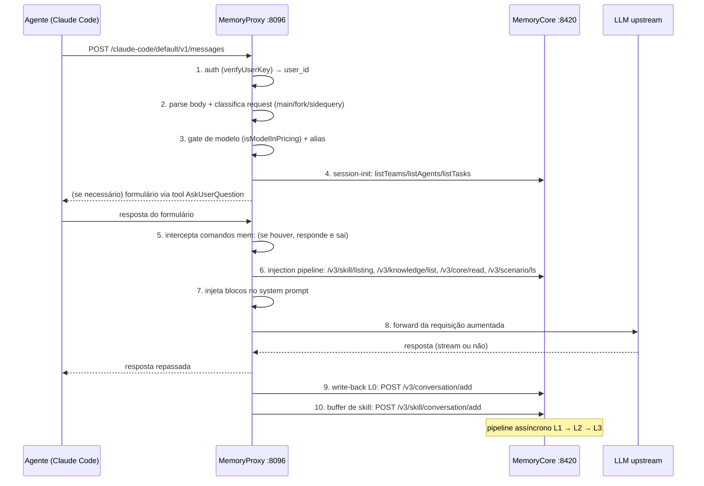
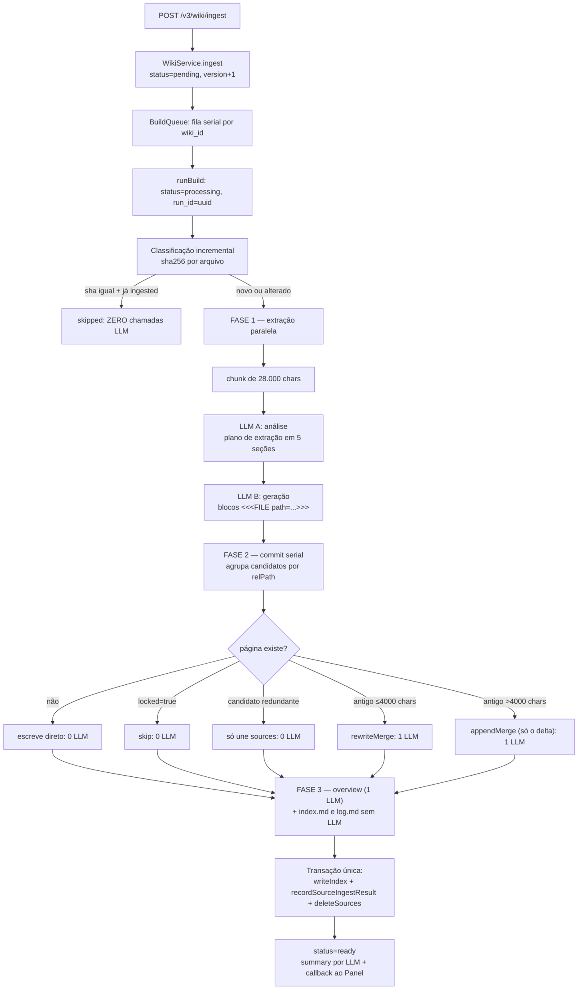
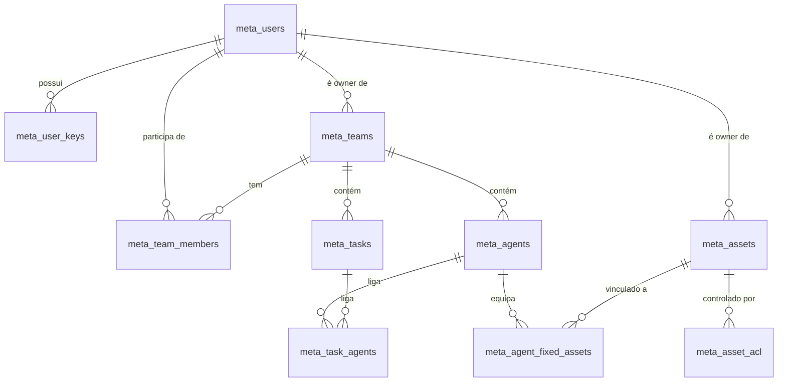

# Análise Técnica — TencentDB Agent Memory

> Documento produzido a partir da leitura direta do código-fonte e da documentação do repositório.
> Todas as afirmações abaixo estão ancoradas em arquivos reais, citados por caminho relativo à raiz
> do projeto (e por linha quando o detalhe é preciso). Onde algo não pôde ser confirmado no código
> disponível, isso está dito explicitamente.
>
> Versão analisada: `v2.0.1` (CHANGELOG de 2026-08-25); o `ROADMAP.md` fala em `v2.0.1-beta.1` e o
> `MemoryCore/package.json` declara `2.0.0-beta.1`. As três numerações divergem entre si.

---

## Sumário

1. [Visão geral e objetivo](#1-visão-geral-e-objetivo)
2. [Stack e dependências](#2-stack-e-dependências)
3. [Arquitetura e estrutura do repositório](#3-arquitetura-e-estrutura-do-repositório)
4. [Fluxo principal da aplicação](#4-fluxo-principal-da-aplicação)
5. [Detalhes de implementação interessantes](#5-detalhes-de-implementação-interessantes)
6. [Modelo de dados](#6-modelo-de-dados)
7. [APIs e contratos](#7-apis-e-contratos)
8. [Configuração, deploy e operação](#8-configuração-deploy-e-operação)
9. [Testes e qualidade](#9-testes-e-qualidade)
10. [Pontos fortes, riscos e oportunidades](#10-pontos-fortes-riscos-e-oportunidades)
11. [Referências rápidas](#11-referências-rápidas)

---

## 1. Visão geral e objetivo

### 1.1 O problema

O `README.md` abre com uma pergunta operacional: *"como reduzir trabalho repetitivo ao usar
agentes?"*. O contexto de projeto já explicado não deveria precisar ser repetido numa nova sessão;
documentos já lidos não deveriam ser relidos do zero por cada agente; um fluxo de trabalho que já
funciona não deveria ser redescoberto.

A tese do produto é que memória de agente não é "guardar conversas". É transformar informação que
já custou dinheiro e tempo em **ativos reutilizáveis** que sobrevivem à sessão, ao agente e ao
framework.

### 1.2 O que o sistema entrega

Quatro tipos de ativo de memória, unificados sob o mesmo plano de metadados:

| Ativo | O que é | Onde vive |
| --- | --- | --- |
| **Chat Memory** | Preferências, fatos, decisões e histórico, destilados em quatro camadas L0→L3 | `MemoryCore/src/core/` |
| **Skill** | Procedimento reutilizável com versão, arquivos de recurso, gatilhos e passos | `MemoryCore/src/core/skill/` |
| **Wiki** | Documentos transformados em páginas markdown estruturadas com grafo de links | `MemoryKnowledge/src/engines/wiki/` |
| **CodeGraph** | Repositório indexado em símbolos, arquivos, chamadas e caminhos de impacto | `MemoryKnowledge/src/engines/code/` |

### 1.3 A proposta de valor real

A tabela do `README.md` posiciona o produto contra RAG comum. RAG responde "o que pode ser
encontrado". O sistema aqui também responde "quem pode usar, qual versão vale, e para qual agente
isso deve ir". Concretamente, o que o RAG padrão não tem e este projeto tem:

- **Ownership, versão e status** por ativo (`meta_assets`).
- **Vinculação explícita agente↔ativo** (`meta_agent_fixed_assets`), com modo de injeção e prioridade.
- **Quatro níveis de visibilidade** (`private` / `team` / `restricted` / `agent`) com ACL granular.
- **Portabilidade entre frameworks**: o mesmo ativo serve Claude Code, Codex, CodeBuddy, WorkBuddy,
  DeepSeek Harness, OpenCode, Hermes, OpenClaw e Pi.

### 1.4 Para quem

O público-alvo declarado é um **time de agentes**, não um agente isolado. A narrativa do
`README.md` ("Tiny but Serious Inc.") descreve uma empresa de uma pessoa que monta uma equipe de
agentes com papéis distintos (Scout, Builder, Reviewer), cada um com um *loadout* de memória
diferente. O `MemoryPanel` existe justamente para que um humano controle esse loadout.

Há um segundo público implícito, visível em `docs/tdai-v2-technical-ops.md`: operadores que rodam
a stack em casa ou em uma máquina só, com um agente (Pi) e um gateway LLM externo.

### 1.5 O diferencial arquitetural: zero-code integration

O ponto mais forte do produto não é a memória em si, é o **modo de acoplamento**. O
`MemoryProxy` se apresenta ao agente como se fosse o próprio LLM. O usuário só troca a
`BASE_URL` do cliente:

```
ANTHROPIC_BASE_URL=http://localhost:8096/claude-code/default
```

Não há plugin, hook, MCP server nem alteração de código do agente. O proxy intercepta a
requisição, injeta memória no system prompt, encaminha ao LLM real e captura a conversa de volta.
Isso é o que permite suportar 8+ clientes diferentes sem escrever um adaptador de runtime para
cada um.

---

## 2. Stack e dependências

### 2.1 Linguagens e runtime

Todo o backend é **TypeScript sobre Node.js ≥ 22**, em ESM, executado via `tsx` em
desenvolvimento e nas imagens Docker. O `MemoryProxy/src/index.ts:3-10` chega a fazer uma checagem
explícita de versão do Node antes de qualquer import, saindo com `process.exit(1)` e sugerindo
`nvm use 22`.

Há Python em dois lugares apenas: o SDK cliente (`sdk/memory-core/python/`) e o plugin de Memory
Provider para o Hermes (`MemoryCore/hermes-plugin/memory/`).

### 2.2 Frameworks HTTP — três escolhas diferentes

Este é um ponto de heterogeneidade real dentro do monorepo:

| Módulo | Framework | Evidência |
| --- | --- | --- |
| MemoryCore | **`node:http` puro**, roteamento artesanal | `MemoryCore/src/gateway/server.ts:649` usa `http.createServer()`; o dispatch é uma cadeia de `if` sobre `pathname` |
| MemoryProxy | **Hono 4** | `MemoryProxy/package.json` → `hono ^4.7.10` |
| MemoryKnowledge | **Hono 4** + `@hono/swagger-ui` | `MemoryKnowledge/package.json` |
| MemoryPanel | **Hono 4** | `MemoryPanel/package.json` |

O MemoryCore não tem *path params* — todas as rotas são literais exatas, quase todas `POST` com
corpo JSON, no estilo RPC-sobre-HTTP.

### 2.3 Bancos de dados e busca

Não existe um banco único. Cada módulo persiste no que faz sentido para ele:

| Módulo | Persistência | Busca |
| --- | --- | --- |
| MemoryCore (memória) | **SQLite** com `sqlite-vec` + FTS5, **ou** Tencent Cloud VectorDB (TCVDB) | Híbrida BM25 + vetorial fundida por RRF |
| MemoryCore (metadados) | **SQLite** (`node:sqlite` `DatabaseSync`) **ou** MongoDB | SQL |
| MemoryCore (L2/L3, recursos) | Arquivos Markdown em **filesystem local ou COS** | Índice JSON derivado |
| MemoryKnowledge | **SQLite** via **Drizzle ORM** + `better-sqlite3`; um `index.db` adicional por wiki | **FTS5/BM25 apenas**, sem vetores |
| MemoryProxy | SQLite / Redis / COS / filesystem / memória (KV plano) | — |
| MemoryPanel | **Nenhum banco próprio** | — |

Dois detalhes importantes:

- A escolha do backend de metadados do Core é **inferida, não configurada**:
  `MemoryCore/src/metadata/store/factory.ts:71-101` decide MongoDB se `TDAI_METADATA_MONGO_URI`
  estiver preenchida, senão SQLite. Configurar os dois é erro fatal de boot.
- O `MemoryKnowledge` **não tem busca vetorial nenhuma**. Grep por `embedding|vector|vdb` no módulo
  só encontra comentários históricos. A busca de wiki é FTS5 com BM25 mais expansão por grafo.

### 2.4 Modelos de LLM e embedding

O sistema é **agnóstico de provedor** e exige que o operador traga o próprio LLM. Há dois grupos
de configuração independentes no deploy (`deploy/global-images/.env.example`):

- **Grupo memory** (`MEMORY_LLM_BASE_URL` / `_API_KEY` / `_MODEL`) — alimenta as pipelines de
  destilação L1/L2/L3 e a ingestão de wiki.
- **Grupo proxy** (`PROXY_UPSTREAM_URL` / `_API_KEY` / `_MODEL`) — é o LLM que o agente do usuário
  realmente conversa.

Protocolos suportados para o LLM de memória: **OpenAI-compatible** e **Anthropic**
(`MEMORY_LLM_PROTOCOL`). A chamada é feita pelo **Vercel AI SDK** (`ai` + `@ai-sdk/openai` +
`@ai-sdk/anthropic`) com `compatibility: "compatible"`, o que faz funcionar com DeepSeek, Qwen,
GLM e similares.

Os YAMLs de exemplo indicam o que o time usa na prática: `MemoryCore/tdai-gateway.yaml` aponta
para Tencent LKEAP com `deepseek-v3.2`, 32000 tokens de saída e timeout de 300 s;
`MemoryCore/tdai-gateway.standalone.yaml` é um template mínimo com OpenAI `gpt-4o`.

**Embeddings** são opcionais e desligados por padrão. Existem três implementações em
`MemoryCore/src/core/store/embedding.ts`:

1. `LocalEmbeddingService` via `node-llama-cpp` com `embeddinggemma-300m`, 768 dimensões — mas é
   **inalcançável pela configuração do usuário**, porque `MemoryCore/src/config.ts:433-440` mapeia
   `provider="local"` para `"none"`.
2. `OpenAIEmbeddingService` para qualquer endpoint OpenAI-compatible; `model` e `dimensions` são
   obrigatórios.
3. `NoopEmbeddingService`, usado quando o backend é TCVDB.

Quando não há embedding, o sinal semântico vem inteiramente do BM25.

### 2.5 Serviços externos opcionais

Nenhum é obrigatório; todos degradam para no-op.

- **Redis** — backend de estado distribuído do pipeline, cache de sessão do proxy, rate limit,
  fila de skills. Sem ele, o Core cai em `LocalStateBackend` (memória) e o rate limit do proxy fica
  permanentemente em fail-open.
- **Tencent COS** — object storage para L2/L3, checkpoints e recursos de skill.
- **Langfuse** — tracing de chamadas LLM.
- **Opik** — segundo canal de tracing, independente do Langfuse, no proxy.
- **ClickHouse** — dados de uso e cobrança.
- **Kafka** — pipeline de métricas (a implementação real está em submódulo privado).
- **OpenTelemetry / OTLP** — o caminho recomendado para open source.

### 2.6 Frontend

Um único frontend, em `MemoryPanel/web/`: **React 18 + Vite 6 + TypeScript + Tailwind 3 + Zustand 5
+ react-router-dom 7** com `HashRouter`. O design system é o **`tea-component` 2.8** da Tencent.
Visualização de grafo com `sigma` 3 + `graphology`. i18n com `i18next` em `en-US` e `zh-CN`.

É **código-fonte**, não build. O build vai para `web/dist/` (gitignored) e é servido pelo backend
do Panel na mesma origem.

### 2.7 Ferramental de build, lint e teste

| Ferramenta | Onde | Para quê |
| --- | --- | --- |
| `tsdown` | MemoryCore, MemoryKnowledge | Bundle ESM |
| `tsc` | MemoryPanel, SDK TypeScript | Compilação direta |
| `vite` | MemoryPanel/web | Build do frontend |
| `vitest` | Todos os módulos TS | Testes unitários |
| `drizzle-kit` | MemoryKnowledge | Migrations (nunca geradas — ver §9) |
| `kubb` | MemoryCore (`kubb.config.ts`) | Geração de tipos a partir de OpenAPI |
| `eslint` + `prettier` | **Apenas** `MemoryPanel/web` | Lint |
| `pytest` + `respx` | SDK Python | Testes |
| `hatchling` | SDK Python | Build |

**Não há ESLint em nenhum backend.** O único lint configurado no repositório é o do frontend.

---

## 3. Arquitetura e estrutura do repositório

### 3.1 Mapa de serviços e portas

```mermaid
flowchart TB
    subgraph clientes["Clientes (coding agents)"]
        CC[Claude Code]
        CX[Codex CLI]
        CB[CodeBuddy]
        WB[WorkBuddy]
        DSH[DeepSeek Harness]
        OC[OpenCode / OpenClaw / Hermes / Pi]
    end

    subgraph stack["Stack TencentDB Agent Memory"]
        PX["MemoryProxy :8096<br/>intercepta, injeta, captura"]
        MC["MemoryCore Gateway :8420<br/>kernel de memória + metadados"]
        subgraph hub["memory-hub (uma imagem)"]
            PN["MemoryPanel :8125<br/>control plane + UI"]
            KS["MemoryKnowledge :8424<br/>Wiki + CodeGraph"]
        end
    end

    LLM[["LLM upstream<br/>OpenAI-compatible / Anthropic"]]

    CC & CX & CB & WB & DSH & OC -->|BASE_URL apontada ao proxy| PX
    PX -->|forward| LLM
    PX -->|"/v3/conversation/add, /v3/skill/*, /v3/meta/*"| MC
    PX -->|"/v3/knowledge/list (catálogo)"| MC
    PN -->|"/v3/meta/*, /v3/skill/*, dataplane L0-L3"| MC
    PN -->|"/v3/wiki/*, /v3/code-graph/*"| KS
    KS -->|status-callback| PN
    KS -->|LLM via binding, rota /proxy/{serviceId}/v1| PX
    Browser[Navegador] --> PN
```

Portas canônicas no deploy padrão (`deploy/global-images/`):

| Serviço | Porta | Papel |
| --- | --- | --- |
| memory-core | 8420 | Kernel: memória L0–L3, skills, metadados, auth |
| memory-hub / panel | 8125 | Control plane + UI React |
| memory-hub / knowledge | 8424 | Wiki + CodeGraph |
| proxy | 8096 | Intercepção de requisições LLM |

Há uma inconsistência documentada de porta do Panel: `MemoryPanel/.env.example` e o default do
código usam **8123**; a imagem combinada e `MemoryPanel/panel-api-doc.md` usam **8125**. Ambas
estão corretas para cenários diferentes, mas isso confunde quem segue os dois documentos.

### 3.2 MemoryCore — o kernel

`MemoryCore/` é o coração e o módulo mais pesado: 274 arquivos TypeScript. Ele é
**três coisas ao mesmo tempo**, com três entrypoints distintos:

1. **Plugin OpenClaw** — `MemoryCore/index.ts` exporta `register(api)` e é declarado em
   `package.json` sob `openclaw.extensions`. Registra 3 ferramentas e 4 hooks.
2. **Servidor HTTP (gateway)** — `MemoryCore/src/gateway/server.ts`, classe `TdaiGateway`, com
   auto-start quando `process.argv[1]` termina em `server.ts`. É o `CMD` do Dockerfile.
3. **Biblioteca npm** — `@tencentdb-agent-memory/memory-tencentdb-v2`, bundle ESM.

Toda a lógica vive na fachada host-neutra `MemoryCore/src/core/tdai-core.ts` (classe `TdaiCore`,
~51 KB). O `index.ts` é explicitamente descrito como "a thin shell".

Subsistemas internos:

| Diretório | Responsabilidade |
| --- | --- |
| `src/core/conversation/` | Gravação L0 |
| `src/core/record/` | Extração, dedup, leitura e escrita L1 |
| `src/core/scene/` | Scene blocks L2 e seu índice |
| `src/core/persona/` | Geração e gatilho da persona L3 |
| `src/core/store/` | Backends de vetor (SQLite/TCVDB), BM25, embedding, isolamento |
| `src/core/skill/` | Modelo, extração, versionamento e permissões de Skill |
| `src/metadata/` | Users, teams, agents, tasks, assets, ACL |
| `src/gateway/` | Servidor HTTP e handlers |
| `src/offload*/` | Engenharia de contexto intra-sessão (ver §5.6) |
| `src/services/` | Worker de pipeline, scanner de timers, pool de permissões |
| `src/adapters/` | Abstração de host (OpenClaw vs standalone) |
| `src/core/report/` | Observabilidade (OTel, Langfuse, ClickHouse, Kafka) |

### 3.3 MemoryProxy — o ponto de entrada

`MemoryProxy/` (177 arquivos) é um **proxy transparente de requisições LLM**. Ele não persiste
memória: toda leitura e escrita vai para o MemoryCore por HTTP.

Fala **três protocolos de fio**, não um:

| Protocolo | Rota | Handler | Clientes |
| --- | --- | --- | --- |
| Anthropic Messages | `POST /:agent/:spaceId/v1/messages` | `src/anthropicHandler.ts` (2292 linhas) | Claude Code, CodeBuddy |
| OpenAI Chat Completions | `/:agent/:spaceId/v1/chat/completions` + catch-all | `src/handler.ts` (2282 linhas) | CodeBuddy, dsh, opencode, pi, hermes, openclaw |
| OpenAI Responses | `/codex/:spaceId/responses`, `/workbuddy/:spaceId/responses` | `src/codexHandler.ts`, `src/workbuddyHandler.ts` | Codex CLI, WorkBuddy |

A convenção de URL é `/{agentSource}/{spaceId}/...`. O **primeiro segmento identifica o agente** e
o **segundo é o id da instância de memória**. A resolução é um `switch` puro sobre string em
`src/agent-adapters/index.ts:26-45` — sem header, sem user-agent, sem fingerprint.

### 3.4 MemoryKnowledge — o serviço de conhecimento

`MemoryKnowledge/` (56 arquivos) é o **plano de dados de conhecimento**. Duas engines
independentes sob o mesmo serviço:

- **LLM-Wiki** — documentos brutos viram páginas markdown estruturadas com frontmatter YAML e
  `[[wikilinks]]`, indexadas em FTS5 e ligadas num grafo. É uma base cumulativa: páginas são
  deduplicadas e mescladas entre ingestões, não sobrescritas.
- **Code-Graph** — `git clone` de um repositório público HTTPS, indexado pelo engine externo
  **`@colbymchenry/codegraph`**. Não usa LLM.

O plano de controle é o Panel; a comunicação é por `service_id` no header e callbacks de status
de volta.

### 3.5 MemoryPanel — o control plane

`MemoryPanel/` acumula três papéis e **não tem banco próprio**:

1. **BFF/proxy transparente** para o kernel: `/api/v1/meta/*` → `/v3/meta/*` (whitelist de 55
   ações), `/api/v1/skill/*` → `/v3/skill/*` (whitelist de 15).
2. **Camada de agregação**: rotas que fazem N chamadas ao kernel e devolvem uma resposta
   (`/api/v1/chat-memory/*` com 17 endpoints, `/api/v1/agent-overview/bootstrap`,
   `/api/v1/knowledge/**` com 30 endpoints).
3. **Servidor de UI**: serve o React buildado de `web/dist` na mesma origem.

As únicas persistências locais são arquivos JSON de template de agente
(`src/panel/state/agent-template-store.ts`) e dois stores em memória perdidos no restart.

### 3.6 SDK

`sdk/memory-core/` traz dois SDKs **escritos à mão** — não gerados. Não há vestígio de kubb,
openapi-generator ou orval nesses diretórios; a única geração de contrato no repositório é
`MemoryPanel/scripts/generate-meta-openapi.ts`, que gera doc **a partir** do código.

| | TypeScript | Python |
| --- | --- | --- |
| Pacote | `@tencentdb-agent-memory/memory-sdk-ts-v2` | `tencentdb-agent-memory-sdk-python-v2` |
| Runtime | Node ≥18, dep única `undici` | Python ≥3.9, dep única `httpx` |
| Entradas | `.` (já é v3) e `./v3` | `tencentdb_agent_memory` (ainda **v2**) e `.v3` |

Cinco clientes: `MemoryClient` (dataplane L0–L3), `SkillClient` (17 endpoints), `MetadataClient`
(54 rotas meta + 5 de knowledge), `MemoryPromptClient` e `MemoryGenerationLogClient`. O Python
oferece variantes assíncronas de todos.

### 3.7 `agents/` — integração por cliente

Não contém runtime de agente. É **documentação de integração + wizard + importador de ativos**:

- `agents/setup-proxy.sh` (1187 linhas) — wizard interativo que varre as configs existentes de
  todos os agentes com `jq`, pergunta proxy/instância/chave, faz um **health probe real** contra o
  proxy no protocolo correto, escreve o arquivo de config do cliente com backup automático
  `.bak.<timestamp>`, e relê para conferência.
- `agents/skills/setup-proxy/SKILL.md` — a mesma coisa embalada como skill para Claude Code /
  CodeBuddy; o `.sh` é byte-idêntico ao da raiz.
- `agents/asset-import.ts` (2692 linhas) — CLI que varre o disco por skills
  (`~/.claude/skills/*/SKILL.md` e equivalentes) e sessões (`*.jsonl`), e as importa via Panel.
  Tem checkpoint em `.asset-import-state.json` e flags `--force` / `--extract memory|skill|both`.
- `agents/<nome>/README.md` + `asset-import.md` para claude-code, codebuddy, codex, dsh, hermes,
  openclaw, workbuddy; `opencode` só tem README.

### 3.8 `deploy/` — infraestrutura

Três subdiretórios:

- **`deploy/global-images/`** — a stack local de três contêineres com scripts bash. `_lib.sh` (454
  linhas) é a biblioteca comum com `require_vars`, `wait_healthy`, pré-checagem de LLM e
  `check_ports`. `start-all.sh` roda setup interativo e sobe core → hub → proxy em sequência.
- **`deploy/panel-knowledge-combined/`** — o Dockerfile multi-stage da imagem `memory-hub`, que
  empacota Panel + Knowledge num contêiner só, com um supervisor bash (`start-combined.sh`) que
  sobe o Knowledge primeiro e espera seu `/health` antes de subir o Panel.
- **`deploy/dockerhub/publish.sh`** — pipeline de publicação multi-arch das três imagens, com
  varredura de segredos e um `spot_check()` que exporta a imagem e **aborta** se encontrar `/.env`,
  `metadata-instances.json` ou `/.admin-key` dentro dela.

---

## 4. Fluxo principal da aplicação

### 4.1 Visão macro de um turno



### 4.2 Etapa 1 — Autenticação e identidade

A chave `sk-mem-…` do usuário chega no header `Authorization: Bearer`. O proxy chama
`POST {core}/v3/meta/auth/verify` com `{user_key}` no body e o header `x-tdai-service-id` = o
`spaceId` extraído da URL (`MemoryProxy/src/auth.ts:70-120`). Só aceita
`code === 0 && data.valid === true && data.user.user_id`.

**Não há cache.** Cada requisição faz o round-trip completo — decisão explícita em
`MemoryProxy/src/auth.ts:5`.

A chave é gerada com CSPRNG: `sk-mem-` + 24 bytes base64url, 192 bits de entropia
(`MemoryCore/src/metadata/utils/crypto.ts:21-23`).

### 4.3 Etapa 2 — Inicialização de sessão

A sessão é identificada por uma cadeia de headers em ordem de precedência
(`MemoryProxy/src/session/session-key.ts:9-19`):

```
x-conversation-id → x-session-id → x-claude-code-session-id
→ x-deepseek-harness-session-id → x-chat-id → x-thread-id
```

A chave real no store é o `compositeKey` = `` `${agentSource}:${sessionKey}` ``.

A máquina de estados (`MemoryProxy/src/session/types.ts:26-35`):

```
uninitialized → pending_asset_confirm → pending_team_select (só se ≥2 times)
→ pending_agent_select (com paginação) → pending_task_select → initialized
```

Há **dois caminhos** para chegar a `initialized`:

**(a) Formulário interativo.** O proxy fabrica uma resposta do LLM contendo uma chamada de
ferramenta que o cliente entende como pergunta ao usuário. Cada cliente exige um envelope
diferente:

| Cliente | Ferramenta | Prefixo do id | Limite de opções |
| --- | --- | --- | --- |
| claude-code | `AskUserQuestion` | `toolu_cc_session_init_` | 4 (hard) |
| codebuddy | `ask_followup_question` | `call_session_init_` | ilimitado |
| codex | `request_user_input` | `fc_codex_session_init_` | 3 |
| workbuddy | `AskUserQuestion` | `call_wb_session_init_` | 4 |
| dsh | `ask_user_question` | `call_dsh_session_init_` | ilimitado |
| opencode | `question` | `call_oc_session_init_` | 4 |

**(b) Headers de preseleção.** Com `x-team-id`, `x-agent-id`, `x-task-id` e `x-conversation-id`
presentes, o proxy registra a sessão diretamente. É o caminho usado por hermes, openclaw e pi, que
não têm ferramenta de formulário. Valores de header só são honrados quando existem dentro da lista
de times que o kernel devolveu (`MemoryProxy/src/session/preset.ts:9-13`).

A persistência tem **três camadas** (`MemoryProxy/src/session/store.ts:1-24`): L1 em `Map` de
memória, L2a `SessionRepo` com estado completo e TTL de 30 minutos para pendentes, e L2b
`BindingRepo` com registro mínimo e TTL de 30 dias. Sessões `initialized` **não têm TTL lógico** —
o comentário justifica: "usuários legitimamente voltam a conversas antigas".

### 4.4 Etapa 3 — Pipeline de injeção

O coração da leitura de memória. Arquitetura em `MemoryProxy/src/injection/pipeline.ts:79-152`:

```
body cru → Adapter.parse() → AgentContext → detecta AgentProfile
        → executeHooks() → Adapter.serialize() → body modificado
```

**Os injectors registrados** e o que cada um coloca no prompt:

| Injector | Ponto | Prioridade | Bloco injetado |
| --- | --- | --- | --- |
| `skill-tools-injector` | `system.before_tools` | 199 | `<skill_tools>` — receitas curl estáticas para o `/skill-bridge` |
| `skill-injector` | `system.before_tools` | 200 | `<available_skills>` — catálogo de skills do agente |
| `knowledge-tools-injector` | `system.before_tools` | 300 | `<knowledge_tools>` — wikis e code-graphs do time |
| `tdai-tools-injector` | `system.suffix` | 105 | `<tdai_memory_tools>` — 6 ferramentas curl read-only de L0/L1/L2 |
| `tdai-profile-memory-injector` | `system.suffix` | 110 | `<tdai_profile_memory>` (persona L3) + `<l2_scene_index>` |
| `asset-reflection-injector` | `system.suffix` | 1000 | `<asset_reflection>`, só com marcador `/analyse` na URL |

Uma sutileza que importa: **o `point` domina a `priority`**. A ordem dos pontos é fixa
(`system.prefix → before_tools → after_tools → suffix → tools.* → user.*`) e a prioridade só
desempata dentro do mesmo ponto. Por isso o `tdai-tools-injector` (prioridade 105) roda **depois**
do `knowledge-tools-injector` (prioridade 300).

**Uma decisão de design central: o recall L1 automático foi desligado.** O
`tdai-l1-recall-injector` existe em `MemoryProxy/src/injection/injectors/tdai-l1-recall-injector.ts`
mas está **desregistrado**, com o motivo documentado em `MemoryProxy/src/injection/index.ts:347-349`:

> "L0/L1 não são mais recuperadas automaticamente a cada turno e injetadas no user prompt (isso
> destrói o cache de KV/prompt)."

A substituição é elegante: em vez de injetar memória variável a cada turno, o proxy injeta no
**system prompt estável** um conjunto de **ferramentas curl read-only**, e deixa o LLM decidir
quando buscar. O system prompt fica cacheável pelo provedor, e a memória só entra no contexto
quando o modelo realmente precisa.

O mesmo raciocínio vale para L2: o injector coloca apenas o **índice de caminhos e sumários** de
200 caracteres, não o texto completo. O motivo está em
`MemoryProxy/src/injection/injectors/tdai-profile-memory-injector.ts:11-16` — "reduzir
drasticamente o consumo de tokens do primeiro turno" e "deixar o LLM buscar sob demanda".

**Ancoragem semântica.** Cada agente tem um `AgentProfile` que sabe segmentar seu system prompt e
resolver *slots* semânticos para chaves estruturais concretas:

| Slot | CodeBuddy | Claude Code | WorkBuddy | Pi |
| --- | --- | --- | --- | --- |
| `tools` | `mcp_protocol` | — | `mcp_configuration` | `Available tools` |
| `skills` | `agent_skills` | `Session-specific guidance` | `agent_skills` | `Guidelines` |
| `memory` | `memories` | `Memory` | `workbuddy_memory_slot_1` | — |
| `knowledge` | `memories` | `Memory` | `workbuddy_memory_slot_1` | — |

Três estilos estruturais coexistem: CodeBuddy e WorkBuddy usam **tags XML** (whitelist de 33 e 25
tags), Claude Code usa **headings markdown**, Pi usa **linhas-rótulo**. Quando o anchor não
resolve, cai num fallback por `point` que faz append no fim do system prompt.

Note que `knowledge` fica junto de `memory`, não de `skills` — a justificativa em
`MemoryProxy/src/injection/agents/codebuddy/profile.ts:30-38` é que conhecimento é "referência de
nuvem, semanticamente mais próxima da região de memória", e não deve poluir a pilha de skills.

**Cache de hooks.** Cada injector declara uma `cacheStrategy`. A dominante é `session_init`: o
`prewarm` roda uma vez no início da sessão e o resultado é persistido; requisições seguintes leem
do cache e **pulam** o `execute()`. A chave de isolamento é
`(spaceId, userId, agentSource, sessionId, hookId)`. Requisições `fork` (SUGGESTION/RECAP/COMPACT)
são marcadas `readOnly: true` e reusam o cache do diálogo principal **sem** fazer self-heal em
miss, para não escrever conteúdo que talvez não seja byte-idêntico ao do fluxo principal.

### 4.5 Etapa 4 — Forward e write-back

Depois da injeção, o proxy monta a requisição upstream e encaminha. Na volta, dois canais
independentes gravam:

| Canal | Endpoint | Sincronia |
| --- | --- | --- |
| Memória L0 | `POST /v3/conversation/add` | fire-and-forget em streaming, `await` em não-stream |
| Buffer de skill | `POST /v3/skill/conversation/add` | **sempre `await`** |

O L0 é pré-processado antes de sair: mensagens acima de 8192 caracteres são fatiadas preservando
pares surrogate UTF-16, e o envio é feito em lotes de 100 mensagens
(`MemoryProxy/src/tdai/client.ts:19-20`).

Antes disso passa por um **filtro de ruído de harness** (`user-query-extractor.ts:99-193`) em três
camadas. Uma string vazia significa "esta mensagem é 100% ruído", e o chamador não grava L0, não
alimenta o buffer de skill e não casa comando `mem:`:

- **Camada 0** — descarte total por 5 regexes ancorados em `^` para marcadores como
  `[SUGGESTION|TITLE|SUMMARY|COMPACT|SIDECHAIN MODE]`, "The user stepped away and is coming back.
  Recap", replays com timestamp.
- **Camada 1** — âncora explícita: coleta todas as ocorrências de `<user_query>…</user_query>` e
  retorna imediatamente.
- **Camada 2** — descascamento progressivo: remove 13 nomes de tag de instrumentação, filtra
  linhas que são recibos de Write/Edit, detecta o formato `cat -n` do Read **pelo tab** e não por
  espaços, e remove frontmatter YAML estilo MEMORY.md exigindo pelo menos uma de 5 chaves-âncora
  para não apagar `---` legítimo do usuário.

O buffer de skill tem um gate adicional: só é empurrado ao Core quando o assistant respondeu
**sem** `tool_use`/`tool_calls` — ou seja, no fim de uma rodada completa. A justificativa em
`MemoryProxy/src/skill/handler-glue.ts:15-25` é concreta: uma pergunta humana no Claude Code gera
N requisições HTTP no tool-loop; enviando por turno, "algumas rodadas produzem 30+ arquivamentos".

### 4.6 Etapa 5 — Destilação assíncrona no Core

Uma vez gravado o L0, o pipeline assíncrono do Core faz o resto.


**L0 — mensagens brutas.** Sem limiar: grava em **todo `agent_end`**, dentro de uma operação
atômica de checkpoint (`MemoryCore/src/core/hooks/auto-capture.ts:108-142`). Uma linha JSON por
mensagem. Remove blocos de código de respostas do assistente e troca data-URIs base64 por
`[image]`.

**L1 — memórias atômicas.** Sete tipos possíveis, divididos por `promptMode`:

- modo `chat`: `persona`, `episodic`, `instruction`
- modo `code`: `work_fact`, `work_task`, `work_method`, `work_artifact`

Cada registro tem `content`, `type`, `priority` (0–100, com −1 significando instrução global
estrita), `scene_name`, `source_message_ids` e `metadata`. É gravado em **dual-write**: JSONL
append-only como fonte de verdade e backup, mais o vector store como motor de retrieval.

Quatro gatilhos (`MemoryCore/src/utils/pipeline-manager.ts:399-514`):

1. Limiar de conversas — `everyNConversations` default **5**, com **warm-up exponencial** que
   começa em 1 e dobra: 1 → 2 → 4 → 8 → 5. Isso faz a primeira memória aparecer imediatamente numa
   sessão nova, em vez de o usuário esperar 5 turnos.
2. Timer de ociosidade — 600 s.
3. Flush explícito de sessão.
4. Drain de backlog — se o runner sinaliza backlog cheio, reenfileira na hora.

**A deduplicação L1 é 100% por LLM.** Não é hash, não é threshold de similaridade. Funil de duas
fases (`MemoryCore/src/core/record/l1-dedup.ts`):

- **Fase 1 — recall de candidatos** com três níveis de degradação: busca vetorial (top-5), depois
  FTS5/BM25, depois **nada** (dedup pulada, tudo vira `store`).
- **Fase 2 — julgamento em lote**: uma única chamada de LLM com o pool unificado de candidatos,
  retornando `action ∈ {store, update, skip, merge}`. Merge cross-type é permitido; merge N:1 via
  `target_ids`.

**Fail-open universal**: qualquer falha (LLM, parse, ausência de recall) resulta em
`fallbackStoreAll()`. O sistema privilegia recall sobre precisão — prefere memória duplicada a
memória perdida.

**L2 — Scene Blocks.** Uma "cena" não é uma lista de fatos; é um **documento narrativo Markdown
consolidado**. O prompt em `MemoryCore/src/core/prompts/scene-extraction.ts:64-69` é explícito:
*"不是清单，是连贯的叙事文档"* ("não é uma lista, é um documento narrativo coerente"). Formato:

```
-----META-START-----
created / updated / summary / heat
-----META-END-----

## Informação básica do usuário
## Preferências / Sinais implícitos
## Narrativa central (≤400 caracteres, Trigger → Action → Result)
## Trajetória de evolução / Pontos a confirmar
```

Limite de 1500 caracteres por arquivo. O LLM opera com ferramentas `read`/`write`/`edit` **dentro
de um sandbox** cujo workspace é `scene_blocks/` — checkpoint, índice e persona são fisicamente
invisíveis para ele. Deleção só acontece escrevendo o marcador literal `[DELETED]`.

O índice `.metadata/scene_index.json` é **sempre derivado**: `syncSceneIndex()` reconstrói do zero
varrendo os arquivos. O LLM nunca o escreve, o que elimina uma classe inteira de inconsistências.

O gatilho L2 é um timer "descendente": `T = max(now + 10s, últimoL2 + 900s)`, que só **antecipa**
nunca adia, mais uma garantia de intervalo máximo de 3600 s e uma guarda de sessão fria que
abandona se a última atividade tiver mais de 24 h.

**L3 — Persona.** Arquivo único `persona.md`, escrito pelo LLM, com **limite duro de 2000
caracteres** no modo chat e 1200 no modo code. Cinco condições de regeneração, em ordem
(`MemoryCore/src/core/persona/persona-trigger.ts:35-96`):

1. `request_persona_update === true` — sinal fora-de-banda emitido pelo LLM do L2 via marcadores
   `[PERSONA_UPDATE_REQUEST]…[/PERSONA_UPDATE_REQUEST]`.
2. Cold start — primeiras cenas processadas, sem persona ainda.
3. Recovery — persona existiu mas está vazia ou corrompida.
4. Primeira cena com memórias acumuladas.
5. Limiar de 50 memórias desde a última persona.

A geração é **incremental**: só carrega cenas cujo `updated` é posterior ao último timestamp de
persona; sem cenas alteradas e com persona existente, aborta **sem chamar o LLM**. O resultado é
pós-processado com `escapeXmlTags(stripSceneNavigation(text))` — proteção contra injeção no
momento de reinjetar.

### 4.7 Fluxo alternativo: ingestão de Wiki



O custo total em chamadas de LLM por ingestão é:

```
2 × Σ(chunks por fonte)   [análise + geração]
+ M                       [merges que exigem LLM]
+ 1                       [overview, se ≥1 fonte ok e ≥2 páginas]
+ 1                       [wiki summary no callback]
```

Fontes com sha256 inalterado e já ingeridas custam **zero**.

**O protocolo FILE** é o contrato de saída do LLM
(`MemoryKnowledge/src/engines/wiki/ingest-v2/file-protocol.ts`):

```
<<<FILE path="wiki/entities/redis.md">>>
---
type: entity
---
corpo da página com [[wikilinks]]
<<<END>>>
```

A regex de abertura aceita dois ou mais `>` como tolerância a modelos que escrevem `>>`.
`normalizeWikiPath` rejeita paths absolutos, drive letters do Windows e qualquer segmento `.` ou
`..`, e exige prefixo `wiki/`.

**Canonicalização de path** é a chave da deduplicação: se o frontmatter tem `type` e `title`, o
path vira `wiki/${dirForType(type)}/${slugify(title)}.md`, independentemente do que o LLM
escreveu. O `slugify` alterna segmentos CJK e latinos, preservando CJK literalmente
(`Redis 主从` → `redis-主从`).

**Busca de wiki**: FTS5 com BM25 pesando **título 5.0 e conteúdo 1.0**, com tokenização própria
(não jieba — bigrams para CJK, tokens inteiros para latino com 34 stop-words), seguida de
**expansão multi-hop pelo grafo de wikilinks**. Seeds ficam congelados em hop=0 com o score BM25;
cada vizinho recebe `score = anterior × decay` (default 0.5); abaixo de `minScore` é descartado;
cap duro de 200 nós visitados.

### 4.8 Fluxo alternativo: comandos `mem:`

O usuário digita `mem:sync` na conversa e o proxy **intercepta antes de encaminhar ao LLM**,
fabricando uma resposta que o cliente não distingue de uma resposta real.

Seis comandos (`MemoryProxy/src/mem-command/index.ts:28-35`):

| Comando | Efeito |
| --- | --- |
| `mem:help` | Tabela markdown estática, zero I/O |
| `mem:sync` | Re-busca Agent/Task no kernel e re-executa o prewarm com `clearBefore: true` |
| `mem:create-skill [prompt]` | Força o arquivamento do buffer de conversa para extração de skill |
| `mem:create-task [título\|confirm\|cancel]` | LLM gera título e descrição; confirma se já há task vinculada |
| `mem:update-task [descrição\|confirm\|cancel]` | Sempre exige confirmação; título é imutável |
| `mem:session-reset` | Zera o binding e reabre o formulário de seleção |

A resposta é **SSE falso** construída à mão, com um construtor por protocolo
(`MemoryProxy/src/mem-command/response-builder.ts`). Os detalhes revelam engenharia de campo:

- No Anthropic, se `thinking === true`, é inserido um bloco `thinking` **antes** do texto — sem
  ele o Claude Code considera a resposta incompleta e dispara requisições extras.
- Na Responses API, o JSON de `data` **precisa** carregar o campo `type` espelhando o header
  `event:`, porque o cliente codex lê `data.type` prioritariamente e descarta eventos sem ele. O
  sintoma sem isso era o texto simplesmente não aparecer.

O modelo reportado é sempre `"memory-proxy"` com usage zerado — **custo zero**.

O `mem:session-reset` tem um pre-hook próprio que roda **antes do session-init**
(`MemoryProxy/src/mem-command/pre-intercept.ts:4-21`). Sem isso, nos estados `pending_*` a máquina
trataria `"mem:session-reset"` como resposta ao formulário, cairia em `unrecognized`, e faria
bypass — o reset nunca seria capturado.

---

## 5. Detalhes de implementação interessantes

### 5.1 O padrão dominante: falha silenciosa por contrato

Nenhum caminho de telemetria, cobrança ou recall pode derrubar o negócio. Isso é aplicado de forma
sistemática e documentada:

- `IQuotaReporter.reportUsage()` tem contrato explícito de que **nunca pode lançar**
  (`MemoryCore/src/core/abstractions/types.ts:59-61`).
- O wrapper `performAutoRecallInner` nunca lança — falha vira um `RecallResult` com `.error` e
  arrays vazios, para não gerar NPE downstream.
- `getObservabilityBackend()` sempre devolve algo válido, com degradação em dois níveis: submódulo
  privado ausente → console com warning; exceção no init → noop silencioso.
- `fetchAssetCapabilities` é **fail-open total**: qualquer falha resulta em todas as capacidades
  `true`.

Há uma exceção deliberada e correta: `checkAcl` **lança**, para que `checkAclOrDeny` faça
**fail-closed** em decisões de permissão (`MemoryProxy/src/tdai/client.ts:305-312`).

### 5.2 Cada otimização carrega o número do problema que resolveu

Este é um padrão de comentário notável no código, e é uma qualidade real de manutenibilidade:

| Otimização | Número documentado |
| --- | --- |
| `fastEstimateMessages` com tabela binária pré-computada para CJK | ~5 ms por 100 K chars vs. 3–10 s com tiktoken |
| Troca de BRPOP por RPOP + polling de 200 ms | BRPOP monopolizava a conexão ioredis, cada arquivamento esperava ~15 s |
| `content.replace(old, () => new)` em vez de string | `$'` no replacer duplicava o resto do arquivo a cada edit, fazendo scene blocks crescerem exponencialmente |
| Buffer de 85% no threshold agressivo de compactação | "Sem buffer: tokens ficam em 109K com threshold 108.8K → cada tool call re-dispara" |
| Cache com stale-if-error no cliente de knowledge | 33% de timeouts do kernel em produção bloqueavam o prewarm |

### 5.3 Post-mortems codificados

Vários trechos existem porque um incidente real aconteceu, e o comentário narra o incidente:

**Ordem de escrita no arquivamento de skill** (`MemoryCore/src/core/skill/conversation-add/trigger-service.ts:11-22`).
Antes, `_tasks.json` era escrito antes do archive. Num incidente, o `writeArchive` levou ~10 s;
outro nó pegou a task, leu `archive == null`, julgou "fantasma" e **descartou silenciosamente uma
task real**. Daí a ordem archive-primeiro e o `enqueueAgent` dentro do mutex.

**Write-through síncrono de sessão** (`MemoryProxy/src/session/store.ts:155-165`).
Com fire-and-forget, o pod A fechava o stream com o PUT no COS ainda voando; o turno 2 no pod B
dava miss, caía em history-scan, fazia bypass, e a requisição **vazava direto para o LLM sem
memória**. Bug de 2026-07-13.

**Checkpoint distribuído** (`MemoryCore/src/utils/checkpoint.ts:404-427`).
Duas mudanças de comportamento cruciais: falha do backend de lock agora lança
`CheckpointLockUnavailableError` em vez de escrever sem lock ("a implementação antiga escrevia sem
lock aqui, sobrescrevendo os `runner_states` de outros nós"); e timeout de aquisição agora
**desiste** ("escrita sem lock sobrescreveria com um snapshot velho os dados já commitados por
outros — perda do cursor L1, extração duplicada permanente").

**ACK antes de re-enqueue** (`MemoryCore/src/services/pipeline-worker.ts:528-542`).
Sem o ACK da mensagem original antes do re-enqueue, o `msgId` ficava em XPENDING e a recuperação
de mensagens obsoletas re-reivindicava em paralelo — **a mesma task rodando duas vezes**.

**Achatamento da chave de binding** (`MemoryProxy/src/db/binding-repo.ts:7-16`).
A assinatura passou de 4 segmentos para 2 porque o memory-bridge só consegue fornecer esses dois;
em miss cross-pod ele nunca conseguia montar a chave antiga e dava 401 eternamente.

### 5.4 Guard-rails de segurança bem feitos

**`assertDeleteFilterSafe()`** (`MemoryCore/src/core/store/tcvdb.ts:215-232`) — o endpoint
`/document/delete` do TCVDB **apaga a collection inteira** quando recebe filtro vazio. A função
lança erro se o filtro for vazio ou faltar campo de escopo.

**Path traversal em quatro camadas independentes** — `local-backend.ts`, `storage-tools.ts`,
`read-cos.ts` e `skill-resource-store.ts` todas validam separadamente. O
`MemoryProxy/src/storage/key-utils.ts:22-31` é ainda mais conservador: rejeita **qualquer
ocorrência da substring `..`**, não só o segmento exato, com a justificativa de que "o custo de
falso positivo é desprezível e o valor anti-injeção é alto".

**Defesa contra prompt injection em três lugares distintos:**

1. `escapeClosingTags()` no composer de memory-prompt converte tags de fechamento em entidades
   HTML, e um bloco `SYSTEM_CUSTOM_STRATEGY_GUARD` reafirma que o prompt customizado só pode
   ajustar *o que* observar, nunca o formato de saída, os enums ou a whitelist de ferramentas.
2. O prompt de revisão de skill (`MemoryCore/src/core/skill/prompts/skill-review-prompt.ts`)
   **instrui explicitamente o LLM a ignorar blocos `<system-reminder>`, `<rules>` e `<memories>`
   embutidos no transcript** — defesa contra injeção via conversa do usuário.
3. A persona L3 passa por `escapeXmlTags()` antes de ser reinjetada.

**SSRF check no git fetcher** (`MemoryKnowledge/src/source-fetcher/git-fetcher.ts:25-37`) — bloqueia
`10.`, `172.16-31.`, `192.168.`, `169.254.` (metadata de nuvem), `127.`, `localhost`, `::1`,
`fe80:`. Desligável por env var.

### 5.5 O truque das tags não-naturais no transcript de skill

`MemoryCore/src/core/skill/skill-extractor.ts:407-427` usa `<<past-user>>` e `<<past-assistant>>`
em vez de `[user]`/`[assistant]`. O motivo: com as tags naturais, o modelo interpretava a cauda do
transcript como "minha vez de continuar" e produzia 1235 tokens de continuação com zero tool
calls. É captura de papel — o modelo confundia o transcript analisado com a conversa corrente.

### 5.6 O subsistema Offload — engenharia de contexto intra-sessão

Este é o subsistema mais fácil de confundir. Ele tem camadas L1/L1.5/L2/L3 que **não têm relação
nenhuma** com as camadas L0–L3 da memória:

| | Core (`src/core/`) | Offload (`src/offload*/`) |
| --- | --- | --- |
| L1 | memórias de longo prazo | **sumarização de pares tool_call/tool_result** com score de substituibilidade |
| L1.5 | não existe | **julgamento do ciclo de vida da tarefa** |
| L2 | scene blocks Markdown | **fluxograma Mermaid** com mapeamento de nós |
| L3 | geração de persona | **compressão do array de mensagens** |

Escopo temporal também difere: o core é longo prazo entre sessões; o offload é **intra-sessão e
efêmero**, com reclaim por retenção.

**MMD significa Mermaid Diagram**, não "memory markdown". O sistema mantém um mapa cognitivo da
tarefa em Mermaid (`flowchart TD`) com metadados JSON numa diretiva de comentário:

```
%%{ "taskGoal": "…", "progress（0-100）": "…", "createdTime": "ISO", "updatedTime": "ISO" }%%
001-N1["Fase: ação<br/>status: done|doing|paused|blocked<br/>summary: …<br/>Timestamp: ISO8601"]
```

Os guardrails do prompt L2 (`MemoryCore/src/offload_server/prompts/l2-prompt.ts:9-18`) são
conceitualmente interessantes:

- **Agregação elástica** — autonomia para fundir nós, "nunca registrar tudo em detalhe como um
  diário corrido".
- **Lápide cognitiva** (*认知墓碑*) — becos sem saída viram nós com `status: blocked`, para o agente
  não repetir o mesmo erro.
- **Proibido planejar o futuro** — só registra o que ocorreu; todo nó precisa de uma fonte
  (`tool_call_id`).

A compactação de mensagens tem três níveis com thresholds calibrados:

| Nível | Gatilho | Estratégia |
| --- | --- | --- |
| MILD | ≥50% da janela | Escaneia só os primeiros 70% (protege a cauda recente); cascata de score de 7 até 1; **guard anti-inflação** que reverte a substituição se o sumário ficar maior que o original |
| AGGRESSIVE | ≥85% | Acumula da cauda até 60% do budget e descarta a cabeça, com proteção de mensagens de usuário e `MIN_KEEP = 10` |
| EMERGENCY | ≥95% | Alvo de 60%, mínimo de 2 mensagens, truncamento de mensagens grandes a 2000 chars |

### 5.7 Isolamento multi-tenant

O modelo é **filter-based**, não collection-per-user nem namespace: uma tabela/collection por
camada, separação por colunas filtradas em **seis dimensões** (`teamId`, `userId`, `agentId`,
`sessionId`, `taskId`, `sessionKey`).

Há uma **assimetria deliberada e importante**: L0 e L1 isolam por user + agent + session, mas
**L2 e L3 isolam apenas por team + agent** (`MemoryCore/src/core/profile/profile-sync.ts:20-28`).
O motivo é que o perfil precisa acumular entre sessões e usuários — é exatamente o que o torna
útil. Nesse caso sim há prefixo hierárquico de storage:
`profiles/{encodeURIComponent("team:T|agent:A")}/`.

No TCVDB a **ordem das condições importa**: `teamId` vem primeiro, sob pena de vazamento
cross-team (`MemoryCore/src/core/store/tcvdb.ts:189-190`).

### 5.8 Busca híbrida e RRF

A fórmula canônica está em `MemoryCore/src/core/store/search-utils.ts:18,50`:

```ts
export const RRF_K = 60;
const score = 1 / (k + rank + 1);   // rank 0-indexado
```

Escores de listas diferentes são somados. **Não há rerank com cross-encoder em lugar nenhum** e
não há pesos configuráveis — é RRF puro.

Dois caminhos de fusão:

- **SQLite** — fusão client-side: `Promise.all([FTS5, vetorial])` com over-retrieve de
  `limit × 3`, depois RRF. O BM25 local usa `@node-rs/jieba` com `cutForSearch`, filtra stop-words
  chinesas e junta os tokens com **`OR`** — recall alto, precisão baixa.
- **TCVDB** — fusão server-side via `hybridSearch` com `rerank: { method:"rrf", k:60 }`. Quando
  `embeddingEnabled=false` (o default), cria um índice denso *placeholder* de dimensão 1 porque a
  API exige um campo `ann`, e o sinal semântico vem só do BM25 esparso.

### 5.9 Skills: versionamento e concorrência

O modelo é **single-table multi-version** (`MemoryCore/src/core/skill/skill-store-ddl.ts:21-66`).
O detalhe crítico é o índice:

```sql
CREATE UNIQUE INDEX uniq_skills_team_agent_name_head
  ON skills(team_id, owner_agent_id, name) WHERE is_head=1 AND status='active';
```

Ownership é **por agente**, não por usuário: a tupla `(team_id, owner_agent_id)` identifica o dono.
Uma linha de outro time é tratada como **inexistente**, não como "sem permissão" — evita canal
lateral de existência.

O `createNewSkill` orquestra uma "transação" através de **três sistemas sem transação real**, na
ordem *mais frágil primeiro*: COS → banco de skills → `meta_assets`. Falha no terceiro passo faz
rollback completo, e o incremento de contador só é emitido depois dos três passos verdes.

A extração assíncrona usa fila Redis com **at-least-once** via `LMOVE key key RIGHT LEFT`, com três
níveis de degradação (`lmove` nativo → `evalsha` Lua → `rpop_lpush_downgrade`). A classificação de
falhas separa *permanent* (HTTP 400/422, erros de schema) que vão para DLQ após 3 tentativas, de
*transient* (AbortError, 429, 5xx, ECONN*) que fazem **retry infinito sem incrementar contador**.
O fallback é transient, conservador para não perder dados.

Note que as ferramentas expostas ao LLM **não incluem `delete` nem `files_remove`**, com a
justificativa explícita: "o fluxo de extração não deve poder destruir skills do time".

### 5.10 Extensibilidade

O sistema é extensível em cinco eixos, com pontos de extensão claros:

| Eixo | Ponto de extensão |
| --- | --- |
| Novo cliente de agente | `AgentAdapter` (3 membros) + `AgentProfile` (6 métodos) + uma rota em `server.ts` |
| Novo injector | Implementar a interface de hook e registrar em `injection/index.ts` |
| Novo backend de vetor | `switch` em `MemoryCore/src/core/store/factory.ts` |
| Novo backend de metadados | `IMetadataStore` + suíte de contrato compartilhada (62 blocos) |
| Novo host do Core | `HostAdapter` com apenas 3 métodos: contexto, logger e factory de LLM runner |

O `HostAdapter` é particularmente enxuto:

```ts
interface HostAdapter {
  readonly hostType: "openclaw" | "hermes" | "standalone";
  getRuntimeContext(): RuntimeContext;
  getLogger(): Logger;
  getLLMRunnerFactory(): LLMRunnerFactory;
}
```

E o `LLMRunner` tem uma única operação: `run(params): Promise<string>`.

Há também um caso exemplar de teste de paridade: `MemoryCore/src/metadata/store/metadata-store.contract.ts`
exporta `runMetadataStoreContract()` com 62 blocos executados contra **os dois** adapters (SQLite e
MongoDB), garantindo que eles não divirjam.

---

## 6. Modelo de dados

### 6.1 Entidades de metadados (MemoryCore)

DDL em `MemoryCore/src/metadata/store/sqlite-adapter.ts:126-312`; o MongoDB usa os mesmos nomes de
coleção.



| Tabela | PK | Campos notáveis |
| --- | --- | --- |
| `meta_users` | `usr-` | `user_type` (`normal` \| `system_admin`), `auth_provider`, `external_id`, `status` |
| `meta_user_keys` | `uky-` | `key_value` UNIQUE, `is_default`, `last_used_at`, `expires_at`, `revoked_at` |
| `meta_teams` | `team-` | `owner_user_id`, `status` |
| `meta_team_members` | UUID v4 | `role` (`admin`\|`member`\|`reviewer`), UNIQUE(team_id, user_id) |
| `meta_agents` | `agt-` | `prompt`, `visibility`, `owner_user_id` |
| `meta_tasks` | `task-` | `source_type` (`manual`\|`tapd`\|`github`\|`other`), `auto_assign_floating_assets`, `risk_level` |
| `meta_task_agents` | UUID v4 | `role_in_task`, UNIQUE(task_id, agent_id) |
| `meta_participation_logs` | INT | Append-only; 4 índices compostos |
| `meta_assets` | id externo | `asset_type` (`skill`\|`llm_wiki`\|`code_graph`\|`chat_memory`), `visibility`, `status`, `version`, `confidence`, `expires_at`, `usage_count`, `content_ref` |
| `meta_agent_fixed_assets` | — | `injection_mode` (`direct`\|`summary`\|`tool`\|`reference`), `priority`, UNIQUE(agent_id, asset_id) |
| `meta_asset_acl` | — | `subject_type` (`user`\|`team_role`\|`agent`), `permission` (`read`\|`write`\|`delete`\|`assign`\|`share`\|`use`) |
| `meta_config_params` | — | CHECK cruzado: `scope='global'` exige `user_id IS NULL` e vice-versa |

**Um índice merece destaque:**

```sql
CREATE UNIQUE INDEX ux_meta_users_system_admin ON meta_users(user_type)
  WHERE user_type='system_admin';
```

Um índice UNIQUE parcial que garante **um único system_admin por instância**. Replicado no MongoDB
com `partialFilterExpression`.

**Geração de IDs** — não é ULID nem snowflake, é um esquema próprio
(`MemoryCore/src/metadata/utils/id-generator.ts:56-61`):

```ts
const ts = Math.floor(Date.now()/1000) % 36**4;   // ciclo de ~19 dias
return `${prefix}-${encodeBase36(ts,4)}${randomBase36(6)}`;   // usr-3mfxa3b9c1
```

A entropia da parte aleatória é `36^6 ≈ 2.2e9` e usa `Math.random()` (não CSPRNG). Daí a
existência de um preflight de colisão de PK com 3 tentativas nos adapters.

O ID de chat memory é **determinístico**: `chat_memory-{team_id}-{agent_id}`
(`MemoryCore/src/metadata/utils/chat-memory-asset.ts:22`) — naturalmente idempotente.

### 6.2 Dados de memória (SQLite)

Schema em `MemoryCore/src/core/store/sqlite.ts`. PRAGMAs: WAL, `busy_timeout=5000`,
`cache_size=-65536` (64 MB), `mmap_size=128 MB`.

| Tabela | Conteúdo |
| --- | --- |
| `l1_records` | Memórias L1, 18 colunas, **13 índices** |
| `l1_vec` | `vec0(record_id, embedding float[dim] distance_metric=cosine, updated_time)` |
| `l0_conversations` | Mensagens brutas, 9 índices |
| `l0_vec` | Idem, com `recorded_at` |
| `l1_fts` / `l0_fts` | FTS5; coluna `content` com **texto segmentado por jieba**, `content_original UNINDEXED` para exibição |
| `embedding_meta` | provider/model/dimensions; mudança dispara drop das tabelas vec e `needsReindex` |
| `memory_audit` | `layer CHECK IN ('L1','L2','L3')` — **L0 é imutável por design** |
| `entity_teams` / `_users` / `_agents` / `_tasks` / `_knowledge` | Entidades espelhadas |
| `memory_prompts` + `_settings` + `_setting_logs` | Prompts de memória customizados |
| `skills` / `skill_fts` / `skill_vec` | Executadas no mesmo `vectors.db` |

**L2 e L3 não existem como tabela no SQLite.** O comentário em `sqlite.ts:2736-2737` é explícito:
"o sqlite store não persiste linhas de profile L2/L3 (a tabela `profiles` só existe no TCVDB)".
São arquivos Markdown geridos pelo `StorageAdapter`.

### 6.3 Layout físico de arquivos

`MemoryCore/src/core/storage/types.ts:250-282`:

```
conversations/{YYYY-MM-DD}.jsonl   — L0
records/{YYYY-MM-DD}.jsonl         — L1
scene_blocks/{name}.md             — L2
persona.md                         — L3
.metadata/scene_index.json         — índice L2 (sempre derivado)
.metadata/checkpoint.json          — estado do pipeline
```

Em modo *service*, tudo é reescopado por tenant sob
`profiles/{encodeURIComponent("team:{id}|agent:{id}")}/`.

### 6.4 Checkpoints

`MemoryCore/src/utils/checkpoint.ts` divide o estado em **dois namespaces disjuntos** para
eliminar split-brain:

| Namespace | Campos |
| --- | --- |
| `runner_states` | `last_captured_timestamp` (cursor L0 por sessão), `last_l1_cursor`, `last_scene_name` |
| `pipeline_states` | `conversation_count`, `last_extraction_updated_time` (cursor L2), `last_active_time`, `l2_pending_l1_count`, `warmup_threshold` |

O cursor L1 é **monotônico** — só avança se maior, senão loga a regressão, com alinhamento de
fronteira de milissegundo para não partir grupos.

### 6.5 Dados de conhecimento (MemoryKnowledge)

Dois níveis de banco.

**Nível 1 — `knowledge.db` (Drizzle):** 5 tabelas.

| Tabela | Índice notável |
| --- | --- |
| `knowledge_code_graph` | `UNIQUE(service_id, team_id, repo_url, branch) WHERE deleted_at IS NULL` |
| `knowledge_wiki` | `UNIQUE(service_id, team_id, name) WHERE deleted_at IS NULL` |
| `knowledge_wiki_audit` | `(wiki_id, version DESC)`, append-only |
| `knowledge_code_graph_audit` | idem |
| `llm_binding` | PK `service_id` |

Os índices UNIQUE parciais são o que dá **idempotência ao create**.

**Nível 2 — um `index.db` SQLite por wiki**, no mesmo diretório do conteúdo:

| Tabela | DDL |
| --- | --- |
| `wiki_fts` | `fts5(page_id UNINDEXED, title_tok, content_tok, tokenize='unicode61 remove_diacritics 0')` |
| `page_meta` | `page_id PK, title, type, rel_path, snippet` — **o corpo não entra no banco**, fica no `.md` |
| `graph_edge` | `PRIMARY KEY(source_id, target_id)` |
| `source` | `filename PK, sha256, size, status, ingested_at, ingest_error` |

A estratégia de conexão é bem pensada: **escrita** abre conexão dedicada, roda a transação, faz
`wal_checkpoint(TRUNCATE)` e fecha — nunca entra no pool; **leitura** usa um `LRUCache` de até 300
conexões. A restrição de file descriptors está documentada: WAL usa 3 fd por conexão, ~900 fd no
total, com recomendação de `ulimit -n ≥ 2048`.

### 6.6 Estado do proxy

Todo o estado do proxy é KV plano sob dois buckets, com layout desenhado para lifecycle rules do
COS (`<ttl|nottl>/<spaceId>/<userId>/<agentSource>/<sessionId>/<tipo>`):

| Repositório | Chave | Bucket |
| --- | --- | --- |
| Estado de sessão | `ttl/<space>/<user>/<agentSource>/<sid>/inj-sess.json` | ttl |
| Cache de hooks | `ttl/<space>/<user>/<agentSource>/<sid>/inj-hook/<hookId>.json` | ttl |
| Binding de identidade | `nottl/<space>/<sid>/binding.json` | nottl |
| Pin de versão de skill | `nottl/<space>/<user>/<agentSource>/<sid>/skill-vpin/<skillId>.txt` | nottl |

O `spaceId` **precisa** ficar logo após o bucket porque uma lifecycle rule do COS casa por prefixo
e não suporta wildcard no meio do path (`MemoryProxy/src/storage/key-utils.ts:52-53`).

---

## 7. APIs e contratos

### 7.1 Envelope e códigos

O envelope canônico do MemoryCore e do Panel é:

```json
{ "code": 0, "message": "ok", "request_id": "…", "data": { } }
```

O mapeamento para HTTP no Core (`MemoryCore/src/gateway/v2-router.ts:637`): `code === 0` → 200;
`400 ≤ code < 600` → o próprio valor; **fora dessa faixa → HTTP 200**. Isso significa que códigos
de negócio de 5 dígitos como `4291` (quota estourada) ou `40901` (versão de skill obsoleta) chegam
ao cliente com **HTTP 200**.

O MemoryKnowledge tem o mesmo formato mas **sem `request_id`** — o campo existe em
`api-helpers.ts` mas nenhuma rota o passa.

### 7.2 MemoryCore — 108 endpoints v3

Distribuição segundo `MemoryCore/v3-api-memorycore-doc.md:83-99`:

| Grupo | Qtd | Exemplos |
| --- | --- | --- |
| Dataplane L0–L3 | 18 | `/v3/conversation/{add,query,search,delete,count}`, `/v3/atomic/*`, `/v3/scenario/*`, `/v3/core/*` |
| Skill | 17 | `/v3/skill/{create,update,patch,delete,get,get-by-name,list,search,versions,export,listing,extract}`, `files/{write,remove,read}`, `conversation/{add,force-archive}` |
| Meta | 55 | `/v3/meta/{user,user-key,team,team-member,agent,task,task-agent,participation-log,asset,agent-fixed-asset,acl}/*` |
| Knowledge | 5 | `/v3/knowledge/{create,get,update,delete,list}` |
| Memory-Prompt | 7 | Prompts de estratégia customizados |
| Generation-Log | 2 | Proveniência de memória gerada |
| Chat-Memory | 1 | `/v3/chat-memory/clear` |
| Internal-Meta | 2 | `user/init-admin`, `user/list-by-instance` |

**Quase tudo é POST.** As únicas rotas que aceitam GET são Memory-Prompt e Generation-Log, com
"body" vindo da query string.

Exemplo de requisição e resposta do dataplane:

```json
// POST /v3/conversation/add
// Headers: Authorization: Bearer <api_key>
//          x-tdai-service-id: default
{
  "team_id": "team-xxx", "user_id": "usr-xxx", "agent_id": "agt-xxx",
  "session_id": "sess-1", "task_id": "task-xxx",
  "messages": [{ "role": "user", "content": "…" }]
}

// Resposta
{ "code": 0, "message": "ok", "request_id": "…", "data": { } }
```

### 7.3 Autenticação — três camadas independentes

**Camada 1 — Bearer shared-secret** (`MemoryCore/src/gateway/server.ts:1116-1129`):

```ts
const expected = this.config.server.apiKey;
if (!expected) return "ok";                  // auth DESLIGADA quando não configurada
if (!header.startsWith("Bearer ")) return "missing";
if (!safeEqual(provided, expected)) return "invalid";
```

A comparação é constant-time via `crypto.timingSafeEqual`. Mas note a primeira linha: **sem
`apiKey` configurada, a autenticação é um no-op**.

**Camada 2 — Tenant `x-tdai-service-id`.** É o `instanceId` e a chave de tudo em modo service:
resolve o store, o storage e a quota.

**Camada 3 — `x-tdai-user-key`**, só em `/v3/meta/*`. A chave estática do "memory system user" é
**proibida como header** e só vale no body de `auth/verify`.

Identidade de negócio (isolation) é independente da auth: body tem precedência sobre os headers
`x-tdai-{team,user,agent,session,task}-id`. O modo estrito v3 exige `team_id + agent_id + user_id`;
`session_id` é **deliberadamente opcional** — sem ele, a busca agrega cross-session.

### 7.4 MemoryPanel — API

Prefixo `/api/v1`, **tudo POST estilo RPC**, exceto `GET /health` e `GET /api/v1/meta/instances`.

Autenticação: **não há JWT, cookie nem sessão de servidor**. É um modelo de duplo header por
requisição:

| Header | Papel |
| --- | --- |
| `x-tdai-service-id` | `instance_id` — resolve endpoint e `api_key` do Gateway no registry |
| `x-tdai-user-key` | Credencial do usuário (`sk-mem-…`), repassada ao kernel |
| `x-request-id` | Correlação, opcional |

O `api_key` do gateway **é do servidor e nunca chega ao browser** — `InstanceRegistry.listPublic()`
o omite. No frontend, o usuário cola sua `user_key`, o Panel chama `auth/verify`, e a sessão é
guardada em `localStorage['tdai-panel.session']`.

O proxy `/meta/*` **não é 100% transparente**. Ele adiciona:

- `DUP_CHECK_MAP` — `user/create`, `team/create`, `agent/create`, `task/create` fazem
  *read-before-write* e retornam 409 em nome duplicado; se a checagem falhar, deixa passar para
  não bloquear criações legítimas.
- `agent/set-default-template` e `get-default-template` **não vão ao kernel** — leem e gravam o
  arquivo local de template; `set` exige `system_admin`.
- `team-member/add` bem-sucedido dispara, assíncrono e best-effort, a clonagem de um Agent padrão
  para o novo membro, com fork das skills do template.
- `user/list` filtra o usuário interno de billing `knowledge-service`.

### 7.5 MemoryKnowledge — 37 endpoints

Wiki (16), Code-Graph (14), Tools (2), LLM-Binding interno (3), Auto-Sync (2), `/health`.

O par mais importante é o de **descoberta progressiva de ferramentas**:

- `POST /v3/tools/list` com `{knowledge_id}` → retorna `{type, name, summary, status, tools[]}`
  (7 ferramentas para wiki, 9 para code-graph).
- `POST /v3/tools/call` com `{knowledge_id, tool_name, params}` → executa.

Isso é o que permite ao agente descobrir capacidades em runtime em vez de ter tudo cravado no
prompt.

O **`openapi.yaml` cobre apenas 28 dos 37 endpoints** — faltam `/tools/*`,
`/internal/llm-binding/*`, `/auto-sync/*` e os dois `update-meta`.

**Não há autenticação real** no MemoryKnowledge. O modelo é de confiança de rede interna: o
`service_id` é auto-declarado no header e validado apenas contra `^[A-Za-z0-9_-]+$` com ≤200
caracteres — validação que existe como defesa contra path traversal, não como autenticação (o
comentário em `api-helpers.ts:15-18` diz isso explicitamente).

### 7.6 MemoryProxy — endpoints próprios

Além das rotas de proxy, expõe:

| Rota | Auth | Descrição |
| --- | --- | --- |
| `GET /health` | não | Retorna **503** quando o storage pedido era `cos` mas o efetivo é process-local, para o k8s tirar o pod do balanceador |
| `GET /whoami` | não | API key → keyId em texto plano |
| `POST /skill-bridge/*` | — | Reverse-proxy para as ferramentas de skill do Core, injetando auth e identidade |
| `POST /memory-bridge/*` | — | Reverse-proxy **read-only** para L0/L1/L2/L3 (6 subpaths permitidos; escritas retornam 403) |
| `POST /v3/instance/proxy-destroy` | **Bearer** | Limpeza de dados de uma instância |
| `GET\|PUT\|DELETE /v3/admin/rate-limits` | **não** | Leitura e mutação de limites globais |
| `POST /v3/session/refresh-cache` | **não** | Re-executa o prewarm |
| `POST /v3/session/force-archive-skill` | **não** | Força arquivamento do buffer |

O `/memory-bridge` ser estritamente read-only é a peça que torna seguro dar ao LLM receitas curl no
system prompt: mesmo que o modelo seja induzido a fazer algo estranho, `atomic/update`,
`scenario/write` e `core/write` retornam 403.

### 7.7 Superfície do SDK

O SDK envolve o dataplane com **isolamento estrito obrigatório**. O construtor do `MemoryClient`
exige `endpoint, apiKey, serviceId, teamId, agentId, userId`:

```ts
const client = new MemoryClient({
  endpoint: "http://127.0.0.1:8420", apiKey: "sk-mem-…",
  serviceId: "your-memory-instance-id",
  teamId: "team-xxx", agentId: "agt-xxx", userId: "usr-xxx", sessionId: "sess-1"
});
await client.addConversation({ messages: [{ role: "user", content: "Hello" }] });

// agregar entre sessões
const all = await client.withIsolation({ sessionId: null }).queryConversation({ limit: 20 });
```

Duas regras de segurança implementadas client-side:

- **`addConversation` exige `session_id`** — lança `ParamError` se ausente.
- **Deletes nunca herdam o `session_id` do construtor** — precisam ser explícitos.

Há validação de limites antes de sair: dedupe de ids, teto de 5000 para `message_ids` e de 100
para `session_ids` e `memory_ids`.

Ambos os READMEs do SDK trazem uma nota de segurança importante: os endpoints de delete e clear do
kernel **não fazem autorização por usuário** — para semântica "só o dono", é preciso usar o backend
do Panel (`/api/v1/chat-memory/clear`).

---

## 8. Configuração, deploy e operação

### 8.1 Rodando localmente — o caminho de 3 comandos

```bash
git clone https://github.com/Tencent/TencentDB-Agent-Memory.git
cd TencentDB-Agent-Memory/deploy/global-images
cp .env.example .env
$EDITOR .env       # preencher os dois grupos de LLM
./start-all.sh
```

O `start-all.sh` roda `interactive_llm_setup` (que pergunta com defaults e grava de volta no
`.env`), valida todas as variáveis obrigatórias de uma vez, checa portas livres, e sobe
**core → hub → proxy** em sequência, esperando cada um ficar healthy. No fim imprime a tabela de
endpoints e um comando pronto de Claude Code com a admin key.

Painel em `http://localhost:8125`.

### 8.2 Variáveis de ambiente obrigatórias

Validadas por `require_vars`, que rejeita vazio **e** o literal `REPLACE_ME`, e lista **todas** as
faltas de uma vez:

| Grupo | Variáveis |
| --- | --- |
| Imagens | `MEMORY_CORE_IMAGE`, `MEMORY_HUB_IMAGE`, `PROXY_IMAGE` |
| Portas | `MEMORY_CORE_PORT`, `PANEL_PORT`, `KNOWLEDGE_PORT`, `PROXY_PORT` |
| Volumes | `MEMORY_CORE_VOLUME`, `PANEL_VOLUME` |
| LLM de memória | `MEMORY_LLM_BASE_URL`, `MEMORY_LLM_API_KEY`, `MEMORY_LLM_MODEL` |
| LLM do proxy | `PROXY_UPSTREAM_URL`, `PROXY_UPSTREAM_API_KEY`, `PROXY_UPSTREAM_MODEL` |
| Knowledge | `KNOWLEDGE_PUBLIC_BASE_URL` (**deve conter `/v3`**) |

Opcionais relevantes: `MEMORY_LLM_PROTOCOL` (`openai`\|`anthropic`), `MEMORY_PROMPT_MODE`
(`chat`\|`code`), `PROXY_FULL_STACK`, `MEMORY_CORE_GATEWAY_API_KEY`.

**Uma armadilha documentada no próprio script:** `MEMORY_CORE_GATEWAY_API_KEY` deve ficar
**vazia**, porque `MemoryProxy/src/auth.ts` não envia o header `Bearer` ao chamar
`/v3/meta/auth/verify`. Com o gate de Bearer ligado, a autenticação e o session-init do proxy
quebram.

### 8.3 As três imagens Docker

| Componente | Contêiner | Imagem | Porta |
| --- | --- | --- | --- |
| memory-core | `tdai-memory-core` | `agentmemory/memory-core:latest` | 8420 |
| memory-hub | `tdai-memory-hub` | `agentmemory/memory-hub:latest` | 8125 + 8424 |
| proxy | `tdai-proxy` | `agentmemory/memory-proxy:latest` | 8096 |

Todas multi-arch (amd64 + arm64), sobre `node:22-slim`. Rede compartilhada `tdai-memory-stack`,
criada idempotentemente por cada script. O hub e o proxy sobem com
`--add-host=host.docker.internal:host-gateway`.

Volumes: `tdai-memory-core-data` → `/data/tdai-memory` (SQLite e memórias do core);
`tdai-panel-data` → `/data/knowledge` (SQLite do KS, clones git, arquivos de wiki, logs).

Healthchecks estão nas imagens. O `memory-hub` exige **os dois** `/health` (8125 e 8424) com
`--start-period=45s` e 15 tentativas.

### 8.4 Geração de credenciais no boot

O `start-memory-core.sh` faz um **init-admin** automático após o contêiner ficar healthy: gera
`sk-mem-<32 chars>` com `openssl`, chama `POST /v3/internal/meta/user/init-admin`, grava em
`deploy/global-images/.admin-key` com `umask 077`, e valida com `auth/verify` mascarando a chave no
log.

O `init-admin` só funciona com banco vazio, e cria além do admin um `default-team` e um
`default-agent-<username>`.

### 8.5 Dependências entre serviços e degradação

Documentadas nos scripts, com `warn` mas sem bloqueio:

- **Core** é independente.
- **Hub** sobe sozinho, mas o Knowledge falha ao chamar o Core para RAG.
- **Proxy** sobe sozinho mas degrada: cost-guard vira passthrough; auth, tdai e skill precisam do
  Core; session-init precisa do Hub.

### 8.6 A cadeia de degradação de storage do proxy

Este é o ponto operacional mais crítico e está bem tratado
(`MemoryProxy/src/storage/factory.ts:131-150`):

```
backend === "cos"  →  tenta cos; falhou → THROW, o processo não sobe
backend !== "cos"  →  ordem ["sqlite","fs","memory"] a partir do preferido
                      cada degradação → console.error "!!! DEGRADED !!!"
                      + "!!! MULTI-NODE HAZARD !!!" se o efetivo for process-local
```

O raciocínio é explícito: COS é o único backend correto em multi-nó; degradar silenciosamente faz
cada pod escrever no próprio disco, com leituras cross-node lendo vazio. **Melhor o pod morrer e o
k8s tirá-lo do balanceamento.**

O backend `memory` tem um alarme com throttle que a cada 60 s emite `console.error` com quantas
operações ocorreram — a versão anterior só avisava uma vez no factory, e degradações em produção
passavam despercebidas.

### 8.7 Observabilidade

Quatro canais coexistem, todos opcionais e todos com falha silenciosa.

**Langfuse** — tracing de LLM. O modelo semântico central é **um trace = um turn**: o tool-loop
gera N requisições HTTP independentes que compartilham o mesmo `traceId` determinístico
(`sha256(sessionKey:turnSeq)` truncado em 32 chars), virando N observações `generation` sob o mesmo
trace. O merge cross-request é feito com um "phantom parent" — um `spanId` derivado do próprio
`traceId`, consistente para todo o turno.

No Core, o Langfuse é implementado como um **SpanProcessor filtrante** que só encaminha spans com
prefixo `ai.*` ou `gen_ai.*` — exatamente os que o `experimental_telemetry` do Vercel AI SDK
produz. Todo o resto (`gateway.*`, `core.*`, `http.*`) é descartado.

**Opik** — segundo canal no proxy, independente, via REST cru sem SDK. Um projeto **por `keyId`**.

**ClickHouse** — dados de uso e cobrança. Quatro tabelas no proxy: `usage_logs` (~28 colunas com
detalhamento de cache tokens), `usage_raw` (rastreabilidade de anomalias), `session_init_logs` e
`tool_call_logs` (ambas com TTL de 90 dias). O cabeçalho do arquivo admite honestamente:
*"esforço para não perder", não "garantia de zero perda"* — zero-loss exigiria um WAL em disco que
não existe.

**OpenTelemetry/OTLP** — o caminho recomendado para open source: um endpoint OTLP recebe traces,
logs e métricas (Jaeger, Tempo, Loki, SigNoz, Collector).

Métricas emitidas pelo Core cobrem todas as camadas: `recall_{hit_count,top_score,latency_ms}`,
`l1_{extraction_latency_ms,dedup_latency_ms,extraction_rate}`, `l2_scenes_{created,updated,deleted}`,
`l3_persona_drift_ratio`, e tokens/credit por etapa.

Um detalhe bom: todo `metricProducer.send()` **injeta automaticamente o `traceId`** do span ativo,
permitindo partir de uma métrica anômala no ClickHouse e recuperar o trace completo.

### 8.8 Quota e crédito

**O que consome credit:** apenas as chamadas LLM das pipelines de memória (`l1-extraction`,
`l1-conflict-detection`, `scene-extract*`, `persona-generation`). Recall, buscas, captura L0 e as
chamadas do offload **não** consomem por este caminho.

Fórmula (`MemoryCore/src/core/report/metric-tracking-runner.ts:134-140`):

```
Credit = (input/10000 × 1.0 + output/10000 × 4.0) × multiplicador
```

Âncora: 1 Credit = 10000 input tokens padrão. Multiplicadores: baseline 1.0, flagship
(gpt-4o/gpt-5/claude-4.5-sonnet) 15.0, ultra-rápido (deepseek-v3.2) 0.8.

Há **prevenção de dupla cobrança**: quando `llm.provider = "proxy"`, o proxy já reporta o consumo
ao mesmo endpoint, então o Core zera o credit — mas mantém o `memoryDelta`, porque "quantas
memórias foram escritas" é semântica exclusiva do core.

**Rate limit no proxy:** sliding window counter com buckets de 1 segundo, toda a lógica num script
Lua atômico no Redis. Janela fixa de 60 s. A dimensão é **`instanceId × modelId`** — não há
dimensão por usuário, por chave nem por time. Defaults: `tpm: 1_000_000`, `qpm: 100`.

Uma assimetria proposital: QPM rejeita a requisição **que estouraria** (`usado + 1 > limite`); TPM
rejeita quando o consumo **já registrado** atingiu o teto, porque tokens só são conhecidos após a
resposta. O limitador de TPM é, por construção, *lagging*.

---

## 9. Testes e qualidade

### 9.1 O achado mais relevante: os testes não estão no repositório

Contagem direta de arquivos de teste, excluindo `node_modules`:

| Módulo | Arquivos `*.test.ts` / `*.spec.ts` / `test_*.py` |
| --- | --- |
| MemoryCore | **0** |
| MemoryKnowledge | **0** |
| MemoryPanel | **0** |
| SDK (TS e Python) | **0** |
| MemoryProxy | **1** (`src/common/__tests__/user-query-extractor.test.ts`) |

Ao mesmo tempo, **todos** os módulos têm `vitest` configurado e apontando para diretórios que não
existem:

- `MemoryCore/vitest.config.ts` inclui `src/**/*.test.ts` e `__tests__/**/*.test.ts`.
- `MemoryPanel/vitest.config.ts` inclui `tests/**/*.test.ts` — e `MemoryPanel/tests/` não existe.
- `MemoryPanel/package.json` declara `test:panel:e2e` apontando para `tests/panel/e2e-panel-meta.sh`
  e `test:knowledge:e2e` para `tests/knowledge/e2e-knowledge-chain.ts`, ambos ausentes.

A explicação está no `MemoryCore/package.json`, campo `files`, que exclui explicitamente
`!src/**/*.test.ts`, `!src/**/*.spec.ts` e `!src/**/__tests__/`. Ou seja: **a suíte de testes
existe no repositório interno e foi removida na publicação open source**. Os scripts E2E
referenciados (`__tests__/standalone/e2e.sh`, `__tests__/e2e/test_hermes_standalone_e2e.py`,
`__tests__/devcloud-multipod/`) também não vieram.

Isso tem uma consequência prática direta: **um contribuidor externo não consegue rodar a suíte de
testes do projeto**, apenas os scripts de smoke test e E2E que dependem de serviços rodando.

### 9.2 CI — cobre um módulo de cinco

`.github/workflows/pr-ci.yml` é o **único** workflow. Dispara em `pull_request → main`, com
`concurrency` cancelando runs anteriores, e **`working-directory: MemoryCore`** para todos os jobs.

Cinco jobs:

1. **install** — Node 22, cache de `node_modules`, `npm install --ignore-scripts`.
2. **pack** — `npm pack --dry-run` e `npm pack`, sobe o `.tgz` como artifact por 7 dias.
3. **manifest** — valida `openclaw.plugin.json` (existe, JSON válido, `id` string, `configSchema`
   objeto) e os metadados `openclaw.*` do `package.json`.
4. **size** — falha se o tarball passar de **2048 KB**.
5. **isolation** — `scripts/ci/check-skill-queue-isolation.sh`, um guard que proíbe PRs de tocar
   arquivos "linha vermelha" (`state/`, `pipeline-worker`, `integrations`, `redis`) e proíbe novos
   imports diretos de `fs` em `src/core/skill/**`.

**Não há CI algum para MemoryPanel, MemoryKnowledge, MemoryProxy, `sdk/` ou `deploy/`.** Nenhum
lint, nenhum typecheck, nenhum teste. O `secret-scan.sh` também não roda em pipeline — só via
pre-commit hook local e dentro dos `publish.sh`.

O job `isolation` é, apesar disso, uma ideia boa: é um guard arquitetural codificado, que faz o CI
enforçar uma decisão de design em vez de depender de revisão humana.

### 9.3 Ferramentas de qualidade que existem

**Typecheck** está declarado em MemoryProxy, MemoryKnowledge e MemoryPanel (`tsc --noEmit`), mas
não é executado por CI.

**Secret scan** — `MemoryPanel/scripts/secret-scan.sh` procura regexes de alta entropia, `sk-…`,
`Bearer …` e pares `password`/`token`/`api_key`. Há um `install-git-hooks.sh` que o instala como
pre-commit.

**Spot-check de imagem** — `deploy/dockerhub/publish.sh` faz `docker create` + `docker export |
tar -t` e **aborta o publish** se encontrar `/.env`, `metadata-instances.json` ou `/.admin-key`
dentro da imagem. Isso é uma prática de segurança acima da média.

**Suíte de contrato de store** — `MemoryCore/src/metadata/store/metadata-store.contract.ts` com 62
blocos executados contra SQLite e MongoDB. O arquivo está no repositório, mas os testes que o
executam não.

**Scripts de smoke e E2E** — `MemoryCore/package.json` declara 6 scripts `smoke:skill:*`,
`MemoryPanel/scripts/` tem `e2e-skill-authz.sh` e `e2e-knowledge-authz.sh` (curl contra
8123/8420/8421), e `deploy/global-images/verify.sh` (283 linhas) faz um dry-run completo do
ambiente incluindo pré-checagem de conectividade LLM de dentro dos contêineres.

### 9.4 Documentação referenciada e ausente

Vários documentos são citados em READMEs, comentários e configs mas não existem nesta cópia:

- `MemoryPanel/docs/api/knowledge-panel-api.md`
- `MemoryPanel/docs/api/chat-memory.md`
- `MemoryPanel/tests/**`
- `docs/tdai-v2-family-guide.md` (referenciado no topo de `docs/tdai-v2-technical-ops.md`)
- `docs/architecture/09|10|11-*.md`
- `MemoryCore/tdai-gateway.service.yaml` (referenciado em `README.docker.md`)

---

## 10. Pontos fortes, riscos e oportunidades

### 10.1 O que está genuinamente bem feito

**1. O modelo de acoplamento zero-code é a decisão de produto certa.** Suportar 8+ clientes de
agente sem plugin, hook ou MCP, apenas trocando a `BASE_URL`, é o que torna o produto instalável em
minutos. Os concorrentes que exigem SDK no código do agente têm uma barreira de adoção muito maior.

**2. A decisão de desligar o recall automático L1 é sofisticada.** Trocar "injetar memória variável
a cada turno" por "injetar ferramentas curl no system prompt estável e deixar o LLM decidir" resolve
simultaneamente três problemas: destruição do KV cache do provedor, consumo de tokens no primeiro
turno, e injeção de contexto irrelevante. A mesma lógica aplicada ao L2 (só o índice de caminhos, o
texto sob demanda) é consistente.

**3. A engenharia de campo é visível e documentada.** Dezenas de trechos existem porque um bug real
aconteceu, e o comentário narra o bug com números. O `$'` que duplicava arquivos, o BRPOP que
custava 15 s, o ACK que causava execução dupla — isso é conhecimento operacional preservado no
código, e é raro.

**4. Os guard-rails de segurança são específicos e bem escolhidos.** `assertDeleteFilterSafe` (o
TCVDB apagaria a collection inteira), path traversal em quatro camadas independentes, defesa
anti-prompt-injection em três lugares distintos, `/memory-bridge` estritamente read-only. Não são
guard-rails genéricos de checklist; são respostas a modos de falha reais do sistema.

**5. A modelagem de memória em camadas é bem pensada.** A assimetria de isolamento (L0/L1 por
sessão, L2/L3 por team+agent) é exatamente a decisão correta: o perfil só é útil se acumular. O
sandbox de ferramentas para o LLM do L2, com checkpoint e índice fisicamente invisíveis, elimina
uma classe inteira de corrupção. O índice de cenas ser sempre derivado, nunca escrito pelo LLM, é
a mesma filosofia.

**6. A degradação de storage do proxy é operacionalmente correta.** Preferir matar o pod a degradar
silenciosamente para disco local em multi-nó, e sinalizar isso no `/health` com 503 para o k8s
retirar do balanceador, é a escolha certa.

**7. A suíte de contrato de store.** Garantir paridade entre SQLite e MongoDB com 62 blocos
executados contra os dois adapters é a forma correta de manter duas implementações de uma interface.

### 10.2 Riscos de segurança

Ordenados por severidade.

**S1 — Três rotas `/v3/*` do proxy sem autenticação.** `session/refresh-cache`,
`session/force-archive-skill` e `admin/rate-limits` (**incluindo PUT e DELETE que mutam limites
globais**) não chamam `checkAdminAuth`. Pior: o docblock em
`MemoryProxy/src/routes/session-refresh.ts:237` **afirma literalmente** que a rota "passa por admin
auth", mas o handler não importa nem chama a função. E o default de `admin.apiKey` é `""`, o que
torna até o `proxy-destroy` público por padrão.

**S2 — Autenticação do gateway desligada quando não configurada.**
`MemoryCore/src/gateway/server.ts:1118` retorna `"ok"` se `apiKey` for undefined. A mitigação é um
WARN no boot. Combinado com o fato de que o `.env.example` do deploy deixa
`MEMORY_CORE_GATEWAY_API_KEY` vazia por causa do bug do Bearer no proxy (§8.2), o resultado é que
o deploy padrão roda com o kernel **sem autenticação de gateway**.

**S3 — `assertIsolation()` nunca lança.** O JSDoc em
`MemoryCore/src/core/store/isolation.ts:70-71` promete `@throws` quando `enforce=true` e faltam
campos obrigatórios. A implementação calcula os campos faltantes e simplesmente preenche com
placeholder; `config.enforce` **nunca é lido** e `IsolationError` nunca é instanciada. Uma
requisição sem `userId` cai silenciosamente no bucket `"default"` compartilhado. Isso é um risco de
vazamento cross-tenant.

**S4 — `V3_STRICT_ISOLATION` default OFF em runtime** (`src/utils/env-config.ts:161-163`) enquanto
o default do router é ON (`v2-router.ts:604`). Testes passariam em modo estrito, produção roda
permissivo.

**S5 — MemoryKnowledge sem autenticação alguma.** O `service_id` é auto-declarado no header. O
modelo de confiança é de rede interna, mas nada no deploy impede que a porta 8424 fique exposta.
`/v3/auto-sync/trigger`, que dispara varredura global, não exige header nenhum.

**S6 — Vazamento parcial de credencial em log.** `MemoryProxy/src/meta/client.ts:551` imprime
`userKey.prefix` — **os primeiros 20 caracteres** da credencial — em toda resposta não-2xx. O
prefixo `[wb-debug]` sugere debug temporário esquecido. Compare com `maskUserKey` no mesmo módulo,
que preserva só 6+4 caracteres.

**S7 — `HttpTransport` legado do SDK TypeScript com `rejectUnauthorized` default `false`.** Cria um
`undici.Agent` sem validar TLS, e em runtimes sem undici recorre a `NODE_TLS_REJECT_UNAUTHORIZED=0`.
O `V3HttpTransport` corrigiu isso, mas o legado continua exportado.

### 10.3 Riscos de correção

**C1 — `withL0Retry` é código morto na prática.** Ele espera erros no formato
`` `tdai POST ... HTTP <code>` ``, mas `postForCtx` **nunca lança**: retorna `{}` em `!res.ok`
(`MemoryProxy/src/tdai/client.ts:293`) e engole exceções. Logo `addConversation` sempre resolve, o
retry nunca dispara, e **um 503 do kernel resulta em perda silenciosa de L0**. Este é
provavelmente o bug mais consequente do repositório: é o caminho de escrita da memória.

**C2 — Injeção com anchor descarta o `cache_control` do system prompt Anthropic.** O
`pipeline.ts:368` colapsa `sysMsg.blocks` num único bloco sem metadata, e `anthropic.ts:198-205`
serializa como string pura quando há exatamente um bloco. O resultado é que o prompt caching do
Claude Code é perdido no caminho de anchor — exatamente o problema que a arquitetura de injeção
tentou resolver ao desligar o recall L1.

**C3 — `MAX_RETRIES = 0` no serviço de embedding** (`MemoryCore/src/core/store/embedding.ts:369`).
O loop `for (attempt = 0; attempt <= MAX_RETRIES; ...)` roda uma vez. Todo o aparato de backoff
exponencial e classificação 4xx/5xx é código morto.

**C4 — Códigos de negócio fora de 4xx/5xx retornam HTTP 200.** Um cliente que só checa o status
HTTP trata estouro de quota (`4291`) como sucesso.

**C5 — Divergência de base 10× no cálculo de credit.** `credit-calculator.ts:42` usa /1000 tokens;
`metric-tracking-runner.ts:134-140` usa /10000. Mesmas taxas nominais, ambos declarando a mesma
âncora, **ambos vivos**.

**C6 — Dimensão do TCVDB hardcoded em 1024** (`tcvdb.ts:317,322`), independente de
`tcvdb.embeddingModel`. Trocar de modelo de embedding quebra silenciosamente.

**C7 — `recall.scoreThreshold` (0.3) comparado contra `rrfScore`** no caminho de fusão, onde o
máximo teórico é ~`2/61 ≈ 0.033`. O threshold é inatingível nesse caminho e efetivo no outro —
inconsistente entre caminhos.

**C8 — `pendingStaleMs` (300 s) menor que `lockTtlMs` (600 s)**, contrariando o comentário no
próprio arquivo que diz que deve ser maior. A recuperação de tasks obsoletas pode reivindicar uma
task ainda sob lock válido.

**C9 — Classificação de request de codex e workbuddy duplicada e já divergente.** Os adapters em
`src/agent-adapters/` não são chamados; os handlers usam cópias locais que **já divergiram**
(`path.includes` vs `endsWith`; `memgen === "true"||"1"` vs só `"true"`). Nada em runtime
detectaria a divergência.

**C10 — `MemoryKnowledge` MCP stdio não envia `x-tdai-service-id`**
(`src/mcp/http-client.ts:37-38`), header obrigatório em todas as rotas que ele chama. Toda tool
call retornaria 400. O caminho MCP aparentemente não está exercitado.

### 10.4 Dívida técnica e código morto

Além dos itens acima, o inventário de código morto identificado é substancial:

| Item | Local |
| --- | --- |
| `search-utils.ts` (o RRF canônico) não é importado por ninguém; a lógica está triplicada em `auto-recall.ts`, `memory-search.ts` e `conversation-search.ts` | `MemoryCore/src/core/store/` |
| Busca vetorial de skill no SQLite não existe — `searchSkills` sempre degrada para BM25 com warning | `skill-store.ts:568-574` |
| `WorkerPermitPool` nunca satura (capacidade == concorrência) — vestígio de quando era compartilhado | `server.ts:361` |
| `ctx.isAdmin` é sempre `false` em `/v3/meta/*` — todos os ramos que o consultam são inalcançáveis | `metadata/router/auth.ts:19,67` |
| `TimerScanner` é no-op completo com `LocalStateBackend`, mas ainda loga "Started" e reporta saudável a cada 500 ms | `timer-scanner.ts:150-153` |
| `createSessionCreateTaskHandler` / `createSessionUpdateTaskHandler` — ~150 linhas não registradas em `server.ts` | `MemoryProxy/src/routes/session-task.ts:604,626` |
| 9 dependências declaradas e nunca importadas no MemoryKnowledge (`graphology-communities-louvain`, `zod`, `js-yaml`, `@node-rs/jieba`, `js-tiktoken`, `minisearch`, `crc-32`, `json5`, `dayjs`) | `MemoryKnowledge/package.json` |
| `LocalEmbeddingService` inteiro é inalcançável — a config mapeia `local` para `none` | `embedding.ts` + `config.ts:433-440` |

O caso do `graphology-communities-louvain` tem consequência funcional visível: o campo
`communities` da API de grafo do wiki é **sempre `[]`**.

### 10.5 Divergências entre documentação e código

Este é um padrão recorrente e vale como categoria própria, porque afeta diretamente quem tenta
operar o sistema:

| Documentado | Real |
| --- | --- |
| `l1IdleTimeoutSeconds` 30 ou 60 | **600** |
| `l2DelayAfterL1Seconds` 90 | **10** (mas o YAML usa 90) |
| `persona.maxScenes` 20 | **15** |
| Intervalo do TimerScanner 2000 ms | **500 ms** |
| Panel na porta 8123 (`.env.example`) | **8125** na imagem combinada e na doc de API |
| `/proxy/<spaceId>/` "defaults to codebuddy" | Resolve `"claude-code"` |
| `mem:` tem 3 comandos (`config.example.yaml`) | Tem **6** |
| `MemCommandName` lista 5 comandos | Omite `session-reset`, que existe |
| SDK expõe 17 ações de skill | Whitelist do Panel expõe **15** |
| Skill actions `get-by-name` e `conversation/force-archive` | Bloqueadas pelo Panel, mas `agents/asset-import.ts:1026` chama a segunda **através do Panel** |
| `tdai-gateway.standalone.yaml` como template | **Nunca é auto-descoberto** — só `tdai-gateway.yaml` |
| Credenciais default `admin/admin` no README de deploy | O script gera `sk-mem-` aleatória |

Além disso, **YAML malformado é silenciosamente ignorado** (`config.ts:415-417`, `catch {}`),
caindo em configuração-só-por-env sem aviso. Combinado com o fato de que cair no `DEFAULT_CONFIG`
do proxy significa `sessionInit`, `injection` e `tdai` **desligados**, esse é um modo de falha
particularmente confuso de diagnosticar.

### 10.6 Oportunidades de melhoria

Ordenadas por relação custo-benefício.

**O1 — Corrigir `withL0Retry` (C1).** Fazer `postForCtx` lançar em `!res.ok`, ou fazer o retry
inspecionar o retorno. Baixo custo, alto impacto: é o caminho de escrita da memória.

**O2 — Adicionar `checkAdminAuth` às três rotas expostas (S1)** e definir um default seguro para
`admin.apiKey` (por exemplo, desabilitar as rotas quando vazio, em vez de abri-las). Uma tarde de
trabalho.

**O3 — Implementar de fato o `assertIsolation()` (S3)**, honrando `config.enforce`. Ou, se a
decisão for manter o comportamento permissivo, corrigir o JSDoc para não prometer o que não faz —
que é pior, porque induz quem lê a confiar numa garantia inexistente.

**O4 — Estender o CI aos outros quatro módulos.** Mesmo só `tsc --noEmit` + `secret-scan.sh` já
pegaria vários dos itens de C9 e C10. Os scripts `typecheck` já existem em três dos módulos.

**O5 — Publicar a suíte de testes.** Sem ela, contribuições externas são um exercício de fé, e a
promessa do `CONTRIBUTING.md` de aceitar "novos adaptadores de framework" é difícil de honrar com
segurança.

**O6 — Deduplicar a classificação de request de codex/workbuddy (C9).** Fazer os handlers chamarem
os adapters, e deletar as cópias locais. As duas já divergiram; a terceira divergência é questão de
tempo.

**O7 — Endpoint de DLQ para skills.** O `_tasks_dlq.json` cresce indefinidamente por agente, sem
TTL, com recuperação manual via `cat`/`mv`. Um endpoint de listagem e reprocessamento é trabalho
pequeno com valor operacional real.

**O8 — Consolidar as fontes de verdade de cache tokens.** Existem três implementações
(`normalizeUsageDetails` no Langfuse, `buildClickHouseRow`, `computeCreditDelta`) com duplicação
reconhecida em comentário. Já causou pelo menos um bug documentado onde o total ficava uma ou duas
ordens de grandeza menor.

**O9 — Rate limit por usuário.** A dimensão atual é `instanceId × modelId`. Num deploy
multi-usuário, um usuário pode consumir toda a cota da instância. E requisições sem `spaceId`
escapam completamente do limitador.

**O10 — `pending-store` cross-pod.** O store de confirmação de comandos `mem:` é um `Map` de
módulo, não compartilhado entre pods, enquanto o resto do sistema é explicitamente multi-pod. Um
`mem:create-task` no pod A e o `confirm` no pod B falham dentro do TTL. Migrar para Redis é
trivial dado que o Redis já é dependência opcional.

### 10.7 Avaliação geral

Este é um sistema **ambicioso, funcional e claramente exercitado em produção**, com um nível de
engenharia de campo acima da média — os post-mortems codificados e os guard-rails específicos são
prova de que o sistema rodou de verdade, sob carga, e machucou.

Ao mesmo tempo, é um sistema **grande demais para o rigor de processo que tem**. 500+ arquivos
TypeScript, quatro serviços, três protocolos de fio, oito clientes de agente, dois backends de
metadados, dois backends de vetor, cinco backends de storage — e um CI que roda `npm pack` em um
módulo. A quantidade de código morto, de divergências doc-código e de bugs latentes encontrados
numa leitura estática é consistente com isso.

A boa notícia é que os problemas encontrados são, na grande maioria, **localizados e corrigíveis
sem mudança arquitetural**. As decisões de fundo — acoplamento por proxy, camadas L0–L3, ferramentas
em vez de injeção, plano de metadados unificado, isolamento assimétrico — são sólidas. O que falta
é higiene: CI, testes publicados, e uma passada removendo o que não é mais chamado.

---

## 11. Referências rápidas

### Documentação

| Arquivo | Por que importa |
| --- | --- |
| `README.md` | Proposta de valor, tabela de agentes suportados, benchmark PersonaMem |
| `INSTALL.md` | Guia completo de instalação e configuração de cada cliente (25 KB) |
| `ROADMAP.md` | O que vem no v2.0.1: templates de agente, comandos `mem:` de task, edição de L1–L3 |
| `CHANGELOG.md` | Histórico por versão, cobrindo todos os módulos |
| `docs/tdai-v2-technical-ops.md` | Guia de operação real de um deploy caseiro; a melhor descrição end-to-end do caminho de requisição |
| `MemoryCore/v3-api-memorycore-doc.md` | Referência dos 108 endpoints v3 |
| `MemoryKnowledge/openapi.yaml` | Spec formal (28 de 37 endpoints) |
| `MemoryPanel/panel-api-doc.md` | Referência da API do Panel |
| `MemoryProxy/config.example.yaml` | Referência de configuração do proxy (46 KB) |

### MemoryCore — arquivos-chave

| Arquivo | Por quê |
| --- | --- |
| `MemoryCore/src/core/tdai-core.ts` | Fachada host-neutra; toda a lógica passa por aqui |
| `MemoryCore/src/gateway/server.ts` | Servidor HTTP, roteamento artesanal, autenticação, wiring |
| `MemoryCore/src/core/record/l1-extractor.ts` | Extração L1 com parsing defensivo de JSON |
| `MemoryCore/src/core/record/l1-dedup.ts` | Dedup por LLM em duas fases com fail-open |
| `MemoryCore/src/core/scene/scene-extractor.ts` | L2 com sandbox de ferramentas para o LLM |
| `MemoryCore/src/core/persona/persona-trigger.ts` | As 5 condições de regeneração da persona |
| `MemoryCore/src/utils/pipeline-manager.ts` | Os 4 gatilhos de L1 e o timer descendente de L2 |
| `MemoryCore/src/utils/checkpoint.ts` | Namespaces disjuntos e lock distribuído |
| `MemoryCore/src/core/store/sqlite.ts` | Schema completo do banco de memória (163 KB) |
| `MemoryCore/src/core/store/isolation.ts` | Modelo de isolamento em 6 dimensões (e o `assertIsolation` que não lança) |
| `MemoryCore/src/metadata/store/sqlite-adapter.ts` | DDL das 12 tabelas de metadados |
| `MemoryCore/src/metadata/service/permission-checker.ts` | Cascata de decisão de permissão em 6 passos |
| `MemoryCore/src/core/skill/skill-store-ddl.ts` | Modelo single-table multi-version de skills |
| `MemoryCore/src/services/pipeline-worker.ts` | Worker, locks, retry, dead letter |
| `MemoryCore/src/core/hooks/auto-recall.ts` | Recall, orçamentos e formato do bloco injetado |
| `MemoryCore/src/adapters/standalone/llm-runner.ts` | Chamada de LLM via Vercel AI SDK |
| `MemoryCore/tdai-gateway.yaml` | Configuração default ativa |

### MemoryProxy — arquivos-chave

| Arquivo | Por quê |
| --- | --- |
| `MemoryProxy/src/server.ts` | Registro de rotas em ordem estrita; a ordem importa |
| `MemoryProxy/src/anthropicHandler.ts` | O pipeline de 16 estágios do caminho Anthropic |
| `MemoryProxy/src/injection/pipeline.ts` | Motor de injeção, cache de hooks, ancoragem |
| `MemoryProxy/src/injection/index.ts` | Registro condicional dos injectors; o comentário sobre o recall L1 desligado |
| `MemoryProxy/src/injection/injectors/tdai-profile-memory-injector.ts` | Persona L3 + índice L2 |
| `MemoryProxy/src/agent-adapters/index.ts` | Resolução do agente por prefixo de URL |
| `MemoryProxy/src/common/user-query-extractor.ts` | Filtro de ruído de harness em 3 camadas |
| `MemoryProxy/src/session/store.ts` | Recuperação de sessão em cadeia L1 → L2a → L2b → history-scan |
| `MemoryProxy/src/tdai/client.ts` | Write-back L0, chunking, batching |
| `MemoryProxy/src/tdai/pending-writes.ts` | `withL0Retry` e o flush de SIGTERM |
| `MemoryProxy/src/skill/handler-glue.ts` | Gate de final-answer e fatiamento de round |
| `MemoryProxy/src/mem-command/response-builder.ts` | SSE falso, um construtor por protocolo |
| `MemoryProxy/src/storage/factory.ts` | A cadeia de degradação de storage |
| `MemoryProxy/src/rate-limit/redis-store.ts` | Sliding window em Lua |

### MemoryKnowledge — arquivos-chave

| Arquivo | Por quê |
| --- | --- |
| `MemoryKnowledge/src/module.ts` | Montagem do módulo, workers, recuperação de restart |
| `MemoryKnowledge/src/engines/wiki/manager.ts` | Orquestração da ingestão, tokenização, grafo |
| `MemoryKnowledge/src/engines/wiki/ingest-v2/index.ts` | As três fases da ingestão |
| `MemoryKnowledge/src/engines/wiki/ingest-v2/prompts.ts` | Prompts de análise e geração |
| `MemoryKnowledge/src/engines/wiki/ingest-v2/merge.ts` | As 5 rotas de merge e quando o LLM é chamado |
| `MemoryKnowledge/src/engines/wiki/ingest-v2/file-protocol.ts` | O protocolo `<<<FILE>>>` |
| `MemoryKnowledge/src/engines/wiki/index-db.ts` | FTS5, estratégia de conexão, pool LRU |
| `MemoryKnowledge/src/engines/wiki/graph-search.ts` | BFS multi-hop com decay |
| `MemoryKnowledge/src/engines/code/bridge.ts` | Resolução do engine externo por plataforma |
| `MemoryKnowledge/src/source-fetcher/git-fetcher.ts` | Clone, sync incremental, SSRF check |
| `MemoryKnowledge/src/db/schema.ts` | Schema Drizzle das 5 tabelas |
| `MemoryKnowledge/src/store/llm-binding-store.ts` | `resolveLlmConfig`, o roteamento de LLM |
| `MemoryKnowledge/src/routes/tools.ts` | Descoberta progressiva de ferramentas |

### MemoryPanel, SDK, agents e deploy

| Arquivo | Por quê |
| --- | --- |
| `MemoryPanel/src/panel/http/app.ts` | Registro de rotas e fallback SPA |
| `MemoryPanel/src/panel/routes/meta/proxy.ts` | Whitelist de 55 ações e as exceções ao passthrough |
| `MemoryPanel/src/panel/routes/chat-memory.ts` | 17 endpoints e a regra de autorização de leitura |
| `MemoryPanel/src/panel/startup/ensure-knowledge-llm-binding.ts` | Como o Knowledge ganha credencial de LLM no boot |
| `MemoryPanel/web/src/lib/api/base.ts` | Cliente HTTP do frontend, paginação, dedupe |
| `sdk/memory-core/typescript/src/v3/client.ts` | Superfície do dataplane com isolamento estrito |
| `sdk/memory-core/typescript/src/v3/metadata-client.ts` | As 54 rotas meta |
| `agents/setup-proxy.sh` | Wizard de configuração com health probe real |
| `agents/asset-import.ts` | Importador de skills e sessões existentes |
| `deploy/global-images/_lib.sh` | Biblioteca comum: validação, healthcheck, pré-checagem de LLM |
| `deploy/global-images/start-memory-core.sh` | Geração de config e init-admin |
| `deploy/panel-knowledge-combined/start-combined.sh` | Supervisor de dois processos na imagem hub |
| `deploy/dockerhub/publish.sh` | Publicação multi-arch com spot-check de segredos |
| `.github/workflows/pr-ci.yml` | O único CI do repositório |
